 
 

<h1>**Cycling From Oregon to Mexico**</h1> 
<h6>
***A bicycle Journey for the books***
</h6>

*[Tylerisyoung.Substack.com](www.tylerisyoung.substack.com)*   
*[Twitter.com/TylerisYoung](www.twitter.com/Tylerisyoung)*  
 _________________________
  
 10/31/2016
  
 
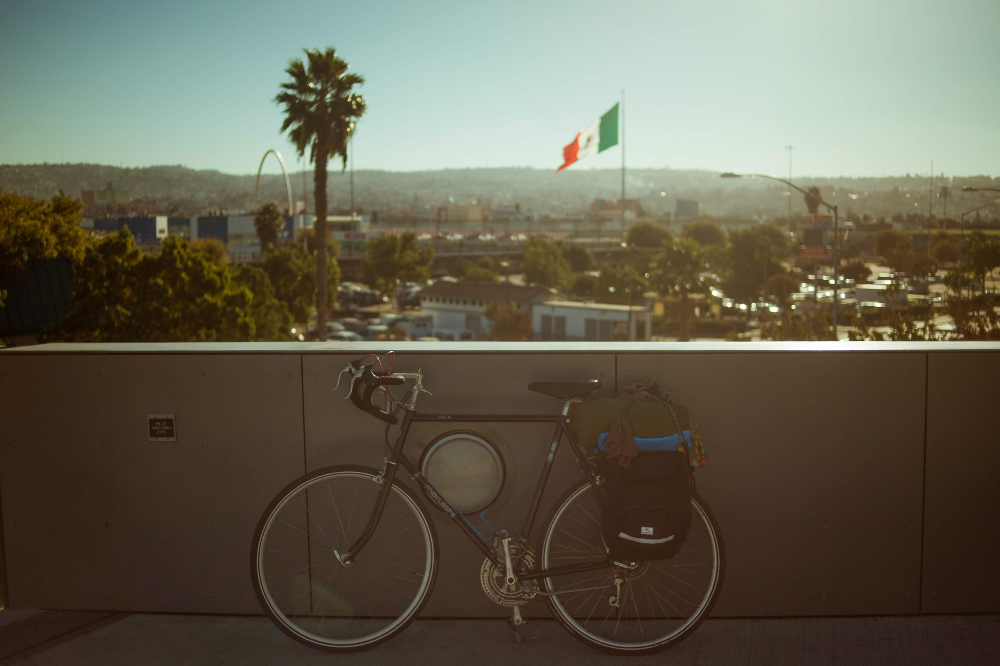
 
 

<h3>
***So I rode my bicycle from Oregon to Mexico…***
</h3>

 
These are photos of people and events in the order that they took place over this past month. On October first, 2016 I took a train to Oregon with the intention of making my way down to Mexico. The only transportation I brought with me was my bicycle.... This is an account of this journey as it happened. 1400 miles in total, many biked, some hitched, and a few  bussed, all in 31 days all while avoiding single occupancy vehicles. There are times when you learn something you thought you already knew. They say when god gives you a sign, you should follow it every-time. There's some truth to that, when everything's going bad, when you're feeling sad, or even forced to get mad. But what if you don't put your faith in God, or believe in Karma, live through Jihad, or breathe the dogma? What if you're just an ordinary someone who's a kind person to yourself and your loved ones. Should this turn of events be ignored to grow dimmer, turned on the back burner and left to simmer? Or should you take life for granted and see things from any angle even when they're slanted? Every single story has its up's and its downs, they should take you for a ride and send your mind spinning round and round never to come down. Thanks to everyone, and all my last minute hosts who are both pictured or otherwise. 

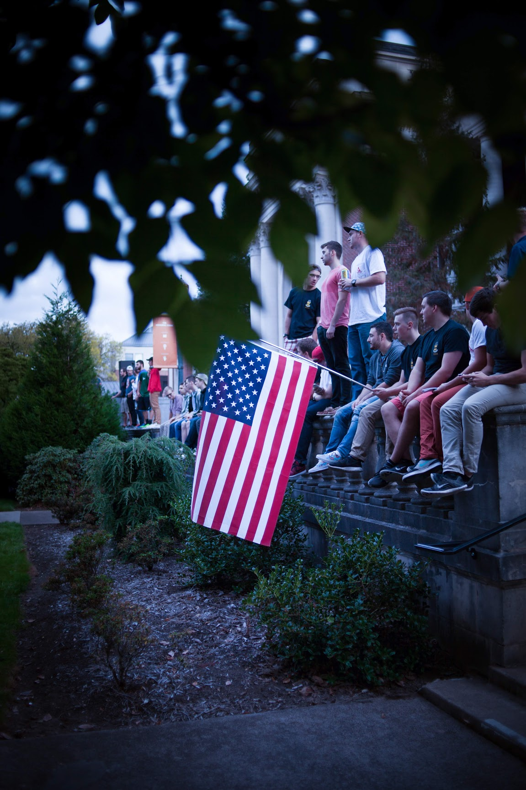
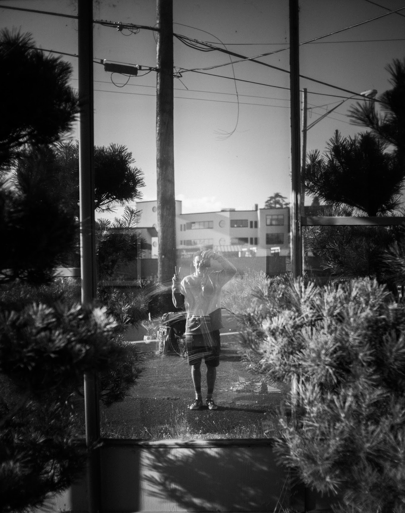

 
 

<h3>
***THE CAR***
</h3>

   
50 yards and vanishing quickly, my mind is beginning to ease, I think I still can pull this left at high speeds. I’m banking on the right ready to take a tight turn, speeding, speeding to the one way stop at the head of a two lane road , I know that I won’t be able to abide by the laws for this measly back road, two lane stop sign. Who might care, even the police here would turn an eye blind. This was nothing new, I had long ago become an outlaw, doing what I please with the roads. They’re here for my use and I’ll use them as I please while trying not to put myself or others in too much stress or danger. I know I can make it, I’m daunting the lean as much as I can, speeding past the stop sign and into the first lane of what comes to be oncoming traffic. I hear the sheik of an old set of brakes before I hear the tires begin to skid to my right, I am close enough to see the discontent in the drivers bright blue eyes as we only came closer. I was at the mercy of physics, my brakes were maxed, and my only option was to take my turn tighter.

 

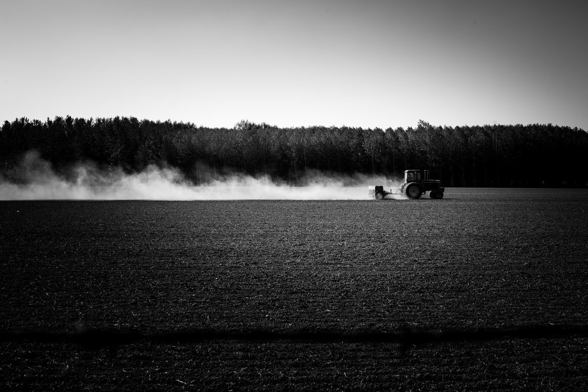
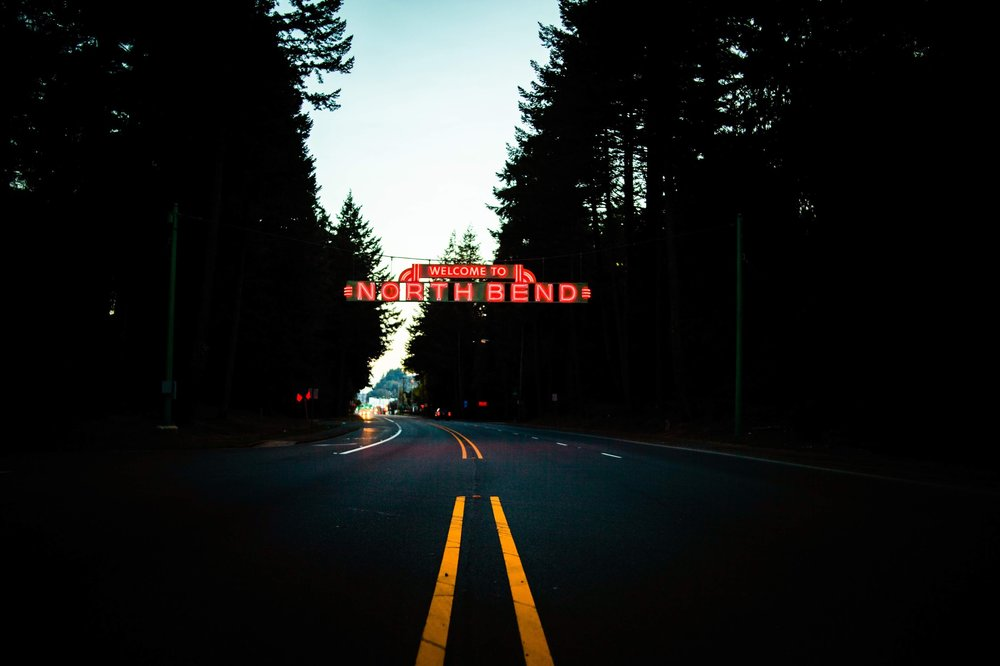
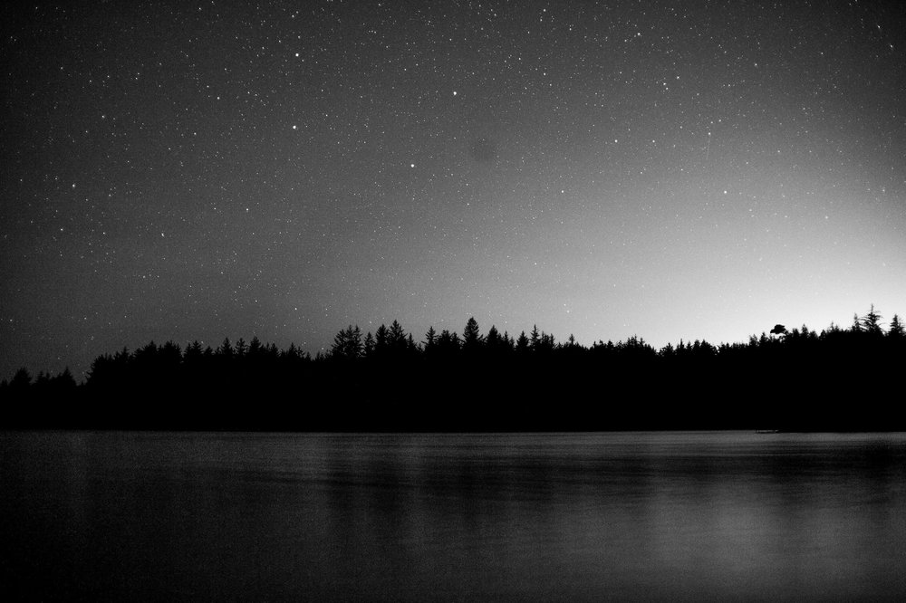

 

 

<h3>
***FATE***
</h3>
   
My tires quickly go from a roll to a skid to a trot, up and down, up and down, skidding and bouncing on the ground. I’m going as fast as the car and its coming from my right going now in the far lane of traffic in almost the same direction, yet a collision is destined and there is no overcoming my balance unless I want to go down for the worst of it. Shaking to the core for my very life. I begin to pull into a slide and my back swings round. The situation is mounting, the driver has no time or place to swerve, no reason to honk, and no idea how this could have happened, we’ve gone from a T-bone to a wish-bone and I unknowingly and intuitively begin to counter lean in the opposite direction which would normally send me over, but it’s not over I go, I come to an impact with the burgundy sedan before me. My hand connects first on the rear window, It slides a moment then catches up, My shoulder and back fall at the same time flexing the glass, my bike begins to fall, beneath me but I pull out from under, it wants to topple. My handle bars finally connecting with the lower portion of the driver’s door, I push with all my might. Shoulder, elbow, then hand, I was in full rebound in the other direction, bike back below my knees the tires still spinning at the speed of the car no longer, I no longer have the brakes applied, I needed my hand for balance. I had bounced.  Off I went, newly balanced, one handed, and  elbow hurting, but still standing, still riding, still thinking. The car at my right begins to fall away, coming to a furious halt in an uproar of dust at the shoulder. I make a calm stop twenty yards ahead to asses the damage I’ve done to the car before I consider the damage to myself, which both were minimal if existent at all. I took my feet from the slippers and stood straddling my old Italian beauty Cecilia. Looking over my shoulder there were two blue eyes, dead locked on mine. Ten seconds passed, but it felt like more, their face still in shock and mouth slightly open, hands coming off the wheel for a full force double fisted smash on the horn of great proportions. 

   
 

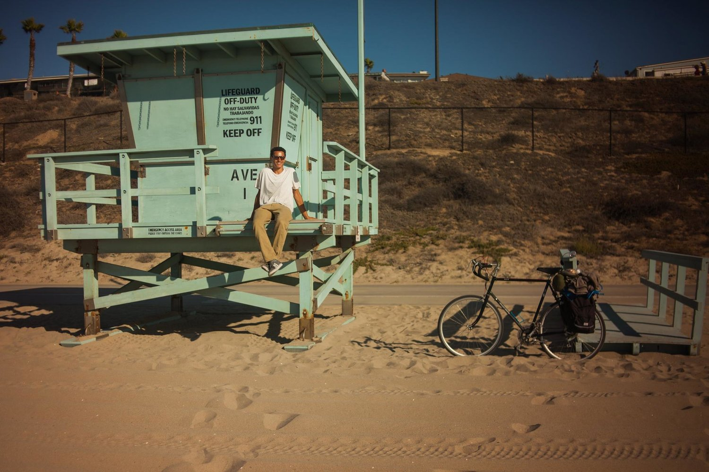
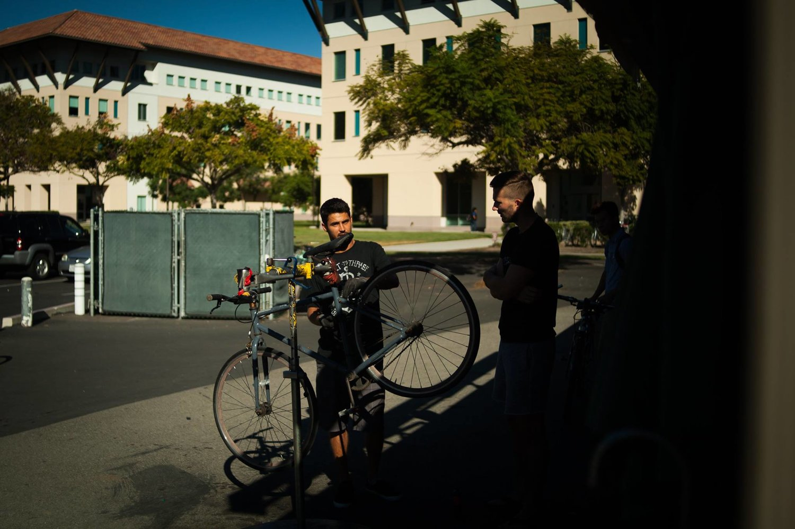

 
 

 

<h3>
***THAT NOISE!***
</h3>

  
When I understood that the horrendous noise wasn’t going to end anytime soon, I gave a soldiers salute over my shoulder to the unforgiving and assumed uncooperative driver and saddled up once again. 

 

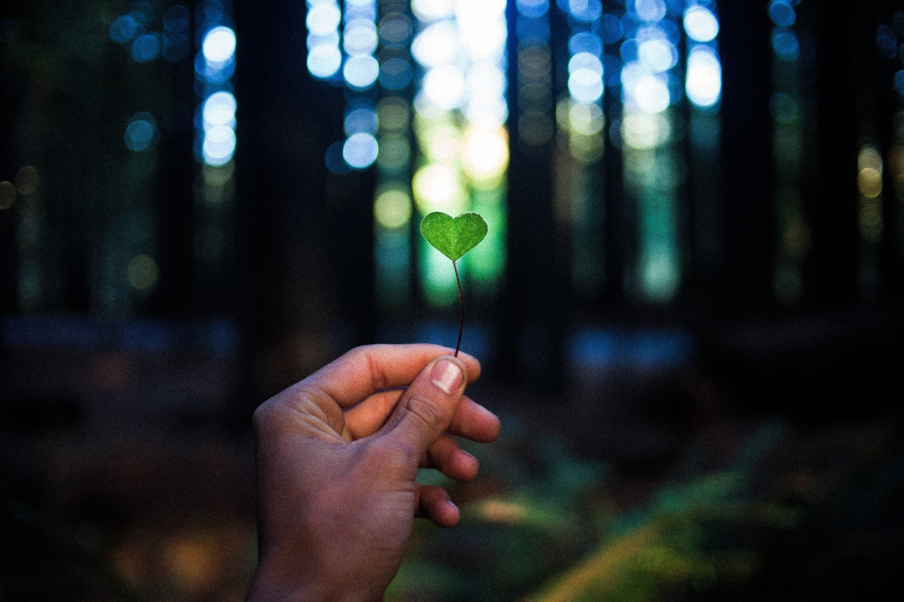

 
 

 

<h3>
***GO***
</h3>

  
I began the slow feat of toiling away in the reigns to bring my weight up to speed again and all the while listening to droning of the high pitched blare behind me. It slowly began to get louder and louder, and as it gained on me, it began to shriek at intermittent and repulsive intervals. Then just as it was at my side, it steadied itself and began to fade out as the burgundy blur once again fled off into the countryside at unspeakable speeds. We had an understanding. 

 
 

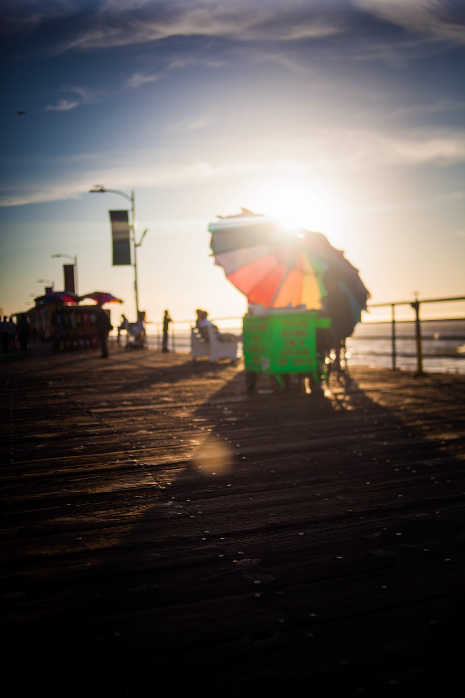
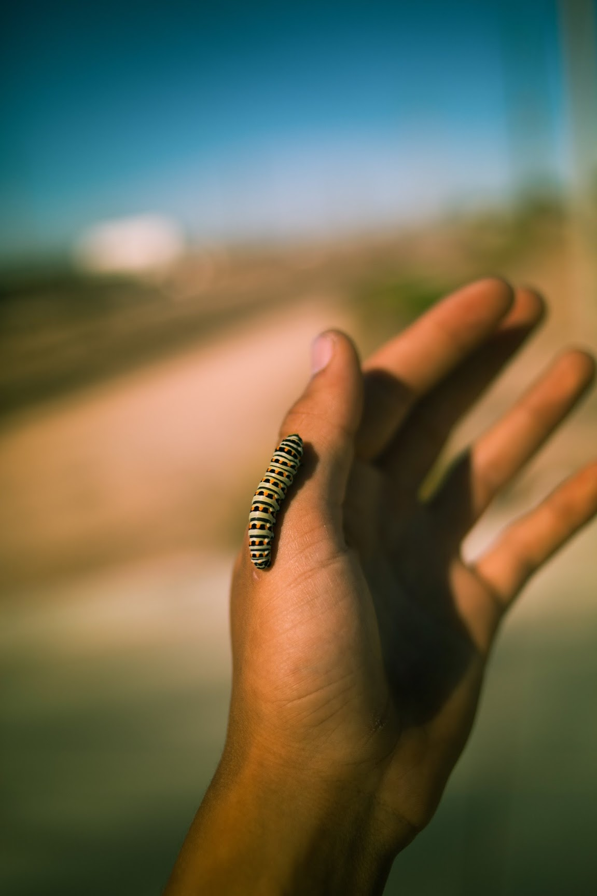

 
 

 

<h3>
***REALITY CHECKS***
</h3>

  
 The mayor’s office does not officially agree “ “It is unacceptable to encourage someone to break a law that could result in injury or death because it is ‘inconvenient’ for the driver/bicyclist to come to a complete stop. All vehicles shall stop at a stop sign — period,” Police Chief Greg Suhr wrote in a letter to the Board of Supervisors.”
Just after the near death experience with that red machine, I was coming out of the back country onto the main highway, and even in light of recent events, I know I’m not stopping at the stop  sign… Why waste my good energy in coming to a full and complete stop? In the city of San Francisco where I worked as a bike messenger in the summer leading up to this trip, the might state otherwise, but the unspoken rule between police and cyclists is that if you do it safely, you’re fine, and that is why most cyclists there treat stop signs as yield signs, and red lights as stop signs. Anyways, this time I can see everything clearly, I can see the road at least, and traffic is only going one way, and slowly at that. I take the right tun and I’m again on the freeway, - I dislike cycling on the freeways, they get monotonous - I have to make it tight because of the traffic, but it’s no problem, I realize that I’m going the same speed as a green SUV and I decide to ride the line as they are not seeing or not having expected a cyclist next to them, I reach my arm out to the left, palm to the rear wheel well and take a quick ride, the SUV accelerates and takes me along for the ride with its mechanical combustion fueled power, almost a reality check of emotions and possibilities of events past, sometimes it’s necessary to check one’s reality, an important aspect of living a conscious life of significance. I’m still alive, life goes on as normally as ever!

 

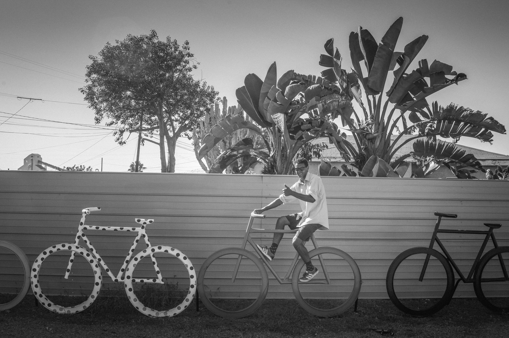

 
 

 

<h3>
***CECILIA***
</h3>

  
She’s black with yellow highlights, and big ol round ones, 27’s to be exact. I’ve named her Cecilia after that one song I keep listening to on my “Mellow biking jams” playlist. She has since been retired for a Japanese racer, which broke my heart, but when she was running strong, boy could we fly. It takes the better part of me not to fix er up and ride her another lifetime.

 
 

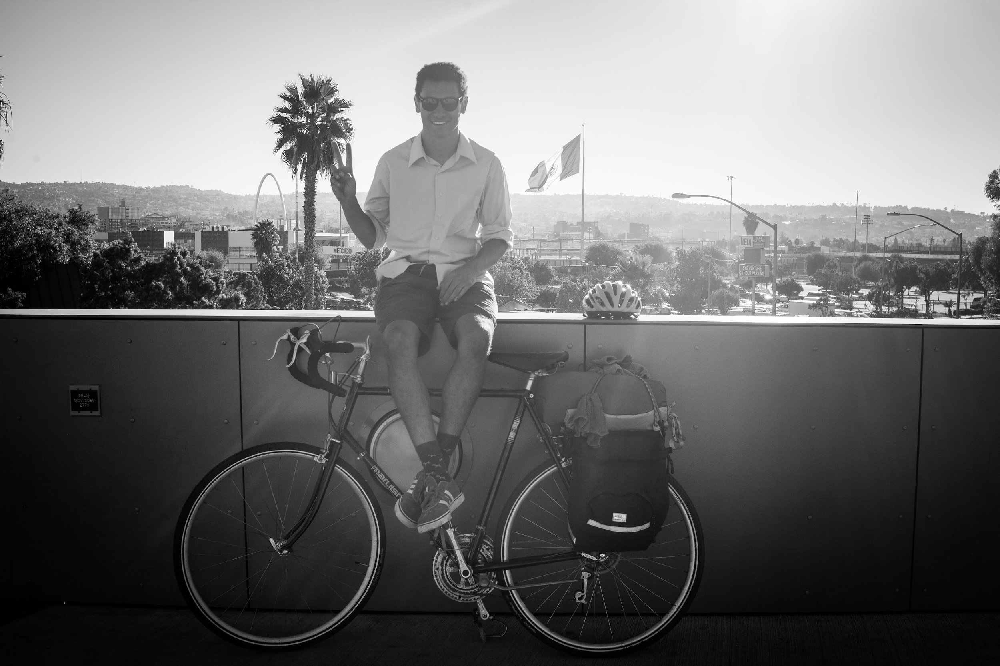

 
 

Made it.

