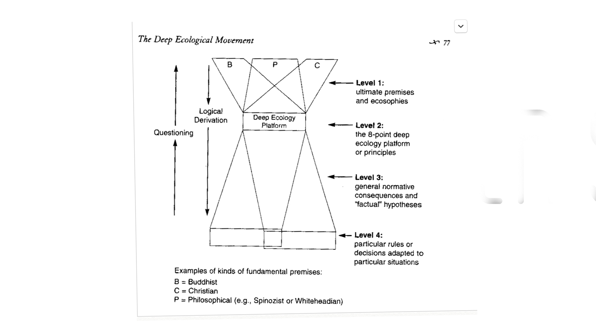

 
 

<h1>**Deep Ecology**</h1> 
<h6>
***An Inquiry into Deep Ecology***
</h6>

*[Tylerisyoung.Substack.com](www.tylerisyoung.substack.com)*   
*[Twitter.com/TylerisYoung](www.twitter.com/Tylerisyoung)*  
 _________________________
  
 03/30/2019
  
 

<h3>
The Philosophy of Ecology & how it may relate to ~Game B <h5>*Podcast Excerpt*</h5>
</h3>

 
 
 

  This inquiry is in reference to: An essay titled “The Deep Ecological Movement, Some philosophical aspects, by Arne Naess the Norwegian philosopher who coined the term deep ecology, and his essay was published in a book compiled and edited by George Sessions titled : Deep Ecology for the Twenty-First Century: Readings on the Philosophy and Practice of the New Environmentalism. 

 I’m going to start this off as Naess does in his introduction, about a story of an ecologist by the name of Ivar Mysterud, “Increasing pressures for continued growth and development have placed the vast majority of environmental professionals on the defensive, by way of illustration,  

The field ecologist Ivar Mysterud, who both professionally and vigorously advocated deep ecological principals around the late 1960’s encountered considerable resistance. Colleagues at his university said he should keep to his science and not meddle in philosophical and political matters. He should resist the temptation to become a prominent “popularizer: through mass media exposure. Nevertheless, he persisted and influenced thousands of people (including myself)” states Naess.

Naess continues The life story of Mysterud and goes on to detail his expertise in assessing damages caused by bears when killing or maiming sheep and other domestic animals in Norway, many of which farmers relied on for their livelihoods. With the continued development in Norway, and sheep farming in the 60’s  not being as it always was, and whenever I think about sheep farming, I obviously think of the alchemist and the Shepard there in the Middle East , I’ll bet he had no trouble with bears… but although that’s a great book, and I actually think some similar themes can be tied to the deep ecological movement, that’s not the point of this inquiry. I aim to familiarize those who are unfamiliar with deep ecology. 

So, back to Mysterud. Who was an excellent advocate of the deep ecological movement, and also eventually became part regulator of territories and land in bear country where these shepherds were living, and when things began to get tricky between farmers, shepherds, and bears; he appeared to adopt a mindset of what Naess calls; Shallow Ecology, which we’ll define in a second,  by defending sheep owners, he gave them more money as compensation for bear attacks, and by hiring hunters to kill the usual suspects such as juvenile bears. And after being called out in public for adopting a shallow ecological mindset, and practice, he insisted privately that he had not changed his views but was no longer advocating fervently. He aimed to continue the status quo, as he knew it was rather expensive for sheep owners to prove a bears guilt, and he ultimately feared rather ecologically regressive policies which would be easily pushed into place by the sheep owners and policy makers, he also wanted to maintain his public image , friendships, and credibility among shepards, and his university peers. 

Ness claims this is true of thousands of professionals in the environmental field, compromising views to fit in, maintain status quo, and avoid public shaming which I think has only gotten far worse with the advent of twitter today. He also notes that their areas of specialty tend to limit them to that particular field, and like Ivar, would be publicly criticized if they tried to take a new path, though on the flip side, I do believe this is  in fact more common and acceptable to change practices these days. Though job security is still a factor when speaking out and voicing unpopular opinions. 

Ness concludes Ivan’s story with a rather gloomy but I think accurate critique on the scientific and governmental policy system that still holds. 

“Thousands of experts hired by the government and other big institutions devote their time to this complicated problem, yet it is difficult for the public to find out or realize that many of these same experts consider the problem to be pointless and irrelevant. What these experts consider relevant are the problems of how to stabilize and eventually decrease consumption without losing genuine quality of life for humans. But they continue to work on the irrelevant problems assigned to them while, at the same time, failing to speak out, because the ultimate power is not in their hands. “

So now I’m going to take a second to describe What ness puts forth as a sort of the fundamental principles of deep ecology. There are 8 points which follow, and ness states that they are fundamental in belief in deep ecology, and anyone that rejects any point shall not be viewed as a supporter of deep ecology. Then he conditionalizes this with a claim that many people think they are not in support of a point yet fundamentally agree with its implications, so the 8 points are this; 

<h2>***The 8 Principles of Deep Ecology***</h2>

<h4>

- The well-being and flourishing of human and non-human life on Earth have value in themselves (synonyms: intrinsic value, inherent value, inherent worth). These values are independent of the usefulness of the non-human world for human purposes.

- Richness and diversity of life forms contribute to the realization of these values and are also values in themselves.

- Humans have no right to reduce this richness and diversity except to satisfy vital needs.

- The flourishing of human life and culture is compatible with a substantially smaller human population. The flourishing of non-human life requires a smaller human population.

- Present human interference with the non-human world is excessive, and the situation is rapidly worsening.

- Policies must, therefore, be changed. These policies affect basic economic, technological and ideological structures. The resulting state of affairs will be deeply different from the present.

- The ideological change will be mainly that of appreciating life quality (dwelling in situations of inherent value) rather than adhering to an increasing standard of living. There will be a profound awareness of the difference between bigness and greatness.

- Those who subscribe to the foregoing points have an obligation directly or indirectly to try to implement the necessary changes.

</h4>

And before I give you my opinion on the points, I’m gong to explain deep ecology as a means of assessing the world which the term has been used without trying to define it this far. Ness says that there is no reason that supporters of a movement should adhere to an exact definition, or rather a set of morals as he put forth perviously. The points refer to the biosphere as a whole and represent a form ecocentricism placing ecology and the interactions of ecosystems at the core of everything, not a bad idea. He then explains deep vs shallow ecology by means of several examples. The first of which is pollution. 

<h2>***Shallow vs Deep Ecology***</h2>

A shallow ecological approach to solving the continuous problem of pollution would be to; Implement laws to limit pollution, and to use technology to purify the air, water, and ultimately spread pollution more evenly across the earth so that no one area is being exposed to concentrated pollution. Which sounds a lot like our current path. Then, a deep ecological approach would be to evaluate form a biospheric perspective, and not focusing exclusively on its human effects, but rather all species and non life forms, and to stop the economic processes that lead to pollution instead of fighting it after the fact. And to assist countries who cannot curb pollution on their own. The timeline for considering changes is set at a minimum of 100 years out. 

Next he uses an example of natural resources and staes that resources in todays world are for the affluent, and for those who have the technology to exploit them. He also states that in our current economic system, resources will never be depleted because as they become more scarce, the price will go up, and result in a corresponding reduction in the use of this particular resource until ultimately the resource is so scarce, and price is so high, it makes better economic sense to use an alternative resource in its place; Which is accurate from a free market supply and demand perspective. He then goes on to state that if there is no human use for a resource , and one if likely never to be found, it does not matter if it is destroyed, which I also think is an accurate analysis of your current system. He advocates for a deeper, more fundamental approach in stating that all resources and habitats are inherently valuable in their own right and argues that no natural object shall be solely conceived of as a resource. He emphasizes a maximally long range time and consideration perspective for the earth as a self sustaining biosphere. Makes sense to me. Maybe you agreed with the principles, and the examples, and are now a proponent of deep ecology, then again, maybe not. I am going to list two areas I felt a bit shaky on given my general skepticism of anything in general, and those are mainly on points three and four of the principles.

<h2>***Concerns***</h2>
 
***Addressing Principle #4:***   
 
***"The flourishing of human life and culture is compatible with a substantially smaller human population. The flourishing of non-human life REQUIRES a smaller human population."***
 
 I agree with the first part there, of course we as humans can flourish at a much smaller population level, however the second part, the flourishing of nonhuman life requires a smaller human population. This I am unclear about, and I don’t know if its my place to state this as fact which would impact billions of people over centuries. I certainly think it would be EASIER for nonhuman life to flourish, if there were less of us around, however I think we are also getting really good at playing with nature in a way which Naess likely wouldn’t approve of, but would technically allow plant species to maintain their population levels in their current areas, not go extinct, and technically flourish within a diverse and resilient ecosystem, then again, maybe I’m an optimist. But there are countless studies that show that the carrying capacity of the earth is anywhere from 3 billion people to 40 billion people and that;’s obviously a very huge range but most studies claim it’s between 7-11 billion within reason. So of course, this may come at the expense of species extinction which we are already seeing today at 100x the background extinction rate which means our anthropocentric practices are driving species to extinction roughly 100 times faster than would happen without humans around, but there is also a remote chance that we were put here for a reason which might require a form similar to our current trajectory, I frankly do not know.  Ness has a note on population, but simply avoids these considerations by saying that the earth does not belong to humans and that we should prefer a mode of being that only satisfies our vital needs. However that brings me to my next point on point number three. 
 

***Addressing Principle #3:***  
 
***"Humans have no right to reduce this richness and diversity except to satisfy vital needs."***
 
I think this is a personal opinion which everyone needs to answer for themselves which in turn, requires a stable climate and wellbeing for all. There are a couple things which we need to address here, being mainly what is species richness and diversity, does that mean we need to preserve every species and ecosystem that currently exists, or should we only maintain all ecosystems so that their biodiversity is high enough to maintain resiliency in the face of natural disasters etc. aside from getting out of the way (reducing our population size) should we help nature along at all, or stand by while our past destructions continue to negatively impact species. This is almost a preservation vs conservation argument that John Muir and Gifford Pinchot are famous for. Muir who Naess later calls a taoist, wanted everyone out of the wilderness, and Pinchot wanted to maximize its usefulness (presumably for humans) as dictated by ecologists and scientists. But that’s a story for a different day. So it depends on what you consider vital needs, obviously food, water, shelter, but what about wifi? Is access to the internet a vital need? Some Like Langdon Winner and the luddites would argue it is not so, but many of us today would disagree, and ultimately I consider this point to POSSIBLY be in conflict with some people’s meaning of life. The people of earth have decided as individuals, that we are all here for different reasons, and that is why this is the age old question, what is the meaning of life? I will put forth the possible opinion that we were put here by a god - by a Big Bang, - by a simulation - for the reason only to learn to spread throughout the universe onto different planets, bringing with us, our knowledge, our species, and ultimately, even our diversity, and biodiversity, and I would be interested to hear what Naess has to say about colonizing other planets potentially without water - like mars (which has presumably less biodiversity than earth ) and bringing plants with us to start forests, create rain, and populate this once dry desert planet with an abundance of flora and fauna? Sure it doesn’t “belong” to us, but should we preserve and honor the dry dusty rocks which it is home to, or help ensure that literally the only life forms we can comprehend and know of within billions of lightyears keep on keeping on at least within this solar system, and maybe one day beyond.  You know I’m not sure what Naess would say. But ultimately, I think this is a personal decision, as all philosophical questions and answers should be.