<!--
Financial Dashboard. No API keys: the data file docs/data/markets.json is
built by scripts/update_market_data.py (Yahoo Finance prices, FRED public
CSVs) and refreshed every day by the GitHub Action in
.github/workflows/update-markets.yml. The charts are drawn in the browser.
-->

<br>
<br>

<h2>**Market Analysis & My Growth Portfolio**</h2> 
<h6>
<br>
***For sure financial advice - More on Substack & Twitter***
</h6>

*[Tylerisyoung.Substack.com](https://www.tylerisyoung.substack.com)*   
*[Twitter.com/TylerisYoung](https://www.twitter.com/Tylerisyoung)*  
 _________________________

<p style="text-align:center;font-weight:700;font-size:1.25rem;margin:1rem 0 1rem"><a href="#ongoing-ta" style="color:inherit">Blog Below &darr;</a></p>

```{=html}
<style>
.fd{--blue:#3d6fd6;--blue-lt:#a8c5f7;--red:#e07a7a;--yellow:#f2c46d;--green:#4f9d69;--ink:#2d3a4a;--muted:#6b7686;--line:#e6e9ef;
    font-family:system-ui,-apple-system,"Segoe UI",sans-serif;color:var(--ink);max-width:1180px;margin:0 auto}
.fd h1{font:600 1.7rem Georgia,serif;margin:.4rem 0 .1rem}
.fd .accent{height:4px;border-radius:4px;background:linear-gradient(90deg,#e8a0a0,#f2c46d 45%,#a8c5f7);margin:.3rem 0 .6rem;opacity:.8}
.fd .live .tradingview-widget-container{width:80%!important;transform:scale(1.25);transform-origin:0 0;margin-bottom:18px}
.fd .live{border:1px solid #f1e3bd;border-left:4px solid #f2c46d;background:#fefaf0;border-radius:10px;padding:.3rem .6rem;margin:.2rem 0 .6rem;min-height:72px}
.fd .tre{border:1px solid var(--line);border-top:3px solid #f5dfa6;border-radius:10px;background:#fff;padding:.6rem .8rem;margin-bottom:12px}
.fd .tre-top{display:flex;flex-wrap:wrap;gap:.4rem 1.6rem;align-items:baseline;margin-bottom:.5rem;font-size:.95rem}
.fd .tre-top .k{font-size:.72rem;text-transform:uppercase;letter-spacing:.08em;color:#b0833a;font-weight:700}
.fd .tre-top .tre-note{margin-left:auto;font-size:.75rem;color:var(--muted)}
.fd .tre-wrap{overflow-x:auto}
.fd .tre table{width:100%;border-collapse:collapse;font-size:.78rem;font-variant-numeric:tabular-nums;white-space:nowrap}
.fd .tre th{background:var(--ink);color:#fff;font-weight:600;padding:.4rem .5rem;text-align:right;cursor:pointer;user-select:none;white-space:normal;vertical-align:bottom;line-height:1.2;border-left:1px solid #46546a}
.fd .tre th:first-child{text-align:left}.fd .tre th.b{color:#f2c46d}.fd .tre th:nth-child(6){border-left:3px solid #f2c46d}.fd .tre td:nth-child(2){text-align:center;font-weight:600;color:#6b7686}
.fd .tre td{padding:.28rem .4rem;text-align:right;border-bottom:1px solid var(--line)}
.fd .tre td:first-child{text-align:left;font-weight:700}.fd .tre td:nth-child(6){border-left:3px solid #f2c46d;color:#b0833a;font-weight:600}
.fd .tre tr:hover td{background:#fdf8ea}
.fd .tre-foot{font-size:.72rem;color:var(--muted);margin-top:.5rem;line-height:1.45}
.fd .pf{border:1px solid var(--line);border-top:3px solid #f5dfa6;border-radius:10px;background:#fff;padding:.7rem .8rem;margin-bottom:12px}
.fd .pf-sub,.fd .pf-note{font-size:.78rem;color:var(--muted);margin:.3rem 0 .6rem}
.fd .pf-grid{display:grid;grid-template-columns:repeat(3,1fr);gap:12px}
@media(max-width:900px){.fd .pf-grid{grid-template-columns:1fr}}
.fd .pf-card{border:1px solid var(--line);border-radius:8px;padding:.5rem .6rem;background:#fefcf6}
.fd .pf-t{font-weight:600;font-size:.88rem;color:var(--ink);margin-bottom:.3rem}
.fd .pf-t span{font-weight:400;color:var(--muted);font-size:.75rem}
.fd .pf-in{display:flex;gap:.5rem;align-items:center}
.fd .pf-pie{position:relative;width:46%;min-width:130px;aspect-ratio:1}
.fd .pf-tab{flex:1;font-size:.74rem}
.fd .pf-tab table{width:100%;border-collapse:collapse;font-variant-numeric:tabular-nums}
.fd .pf-tab td{padding:.12rem .25rem;border-bottom:1px solid var(--line)}
.fd .pf-tab td:last-child{text-align:right}
.fd #tre-table th.t1{background:#2f4a7a;color:#fff}
.fd #tre-table td small{display:block;color:#6b7686;font-size:.68rem}
.fd .tdot{display:inline-block;width:8px;height:8px;border-radius:50%;margin-right:5px;vertical-align:middle}
.fd .pf-tab .sw{display:inline-block;width:9px;height:9px;border-radius:2px;margin-right:5px;vertical-align:middle}
.fd .pf-tab .st{margin-top:.35rem;color:var(--ink);line-height:1.45}
.fd .pf-h{font:600 .95rem system-ui,sans-serif;color:var(--blue);margin:1.1rem 0 .3rem;text-transform:uppercase;letter-spacing:.06em}
.fd .pf-front{position:relative;height:360px}
.fd .pf-corr{overflow-x:auto}.fd .pf-corr table{border-collapse:collapse;font-size:.66rem;font-variant-numeric:tabular-nums;margin:0 auto}
.fd .pf-corr td,.fd .pf-corr th{width:36px;height:24px;text-align:center;padding:0}.fd .pf-corr th{font-weight:600;color:var(--ink)}
.fd .pf-corr th.r{text-align:right;padding-right:5px;width:auto}.fd .pf-corr thead th{writing-mode:vertical-rl;transform:rotate(180deg);height:48px;vertical-align:bottom}
.fd .btcmp{width:100%;border-collapse:collapse;font-size:.8rem;font-variant-numeric:tabular-nums;margin-top:.6rem}
.fd .btcmp th{background:var(--ink);color:#fff;font-weight:600;padding:.3rem .45rem;text-align:right}
.fd .btcmp td{padding:.26rem .45rem;text-align:right;border-bottom:1px solid var(--line)}
.fd .btcmp th:first-child,.fd .btcmp td:first-child,.fd .btcmp td:last-child,.fd .btcmp th:last-child{text-align:left}
.fd .tre td.nm{color:var(--muted);text-align:center}
.fd .pp-tog{display:block;font-size:.85rem;font-weight:600;margin:.1rem 0 .5rem;cursor:pointer}
.fd .pp-stat{font-size:.8rem;margin:-.3rem 0 .6rem;padding:.3rem .6rem;border-radius:6px;background:#fdf8ea;display:inline-block}
.fd .pp-tog span{font-weight:400;color:var(--muted);font-size:.78rem}
.fd .best{border:1px solid var(--line);border-top:3px solid #f5dfa6;border-radius:10px;background:#fff;padding:.7rem .8rem;margin-bottom:12px}
.fd .best-sub{font-size:.8rem;color:var(--muted);margin-bottom:.4rem}
.fd .best-chart{position:relative}
.fd .best table{width:100%;border-collapse:collapse;font-size:.74rem;font-variant-numeric:tabular-nums;margin-top:.6rem;line-height:1.25}
.fd .best th{background:var(--ink);color:#fff;font-weight:600;padding:.3rem .3rem;text-align:right;vertical-align:bottom}
.fd .best th:first-child,.fd .best td:first-child{text-align:left}
.fd .best h3{font:600 .98rem system-ui,sans-serif;margin:.1rem 0 .25rem;color:var(--ink)}
.fd .best h3 span{font-weight:400;font-size:.8rem;color:var(--muted);margin-left:.4rem}
.fd .best-wrap{overflow-x:auto}
.fd .srcs{margin-top:.8rem;border:1px solid #f1e3bd;border-radius:8px;background:#fefaf0}
.fd .srcs summary{cursor:pointer;padding:.55rem .8rem;font-weight:700;font-size:.9rem;color:#b0833a}
.fd .srcs .body{padding:.1rem .9rem .7rem;font-size:.76rem;line-height:1.45;columns:2 420px;column-gap:1.6rem}
.fd .srcs .a{break-inside:avoid;margin:.55rem 0}
.fd .srcs .a b{font-size:.84rem}.fd .srcs .a i{color:var(--muted);font-style:normal}
.fd .srcs ul{margin:.1rem 0 .2rem 1rem;padding:0}.fd .srcs li{margin:.05rem 0}
.fd .srcs .lab{font-size:.68rem;text-transform:uppercase;letter-spacing:.06em;color:#8a7338;font-weight:700;margin-top:.2rem}
.fd .fx{background:#fdf3d0;border:1px solid #f1e3bd;border-radius:6px;padding:.4rem .7rem;font:.76rem/1.5 ui-monospace,Menlo,Consolas,monospace;margin:.3rem 0 .6rem;color:#5a4a1e}
.fd .srcs .fbody{columns:auto;padding:.1rem .9rem .7rem;font-size:.78rem;line-height:1.55}
.fd .srcs .fbody code{background:#fdf3d0;padding:0 .2rem;border-radius:3px;font-size:.76rem}
.fd .srcs .fbody p{margin:.25rem 0}
.fd .picks-f{margin-top:0}
.fd .fv-detail{border-top:1px solid var(--line);margin-top:.5rem;padding-top:.4rem}.fd .fv-t{font-size:.84rem;font-weight:600}.fd .fv-t span{font-weight:400;color:var(--muted);font-size:.78rem;margin-left:.4rem}.fd .fv-c{position:relative;height:260px}
.fd .spec{display:grid;grid-template-columns:max-content 1fr;gap:.18rem .9rem;font-size:.82rem;line-height:1.45;max-width:1000px;margin:.2rem 0 .7rem;padding:.55rem .8rem;border:1px solid var(--line);border-radius:8px;background:#fafbfd}
.fd .spec .sl{color:var(--muted);font-weight:600;white-space:nowrap}.fd .spec .sv b{color:#b0833a}
.fd .btstats{width:100%;border-collapse:collapse;font-size:.76rem;font-variant-numeric:tabular-nums;margin:.35rem 0 .2rem}.fd .btstats th{color:var(--muted);font-weight:600;text-align:right;padding:.2rem .4rem;border-bottom:1px solid var(--line)}.fd .btstats td{text-align:right;padding:.2rem .4rem;border-bottom:1px solid #f3f4f7}.fd .btstats td:first-child,.fd .btstats th:first-child{text-align:left;font-weight:600}
.fd .best tr.grp th{background:#4a5870;font-size:.7rem;letter-spacing:.06em;text-transform:uppercase;text-align:center}.fd .best .g1{border-left:3px solid #f2c46d}
.fd .sim{border:1px solid var(--line);border-radius:10px;background:#fff;padding:.5rem .8rem .3rem;margin-bottom:12px}
.fd .sim-t{font-weight:600;font-size:.92rem}.fd .sim-t span{font-weight:400;font-size:.8rem;color:var(--muted);margin-left:.4rem}
.fd .sim-c{position:relative;height:170px}
.fd .bt-sub{font-weight:700;font-size:1rem;color:var(--ink);margin:.1rem 0 .35rem}
.fd .bt-exp{font-size:.84rem;line-height:1.55;color:var(--ink);max-width:980px;margin-bottom:.7rem}
.fd .bt-buckets{display:grid;grid-template-columns:repeat(auto-fit,minmax(260px,1fr));gap:10px;margin-bottom:12px}
.fd .bk{border:1px solid #c9dafa;background:#f7faff;border-radius:10px;padding:.5rem .8rem}
.fd .bk-h{font-weight:700;color:var(--blue);font-size:.95rem}.fd .bk-h span{color:var(--muted);font-weight:600;margin-left:.3rem}
.fd .bk-t{margin-top:.3rem;font:600 .9rem "SFMono-Regular",Menlo,Consolas,monospace;color:#7d8aa3;line-height:1.7}
.fd .bk-t span.on{color:var(--blue);background:#e2ecfd;border-radius:4px;padding:0 .2rem}
.fd .simlog i.rb{color:#b0833a;font-size:.7rem}
.fd .simlog{width:100%;border-collapse:collapse;font-size:.76rem;font-variant-numeric:tabular-nums}.fd .simlog th{text-align:left;color:var(--muted);font-weight:600;border-bottom:1px solid var(--line);padding:.2rem .4rem}.fd .simlog td{padding:.15rem .4rem;border-bottom:1px solid #f3f4f7}.fd .simlog td:nth-child(n+3),.fd .simlog th:nth-child(n+3){text-align:right}
.fd .srcs .note{font-size:.76rem;color:var(--muted);padding:0 .9rem;margin:0}
.fd .best .pct{color:var(--muted);font-size:.72rem}.fd .best .up{color:#3f8a57}.fd .best .dn{color:#c75b5b}
.fd .best td{padding:.22rem .3rem;text-align:right;border-bottom:1px solid var(--line);vertical-align:top}
.fd .best td small{display:block;color:var(--muted);font-size:.66rem}
.fd .best td:nth-child(2){font-weight:700}
.fd .best tr:hover td{background:#fdf8ea}
.fd .best-method{font-size:.78rem;color:var(--ink);line-height:1.5;margin-top:.7rem}
.fd .best-method h4{font-size:.85rem;margin:.6rem 0 .2rem;color:#b0833a}
.fd .best-method ol,.fd .best-method ul{margin:.2rem 0 .2rem 1.1rem;padding:0}
.fd .best-method .src{font-size:.74rem;color:var(--muted)}
.fd .debtclock{border:1px solid #f1d0d0;border-left:4px solid #e07a7a;background:#fdf6f5;border-radius:10px;padding:3.6rem 1rem;margin-bottom:12px;text-align:center}
.fd .debtclock .lab{font-size:.75rem;text-transform:uppercase;letter-spacing:.12em;color:#b25a5a;font-weight:700}
.fd .debtclock .num{font:700 2.4rem/1.15 "SFMono-Regular",Menlo,Consolas,monospace;color:#c0392b;letter-spacing:.02em;font-variant-numeric:tabular-nums;margin:.15rem 0}
@media(max-width:700px){.fd .debtclock .num{font-size:1.5rem}}
.fd .picks{border:1px solid #c9dafa;border-left:4px solid #3d6fd6;background:#f1f6fe;border-radius:10px;padding:3.6rem 1rem;margin-bottom:12px;text-align:center}
.fd .picks .row{display:flex;flex-wrap:wrap;justify-content:center;gap:.4rem 2.6rem}
.fd .picks .row{display:grid;grid-template-columns:repeat(5,auto);justify-content:center;gap:1.2rem 2.4rem}
.fd .picks .row::before,.fd .picks .row::after{display:none}.fd .picks .row{margin:0}
@media(max-width:900px){.fd .picks .row{grid-template-columns:repeat(3,auto)}}
.fd .picks .tk{font:700 2.4rem/1.15 "SFMono-Regular",Menlo,Consolas,monospace;color:var(--blue);letter-spacing:.02em}
@media(max-width:700px){.fd .picks .tk{font-size:1.5rem}}
.fd .picks .pk{display:flex;flex-direction:column;align-items:center}
.fd .picks .rk{font-size:.8rem;font-weight:700;color:#6b8fd9;letter-spacing:.08em;margin-bottom:.1rem}
.fd .picks .meta{font-size:.76rem;color:var(--muted);margin-top:.5rem}
.fd .debtclock .meta{font-size:.76rem;color:var(--muted)}
.fd .tile{border:1px solid #f1e3bd;border-left:4px solid #f2c46d;background:#fefaf0;border-radius:10px;padding:.5rem .9rem;height:96px;overflow:hidden}
.fd .tile .k{font-size:.72rem;text-transform:uppercase;letter-spacing:.08em;color:#8a7338;font-weight:600}
.fd .tile .big{font:600 1.8rem Georgia,serif;line-height:1.15;margin:.15rem 0}
.fd .tile .tradingview-widget-container{margin:-4px -12px 0}
.fd .tile .meta{font-size:.78rem;color:var(--muted)}
.fd .tile .dot{display:inline-block;width:7px;height:7px;border-radius:50%;background:#4f9d69;margin-right:.35rem;animation:fdp 2s infinite}
@keyframes fdp{50%{opacity:.25}}
.fd .sub{color:var(--muted);font-size:.85rem;margin-bottom:1rem}
.fd .strip{display:flex;flex-wrap:wrap;gap:.3rem .9rem;padding:.45rem .8rem;border:1px solid var(--line);border-radius:10px;background:#fafbfd;margin-bottom:.6rem;font-size:.8rem}
.fd .strip b{font-weight:600}.fd .up{color:var(--green)}.fd .dn{color:#c75b5b}
.fd .ctrl{display:flex;flex-wrap:wrap;justify-content:center;align-items:center;gap:.45rem;margin:.3rem 0 1rem}
.fd .ctrl .lab{font-size:.88rem;color:#6b7686}
.fd .paradigm{text-align:center;max-width:860px;margin:1.6rem auto 1.7rem;font-size:.9rem;line-height:1.5;color:var(--ink);padding:.55rem 1rem;border-top:1px solid #f5dfa6;border-bottom:1px solid #f5dfa6}
.fd .paradigm b{color:#b0833a}
.fd .paradigm .ph{font-weight:700;font-size:1rem;color:#b0833a;text-align:center;margin-bottom:.35rem}
.fd .ctrl button{border:1px solid var(--line);background:#fff;border-radius:6px;padding:.32rem .85rem;font-size:.92rem;color:var(--ink);cursor:pointer}
.fd .ctrl button.on{background:var(--blue);border-color:var(--blue);color:#fff}
.fd .ctrl button:hover,.fd .explorer .tabs button:hover{background:#fdf3d8}
.fd .ctrl .sep{width:1px;height:20px;background:var(--line);margin:0 .3rem}
.fd h2{font:600 1.05rem system-ui,sans-serif;text-transform:uppercase;letter-spacing:.08em;color:var(--blue);margin:1rem 0 .6rem;border:0;padding-bottom:.25rem;border-bottom:2px solid #f5dfa6;display:inline-block}
.fd .grid{display:grid;grid-template-columns:repeat(auto-fill,minmax(340px,1fr));gap:14px}
.fd .card{border:1px solid var(--line);border-radius:10px;padding:.7rem .8rem .5rem;background:#fff}
.fd .card .t{display:flex;justify-content:space-between;align-items:baseline;gap:.5rem}
.fd .card .n{font-weight:600;font-size:.92rem}
.fd .card .v{font-weight:600;font-size:1.05rem;white-space:nowrap}
.fd .card .c{font-size:.78rem;color:var(--muted);margin:.1rem 0 .3rem}
.fd .card canvas{width:100%!important;height:190px!important}
.fd .explorer{grid-column:1/-1;border-top:3px solid #f5dfa6}
.fd .explorer .t .v{font-size:2rem;line-height:1.1;letter-spacing:.01em}
.fd .explorer .t .n{font-size:1.05rem}
.fd .fdpager{margin-bottom:12px}
.fd .fdpager>.pg,.fd .pg-grid>.pg{display:none}
.fd .fdpager>.pg.on{display:block}
.fd .pg-grid>.pg.on{display:block}
.fd .pg-grid{display:block}
.fd .pg-grid .card canvas{height:340px!important}
.fd .pg-tabs{margin:.2rem 0 .7rem}
.fd .pg-h{font:600 .98rem system-ui,sans-serif;margin:.1rem 0 .35rem;color:var(--ink)}
.fd .mp-tabs{display:flex;flex-wrap:wrap;gap:.3rem;margin:.3rem 0 .6rem}
.fd .mp-tabs button{border:1px solid var(--line);background:#fff;border-radius:999px;padding:.2rem .7rem;font-size:.8rem;color:var(--ink);cursor:pointer}
.fd .mp-tabs button.on{background:var(--blue);border-color:var(--blue);color:#fff}
.fd .explorer .tabs{display:flex;flex-wrap:wrap;gap:.3rem;margin:.3rem 0 .5rem}
.fd .explorer .tabs button{border:1px solid var(--line);background:#fff;border-radius:999px;padding:.2rem .65rem;font-size:.78rem;color:var(--ink);cursor:pointer}
.fd .explorer .tabs button.on{background:var(--blue);border-color:var(--blue);color:#fff}
.fd .explorer .tabs button.pair.on{background:#d9736f;border-color:#d9736f}
.fd .explorer .tabs .lab{font-size:.72rem;color:var(--muted);text-transform:uppercase;letter-spacing:.06em;align-self:center;margin-right:.2rem}
.fd .explorer canvas{height:330px!important}
.fd .perf canvas{height:580px!important}
.fd .foot{color:var(--muted);font-size:.75rem;margin:1.2rem 0 2rem}
</style>

<div class="fd">
  <h1>Financial Dashboard</h1>
  <div class="accent"></div>
  <div class="sub" id="fd-updated">Loading data…</div>
  <div class="live">
    <div class="tradingview-widget-container"><div class="tradingview-widget-container__widget"></div>
    <script type="text/javascript" src="https://s3.tradingview.com/external-embedding/embed-widget-tickers.js" async>
    {"symbols": [{"proName": "COINBASE:BTCUSD", "title": "Bitcoin (live, 24/7)"}, {"proName": "CAPITALCOM:US500", "title": "S&P 500 futures (live)"}],
     "isTransparent": true, "showSymbolLogo": true, "colorTheme": "light", "locale": "en"}
    </script></div>
  </div>
  <div class="strip" id="fd-strip"></div>
  <br><br><br><br><br><br><br><br><br><br>
  <div class="ctrl">
    <span class="lab">Timeframe</span>
    <button data-tf="D" class="on">Daily</button><button data-tf="W">Weekly</button><button data-tf="M">Monthly</button>
    <span class="sep"></span>
    <span class="lab">Range</span>
    <button data-r="0.02">1W</button><button data-r="0.08">1M</button><button data-r="1">1Y</button><button data-r="3" class="on">3Y</button><button data-r="5">5Y</button><button data-r="0">All</button>
    <span class="sep"></span>
    <button id="fd-log" class="on">Log scale (prices)</button>
  </div>
  <h2>Markets</h2>
  <div class="grid" id="fd-prices"></div>
  <br><br><br><br><br><br><br><br><br><br>
  <h2>Current Best Buy</h2>
  <label class="pp-tog"><input type="checkbox" id="pp-on" checked> Include personal predictions <span>(50% weight on BTC, SOL, TSLA and MSTR 2030 targets; untick to see every ranking, pick and optimal mix on outside forecasts only)</span></label>
  <div class="pp-stat" id="pp-stat"></div>
  <div class="fdpager">
  <div class="best pg" data-t="Comparative Value">
    <h3>Comparative Value<span>which asset is most beaten down against its own history</span></h3>
    <div class="best-sub">Every asset scored for deepest value: largest negative deviation to its 20-week EMA &amp; 200-day EMA, measured in its own typical swings (z-score) so volatile assets aren't automatically the cheapest. Those further from ATH also rank higher. Updates with every price refresh.</div>
    <div class="best-chart"><canvas id="cv-chart"></canvas></div>
    <details class="srcs"><summary>Formulas (click to open)</summary><div class="fbody">
      <p><b>Gaps:</b> <code>g₂₀w = ln(Price ÷ EMA₂₀w)</code> and <code>g₂₀₀d = ln(Price ÷ EMA₂₀₀d)</code>, with <code>EMAₜ = α·xₜ + (1 − α)·EMAₜ₋₁</code>, α = 2/21 on weekly closes and 2/201 on daily closes.</p>
      <p><b>Volatility-adjusted (z-score):</b> <code>z = g ÷ standard deviation of g over the last ~2 years (520 trading days)</code>. A −10% gap is a big deal for SPY (≈ −2σ) but routine for a SOL treasury stock (≈ −0.5σ).</p>
      <p><b>ATH bonus:</b> <code>DD = 1 − Price ÷ ATH</code> (highest close since 2016; treasury companies only since they started holding coins).</p>
      <p><b>Value score (bar):</b> <code>−(z₂₀w + z₂₀₀d) ÷ 2 + 0.75 × DD</code>. Higher = cheaper. Assets need 30 days of history.</p>
    </div></details>
  </div>
  <div class="best pg" data-t="Fair Value">
    <h3>Fair Value<span>where each asset sits vs its own long-term log regression trend</span></h3>
    <div class="best-sub">Each asset's whole price history is fit to a logarithmic regression trendline (the "fair value" line). Bars show how far today's price is above or below that line; the most undervalued is on top. Below, the same averaged by asset class. Updates with every price refresh.</div>
    <div class="best-chart"><canvas id="fv-chart"></canvas></div>
    <div class="fv-detail"><div class="fv-t">By asset class <span id="fv-class-now"></span></div><div class="fv-c"><canvas id="fv-class"></canvas></div></div>
    <details class="srcs"><summary>Formulas (click to open)</summary><div class="fbody">
      <p><b>Trendline:</b> <code>ln(Price) = a + b × ln(days since the asset began)</code>, fit by least squares on weekly closes over all available history (a power-law, the same kind of log regression used for bitcoin). "Began" = launch or listing date (bitcoin: the Jan 3, 2009 genesis block; treasury companies: the day they started holding coins).</p>
      <p><b>Fair value</b> = the trendline today: <code>e^(a + b × ln(days))</code> · <b>Bar</b> = <code>Price ÷ Fair value − 1</code> · <b>σ</b> = how far that is in standard deviations of the asset's own history around the line (−2σ = rarely this cheap).</p>
      <p><b>By asset class:</b> for AI, Crypto and Commodities, each member's distance from its own trendline is averaged every week (in log terms, members with 2+ years of prices), so 0% = the class as a whole sits on fair value.</p>
      <p>Needs at least 2 years of prices to fit a trend, so the newer treasury companies and SPCX aren't shown. A trendline describes the past; it isn't a forecast.</p>
    </div></details>
  </div>
  <div class="best pg" data-t="Projected Growth">
    <h3>Projected Growth<span>today's price vs the forecasters' 2030 targets</span></h3>
    <div class="best-sub">Ranked by average 2030 return (today's price to the median 2030 target). Bars show that return as a CAGR (yearly compound growth) so big and small numbers fit on one chart.</div>
    <div class="best-chart"><canvas id="best-chart"></canvas></div>
    <div class="fv-detail"><div class="fv-t">By asset class <span id="pg-class-now"></span></div><div class="fv-c"><canvas id="pg-class"></canvas></div></div>
    <div class="best-wrap"><table id="best-table"><thead>
      <tr class="grp"><th colspan="2"></th><th colspan="4" class="g1">Value signals</th><th colspan="7" class="g1">Price targets</th></tr>
      <tr><th>Ticker</th><th>Price</th><th class="g1">Below ATH</th><th>vs 20-wk EMA</th><th>vs 200-day EMA</th><th>Value score</th><th class="g1">Low target</th><th>Median target</th><th>High target</th><th>12-mo return</th><th>At NAV 1.0x</th><th>CAGR to 2030</th><th>Return to 2030 median</th></tr>
    </thead><tbody></tbody></table></div>
    <div class="best-method" id="best-method"></div>
    <details class="srcs"><summary>Formulas (click to open)</summary><div class="fbody">
      <p><b>Targets:</b> Low / High = lowest / highest 2030 target. Median = median of all 2030 targets, except BTC, SOL, TSLA, MSTR: <code>0.5 × Personal predictions + 0.5 × average of the others</code>.</p>
      <p><b>Conversions:</b> GLD, SLV, CPER <code>= metal target × ETF price ÷ metal price today</code> · SPY <code>= S&amp;P 500 target ÷ 10.02</code> · copper <code>$/lb = $/t ÷ 2,204.62</code> · UUUU, SILJ, MP <code>= price on the target date × sector 2030 target ÷ sector price on that date</code> (uranium, silver, avg of uranium/silver/gold/copper), locked in dollars.</p>
      <p><b>Treasury companies:</b> <code>CPS = coins ÷ shares</code> · <code>mNAV = Price ÷ (CPS × coin price)</code> · <code>Target = coin 2030 target × CPS × √mNAV</code> (NAV assumed halfway back to 1.0x) · At NAV 1.0x <code>= Price ÷ CPS</code> and <code>CPS × coin median target</code>.</p>
      <p><b>12-month return:</b> each ~1-year target is restated to exactly 12 months from today: if it's further out, <code>Price × (Target ÷ Price)^(12 ÷ months)</code>; if it's sooner, it's carried forward along the path to the median 2030 target. Expired targets are dropped. Stocks use the analyst consensus (12 months from its date).</p>
      <p><b>By asset class:</b> the average CAGR to the median 2030 target of each bucket's members, every week since March 2020, using that week's price and years left to 2030. It uses today's targets for past weeks, so read it as "how much upside the current targets implied at that week's price."</p>
      <p><b>Returns:</b> <code>Return to 2030 median = Median ÷ Price − 1</code> (ranking) · <code>CAGR = (Median ÷ Price)^(1/Y) − 1</code>, Y = years to Dec 31, 2030 (bar) · <b>Colors:</b> yellow → green by rank; faded red = negative.</p>
    </div></details>
    <details class="srcs"><summary>Sources for every price target (click to open)</summary>
      <p class="note">Every forecaster behind the low, median and high targets, with the date it was published and a link. Targets checked <span id="tgt-asof"></span>. To add your own 2030 target for any asset, set it in <code>USER_INPUT</code> at the top of the targets section in <code>scripts/update_market_data.py</code>; it then counts as one more source.</p>
      <div class="body" id="best-sources"></div></details>
  </div>
  </div>
  <h2>BTC and Solana Treasury Companies</h2>
  <div class="tre">
    <div class="tre-top"><div><span class="k">BTC</span> <b id="tre-btc">…</b></div><div><span class="k">SOL</span> <b id="tre-sol">…</b></div><div><span class="k">BTC market cap</span> <b id="tre-mcap">…</b></div><div class="tre-note">Ranked best buy first by the last column. Green = below 1 (stock is cheaper than its coins), red = above 1. Click a column to re-sort.</div></div>
    <div class="tre-wrap"><table id="tre-table"><thead><tr>
      <th data-s="t">Ticker</th><th data-s="coin">Coin</th><th data-s="price">Share Price</th><th data-s="mcap">Market Cap</th>
      <th data-s="qty" class="b">HOLD QTY</th><th data-s="hold" class="b">HOLD $</th><th data-s="per" class="b">Crypto Per $ Invested</th><th data-s="nav" class="b">mNAV (equity only)</th><th data-s="navd" class="b">mNAV incl. Debt</th><th data-s="navt" class="b">mNAV at 1st Target incl. Debt</th><th data-s="cvn" class="b">Notes Converting at 1st Target</th><th data-s="fin" class="b t1">Final: mNAV at 1st Target, Debt + Conversions</th>
    </tr></thead><tbody></tbody></table></div>
    <div class="tre-foot">Crypto per $ invested = BTC or SOL held ÷ market cap. mNAV (equity only) = market cap ÷ crypto held. n/m = not meaningful for Tesla and SpaceX, operating companies whose coins are a tiny part of their value. Coin holdings from CoinGecko's public treasury data and share counts from Yahoo Finance, both refreshed monthly (last <span id="tre-asof"></span><span id="tre-solasof" style="display:none"></span>). Share prices from Yahoo Finance (about every 2 hours); BTC and SOL live from Coinbase. Market caps count only shares. <b>mNAV incl. debt</b> = (market cap + debt + preferred &minus; cash) &divide; crypto held: enterprise value per dollar of coins, i.e. what you really pay for the coins once lenders and preferred holders are paid. HOLD QTY is net of coins owed back (DeFi Development's borrowed SOL, and Upexi&#39;s 1.08M SOL set aside to hand back to noteholders). Debt, preferred and cash from each company's latest filing (mostly June 30, 2026; Strategy Aug/Sep 2026); hover a cell for the breakdown.<br><br><b>The three forward columns</b> use each coin&#39;s first price target, the average of its near-term (12-month to end-2027) forecasts in the Current Best Buy sources: <span id="tre-t1"></span>.<br>
      <b>mNAV at 1st target incl. debt</b> = market cap &divide; (net coins &times; first target &minus; debt &minus; preferred + cash). All convertible notes are treated as debt (Upexi&#39;s as SOL handed back).<br>
      <b>Notes converting at 1st target</b>: a note converts when the shares it turns into are worth more than what its holder gets otherwise (the dollar principal, or for Upexi the SOL returned). Converted notes leave the debt and add shares. Strategy&#39;s STRK and Metaplanet&#39;s MERCURY preferred are treated the same way.<br>
      <b>Final</b> = share price &divide; (value left for shareholders at the first target &divide; shares after conversions). Below 1 = the stock is cheap even after every lender is paid and every in-the-money note converts. Holdings, shares (including pre-funded and penny warrants), debt and converts from each company&#39;s latest filing or press release (Sept 2026; Upexi and DeFi Development June 30); hover for the math.</div>
  </div>
  <h2>This Week's Best Buys</h2>
  <br><br><br><br><br>
  <div class="picks"><div class="row" id="picks-row"><span class="tk">…</span></div>
    <div class="meta" id="picks-meta">Top 10 by combined rank in Comparative Value and Projected Growth · recalculated with every price refresh</div></div>
  <details class="srcs picks-f"><summary>Formula (click to open)</summary><div class="fbody">
    <p>Each asset gets two ranks, turned into a 0–100 score (100 = 1st place): <b>Value</b> = its place on the Comparative Value chart, <b>Growth</b> = its place on the Projected Growth chart (avg 2030 return).</p>
    <p><code>Overall = (Value score + Growth score) ÷ 2</code>. The ten highest overall are shown; ties go to the higher Growth score. The backtests buy the top 5.</p>
  </div></details>
  <br><br><br><br><br>
  <h2>Backtests</h2>
  <div class="bt-sub">$7,000 a year into a Roth IRA, invested every Monday since March 2020</div>
  <div class="bt-exp">Three plans, each against the S&amp;P 500 bought the same way: a 40/40/20 bitcoin / S&amp;P / gold mix and an equal split across every ticker (both bought and held), and the equal split with a basic layer-out rule on each asset&#39;s regression line. All three use prices only, no price targets, so there is no hindsight in the picks.</div>
  <details class="srcs picks-f"><summary>Backtest formulas, stats &amp; limits (click to open)</summary><div class="fbody">
    <p><b>Weekly buying:</b> each Monday's $135 is split by the plan's fixed weights. Backtests 1–2 never sell; weights drift with prices.</p><p><b>Layer out (Backtest 3):</b> each Monday, every holding's trendline <code>ln(Price) = a + b × ln(days since inception)</code> is refit on weekly closes up to that day only (needs 2 years of history). If <code>Price ÷ trendline − 1 &gt; 80%</code>, 20% of the holding is sold (no more than once every 4 weeks per name) and the proceeds buy the #1 name by Value score that week (deepest below its moving averages; price-only, no hindsight).</p>
    <p><b>Stats:</b> <i>Money-weighted return</i> = the yearly rate that makes every $135 deposit grow into the ending value (IRR, the right measure for DCA). <i>Time-weighted return</i> = yearly growth with deposits stripped out. <i>Volatility</i> = standard deviation of weekly returns × √52. <i>Max drawdown</i> = worst peak-to-trough fall of the time-weighted line. <i>Sharpe</i> = average weekly return over the risk-free rate ÷ its standard deviation × √52. <i>Sortino</i> = the same over downside volatility only.</p>
    <p><b>Prices:</b> dividend-adjusted closes where they exist (SPY, AVGO, NVDA, MU, MRVL, SILJ); gold via GLD. In Backtest 3, assets join once they have 30 days of prices (SPCX from July 2026; treasury companies from when they started holding coins).</p>
    <p><b>Limits:</b> starting in March 2020, three weeks before the COVID low, flatters every plan. Backtests 2–3 carry <i>survivorship bias</i>: its names were chosen in 2026, knowing which ones did well.</p>
  </div></details>
  <br><br><br><br><br>
  <div class="fdpager">
    <div class="pg" data-t="Backtests Compared">
<h3 class="pg-h">Backtests Compared</h3>
  <div class="pf">
    <div class="pf-sub">All three backtests and the S&amp;P 500 on one chart: growth of $1 with the weekly deposits stripped out (time-weighted), log scale. Sortino = return over the risk-free rate ÷ downside volatility only; Calmar = time-weighted return ÷ max drawdown.</div>
    <div class="pf-front"><canvas id="btc-chart"></canvas></div>
    <table id="btc-table" class="btcmp"></table>
  </div>
  
    </div>
    <div class="pg" data-t="1: 40/40/20 BTC / S&amp;P / Gold">
<h3 class="pg-h">Backtest 1: 40% Bitcoin / 40% S&amp;P 500 / 20% Gold</h3>
  <div class="bt-sub">Weekly DCA into a fixed 40/40/20 mix of BTC, SPY and GLD, never sold</div>
  <div class="spec"><div class="sl">Period</div><div class="sv">Mar 2, 2020 – today</div><div class="sl">Contribution</div><div class="sv">$7,000 a year into a Roth IRA = ~$135 every Monday</div><div class="sl">Buys each week</div><div class="sv">40% BTC, 40% SPY, 20% GLD</div><div class="sl">Selling</div><div class="sv">never: buy and hold, no rebalancing</div></div>
  <div class="sim"><div class="sim-t">Backtest 1 <span id="simA-res"></span></div>
    <div class="sim-c"><canvas id="simA-chart"></canvas></div>
    <div id="simA-stats"></div>
    <details class="srcs"><summary>Week-by-week buys (click to open)</summary><div class="fbody"><table class="simlog"><thead><tr><th>Week of</th><th>Buying that week</th><th>Strategy</th><th>S&amp;P</th></tr></thead><tbody id="simA-log"></tbody></table></div></details></div>
  
    </div>
    <div class="pg" data-t="2: Equal weight">
<h3 class="pg-h">Backtest 2: Equal Weight, All <span class="nall">21</span> Names</h3>
  <div class="bt-sub">Weekly DCA split equally across every name on the list, never sold</div>
  <div class="spec"><div class="sl">Period</div><div class="sv">Mar 2, 2020 – today</div><div class="sl">Contribution</div><div class="sv">$7,000 a year into a Roth IRA = ~$135 every Monday</div><div class="sl">Buys each week</div><div class="sv">equal split across every name with 30+ days of prices</div><div class="sl">Selling</div><div class="sv">never: buy and hold, no rebalancing</div></div>
  <div class="sim"><div class="sim-t">Backtest 2 <span id="sim5-res"></span></div>
    <div class="sim-c"><canvas id="sim5-chart"></canvas></div>
    <div id="sim5-stats"></div>
    <details class="srcs"><summary>Week-by-week buys (click to open)</summary><div class="fbody"><table class="simlog"><thead><tr><th>Week of</th><th>Buying that week</th><th>Strategy</th><th>S&amp;P</th></tr></thead><tbody id="sim5-log"></tbody></table></div></details></div>
  
    </div>
    <div class="pg" data-t="3: Layer in / layer out">
<h3 class="pg-h">Backtest 3: Layer In / Layer Out on the Regression Line</h3>
  <div class="bt-sub">Backtest 2's equal-weight DCA, plus a simple trim rule: when a holding runs 80% above its log-regression trendline, sell 20% of it and put the money into the current best buy</div>
  <div class="spec"><div class="sl">Period</div><div class="sv">Mar 2, 2020 – today</div><div class="sl">Contribution</div><div class="sv">$7,000 a year into a Roth IRA = ~$135 every Monday</div><div class="sl">Buys each week</div><div class="sv">equal split across every name with 30+ days of prices (layer in)</div><div class="sl">Selling</div><div class="sv"><b>layer out: price more than 80% above its trendline → sell 20% of that holding (at most once every 4 weeks per name); proceeds buy the #1 name by Value score that week</b></div></div>
  <div class="sim"><div class="sim-t">Backtest 3 <span id="simL-res"></span></div>
    <div class="sim-c"><canvas id="simL-chart"></canvas></div>
    <div id="simL-stats"></div>
    <details class="srcs"><summary>Week-by-week buys and trims (click to open)</summary><div class="fbody"><table class="simlog"><thead><tr><th>Week of</th><th>Buying that week</th><th>Strategy</th><th>S&amp;P</th></tr></thead><tbody id="simL-log"></tbody></table></div></details></div>
  
    </div>
  </div>
  <br><br><br><br><br>
  <h2>Price Target Levels</h2>
  <div class="pf">
    <div class="pf-sub">Layer in / layer out levels for each holding: last 12 months of price, the log-regression trendline projected to 2030, three sell levels and the 2030 target. Green = layer-in zone (at or below the trendline). Sell levels are set 50%, 80% and 100% of the way from today&#39;s price to the 2030 target. Pick a holding; log scale, dollar prices.</div>
    <div class="mp-tabs" id="mp-tabs"></div>
    <div class="pf-front" style="height:440px"><canvas id="mp-chart"></canvas></div>
    <div class="pf-note" id="mp-note"></div>
  </div>
  <br><br><br><br><br>
  <br><br><br><br><br>
  <h2>Portfolio &amp; Sharpe Ratio</h2>
  <div class="pf">
    <div class="pf-sub">Expected return = each asset's CAGR to its median 2030 target (Projected Growth). Risk = annualized volatility and correlations of weekly returns over the last 2 years (shorter for newer listings). Sharpe = (expected arithmetic return − risk-free) ÷ volatility, the standard mean-variance form, where arithmetic return = CAGR + volatility² ÷ 2; the returns shown are the weight-averaged CAGRs. Risk-free = 3-month Treasury bill. Optimal mixes are long-only with at most 60% in any one name and 80% in any one category (AI, Crypto, Commodities). These are Sharpe ratios <i>implied by the price targets</i>, not measured ones. Recalculated with every price update.</div>
    <div class="pf-grid">
      <div class="pf-card"><div class="pf-t">1. My portfolio</div><div class="pf-in"><div class="pf-pie"><canvas id="pf-pie1"></canvas></div><div class="pf-tab" id="pf-tab1"></div></div></div>
      <div class="pf-card"><div class="pf-t">2. Optimal mix of my holdings <span>(max 60% per name, 80% per category)</span></div><div class="pf-in"><div class="pf-pie"><canvas id="pf-pie2"></canvas></div><div class="pf-tab" id="pf-tab2"></div></div></div>
      <div class="pf-card"><div class="pf-t">3. Optimal mix of all Markets tickers <span>(max 60% per name, 80% per category)</span></div><div class="pf-in"><div class="pf-pie"><canvas id="pf-pie3"></canvas></div><div class="pf-tab" id="pf-tab3"></div></div></div>
    </div>
    <div class="fdpager">
      <div class="pg" data-t="Sharpe: my holdings">
    <h3 class="pf-h">Sharpe ratio: my holdings</h3>
    <div class="pf-front"><canvas id="pf-front1"></canvas></div>
    <div class="pf-note">Pale dots: 4,000 random mixes of my five holdings, plus each holding (labeled). Colored dots use each ticker's page-wide color. Dark diamond = my portfolio (1); dark star = the highest-Sharpe mix (max 60% per name, 80% per category) (2).</div>
      </div>
      <div class="pg" data-t="Sharpe: all Markets tickers">
    <h3 class="pf-h">Sharpe ratio: all Markets tickers</h3>
    <div class="pf-front"><canvas id="pf-front2"></canvas></div>
    <div class="pf-note" id="pf-note2">Pale dots: 4,000 random mixes of every ticker in the Markets chart, plus each ticker (labeled). Colored dots use each ticker's page-wide color. Dark diamond = my portfolio (1); dark star = the highest-Sharpe mix (max 60% per name, 80% per category) (3).</div>
      </div>
      <div class="pg" data-t="Monte Carlo: my portfolio">
    <h3 class="pf-h">Monte Carlo: my portfolio to 2030</h3>
    <div class="pf-front"><canvas id="pf-mc"></canvas></div>
    <div class="pf-note" id="pf-mc-note"></div>
      </div>
      <div class="pg" data-t="Correlation heatmap">
    <h3 class="pf-h">Correlation heatmap</h3>
    <div class="pf-note">Correlation of weekly returns over the last 2 years (shorter for newer listings). Red = move together, blue = move opposite, pale = unrelated.</div>
    <div id="pf-corr" class="pf-corr"></div>
      </div>
    </div>
  </div>
  <br><br>
  <h2>Economy</h2>
  <div class="debtclock"><div class="lab">U.S. National Debt</div>
    <div class="num" id="fd-debt">$—</div>
    <div class="meta" id="fd-debt-meta">Treasury, Debt to the Penny</div></div>
  <div class="grid" id="fd-macro"></div>
</div>

<script src="https://cdn.jsdelivr.net/npm/chart.js@4.4.1/dist/chart.umd.min.js"></script>
<script>
(function () {
  var years = 3, tf = "D", logScale = true, DATA = null, charts = [];
  var FEATURED = [];
  var SINGLES = ["BTC-USD", "SPY", "SOL-USD", "MSTR", "TSLA", "SPCX", "AVGO", "NVDA", "MU", "MRVL", "FWDI", "DFDV", "UPXI", "MP", "GLD", "SLV", "SILJ", "UUUU", "CPER", "ETH-USD"];
  var TREASURY_T = ["MSTR", "MTPLF", "SPCX", "TSLA", "FWDI", "DFDV", "UPXI", "HSDT"];
  var PAIRS = [["ETH-USD", "BTC-USD"], ["BTC-USD", "GC=F"], ["FWDI", "SOL-USD"], ["MSTR", "BTC-USD"], ["SOL-USD", "BTC-USD"], ["SOL-USD", "DFDV"], ["AVGO", "MU"], ["AVGO", "NVDA"], ["NVDA", "MU"], ["MRVL", "AVGO"], ["MRVL", "NVDA"], ["TSLA", "SPCX"], ["SLV", "GLD"], ["HG=F", "SLV"], ["SPY", "GLD"], ["SOL-USD", "ETH-USD"]];
  var SHORT = {"BTC-USD": "BTC", "SOL-USD": "SOL", "BZ=F": "Brent", "GC=F": "Gold", "HG=F": "Copper", "ETH-USD": "ETH"};
  var sel = "BTC-USD";
  function sn(sym) { return SHORT[sym] || sym; }
  // ---------- paginated chart areas: one page at a time, tabs on top ----------
  function pgShow(tabs, pages, i) {
    pages.forEach(function (p, j) { p.classList.toggle("on", j === i); });
    tabs.querySelectorAll("button").forEach(function (b, j) { b.classList.toggle("on", j === i); });
    pages[i].querySelectorAll("canvas").forEach(function (c) { var ch = Chart.getChart(c); if (ch) ch.resize(); });
  }
  function initPagers() {
    document.querySelectorAll(".fd .fdpager").forEach(function (pg) {
      if (pg.dataset.ready) return; pg.dataset.ready = 1;
      var pages = Array.prototype.slice.call(pg.children).filter(function (c) { return c.classList.contains("pg"); });
      var tabs = document.createElement("div"); tabs.className = "mp-tabs pg-tabs";
      tabs.innerHTML = pages.map(function (p) { return "<button>" + p.dataset.t + "</button>"; }).join("");
      pg.insertBefore(tabs, pg.firstChild);
      tabs.querySelectorAll("button").forEach(function (b, i) { b.onclick = function () { pgShow(tabs, pages, i); }; });
      pgShow(tabs, pages, 0);
    });
  }
  var macroPage = 0;
  function pagerGrid(el) {   // the Economy cards: one card per page, remembering the open page across re-renders
    var cards = Array.prototype.slice.call(el.children), tabs = document.getElementById(el.id + "-tabs");
    if (!tabs) { tabs = document.createElement("div"); tabs.id = el.id + "-tabs"; tabs.className = "mp-tabs pg-tabs"; el.parentNode.insertBefore(tabs, el); }
    tabs.innerHTML = cards.map(function (c) { return "<button>" + c.querySelector(".n").textContent + "</button>"; }).join("");
    el.classList.add("pg-grid"); cards.forEach(function (c) { c.classList.add("pg"); });
    tabs.querySelectorAll("button").forEach(function (b, i) { b.onclick = function () { macroPage = i; pgShow(tabs, cards, i); }; });
    pgShow(tabs, cards, Math.min(macroPage, cards.length - 1));
  }
  // One color per ticker, used by every chart, pie, dot and swatch on the page
  var TCOL = { "FWDI": "#3d7be0", "TSLA": "#d9443f", "DFDV": "#c2185b", "MRVL": "#1f8a70", "SPCX": "#5d6d7e", "UPXI": "#26b5c6",
    "BTC-USD": "#f39c12", "SOL-USD": "#8e5bd6", "ETH-USD": "#6c7ae0", "MSTR": "#a85a1f", "MTPLF": "#e8875a", "HSDT": "#e57aa9",
    "NVDA": "#76b900", "AVGO": "#7d3c98", "MU": "#1b4f8a", "MP": "#8d3b12", "GLD": "#d4a417", "GC=F": "#c49b0e",
    "SLV": "#7f8a95", "SI=F": "#5f6b77", "SILJ": "#a3aab2", "UUUU": "#9cb021", "HG=F": "#b87333", "CPER": "#d9925e", "SPY": "#222222" };
  function tc(k) { if (TCOL[k]) return TCOL[k]; var h = 0; for (var i = 0; i < k.length; i++) h = (h * 31 + k.charCodeAt(i)) % 360; return "hsl(" + h + ",55%,48%)"; }
  function tca(k, a) { var c = tc(k); if (c[0] !== "#") return c.replace("hsl", "hsla").replace(")", "," + a + ")"); var n = parseInt(c.slice(1), 16); return "rgba(" + (n >> 16) + "," + (n >> 8 & 255) + "," + (n & 255) + "," + a + ")"; }
  function dot(k) { return '<span class="tdot" style="background:' + tc(k) + '"></span>'; }
  function ratio(a, b) {           // a / b on the dates both traded
    var m = {}; DATA.prices[b].points.forEach(function (p) { m[p[0]] = p[1]; });
    return DATA.prices[a].points.filter(function (p) { return m[p[0]]; }).map(function (p) { return [p[0], +(p[1] / m[p[0]]).toPrecision(5)]; });
  }
  var fmtMoney = function (v) { return v >= 1000 ? "$" + v.toLocaleString(undefined, {maximumFractionDigits: 0}) : "$" + v.toLocaleString(undefined, {maximumFractionDigits: v < 10 ? 3 : 2}); };
  var MACRO_FMT = {
    cpi_yoy: function (v) { return v.toFixed(1) + "%"; }, cpi_cum: function (v) { return "+" + v.toFixed(1) + "%"; }, unrate: function (v) { return v.toFixed(1) + "%"; },
    t10y2y: function (v) { return v.toFixed(2) + " pts"; }, debt_gdp: function (v) { return v.toFixed(1) + "%"; },
    m2: function (v) { return "$" + v.toFixed(2) + "T"; }, debt: function (v) { return "$" + v.toFixed(2) + "T"; },
    real_gdp: function (v) { return "$" + v.toFixed(2) + "T"; },
    payrolls: function (v) { return (v >= 0 ? "+" : "") + Math.round(v).toLocaleString() + "K"; },
    fedfunds: function (v) { return v.toFixed(2) + "%"; }, dgs10: function (v) { return v.toFixed(2) + "%"; },
    dgs30: function (v) { return v.toFixed(2) + "%"; }, dgs2: function (v) { return v.toFixed(2) + "%"; }, shadow: function (v) { return "~" + v.toFixed(1) + "%"; },
    walcl: function (v) { return "$" + v.toFixed(2) + "T"; }, icsa: function (v) { return Math.round(v) + "K"; },
    sahm: function (v) { return v.toFixed(2); }
  };
  function cut(points, macro) {
    var y = macro && years && years < 1 ? 1 : years;   // economy charts are monthly/weekly data: show at least 1 year
    if (!y) return points;
    var d = new Date(points[points.length - 1][0]);
    if (y === 0.02) d.setDate(d.getDate() - 7);          // 1 week
    else if (y === 0.08) d.setMonth(d.getMonth() - 1);   // 1 month
    else d.setFullYear(d.getFullYear() - y);
    var s = d.toISOString().slice(0, 10);
    return points.filter(function (p) { return p[0] >= s; });
  }
  // Weekly / monthly timeframe: keep the last value in each week (Mon-Sun) or month
  function resample(points) {
    if (tf === "D") return points;
    var out = [], key = null;
    points.forEach(function (p) {
      var k;
      if (tf === "M") k = p[0].slice(0, 7);
      else { var d = new Date(p[0] + "T00:00:00Z"); d.setUTCDate(d.getUTCDate() - ((d.getUTCDay() + 6) % 7)); k = d.toISOString().slice(0, 10); }
      if (k === key) out[out.length - 1] = p; else { out.push(p); key = k; }
    });
    return out;
  }
  function pctChange(points, daysBack) {
    var last = points[points.length - 1], d = new Date(last[0]); d.setDate(d.getDate() - daysBack);
    var s = d.toISOString().slice(0, 10), base = null;
    for (var i = points.length - 1; i >= 0; i--) { if (points[i][0] <= s) { base = points[i]; break; } }
    return base ? (last[1] / base[1] - 1) * 100 : null;
  }
  function chg(p) { return p == null ? "" : '<span class="' + (p >= 0 ? "up" : "dn") + '">' + (p >= 0 ? "+" : "") + p.toFixed(1) + "%</span>"; }
  function card(el, id, title, value, note) {
    var c = document.createElement("div"); c.className = "card";
    c.innerHTML = '<div class="t"><span class="n">' + title + '</span><span class="v">' + value + '</span></div><div class="c">' + note + '</div><canvas id="' + id + '"></canvas>';
    el.appendChild(c); return document.getElementById(id);
  }
  function draw(canvas, points, opts) {
    var pts = resample(cut(points, opts.macro));
    var bar = opts.bar, color = opts.color || "#3d6fd6";
    return new Chart(canvas, {
      type: bar ? "bar" : "line",
      data: { labels: pts.map(function (p) { return p[0]; }),
              datasets: [{ data: pts.map(function (p) { return p[1]; }), borderColor: color, borderWidth: 1.6, pointRadius: 0, tension: 0.1,
                           backgroundColor: bar ? pts.map(function (p) { return p[1] >= 0 ? "#a8c5f7" : "#e07a7a"; }) : (opts.fill || "rgba(61,111,214,0.08)"), fill: !bar }] },
      options: {
        animation: false, responsive: true, maintainAspectRatio: false,
        interaction: { mode: "index", intersect: false },
        plugins: { legend: { display: false }, tooltip: { callbacks: { label: function (c) { return opts.fmt(c.parsed.y); } } } },
        scales: {
          x: { ticks: { maxTicksLimit: 5, maxRotation: 0, color: "#6b7686", font: { size: 10 }, callback: function (v) { var l = this.getLabelForValue(v); return years && years < 1 && !opts.macro ? l.slice(5) : l.slice(0, years && years <= 3 ? 7 : 4); } }, grid: { display: false } },
          y: { type: opts.log ? "logarithmic" : "linear", position: "right", ticks: { maxTicksLimit: 5, color: "#6b7686", font: { size: 10 },
               callback: function (v) { return opts.axis ? opts.axis(v) : v; } }, grid: { color: "#f0f2f6" } }
        }
      }
    });
  }
  function render() {
    charts.forEach(function (c) { c.destroy(); }); charts = [];
    var P = document.getElementById("fd-prices"), M = document.getElementById("fd-macro");
    P.innerHTML = ""; M.innerHTML = "";
    FEATURED.forEach(function (sym, i) {
      var s = DATA.prices[sym], pts = s.points, last = pts[pts.length - 1];
      var cv = card(P, "p" + i, s.name, fmtMoney(last[1]), "1D " + chg(pctChange(pts, 1)) + " &nbsp; 1Y " + chg(pctChange(pts, 365)) + " &nbsp; as of " + last[0]);
      charts.push(draw(cv, pts, { log: logScale, fmt: fmtMoney, color: tc(sym), fill: tca(sym, 0.08), axis: function (v) { return v >= 1000 ? "$" + (v / 1000).toFixed(v >= 10000 ? 0 : 1) + "k" : "$" + v; } }));
    });
    // Explorer: one chart, click between tickers and pairs
    var ex = document.createElement("div"); ex.className = "card explorer";
    var isPair = sel.indexOf("/") > 0, pts, title, val, note, f;
    if (isPair) {
      var ab = sel.split("/"); pts = ratio(ab[0], ab[1]);
      title = sn(ab[0]) + " / " + sn(ab[1]) + " ratio";
      f = function (v) { return v.toPrecision(4); };
      note = "How many " + sn(ab[1]) + " one " + sn(ab[0]) + " buys. Rising = " + sn(ab[0]) + " outperforming. 1Y " + chg(pctChange(pts, 365));
    } else {
      pts = DATA.prices[sel].points; title = DATA.prices[sel].name; f = fmtMoney;
      note = "1D " + chg(pctChange(pts, 1)) + " &nbsp; 1Y " + chg(pctChange(pts, 365)) + " &nbsp; as of " + pts[pts.length - 1][0];
    }
    val = f(pts[pts.length - 1][1]);
    ex.innerHTML = '<div class="t"><span class="n">' + title + '</span><span class="v">' + val + '</span></div><div class="c">' + note + '</div>' +
      '<div class="tabs"><span class="lab">Tickers</span>' + SINGLES.map(function (k) { return '<button data-k="' + k + '"' + (k === sel ? ' class="on"' : '') + '>' + sn(k) + '</button>'; }).join("") + '</div>' +
      '<div class="tabs"><span class="lab">Pairs</span>' + PAIRS.map(function (p) { var k = p[0] + "/" + p[1]; return '<button class="pair' + (k === sel ? ' on' : '') + '" data-k="' + k + '">' + sn(p[0]) + "/" + sn(p[1]) + '</button>'; }).join("") + '</div>' +
      '<div class="tabs"><span class="lab">Treasury companies</span>' + TREASURY_T.filter(function (k) { return DATA.prices[k]; }).map(function (k) { return '<button data-k="' + k + '"' + (k === sel ? ' class="on"' : '') + '>' + sn(k) + '</button>'; }).join("") + '</div>' +
      '<canvas id="ex"></canvas>';
    P.appendChild(ex);
    ex.querySelectorAll("button[data-k]").forEach(function (b) { b.onclick = function () { sel = b.dataset.k; render(); }; });
    charts.push(draw(document.getElementById("ex"), pts, { log: logScale, fmt: f, color: isPair ? "#d9736f" : tc(sel), fill: isPair ? "rgba(224,122,122,0.08)" : tca(sel, 0.08), axis: isPair ? function (v) { return (+v).toPrecision(3); } : function (v) { return v >= 1000 ? "$" + (v / 1000).toFixed(v >= 10000 ? 0 : 1) + "k" : "$" + v; } }));
    perfChart(P);

    var ORDER = ["t10y2y", "debt_gdp", "cpi_cum", "cpi_yoy", "shadow", "fedfunds", "walcl", "unrate", "icsa", "payrolls", "real_gdp", "m2", "debt", "dgs10", "dgs30", "dgs2"];
    ORDER.filter(function (k) { return DATA.macro[k]; }).forEach(function (k, i) {
      var s = DATA.macro[k], pts = s.points, last = pts[pts.length - 1], f = MACRO_FMT[k] || function (v) { return v; };
      var cv = card(M, "m" + i, s.name, f(last[1]), s.unit + " &nbsp;·&nbsp; latest " + last[0]);
      var warm = ["fedfunds", "dgs10", "dgs30", "dgs2", "cpi_yoy", "cpi_cum", "shadow", "unrate", "icsa", "debt", "debt_gdp"].indexOf(k) >= 0;   // stress gauges in faded red
      if (s.band) {   // estimate range: official CPI + (7 - band) to CPI + 7
        var lo = pts.map(function (p) { return [p[0], +(p[1] - s.band).toFixed(2)]; });
        cv.parentNode.querySelector(".v").textContent = "~" + (last[1] - s.band).toFixed(1) + "–" + last[1].toFixed(1) + "%";
        var ch = draw(cv, lo, { macro: true, fmt: f, axis: null, color: "#d9736f", fill: "rgba(0,0,0,0)" });
        var hp = resample(cut(pts, true)); ch.data.datasets[0].fill = false;
        ch.data.datasets.push({ data: hp.map(function (p) { return p[1]; }), borderColor: "#d9736f", borderWidth: 1.6, pointRadius: 0, tension: 0.1, fill: "-1", backgroundColor: "rgba(224,122,122,0.18)" });
        ch.options.plugins.tooltip.callbacks.label = function (c) { return (c.datasetIndex ? "CPI + 7: " : "CPI + 4: ") + c.parsed.y.toFixed(1) + "%"; };
        ch.update(); charts.push(ch); return;
      }
      charts.push(draw(cv, pts, { macro: true, bar: k === "payrolls", fmt: f, axis: null, color: warm ? "#d9736f" : "#3d6fd6", fill: warm ? "rgba(224,122,122,0.07)" : "rgba(61,111,214,0.08)" }));
    });
    pagerGrid(M);
  }
  // Performance: every ticker vs the S&P 500 and the 10-year Treasury, growth of $1 over the last 5 years (log scale)
  // colors by where each line ends: above the S&P = dark to light green, between the S&P and the 10-year = yellow, below the 10-year = light to dark red
  function mix(a, b, t) { return "rgb(" + a.map(function (x, i) { return Math.round(x + (b[i] - x) * t); }).join(",") + ")"; }
  var endLabels = { id: "endLabels", afterDatasetsDraw: function (ch) {
    var ctx = ch.ctx, A = ch.chartArea, items = [], colX = A.right + 34;
    ch.data.datasets.forEach(function (ds, i) { var meta = ch.getDatasetMeta(i); if (!ch.isDatasetVisible(i)) return;
      for (var k = ds.data.length - 1; k >= 0; k--) if (ds.data[k] != null) {
        var pt = meta.data[k], off = pt.y > A.bottom;
        items.push({ y0: Math.min(pt.y, A.bottom), x0: pt.x, v: ds.data[k], t: ds.label, c: ds.borderColor, pin: ds.pin }); break; } });
    ctx.save(); ctx.textBaseline = "middle";
    // S&P 500 and 10-year: labelled right on their own lines
    items.filter(function (it) { return it.pin; }).forEach(function (it) {
      ctx.font = "700 11px system-ui,sans-serif"; var w = ctx.measureText(it.t).width;
      ctx.fillStyle = it.c; ctx.fillText(it.t, it.x0 - w - 7, it.y0 + (it.t === "S&P 500" ? -10 : 10));
    });
    // everything else: a column in top-to-bottom order, each joined to its line by a thin connector
    var rest = items.filter(function (it) { return !it.pin; }).sort(function (a, b) { return b.v - a.v; });
    var step = rest.length > 1 ? Math.max(11, (A.bottom - A.top) / (rest.length - 1)) : 0;
    rest.forEach(function (it, n) {
      var y = A.top + n * step;
      ctx.strokeStyle = it.c; ctx.globalAlpha = 0.55; ctx.lineWidth = 0.8;
      ctx.beginPath(); ctx.moveTo(it.x0 + 2, it.y0); ctx.lineTo(A.right + 8, it.y0); ctx.lineTo(colX - 4, y); ctx.stroke();
      ctx.globalAlpha = 1; ctx.font = "600 10.5px system-ui,sans-serif"; ctx.fillStyle = it.c; ctx.fillText(it.t, colX, y);
    });
    ctx.restore();
  } };
  function smoothLog(v, h) {   // centered moving average of log values; the window shrinks at the ends so the last point stays exact
    return v.map(function (x, i) {
      if (x == null) return null;
      var w = Math.min(h, i, v.length - 1 - i), s = 0, n = 0;
      for (var j = i - w; j <= i + w; j++) if (v[j] != null) { s += Math.log(v[j]); n++; }
      return Math.exp(s / n);
    });
  }
  function perfChart(P) {
    var spy = DATA.prices["SPY"]; if (!spy) return;
    var s0 = "2020-04-01";
    var base = resampleW(spy.points.filter(function (p) { return p[0] >= s0; }));
    var dates = base.map(function (p) { return p[0]; });
    function onDates(points) {   // last close on or before each date; null before the series starts
      var out = [], i = 0, last = null;
      dates.forEach(function (d) { while (i < points.length && points[i][0] <= d) { last = points[i][1]; i++; } out.push(last); });
      return out;
    }
    var H = 6;   // 13-week centered smoothing
    var spyRaw = base.map(function (p) { return p[1] / base[0][1]; }), spyV = smoothLog(spyRaw, H);
    var ds = [];
    bestUniverse().filter(function (k) { return k !== "SPY"; }).forEach(function (k) {
      var v = onDates(DATA.prices[k].points), f = null;
      var out = v.map(function (x, i) { if (x == null) return null; if (f == null) f = spyRaw[i] / x; return x * f; });   // late starters join at the S&P's level
      ds.push({ label: sn(k), data: smoothLog(out, H), order: 3, borderWidth: 1.3, pointRadius: 0, tension: 0.4, spanGaps: true });
    });
    var rf = null, ty = DATA.macro.dgs10 ? onDates(DATA.macro.dgs10.points) : null;
    if (ty) { var g = 1; rf = ty.map(function (y, i) { if (i > 0) { var dd = (Date.parse(dates[i]) - Date.parse(dates[i - 1])) / 864e5; g *= Math.pow(1 + (ty[i - 1] || 0) / 100, dd / 365); } return g; }); }
    var spyEnd = spyV[spyV.length - 1], rfEnd = rf ? rf[rf.length - 1] : 0;
    function lastOf(d) { for (var i = d.data.length - 1; i >= 0; i--) if (d.data[i] != null) return d.data[i]; return 0; }
    var green = ds.filter(function (d) { return lastOf(d) >= spyEnd; }), yellow = ds.filter(function (d) { var x = lastOf(d); return x < spyEnd && x >= rfEnd; }),
        red = ds.filter(function (d) { return lastOf(d) < rfEnd; });
    [green, yellow, red].forEach(function (g) { g.sort(function (a, b) { return lastOf(b) - lastOf(a); }); });
    green.forEach(function (d, i) { d.borderColor = mix([31, 110, 58], [168, 222, 180], green.length > 1 ? i / (green.length - 1) : 0); });
    yellow.forEach(function (d, i) { d.borderColor = mix([214, 170, 40], [242, 206, 110], yellow.length > 1 ? i / (yellow.length - 1) : 0); });
    red.forEach(function (d, i) { d.borderColor = mix([232, 150, 150], [165, 40, 40], red.length > 1 ? i / (red.length - 1) : 0); });
    ds = green.concat(yellow, red);
    ds.push({ label: "S&P 500", data: spyV, borderColor: "#111", borderWidth: 2.4, order: 2, pointRadius: 0, tension: 0.4, pin: true });
    if (rf) ds.push({ label: "10Y Treasury", data: rf, borderColor: "#b23a3a", borderWidth: 2.4, order: 1, borderDash: [7, 4], pointRadius: 0, tension: 0, pin: true });
    // Split log scale: normal log above -50%; below that the scale is compressed so the losers fit in the bottom quarter
    var all = []; ds.forEach(function (d) { d.data.forEach(function (x) { if (x != null) all.push(x); }); });
    var Lmax = Math.log10(Math.max.apply(null, all)), Lmin = Math.log10(Math.min.apply(null, all)), TB = Math.log10(0.5);
    var K = Lmin < TB ? Math.min(1, ((Lmax - TB) / 3) / (TB - Lmin)) : 1;
    function fY(v) { var L = Math.log10(v); return L >= TB ? L : TB - (TB - L) * K; }
    function invY(y) { return y >= TB ? Math.pow(10, y) : Math.pow(10, TB - (TB - y) / K); }
    ds.forEach(function (d) { d.raw = d.data; d.data = d.data.map(function (x) { return x == null ? null : fY(x); }); });
    var TICKS = [0.000001, 0.00001, 0.0001, 0.001, 0.01, 0.1, 0.5, 1, 2, 5, 10, 20, 50, 100, 200, 500, 1000].filter(function (v) { var L = Math.log10(v); return L <= Lmax + 0.15 && L >= Lmin - 0.5; });
    var gapLine = { id: "gapLine", beforeDatasetsDraw: function (ch) { if (K >= 1) return; var y = ch.scales.y.getPixelForValue(TB), A = ch.chartArea, ctx = ch.ctx;
      ctx.save(); ctx.strokeStyle = "#9aa3b2"; ctx.setLineDash([3, 3]); ctx.lineWidth = 1; ctx.beginPath(); ctx.moveTo(A.left, y); ctx.lineTo(A.right, y); ctx.stroke();
      ctx.fillStyle = "#8a93a3"; ctx.font = "italic 10px system-ui,sans-serif"; ctx.textBaseline = "top"; ctx.fillText("scale compressed below −50%", A.left + 6, y + 3); ctx.restore(); } };
    function pctOf(v) { var p = (v - 1) * 100; if (p >= 0) return "+" + Math.round(p).toLocaleString("en-US") + "%";
      var q = 100 + p, dec = q >= 1 ? 0 : Math.min(6, Math.ceil(-Math.log10(q)) + 1); return "−" + (100 - q).toFixed(dec).replace(/(\.\d*?)0+$/, "$1").replace(/\.$/, "") + "%"; }
    var c = document.createElement("div"); c.className = "card explorer perf";
    c.innerHTML = '<div class="t"><span class="n">Every ticker vs the S&amp;P 500 and the 10-year Treasury</span><span class="v" style="font-size:1rem">since April 2020</span></div>' +
      '<div class="c">Total % return since April 2020, log scale (compressed below −50% so the biggest losers fit), weekly closes smoothed over 13 weeks. Thick black = S&amp;P 500 (SPY); dashed red = earning the 10-year Treasury yield (the risk-free rate). Green = beat the S&amp;P, yellow = between the S&amp;P and the 10-year, red = trailed the 10-year. Names on the right are in end-value order; thin lines join each to its line. Later starters join at the S&amp;P\'s level on their first day.</div><canvas id="perf"></canvas>';
    P.appendChild(c);
    charts.push(new Chart(document.getElementById("perf"), { type: "line", data: { labels: dates, datasets: ds }, plugins: [endLabels, gapLine],
      options: { animation: false, responsive: true, maintainAspectRatio: false, layout: { padding: { right: 110 } },
        interaction: { mode: "nearest", intersect: false },
        plugins: { legend: { display: false },
                   tooltip: { callbacks: { label: function (x) { return x.dataset.label + ": " + pctOf(x.dataset.raw[x.dataIndex]); } } } },
        scales: { x: { ticks: { maxTicksLimit: 6, maxRotation: 0, color: "#6b7686", font: { size: 10 }, callback: function (v) { return this.getLabelForValue(v).slice(0, 7); } }, grid: { display: false } },
                  y: { type: "linear", position: "left", min: fY(Math.min.apply(null, all)) - 0.05, max: Lmax + 0.1,
                       afterBuildTicks: function (ax) { ax.ticks = TICKS.map(function (v) { return { value: fY(v) }; }); },
                       ticks: { color: "#6b7686", font: { size: 10 }, callback: function (y) { return pctOf(invY(y)); } }, grid: { color: "#f0f2f6" } } } } }));
  }
  function resampleW(points) {
    var out = [], key = null;
    points.forEach(function (p) { var d = new Date(p[0] + "T00:00:00Z"); d.setUTCDate(d.getUTCDate() - ((d.getUTCDay() + 6) % 7)); var k = d.toISOString().slice(0, 10);
      if (k === key) out[out.length - 1] = p; else { out.push(p); key = k; } });
    return out;
  }
  function strip() {
    document.getElementById("fd-strip").innerHTML = Object.keys(DATA.prices).filter(function (sym) { return !DATA.prices[sym].group; }).map(function (sym) {
      var pts = DATA.prices[sym].points; return "<span id=\"st-" + sym + "\"><b>" + sn(sym) + "</b> " + fmtMoney(pts[pts.length - 1][1]) + " " + chg(pctChange(pts, 1)) + "</span>";
    }).join("");
  }
  document.querySelectorAll(".fd .ctrl button[data-tf]").forEach(function (b) {
    b.onclick = function () { document.querySelectorAll(".fd .ctrl button[data-tf]").forEach(function (x) { x.classList.remove("on"); }); b.classList.add("on"); tf = b.dataset.tf; render(); };
  });
  document.querySelectorAll(".fd .ctrl button[data-r]").forEach(function (b) {
    b.onclick = function () { document.querySelectorAll(".fd .ctrl button[data-r]").forEach(function (x) { x.classList.remove("on"); }); b.classList.add("on"); years = +b.dataset.r; render(); };
  });
  document.getElementById("fd-log").onclick = function () { logScale = !logScale; this.classList.toggle("on", logScale); render(); };
  // Live crypto prices from Coinbase (public), refreshed every minute into the price strip
  function cryptoLive() {
    ["BTC-USD", "SOL-USD"].forEach(function (sym) {
      fetch("https://api.exchange.coinbase.com/products/" + sym + "/stats").then(function (r) { return r.json(); }).then(function (d) {
        var el = document.getElementById("st-" + sym); if (!el) return;
        el.innerHTML = "<b>" + sn(sym) + "</b> " + fmtMoney(+d.last) + " " + chg((+d.last / +d.open - 1) * 100) + ' <span style="color:#8a7338;font-size:.7rem">live</span>';
      }).catch(function () {});
    });
  }
  setInterval(cryptoLive, 60000);
  // Bitcoin treasury companies table
  var TRE = null, treBtc = null, treSolP = null, treSort = "fin", treDir = 1;
  function money(v, d) { return "$" + v.toLocaleString("en-US", { minimumFractionDigits: d || 0, maximumFractionDigits: d || 0 }); }
  function heat(t, good) {   // t in 0..1 (rank); faded green for good, faded red for bad
    var g = [79, 157, 105], r = [224, 122, 122], w = [255, 255, 255], c = good ? g : r, a = 0.15 + 0.55 * t;
    return "rgba(" + c.join(",") + "," + a.toFixed(2) + ")";
  }
  var mpChart = null;
  var mpSel = null;
  function myPaths() {   // layer in / layer out levels per holding: trend, +80/+150/+200% sell lines to 2030, and the 2030 target
    var trow = {}; (DATA.treasury ? DATA.treasury.rows : []).forEach(function (r) { trow[r.t] = r; });
    var PERS = { "SOL-USD": [2153, 2970], "TSLA": [4794, 7910] };   // my 2030 / 2032 predictions
    var med = {}; BEST_ROWS.forEach(function (r) { med[r.k] = r.base; });
    var names = Object.keys(PORTFOLIO.w).filter(function (k) { return DATA.prices[k]; });
    if (!mpSel || names.indexOf(mpSel) < 0) mpSel = names[0];
    var tabs = document.getElementById("mp-tabs");
    tabs.innerHTML = names.map(function (k) { return '<button data-k="' + k + '"' + (k === mpSel ? ' class="on" style="background:' + tc(k) + ';border-color:' + tc(k) + '"' : '') + '>' + dot(k) + sn(k) + '</button>'; }).join("");
    tabs.onclick = function (e) { var k = e.target.getAttribute("data-k"); if (k) { mpSel = k; myPaths(); } };
    var k = mpSel, now = Date.now(), endT = Date.parse("2030-12-31T00:00:00Z"), start = now - 365 * 864e5, labels = [];
    for (var t = start; t <= endT + 6048e5; t += 6048e5) labels.push(new Date(Math.min(t, endT)).toISOString().slice(0, 10));
    var pts = DATA.prices[k].points, last = pts[pts.length - 1], px = last[1], tr = trow[k];
    var isSol = tr && tr.coin === "SOL", f = isSol ? fairValue("SOL-USD") : fairValue(k), share = null;
    if (isSol && tr.shares) { var q = netQty(tr), ND = (tr.debt || 0) + (tr.pref || 0) - (tr.cash || 0), mev = (px * tr.shares + ND) / (q * lastPx("SOL-USD"));
      share = function (P, m) { return Math.max(0, (P * q * (m == null ? mev : m) - ND) / tr.shares); }; }
    var hist = labels.map(function (d) { return d > last[0] ? null : pxOn(k, d); });
    var li = labels.length - 1 - labels.slice().reverse().findIndex(function (d) { return d <= last[0]; }); hist[li] = px;
    function line(mult) { return f ? labels.map(function (d) { var fv = Math.exp(f.a + f.b * Math.log(f.day(d))) * mult; return share ? share(fv) : fv; }) : null; }
    var tgt = null, tgtLab = "", t32 = null;
    if (PERS[k]) { tgt = PERS[k][0]; t32 = PERS[k][1]; tgtLab = "my 2030 target"; }
    else if (isSol && share) { tgt = share(PERS["SOL-USD"][0], 1); t32 = share(PERS["SOL-USD"][1], 1); tgtLab = "2030 target (my SOL $2,153 at NAV 1.0x)"; }
    else if (med[k]) { tgt = med[k]; tgtLab = "2030 target (dashboard median)"; }
    var ds = [], lv = {}, trend = line(1), SL = tgt ? [0.5, 0.8, 1].map(function (w) { return px + w * (tgt - px); }) : [];
    if (trend) ds.push({ label: "Trend (layer in at or below)", data: trend, borderColor: "#3f9b6b", backgroundColor: "rgba(63,155,107,.10)", borderWidth: 1.6, pointRadius: 0, fill: "start", order: 2 });
    var SC = ["#d9a52b", "#e07b39", "#c8463e"], SN = ["Sell 1: 50% of the way to target", "Sell 2: 80% of the way", "Sell 3: at target"];
    SL.forEach(function (v, j) { ds.push({ label: SN[j] + " (" + fmtMoney(v) + ")", data: labels.map(function (d, i) { return i >= li ? v : null; }), borderColor: SC[j], borderWidth: 1.4, borderDash: [6, 4], pointRadius: 0, fill: false, order: 2 }); });
    ds.push({ label: sn(k) + " price", data: hist, borderColor: tc(k), backgroundColor: tc(k), borderWidth: 2.2, pointRadius: 0, spanGaps: true, tension: 0.1, fill: false, order: 1 });
    if (tgt) ds.push({ label: tgtLab, data: labels.map(function (d, i) { return i === labels.length - 1 ? tgt : null; }), borderColor: "#1f2a3c", backgroundColor: tc(k), pointStyle: "rectRot", borderWidth: 2, pointRadius: 9, pointHoverRadius: 11, showLine: false, fill: false, order: 0 });
    if (mpChart) mpChart.destroy();
    mpChart = new Chart(document.getElementById("mp-chart"), { type: "line", data: { labels: labels, datasets: ds },
      options: { animation: false, responsive: true, maintainAspectRatio: false, interaction: { mode: "index", intersect: false },
        plugins: { legend: { labels: { usePointStyle: true, boxWidth: 8, font: { size: 10 } } },
          tooltip: { callbacks: { label: function (c) { return c.parsed.y == null ? null : c.dataset.label + ": " + fmtMoney(c.parsed.y); } } } },
        scales: { x: { ticks: { autoSkip: false, maxRotation: 0, color: "#6b7686", font: { size: 10 }, callback: function (v, i) { var l = this.getLabelForValue(v), p = i > 0 ? this.getLabelForValue(v - 1) : ""; return i > 0 && l.slice(0, 4) !== p.slice(0, 4) ? l.slice(0, 4) : null; } }, grid: { display: false } },
                  y: { type: "logarithmic", ticks: { color: "#6b7686", font: { size: 10 }, callback: function (v) { var e = Math.log10(v), r = e - Math.floor(e); return (Math.abs(r) < 1e-6 || Math.abs(r - Math.log10(2)) < 1e-6 || Math.abs(r - Math.log10(5)) < 1e-6) ? fmtMoney(v) : ""; } }, grid: { color: "#f0f2f6" } } } } });
    var i0 = Math.max(0, labels.findIndex(function (d) { return d >= last[0]; })), note = "<b>" + sn(k) + " today: " + fmtMoney(px) + "</b>";
    if (trend) { var dev = px / trend[i0] - 1; note += ", " + (dev >= 0 ? "+" : "") + Math.round(dev * 100) + "% vs trend (" + fmtMoney(trend[i0]) + ")" + (px <= trend[i0] ? ", in the layer-in zone" : ""); }
    else note += ", no trendline yet (listed July 2026), so no layer-in zone";
    note += ". " + (tgt ? tgtLab.charAt(0).toUpperCase() + tgtLab.slice(1) + ": " + fmtMoney(tgt) + (t32 ? " (2032: " + fmtMoney(t32) + ")" : "") + ". Sell levels: " + SL.map(fmtMoney).join(", ") + " (" + SL.map(function (v) { return "+" + Math.round((v / px - 1) * 100) + "%"; }).join(", ") + " from today)." : "No target.");
    document.getElementById("mp-note").innerHTML = note + "<br><span style=\"color:#6b7686\">Sell levels sit 50%, 80% and 100% of the way from today\'s price to the 2030 target. Trend = <code>ln(Price) = a + b × ln(days)</code> fit on all weekly history. FWDI and UPXI have too little history, so their trend is Solana's converted to a share price at today's EV-mNAV (coins per share, net of debt).</span>";
  }
  function netQty(r) {   // coins held minus coins owed (borrowed SOL, converted at the balance-sheet date's price) and SOL set aside for notes that settle in SOL
    var q = r.qty || r.btc; if (r.owed) { var c = r.coin === "SOL" ? "SOL-USD" : "BTC-USD", p0 = pxOn(c, r.owed[1]); if (p0) q -= r.owed[0] / p0; }
    (r.conv || []).forEach(function (n) { q -= n[2] || 0; }); return q;
  }
  function coinT1(coin) { var t = DATA.targets && DATA.targets[coin === "SOL" ? "SOL-USD" : "BTC-USD"]; return t && t.avg12 ? t.avg12 : null; }
  function fwd(r, qty, P) {   // value left for shareholders at coin price P, with and without the notes that would convert
    if (!P || r.debt == null) return null;
    var notes = r.conv || [];
    function at(cv) { var e = (qty + notes.reduce(function (s, x, i) { return s + (cv[i] ? x[2] : 0); }, 0)) * P - r.debt - (r.pref || 0) + (r.cash || 0), n = r.shares;
      notes.forEach(function (x, i) { if (cv[i]) { n += x[0] / x[1]; if (x[3] !== "sol") e += x[0]; } }); return { e: e, n: n }; }
    var cv = notes.map(function () { return false; }), a0 = at(cv), a = a0;
    for (var k = 0; k < 10; k++) {   // convert while the shares are worth more than the alternative; repeat until nothing changes
      var ps = a.e / a.n, ch = false;
      notes.forEach(function (x, i) { if (!cv[i] && (x[0] / x[1]) * ps > (x[3] === "sol" ? x[2] * P : x[0])) { cv[i] = true; ch = true; } });
      if (!ch) break; a = at(cv);
    }
    return { P: P, e0: a0.e, e: a.e, n: a.n, add: a.n - r.shares, nc: cv.filter(Boolean).length, nt: notes.length };
  }
  function f2(v) { return v.toLocaleString("en-US", { minimumFractionDigits: 2, maximumFractionDigits: 2 }); }
  function mcell(v, tip, cls) {
    if (v === Infinity) return '<td class="nm">n/a</td>';
    if (v >= 1e9) return '<td class="' + (cls || "") + '" title="' + tip + '" style="background:' + heat(1, false) + '">underwater</td>';
    return '<td class="' + (cls || "") + '" title="' + tip + '" style="background:' + heat(0.4 + 0.6 * Math.min(1, Math.abs(Math.log10(Math.max(v, 0.01)))), v < 1) + '">' + (cls ? "<b>" + f2(v) + "</b>" : f2(v)) + "</td>";
  }
  function fwdCells(r) {
    var F = r.F; if (!F) return '<td class="nm">n/a</td><td class="nm">n/a</td><td class="nm">n/a</td>';
    var c = r.coin + " at " + money(F.P) + ": " + Math.round(r.qty).toLocaleString("en-US") + " net coins = " + money(r.qty * F.P) + ", minus debt " + money(r.debt) + ", preferred " + money(r.pref || 0) + ", plus cash " + money(r.cash || 0);
    var t1 = c + " = " + money(F.e0) + " for shareholders (all notes repaid" + (r.t === "UPXI" ? " or their SOL handed back" : "") + ")";
    var conv = F.nt ? (F.nc ? "+" + (F.add / 1e6).toFixed(1) + "M shares<small>" + F.nc + " of " + F.nt + " convert</small>" : "none<small>0 of " + F.nt + " convert</small>") : '<span class="pct">no notes</span>';
    var t3 = money(F.e) + " for shareholders ÷ " + (F.n / 1e6).toFixed(1) + "M shares = " + money(F.e / F.n, 2) + "/share vs price " + money(r.price, 2) + (r.fin < 1e9 ? " (+" + Math.round((1 / r.fin - 1) * 100) + "% to NAV 1.0x)" : "");
    return mcell(r.navt, t1) + '<td title="Notes in the money at the first target convert into shares">' + conv + "</td>" + mcell(r.fin, t3, "t1");
  }
  function treRender() {
    if (!TRE || !treBtc || !treSolP) return;
    var days = (Date.now() - Date.parse("2024-04-20T00:00:00Z")) / 864e5;
    var supply = 19687500 + 450 * days;   // circulating BTC: 19.6875M at the April 20, 2024 halving, plus 450 BTC mined per day
    document.getElementById("tre-btc").textContent = money(treBtc, 2);
    document.getElementById("tre-mcap").textContent = money(treBtc * supply);
    document.getElementById("tre-asof").textContent = TRE.holdings_asof;
    document.getElementById("tre-sol").textContent = money(treSolP, 2);
    document.getElementById("tre-solasof").textContent = TRE.sol_asof || "";
    var e1 = document.getElementById("tre-t1"); if (e1) e1.textContent = "SOL " + money(coinT1("SOL")) + ", BTC " + money(coinT1("BTC"));
    var rows = TRE.rows.filter(function (r) { return r.price && r.shares; }).map(function (r) {
      var coin = r.coin || "BTC", qty = netQty(r), mcap = r.price * r.shares, hold = qty * (coin === "SOL" ? treSolP : treBtc);
      var ev = r.debt != null ? mcap + r.debt + (r.pref || 0) - (r.cash || 0) : null, F = fwd(r, qty, coinT1(coin)), opco = hold / mcap < 0.02;
      return { t: r.t, name: r.name, coin: coin, price: r.price, mcap: mcap, hold: hold, qty: qty, per: hold / mcap, nav: mcap / hold, navd: ev != null ? ev / hold : null, ev: ev, debt: r.debt, pref: r.pref, cash: r.cash, F: F, opco: opco,
               navt: opco || !F ? Infinity : F.e0 > 0 ? mcap / F.e0 : 1e9, cvn: opco || !F ? -1 : F.add, fin: opco || !F ? Infinity : F.e > 0 ? r.price / (F.e / F.n) : 1e9 };
    });
    rows.sort(function (a, b) { var x = a[treSort], y = b[treSort]; if ((treSort === "navt" || treSort === "fin") && (x === Infinity || y === Infinity)) return (x === Infinity) - (y === Infinity); return (typeof x === "string" ? x.localeCompare(y) : x - y) * treDir; });
    document.querySelector("#tre-table tbody").innerHTML = rows.map(function (r) {
      // green below 1x NAV, red above; stronger the further from 1 (log scale, full strength at 10x)
      var bg = heat(0.4 + 0.6 * Math.min(1, Math.abs(Math.log10(r.nav))), r.nav < 1), perBg = bg, navBg = bg;
      if (r.per < 0.02) return '<tr title="' + r.name + ' (operating company; its coins are a tiny share of its value)"><td>' + r.t + "</td><td>" + r.coin + "</td><td>" + money(r.price, 2) + "</td><td>" + money(r.mcap) +
        "</td><td>" + Math.round(r.qty).toLocaleString("en-US") + "</td><td>" + money(r.hold) + '</td><td class="nm">n/m</td><td class="nm">n/m</td><td class="nm">n/m</td><td class="nm">n/m</td><td class="nm">n/m</td><td class="nm">n/m</td></tr>';
      return '<tr title="' + r.name + '"><td>' + r.t + "</td><td>" + r.coin + "</td><td>" + money(r.price, 2) + "</td><td>" + money(r.mcap) +
        "</td><td>" + Math.round(r.qty).toLocaleString("en-US") + "</td><td>" + money(r.hold) + '</td><td style="background:' + perBg + '">' + money(r.per, 2) +
        '</td><td style="background:' + navBg + '">' + r.nav.toLocaleString("en-US", { minimumFractionDigits: 2, maximumFractionDigits: 2 }) + "</td>" +
        (r.navd == null ? "<td></td>" : '<td title="Debt ' + money(r.debt) + " + preferred " + money(r.pref || 0) + " - cash " + money(r.cash || 0) + '" style="background:' + heat(0.4 + 0.6 * Math.min(1, Math.abs(Math.log10(Math.max(r.navd, 0.01)))), r.navd < 1) + '">' +
          r.navd.toLocaleString("en-US", { minimumFractionDigits: 2, maximumFractionDigits: 2 }) + "</td>") + fwdCells(r) + "</tr>";
    }).join("");
  }
  document.querySelectorAll("#tre-table th").forEach(function (th) {
    th.onclick = function () { var k = th.dataset.s; treDir = treSort === k ? -treDir : (k === "t" || k === "coin" || k === "nav" || k === "navd" || k === "navt" || k === "fin" ? 1 : -1); treSort = k; treRender(); };
  });
  function treLive() {
    fetch("https://api.exchange.coinbase.com/products/BTC-USD/stats").then(function (r) { return r.json(); })
      .then(function (d) { if (+d.last) { treBtc = +d.last; treRender(); } }).catch(function () {});
    fetch("https://api.exchange.coinbase.com/products/SOL-USD/stats").then(function (r) { return r.json(); })
      .then(function (d) { if (+d.last) { treSolP = +d.last; treRender(); } }).catch(function () {});
  }
  setInterval(treLive, 60000);

  // ---------- Current Best Buy ----------
  var bestChart = null, cvChart = null;
  function yearsTo(h) { return Math.max(0.25, (Date.parse(h + "-12-31T00:00:00Z") - Date.now()) / 3.15576e10); }
  function lastPx(k) { var p = DATA.prices[k].points; return p[p.length - 1][1]; }
  function bestUniverse() { return SINGLES.concat(TREASURY_T).filter(function (k, i, a) { return a.indexOf(k) === i && DATA.prices[k]; }); }
  function gyBar(t) {   // pastel yellow (t=0) to pastel green (t=1), same as before
    t = Math.max(0, Math.min(1, t)); var a = [247, 224, 140], b = [134, 200, 156];
    return "rgb(" + a.map(function (x, i) { return Math.round(x + (b[i] - x) * t); }).join(",") + ")";
  }
  function barChart(cv, rows, vals, tip, xopts) {
    cv.parentNode.style.height = (rows.length * 19 + 40) + "px";
    return new Chart(cv, { type: "bar",
      data: { labels: rows.map(function (r) { return sn(r.k); }),
              datasets: [{ data: vals, backgroundColor: rows.map(function (r, i) { return vals[i] < 0 ? "rgba(224,122,122,0.55)" : gyBar(r.t); }), borderRadius: 3 }] },
      options: { indexAxis: "y", responsive: true, maintainAspectRatio: false, animation: false,
        plugins: { legend: { display: false }, tooltip: { callbacks: { label: function (c) { return tip(rows[c.dataIndex]); } } } },
        scales: { x: Object.assign({ ticks: { callback: function (v) { return v + "%"; }, color: "#6b7686", font: { size: 10 } }, grid: { color: "#eef1f5" } }, xopts),
                  y: { ticks: { color: "#2d3a4a", font: { size: 11, weight: "600" } }, grid: { display: false } } } } });
  }

  // ---------- Value signals (Comparative Value) ----------
  // Every asset, every day: how far price sits from its 20-week and 200-day EMAs (log gap), each divided by how big
  // that gap usually is for this asset over the past ~2 years (a z-score, so volatile assets aren't automatically "cheapest"),
  // plus a small bonus for distance below its all-time high. Higher score = deeper value.
  var ATH_BONUS = 0.75, ZWIN = 520, VSER = {};
  function ema(v, n) { var a = 2 / (n + 1), e = v[0]; for (var i = 1; i < v.length; i++) e = a * v[i] + (1 - a) * e; return e; }
  function idxAt(pts, day) { var lo = 0, hi = pts.length - 1, r = -1; while (lo <= hi) { var m = (lo + hi) >> 1; if (pts[m][0] <= day) { r = m; lo = m + 1; } else hi = m - 1; } return r; }
  function pxOn(k, day) { var p = DATA.prices[k].points, i = idxAt(p, day); return i < 0 ? null : p[i][1]; }
  function valueSeries(k) {
    if (VSER[k]) return VSER[k];
    var p = DATA.prices[k].points, n = p.length, a2 = 2 / 201, a20 = 2 / 21, e2 = null, ew = null, wk = null, lastC = null, mx = -1;
    var g20 = new Float64Array(n), g200 = new Float64Array(n), dd = new Float64Array(n), ath = new Float64Array(n);
    for (var i = 0; i < n; i++) {
      var d = new Date(p[i][0] + "T00:00:00Z"); d.setUTCDate(d.getUTCDate() - ((d.getUTCDay() + 6) % 7)); var kk = d.toISOString().slice(0, 10);
      if (kk !== wk) { if (lastC != null) ew = ew == null ? lastC : a20 * lastC + (1 - a20) * ew; wk = kk; }   // close out last week
      var x = p[i][1]; lastC = x; e2 = e2 == null ? x : a2 * x + (1 - a2) * e2;
      var w20 = ew == null ? x : a20 * x + (1 - a20) * ew;                                                    // this week so far
      g20[i] = Math.log(x / w20); g200[i] = Math.log(x / e2); mx = Math.max(mx, x); ath[i] = mx; dd[i] = 1 - x / mx;
    }
    function z(g) {   // gap ÷ its own standard deviation over the trailing window
      var s1 = new Float64Array(n + 1), s2 = new Float64Array(n + 1), out = new Float64Array(n);
      for (var i = 0; i < n; i++) { s1[i + 1] = s1[i] + g[i]; s2[i + 1] = s2[i] + g[i] * g[i]; }
      for (i = 0; i < n; i++) { var lo = Math.max(0, i - ZWIN + 1), c = i - lo + 1, a = s1[i + 1] - s1[lo], b = s2[i + 1] - s2[lo];
        var sd = c > 1 ? Math.sqrt(Math.max(0, (b - a * a / c) / (c - 1))) : 0; out[i] = c >= 30 && sd > 0 ? g[i] / sd : NaN; }
      return out;
    }
    var z20 = z(g20), z200 = z(g200), score = new Float64Array(n);
    for (i = 0; i < n; i++) score[i] = -(z20[i] + z200[i]) / 2 + ATH_BONUS * dd[i];
    return (VSER[k] = { p: p, g20: g20, g200: g200, z20: z20, z200: z200, dd: dd, ath: ath, score: score });
  }
  function valueAt(k, day) {   // null until an asset has 30 days of history
    var s = valueSeries(k), i = day ? idxAt(s.p, day) : s.p.length - 1;
    if (i < 29 || isNaN(s.score[i])) return null;
    return { i: i, score: s.score[i], z20: s.z20[i], z200: s.z200[i], dev20: Math.exp(s.g20[i]) - 1, dev200: Math.exp(s.g200[i]) - 1, dd: s.dd[i], ath: s.ath[i] };
  }
  // ---------- Fair value: log regression trendline per asset ----------
  var INCEPTION = { "BTC-USD": "2009-01-03", "ETH-USD": "2015-07-30", "SOL-USD": "2020-03-16", "SPY": "1993-01-22", "TSLA": "2010-06-29", "NVDA": "1999-01-22",
                    "AVGO": "2009-08-06", "MU": "1984-06-01", "MRVL": "2000-06-27", "MP": "2020-06-01", "GLD": "2004-11-18", "SLV": "2006-04-28", "SILJ": "2012-11-29", "CPER": "2011-11-15", "UUUU": "2013-12-01" };
  var fvChart = null, fvLine = null, FV = {};
  function fairValue(k) {
    var pts = resampleW(DATA.prices[k].points); if (pts.length < 104) return null;   // needs 2 years of weekly closes
    var t0 = Date.parse((INCEPTION[k] || pts[0][0]) + "T00:00:00Z"), day = function (d) { return Math.max(1, (Date.parse(d + "T00:00:00Z") - t0) / 864e5 + 1); };
    var n = pts.length, sx = 0, sy = 0, sxx = 0, sxy = 0, X = [], Y = [];
    pts.forEach(function (p) { var x = Math.log(day(p[0])), y = Math.log(p[1]); X.push(x); Y.push(y); sx += x; sy += y; sxx += x * x; sxy += x * y; });
    var b = (n * sxy - sx * sy) / (n * sxx - sx * sx), a = (sy - b * sx) / n;
    var sd = Math.sqrt(Y.reduce(function (s, y, i) { var e = y - a - b * X[i]; return s + e * e; }, 0) / (n - 2));
    var last = DATA.prices[k].points[DATA.prices[k].points.length - 1], xn = Math.log(day(last[0])), fair = Math.exp(a + b * xn);
    return { k: k, a: a, b: b, sd: sd, pts: pts, day: day, fair: fair, px: last[1], dev: last[1] / fair - 1, z: (Math.log(last[1]) - (a + b * xn)) / sd };
  }
  function fairChart() {
    var rows = [], skip = [];
    bestUniverse().forEach(function (k) { var f = fairValue(k); if (f) { rows.push(f); FV[k] = f; } else skip.push(k); });
    rows.sort(function (x, y) { return x.dev - y.dev; });
    var cv = document.getElementById("fv-chart"); cv.parentNode.style.height = (rows.length * 19 + 40) + "px";
    function pc(x) { return (x >= 0 ? "+" : "") + (x * 100).toFixed(1) + "%"; }
    if (fvChart) fvChart.destroy();
    fvChart = new Chart(cv, { type: "bar",
      data: { labels: rows.map(function (r) { return sn(r.k); }),
              datasets: [{ data: rows.map(function (r) { return Math.round(r.dev * 1000) / 10; }), borderRadius: 3,
                           backgroundColor: rows.map(function (r) { return r.dev < 0 ? gyBar(Math.min(1, -r.z / 2) * 0.8 + 0.2) : "rgba(224,122,122,0.55)"; }) }] },
      options: { indexAxis: "y", responsive: true, maintainAspectRatio: false, animation: false,
        plugins: { legend: { display: false }, tooltip: { callbacks: { label: function (c) { var r = rows[c.dataIndex];
          return "Price " + fmtMoney(r.px) + " vs fair value " + fmtMoney(r.fair) + " = " + pc(r.dev) + " (" + (r.z >= 0 ? "+" : "−") + Math.abs(r.z).toFixed(1) + "σ)"; } } } },
        scales: { x: { ticks: { callback: function (v) { return v + "%"; }, color: "#6b7686", font: { size: 10 } }, grid: { color: "#eef1f5" },
                       title: { display: true, text: "Price vs log-regression fair value (below 0 = undervalued)", color: "#6b7686", font: { size: 11 } } },
                  y: { ticks: { color: "#2d3a4a", font: { size: 11, weight: "600" } }, grid: { display: false } } } } });
    try { fairClassChart(); } catch (e) { console.log("fair class", e); }
  }
  var fvClass = null;
  function fairClassChart() {   // average of each class's members' distance from their own trendlines, week by week
    var dates = resampleW(DATA.prices["SPY"].points).map(function (p) { return p[0]; }), COLS = { "AI": "#3d6fd6", "Crypto": "#e0b04a", "Commodities": "#4f9d69" };
    function resid(f) { var out = {}; f.pts.forEach(function (p) { out[p[0]] = Math.log(p[1]) - (f.a + f.b * Math.log(f.day(p[0]))); }); return out; }
    var now = [], ds = BUCKETS.map(function (b) {
      var mem = b.k.filter(function (k) { return FV[k]; }), R = mem.map(function (k) { var r = resid(FV[k]), ks = Object.keys(r).sort(); return { r: r, ks: ks }; });
      var data = dates.map(function (d) { var s = 0, n = 0;
        R.forEach(function (x) { var i = idxAt(x.ks.map(function (q) { return [q]; }), d); if (i >= 0 && (Date.parse(d) - Date.parse(x.ks[i])) < 15 * 864e5) { s += x.r[x.ks[i]]; n++; } });
        return n ? Math.exp(s / n) : null; });   // price ÷ fair value (1 = on the line)
      var cur = mem.reduce(function (s, k) { return s + Math.log(1 + FV[k].dev); }, 0) / Math.max(1, mem.length);
      now.push('<b style="color:' + COLS[b.n] + '">' + b.n + " " + ((Math.exp(cur) - 1) >= 0 ? "+" : "") + ((Math.exp(cur) - 1) * 100).toFixed(1) + "%</b> (" + mem.map(sn).join(", ") + ")");
      return { label: b.n, data: data, borderColor: COLS[b.n], borderWidth: 2, pointRadius: 0, tension: 0.2, spanGaps: true };
    });
    ds.push({ label: "Fair value", data: dates.map(function () { return 1; }), borderColor: "#111", borderDash: [5, 4], borderWidth: 1.2, pointRadius: 0 });
    document.getElementById("fv-class-now").innerHTML = "today: " + now.join(" · ");
    if (fvClass) fvClass.destroy();
    fvClass = new Chart(document.getElementById("fv-class"), { type: "line", data: { labels: dates, datasets: ds },
      options: { animation: false, responsive: true, maintainAspectRatio: false, interaction: { mode: "index", intersect: false },
        plugins: { legend: { display: true, position: "top", align: "end", labels: { boxWidth: 12, boxHeight: 2, font: { size: 11 }, color: "#2d3a4a" } },
                   tooltip: { filter: function (i) { return i.datasetIndex < 3; }, callbacks: { label: function (c) { var v = (c.parsed.y - 1) * 100; return c.dataset.label + ": " + (v >= 0 ? "+" : "") + v.toFixed(1) + "% vs fair value"; } } } },
        scales: { x: { ticks: { maxTicksLimit: 8, maxRotation: 0, color: "#6b7686", font: { size: 10 }, autoSkip: false, callback: function (v, i) { var l = this.getLabelForValue(v), p = i > 0 ? this.getLabelForValue(v - 1) : ""; return l.slice(0, 4) !== p.slice(0, 4) ? l.slice(0, 4) : null; } }, grid: { display: false } },
                  y: { type: "logarithmic", position: "right", afterBuildTicks: function (ax) { ax.ticks = [0.25, 0.5, 0.75, 1, 1.5, 2, 3, 5].filter(function (v) { return v >= ax.min && v <= ax.max; }).map(function (v) { return { value: v }; }); },
                       ticks: { color: "#6b7686", font: { size: 10 }, callback: function (v) { var q = Math.round((v - 1) * 100); return (q > 0 ? "+" : "") + q + "%"; } }, grid: { color: "#f0f2f6" } } } } });
  }
  // Asset-class lines: average a per-asset measure across each bucket's members, week by week
  var CLASS_COL = { "AI": "#3d6fd6", "Crypto": "#e0b04a", "Commodities": "#4f9d69" }, CLASS_CH = {};
  function classChart(id, start, measure, zero, fmt, note, smooth) {
    var dates = resampleW(DATA.prices["SPY"].points).map(function (p) { return p[0]; }).filter(function (d) { return d >= start; });
    var today = dates[dates.length - 1], now = [];
    var ds = BUCKETS.map(function (b) {
      var data = dates.map(function (d) { var s = 0, n = 0; b.k.forEach(function (k) { if (!DATA.prices[k]) return; var v = measure(k, d); if (v != null && isFinite(v)) { s += v; n++; } }); return n ? s / n : null; });
      var cur = data[data.length - 1];
      if (smooth) data = data.map(function (v, i) { var w = data.slice(Math.max(0, i - smooth + 1), i + 1).filter(function (x) { return x != null; }); return w.length ? w.reduce(function (a, x) { return a + x; }, 0) / w.length : null; });
      var mem = b.k.filter(function (k) { return DATA.prices[k] && measure(k, today) != null; });
      now.push('<b style="color:' + CLASS_COL[b.n] + '">' + b.n + " " + fmt(cur) + "</b> (" + mem.map(sn).join(", ") + ")");
      return { label: b.n, data: data, borderColor: CLASS_COL[b.n], borderWidth: 2, pointRadius: 0, tension: 0.2, spanGaps: true };
    });
    ds.push({ label: note, data: dates.map(function () { return zero; }), borderColor: "#111", borderDash: [5, 4], borderWidth: 1.2, pointRadius: 0 });
    document.getElementById(id + "-now").innerHTML = "today: " + now.join(" · ");
    if (CLASS_CH[id]) CLASS_CH[id].destroy();
    CLASS_CH[id] = new Chart(document.getElementById(id), { type: "line", data: { labels: dates, datasets: ds },
      options: { animation: false, responsive: true, maintainAspectRatio: false, interaction: { mode: "index", intersect: false },
        plugins: { legend: { display: true, position: "top", align: "end", labels: { boxWidth: 12, boxHeight: 2, font: { size: 11 }, color: "#2d3a4a" } },
                   tooltip: { filter: function (i) { return i.datasetIndex < 3; }, callbacks: { label: function (c) { return c.dataset.label + ": " + fmt(c.parsed.y); } } } },
        scales: { x: { ticks: { maxTicksLimit: 8, maxRotation: 0, color: "#6b7686", font: { size: 10 }, callback: function (v) { return this.getLabelForValue(v).slice(0, 4); } }, grid: { display: false } },
                  y: { position: "right", ticks: { maxTicksLimit: 6, color: "#6b7686", font: { size: 10 }, callback: function (v) { return fmt(v); } }, grid: { color: "#f0f2f6" } } } } });
  }
  function valueClassChart() {
    classChart("cv-class", "2016-06-01", function (k, d) { var v = valueAt(k, d); return v ? v.score : null; }, 0,
      function (v) { return v == null ? "n/a" : (v >= 0 ? "+" : "") + v.toFixed(2); }, "Neutral (0)", 4);
  }
  function growthClassChart() {
    var end = Date.parse("2030-12-31T00:00:00Z");
    classChart("pg-class", "2020-03-01", function (k, d) {
      if (!GROWTH_FN[k]) return null; var P = function (x) { return pxOn(x, d); }, px = P(k); if (!px || idxAt(DATA.prices[k].points, d) < 0) return null;
      if (T_OF(k) && !P(T_OF(k))) return null;
      var y = (end - Date.parse(d + "T00:00:00Z")) / 3.15576e10; return (Math.pow(GROWTH_FN[k](P) / px, 1 / y) - 1) * 100;
    }, 0, function (v) { return v == null ? "n/a" : (v >= 0 ? "+" : "") + v.toFixed(1) + "%/yr"; }, "0%");
  }
  function T_OF(k) { var t = DATA.targets[k]; return t ? (t.of || (t.kind === "nav" ? t.coin : null)) : null; }
  var VALUE = {}, GROWTH = [], GROWTH_FN = {}, BEST_ROWS = [];
  function compValue() {
    var rows = [];
    bestUniverse().forEach(function (k) { var v = valueAt(k); if (v) { v.k = k; rows.push(v); } });
    rows.sort(function (a, b) { return b.score - a.score; });
    VALUE = {}; rows.forEach(function (r, i) { r.rank = i + 1; r.t = rows.length > 1 ? 1 - i / (rows.length - 1) : 1; VALUE[r.k] = r; });
    function pc(x) { return (x >= 0 ? "+" : "") + (x * 100).toFixed(1) + "%"; }
    function zs(x) { return (x >= 0 ? "+" : "−") + Math.abs(x).toFixed(1) + "σ"; }
    if (cvChart) cvChart.destroy();
    cvChart = barChart(document.getElementById("cv-chart"), rows, rows.map(function (r) { return Math.round(r.score * 100) / 100; }),
      function (r) { return "Value score " + r.score.toFixed(2) + " · vs 20-wk EMA " + pc(r.dev20) + " (" + zs(r.z20) + ") · vs 200-day EMA " + pc(r.dev200) + " (" + zs(r.z200) + ") · " +
        Math.round(r.dd * 100) + "% below ATH (+" + (ATH_BONUS * r.dd).toFixed(2) + ")"; },
      { ticks: { color: "#6b7686", font: { size: 10 } } });
  }

  // ---------- Backtests ----------
  var SIMCH = {}, PICK_CACHE = {}, TOPN = 5;
  var BUCKETS = [{ n: "AI", w: 0.4, k: ["TSLA", "SPCX", "NVDA", "AVGO", "MU", "MRVL"] },
                 { n: "Crypto", w: 0.4, k: ["BTC-USD", "ETH-USD", "SOL-USD", "MSTR", "MTPLF", "FWDI", "DFDV", "UPXI", "HSDT"] },
                 { n: "Commodities", w: 0.2, k: ["GLD", "SLV", "SILJ", "CPER", "UUUU", "MP"] }];
  function tradePts(k) { return DATA.prices[k].adj || DATA.prices[k].points; }   // dividend-adjusted where Yahoo has it
  function tpx(k, day) { var p = tradePts(k), i = idxAt(p, day); return i < 0 ? null : p[i][1]; }
  function rankAt(day, mode) {   // full ranking on a given day, using only prices known that day
    var key = mode + day; if (PICK_CACHE[key]) return PICK_CACHE[key];
    var V = {}, live = bestUniverse().filter(function (k) { return GROWTH_FN[k] && (V[k] = valueAt(k, day)); });
    var vs = live.slice().sort(function (a, b) { return V[b].score - V[a].score; });
    if (mode === "value") return (PICK_CACHE[key] = vs);
    var P = function (k) { return pxOn(k, day); };
    var gs = live.slice().sort(function (x, y) { return GROWTH_FN[y](P) / P(y) - GROWTH_FN[x](P) / P(x); });
    function pr(list, k) { var i = list.indexOf(k); return list.length > 1 ? 100 * (1 - i / (list.length - 1)) : 100; }
    return (PICK_CACHE[key] = live.map(function (k) { var v = pr(vs, k), g = pr(gs, k); return { k: k, o: (v + g) / 2, g: g }; })
      .sort(function (x, y) { return y.o - x.o || y.g - x.g; }).map(function (x) { return x.k; }));
  }
  function btStats(dates, vals, buys, C, rfPts) {   // time-weighted & money-weighted returns, volatility, max drawdown, Sharpe
    var r = [], rf = [], idx = [1];
    for (var i = 1; i < vals.length; i++) if (vals[i - 1] > 0) {
      var x = (vals[i] - (buys[i] ? C : 0)) / vals[i - 1] - 1; r.push(x); idx.push(idx[idx.length - 1] * (1 + x));
      rf.push(rfPts ? rfPts[Math.max(0, idxAt(rfPts, dates[i]))][1] / 100 / 52 : 0);
    }
    var t0 = Date.parse(dates[0]), yrs = (Date.parse(dates[dates.length - 1]) - t0) / 3.15576e10;
    var mean = r.reduce(function (s, x) { return s + x; }, 0) / r.length;
    var sd = Math.sqrt(r.reduce(function (s, x) { return s + (x - mean) * (x - mean); }, 0) / Math.max(1, r.length - 1));
    var exm = r.reduce(function (s, x, i) { return s + x - rf[i]; }, 0) / r.length;
    var peak = 1, mdd = 0; idx.forEach(function (v) { peak = Math.max(peak, v); mdd = Math.min(mdd, v / peak - 1); });
    var VE = vals[vals.length - 1];
    function npv(k) { var s = VE / Math.pow(1 + k, yrs); dates.forEach(function (d, i) { if (buys[i]) s -= C / Math.pow(1 + k, (Date.parse(d) - t0) / 3.15576e10); }); return s; }
    var lo = -0.99, hi = 20; for (var it = 0; it < 100; it++) { var mid = (lo + hi) / 2; if (npv(mid) > 0) lo = mid; else hi = mid; }
    var dd = Math.sqrt(r.reduce(function (s, x, i) { var e = Math.min(0, x - rf[i]); return s + e * e; }, 0) / Math.max(1, r.length));
    var twr = Math.pow(idx[idx.length - 1], 1 / yrs) - 1;
    return { end: VE, twr: twr, irr: (lo + hi) / 2, vol: sd * Math.sqrt(52), mdd: mdd, sharpe: sd > 0 ? exm / sd * Math.sqrt(52) : 0,
             sortino: dd > 0 ? exm / dd * Math.sqrt(52) : 0, calmar: mdd < 0 ? twr / -mdd : 0, idx: idx };
  }
  function simPicks(cfg) {   // cfg.id = element prefix; cfg.start = first date (else the last 52 weeks); cfg.mode = "value" | "div" | "all" | undefined
    var spy = DATA.prices["SPY"].points, end = spy[spy.length - 1][0];
    var mondays = [], d = new Date(cfg.start ? Date.parse(cfg.start) : Date.parse(end) - 3.15576e10); d.setUTCDate(d.getUTCDate() + ((8 - d.getUTCDay()) % 7));
    for (; d.toISOString().slice(0, 10) <= end; d.setUTCDate(d.getUTCDate() + 7)) mondays.push(d.toISOString().slice(0, 10));
    if (!cfg.start) mondays = mondays.slice(-52);   // exactly 52 weekly buys
    var WEEKLY = 7000 / 52, hold = {}, spyUnits = 0, contrib = 0, lastMonth = null, LASTTRIM = {}, TR = {};
    function trendAt(k, day) {   // regression fair value using only weekly closes up to this day (running sums)
      var st = TR[k]; if (!st) { st = TR[k] = { w: resampleW(DATA.prices[k].points), i: 0, n: 0, sx: 0, sy: 0, sxx: 0, sxy: 0, t0: Date.parse((INCEPTION[k] || DATA.prices[k].points[0][0]) + "T00:00:00Z") }; }
      var dd = function (d) { return Math.max(1, (Date.parse(d + "T00:00:00Z") - st.t0) / 864e5 + 1); };
      while (st.i < st.w.length && st.w[st.i][0] <= day) { var x = Math.log(dd(st.w[st.i][0])), y = Math.log(st.w[st.i][1]); st.n++; st.sx += x; st.sy += y; st.sxx += x * x; st.sxy += x * y; st.i++; }
      if (st.n < 104) return null;
      var b = (st.n * st.sxy - st.sx * st.sy) / (st.n * st.sxx - st.sx * st.sx), a = (st.sy - b * st.sx) / st.n; return Math.exp(a + b * Math.log(dd(day)));
    }
    var labels = [], port = [], spyV = [], paid = [], buys = [], BT_LOG = [];
    function value(day) { var v = 0; Object.keys(hold).forEach(function (k) { if (hold[k] > 0) v += hold[k] * tpx(k, day); }); return v; }
    mondays.forEach(function (day) {
      var rank = cfg.mode === "all" || cfg.mode === "fixed" || cfg.mode === "layer" ? [] : rankAt(day, cfg.mode === "value" ? "value" : "overall"), top = rank.slice(0, TOPN), tw = {};
      BUCKETS.forEach(function (b) {   // bucket weight split equally among its assets in this week's top 5; if none, its best-ranked asset
        var m = top.filter(function (k) { return b.k.indexOf(k) >= 0; });
        if (!m.length) m = rank.filter(function (k) { return b.k.indexOf(k) >= 0; }).slice(0, 1);
        m.forEach(function (k) { tw[k] = b.w / m.length; });
      });
      var V = value(day), C = WEEKLY, total = V + C, month = day.slice(0, 7), note = "";
      contrib += C; spyUnits += C / tpx("SPY", day);
      var P0 = function (k) { return tpx(k, day); };
      if (cfg.mode === "fixed") {   // fixed weights, buy and hold
        tw = {}; Object.keys(cfg.w).forEach(function (k) { if (DATA.prices[k] && P0(k)) { tw[k] = cfg.w[k]; hold[k] = (hold[k] || 0) + C * cfg.w[k] / P0(k); } });
        note = "";
      } else if (cfg.mode === "all" || cfg.mode === "layer") {   // equal split across every name with 30+ days of prices; never sold or trimmed
        var allK = (cfg.univ || [].concat.apply([], BUCKETS.map(function (b) { return b.k; }))).filter(function (k) { return DATA.prices[k] && idxAt(DATA.prices[k].points, day) >= 29; });
        var wsum = allK.reduce(function (a2, k) { return a2 + (cfg.w ? cfg.w[k] : 1); }, 0);
        tw = {}; allK.forEach(function (k) { var wk = (cfg.w ? cfg.w[k] : 1) / wsum; tw[k] = wk; hold[k] = (hold[k] || 0) + C * wk / P0(k); });
        note = (cfg.w ? "my weights across " : "equal split across ") + allK.length + " names";
        if (cfg.mode === "layer") {   // layer out: trim 20% of anything more than 80% above its (expanding-window) regression line
          var trims = [], proceeds = 0;
          Object.keys(hold).forEach(function (k) { if (!(hold[k] > 0)) return; var fv = trendAt(k, day); if (!fv) return;
            if (P0(k) / fv - 1 > 0.8 && !(LASTTRIM[k] && Date.parse(day) - Date.parse(LASTTRIM[k]) < 27 * 864e5)) {
              var q = hold[k] * 0.2; hold[k] -= q; proceeds += q * P0(k); LASTTRIM[k] = day; trims.push(sn(k) + " +" + Math.round((P0(k) / fv - 1) * 100) + "%"); } });
          if (proceeds > 0) { var vr = rankAt(day, "value").filter(function (k) { return P0(k) && (!cfg.univ || cfg.univ.indexOf(k) >= 0); }), pick = vr[0] || allK[0];
            hold[pick] = (hold[pick] || 0) + proceeds / P0(pick); tw[pick] = (tw[pick] || 0);
            note += "; trimmed 20% of " + trims.join(", ") + " → $" + Math.round(proceeds).toLocaleString("en-US") + " into " + sn(pick); }
        }
      } else if (month !== lastMonth) {   // first Monday of the month: bring each bucket back to its weight without selling anything entirely
        var pool = C, added = [], trimmed = [];
        var bv = BUCKETS.map(function (b) { var ks = b.k.filter(function (k) { return hold[k] > 0; }); return { b: b, ks: ks, v: ks.reduce(function (s2, k) { return s2 + hold[k] * P0(k); }, 0), t: total * b.w }; });
        bv.forEach(function (x) {   // overrun bucket: sell only the excess, equally from its holdings above an equal share
          var E = x.v - x.t; if (E <= 0 || !x.ks.length) return;
          var share = x.t / x.ks.length, room = {}; x.ks.forEach(function (k) { room[k] = Math.max(0, hold[k] * P0(k) - share); });
          var need = E, act = x.ks.filter(function (k) { return room[k] > 0; });
          while (need > 1e-6 && act.length) { var each = need / act.length; act.forEach(function (k) { var s2 = Math.min(each, room[k]); room[k] -= s2; need -= s2; hold[k] -= s2 / P0(k); if (trimmed.indexOf(k) < 0) trimmed.push(k); }); act = act.filter(function (k) { return room[k] > 1e-6; }); }
          pool += E - need; x.v -= E - need;
        });
        var short = bv.map(function (x) { return Math.max(0, x.t - x.v); }), S2 = short.reduce(function (s2, v) { return s2 + v; }, 0);
        bv.forEach(function (x, bi) {   // proceeds + this week's $135 go to the underweight buckets
          var A = S2 > 0 ? pool * short[bi] / S2 : pool * x.b.w; if (A <= 0) return;
          var targets = {};
          if (cfg.mode === "div") {   // first into the bucket's names not owned yet, else holdings below an equal share
            var fresh = bestUniverse().filter(function (k) { return x.b.k.indexOf(k) >= 0 && !(hold[k] > 0) && valueAt(k, day); });
            if (fresh.length) { fresh.forEach(function (k) { hold[k] = A / fresh.length / P0(k); added.push(k); }); return; }
            var own = x.b.k.filter(function (k) { return hold[k] > 0; }), sh = (x.v + A) / Math.max(1, own.length);
            own.forEach(function (k) { targets[k] = Math.max(0, sh - hold[k] * P0(k)); });
          } else Object.keys(tw).filter(function (k) { return x.b.k.indexOf(k) >= 0; }).forEach(function (k) { targets[k] = Math.max(0, total * tw[k] - (hold[k] || 0) * P0(k)); });
          var ks = Object.keys(targets); if (!ks.length) return;
          var G2 = ks.reduce(function (s2, k) { return s2 + targets[k]; }, 0);
          ks.forEach(function (k) { var buy = G2 > A ? A * targets[k] / G2 : targets[k] + (A - G2) / ks.length; hold[k] = (hold[k] || 0) + buy / P0(k); });
        });
        note = "rebalanced" + (trimmed.length ? " (trimmed " + trimmed.map(sn).join(", ") + ")" : "") + (added.length ? " into " + added.map(sn).join(", ") : "");
      } else {                     // other weeks: new money only, into the picks furthest under their target
        var gap = {}, G = 0; Object.keys(tw).forEach(function (k) { gap[k] = Math.max(0, total * tw[k] - (hold[k] || 0) * P0(k)); G += gap[k]; });
        Object.keys(tw).forEach(function (k) { var buy = G > C ? C * gap[k] / G : gap[k] + (C - G) * tw[k]; hold[k] = (hold[k] || 0) + buy / P0(k); });
      }
      lastMonth = month;
      labels.push(day); port.push(value(day)); spyV.push(spyUnits * tpx("SPY", day)); paid.push(contrib); buys.push(true);
      BT_LOG.push({ d: day, tw: tw, note: note, v: port[port.length - 1], s: spyV[spyV.length - 1] });
    });
    if (labels[labels.length - 1] !== end) { labels.push(end); port.push(value(end)); spyV.push(spyUnits * tpx("SPY", end)); paid.push(contrib); buys.push(false); }
    function $(v) { return "$" + Math.round(v).toLocaleString("en-US"); }
    function pc(v) { return (v >= 0 ? "+" : "") + (v * 100).toFixed(1) + "%"; }
    var ff = DATA.macro.fedfunds ? DATA.macro.fedfunds.points : null, a = btStats(labels, port, buys, WEEKLY, ff), b = btStats(labels, spyV, buys, WEEKLY, ff);
    BT_ALL[cfg.id] = { labels: labels, a: a, b: b, contrib: contrib };
    if (cfg.id === "sim5") { var nn = document.querySelectorAll(".nall"); var cnt = BT_LOG.length ? Object.keys(BT_LOG[BT_LOG.length - 1].tw).length : 21; nn.forEach(function (e) { e.textContent = cnt; }); }
    document.getElementById(cfg.id + "-res").textContent = $(contrib) + " put in → strategy " + $(a.end) + " (" + pc(a.end / contrib - 1) + ") vs S&P " + $(b.end) + " (" + pc(b.end / contrib - 1) + ")";
    function row(n, s) { return "<tr><td>" + n + "</td><td>" + $(s.end) + "</td><td>" + pc(s.irr) + "</td><td>" + pc(s.twr) + "</td><td>" + (s.vol * 100).toFixed(1) + "%</td><td>" + (s.mdd * 100).toFixed(1) + "%</td><td>" + s.sharpe.toFixed(2) + "</td><td>" + s.sortino.toFixed(2) + "</td></tr>"; }
    document.getElementById(cfg.id + "-stats").innerHTML = "<table class=\"btstats\"><thead><tr><th></th><th>Ending value</th><th>Money-weighted return / yr</th><th>Time-weighted return / yr</th><th>Volatility / yr</th><th>Max drawdown</th><th>Sharpe ratio</th><th>Sortino ratio</th></tr></thead><tbody>" +
      row("Strategy", a) + row("S&amp;P 500 DCA", b) + "</tbody></table>";
    document.getElementById(cfg.id + "-log").innerHTML = BT_LOG.slice().reverse().map(function (x) {
      var tgt = BUCKETS.map(function (bk) { var m = Object.keys(x.tw).filter(function (k) { return bk.k.indexOf(k) >= 0; }); return "<b>" + bk.n + "</b> " + m.map(sn).join(", "); }).join(" · ");
      return "<tr><td>" + x.d + "</td><td>" + tgt + (x.note ? ' <i class="rb">' + x.note + '</i>' : "") + "</td><td>" + $(x.v) + "</td><td>" + $(x.s) + "</td></tr>"; }).join("");
    if (SIMCH[cfg.id]) SIMCH[cfg.id].destroy();
    var lab = { id: "simLab", afterDatasetsDraw: function (ch) { var ctx = ch.ctx; ctx.save(); ctx.textBaseline = "middle"; ctx.font = "700 11px system-ui,sans-serif";
      var its = ch.data.datasets.map(function (dd, i) { var pt = ch.getDatasetMeta(i).data[dd.data.length - 1]; return { x: pt.x, y: pt.y, c: dd.borderColor, t: dd.label + " " + $(dd.data[dd.data.length - 1]) }; });
      its.sort(function (p, q) { return p.y - q.y; }); for (var n = 1; n < its.length; n++) if (its[n].y - its[n - 1].y < 14) its[n].y = its[n - 1].y + 14;
      its.forEach(function (it) { ctx.fillStyle = it.c; ctx.fillText(it.t, it.x + 6, it.y); });
      ctx.restore(); } };
    SIMCH[cfg.id] = new Chart(document.getElementById(cfg.id + "-chart"), { type: "line", plugins: [lab],
      data: { labels: labels, datasets: [
        { label: "Strategy", data: port, borderColor: "#3d6fd6", fill: false, borderWidth: 2.2, pointRadius: 0, tension: 0.2 },
        { label: "S&P 500", data: spyV, borderColor: "#111", borderWidth: 1.8, pointRadius: 0, tension: 0.2 },
        { label: "Put in", data: paid, borderColor: "#9aa3b2", borderDash: [5, 4], borderWidth: 1.2, pointRadius: 0, tension: 0 }] },
      options: { animation: false, responsive: true, maintainAspectRatio: false, layout: { padding: { right: 140 } }, interaction: { mode: "index", intersect: false },
        plugins: { legend: { display: false }, tooltip: { callbacks: { label: function (c) { return c.dataset.label + ": " + $(c.parsed.y); },
          afterBody: function (it) { var x = BT_LOG[it[0].dataIndex]; return x ? "Buying that week: " + Object.keys(x.tw).map(sn).join(", ") : ""; } } } },
        scales: { x: { ticks: { maxTicksLimit: 6, maxRotation: 0, color: "#6b7686", font: { size: 10 }, callback: function (v) { return this.getLabelForValue(v).slice(0, 7); } }, grid: { display: false } },
                  y: { ticks: { maxTicksLimit: 5, color: "#6b7686", font: { size: 10 }, callback: function (v) { return "$" + (v / 1000).toFixed(v >= 10000 ? 0 : 1) + "k"; } }, grid: { color: "#f0f2f6" } } } } });
  }
  var BT_ALL = {}, btCmpChart = null;
  function btCompare() {   // all backtests side by side: stats table + growth-of-$1 (time-weighted) overlay on a log scale
    var NAMES = { simA: "1. 40% BTC / 40% S&P / 20% Gold", sim5: "2. Equal weight, all names", simL: "3. Equal weight + layer out" };
    var COL = { simA: "#e3b453", sim5: "#5b8def", simL: "#76bf94" };
    var ids = Object.keys(NAMES).filter(function (k) { return BT_ALL[k]; }); if (!ids.length) return;
    function pc(v) { return (v >= 0 ? "+" : "") + (v * 100).toFixed(1) + "%"; }
    function row(n, s, extra) { return "<tr><td>" + n + "</td><td>" + pc(s.twr) + "</td><td>" + pc(s.irr) + "</td><td>" + (s.vol * 100).toFixed(1) + "%</td><td>" + (s.mdd * 100).toFixed(1) + "%</td><td>" + s.sharpe.toFixed(2) + "</td><td>" + s.sortino.toFixed(2) + "</td><td>" + s.calmar.toFixed(2) + "</td><td>" + (extra || "") + "</td></tr>"; }
    var spy = BT_ALL[ids[0]];
    document.getElementById("btc-table").innerHTML = "<thead><tr><th>Backtest</th><th>Time-weighted / yr</th><th>Money-weighted / yr</th><th>Volatility</th><th>Max drawdown</th><th>Sharpe</th><th>Sortino</th><th>Calmar</th><th>Period</th></tr></thead><tbody>" +
      ids.map(function (k) { var x = BT_ALL[k]; return row(NAMES[k].replace("&", "&amp;"), x.a, x.labels[0].slice(0, 7) + " to now"); }).join("") + row("S&amp;P 500 DCA (benchmark)", spy.b, spy.labels[0].slice(0, 7) + " to now") + "</tbody>";
    var start = BT_ALL[ids[0]].labels;
    var ds = ids.map(function (k) { var x = BT_ALL[k], m = {}; x.labels.forEach(function (d, i) { m[d] = x.a.idx[i]; });
      var base = 1; if (k === "sim2" && BT_ALL.sim3) { var i3 = BT_ALL.sim3.labels.indexOf(x.labels[0]); if (i3 >= 0) base = BT_ALL.sim3.a.idx[i3]; }   // Backtest 2 starts at Backtest 3's level
      return { label: NAMES[k], data: start.map(function (d) { return m[d] != null ? m[d] * base : null; }), borderColor: COL[k], borderWidth: 2, pointRadius: 0, spanGaps: false, tension: 0.15 }; });
    var sm = {}; spy.labels.forEach(function (d, i) { sm[d] = spy.b.idx[i]; });
    ds.push({ label: "S&P 500", data: start.map(function (d) { return sm[d] != null ? sm[d] : null; }), borderColor: "#2d3a4a", borderWidth: 1.6, borderDash: [5, 4], pointRadius: 0 });

    if (btCmpChart) btCmpChart.destroy();
    btCmpChart = new Chart(document.getElementById("btc-chart"), { type: "line", data: { labels: start, datasets: ds },
      options: { animation: false, responsive: true, maintainAspectRatio: false, interaction: { mode: "index", intersect: false },
        plugins: { legend: { labels: { usePointStyle: true, pointStyle: "line", font: { size: 11 } } }, tooltip: { callbacks: { label: function (c) { return c.dataset.label + ": " + (c.parsed.y != null ? c.parsed.y.toFixed(2) + "x" : "-"); } } } },
        scales: { x: { ticks: { maxTicksLimit: 7, maxRotation: 0, color: "#6b7686", font: { size: 10 }, autoSkip: false, callback: function (v, i) { var l = this.getLabelForValue(v), p = i > 0 ? this.getLabelForValue(v - 1) : ""; return l.slice(0, 4) !== p.slice(0, 4) ? l.slice(0, 4) : null; } }, grid: { display: false } },
                  y: { type: "logarithmic", ticks: { color: "#6b7686", font: { size: 10 }, callback: function (v) { return [0.5, 1, 2, 5, 10, 20, 50].indexOf(+v) >= 0 ? v + "x" : ""; } }, grid: { color: "#f0f2f6" },
                       title: { display: true, text: "Growth of $1, deposits stripped out (log scale)", color: "#6b7686", font: { size: 11 } } } } } });
  }
  function bucketCards(top) {
    var html = BUCKETS.map(function (b) {
      return '<div class="bk"><div class="bk-h">' + b.n + " <span>" + Math.round(b.w * 100) + "%</span></div><div class=\"bk-t\">" +
        b.k.map(function (k) { return '<span class="' + (top.indexOf(k) >= 0 ? "on" : "") + '">$' + sn(k) + "</span>"; }).join(" ") + "</div></div>"; }).join("");
    var els = document.querySelectorAll(".bt-buckets"), today = DATA.prices.SPY.points[DATA.prices.SPY.points.length - 1][0];
    function cards(on) { return BUCKETS.map(function (b) { return '<div class="bk"><div class="bk-h">' + b.n + (on === "all" ? "" : " <span>" + Math.round(b.w * 100) + "%</span>") + '</div><div class="bk-t">' +
      b.k.map(function (k) { return '<span class="' + (on === "all" || on.indexOf(k) >= 0 ? "on" : "") + '">$' + sn(k) + "</span>"; }).join(" ") + "</div></div>"; }).join(""); }
    var vtop = []; try { vtop = rankAt(today, "value").slice(0, TOPN); } catch (e) {}
    els.forEach(function (el) { el.innerHTML = cards("all"); });
  }
  // Best buys (top 10, recalculated on every refresh): average of the Value rank and the Projected Growth rank (each as 0-100)
  function weekPicks(noSims) {
    var vOrder = Object.keys(VALUE).sort(function (a, b) { return VALUE[b].score - VALUE[a].score; });
    function pctRank(list, k) { var i = list.indexOf(k); return i < 0 ? null : (list.length > 1 ? 100 * (1 - i / (list.length - 1)) : 100); }
    var rows = GROWTH.filter(function (k) { return VALUE[k]; }).map(function (k) { var v = pctRank(vOrder, k), g = pctRank(GROWTH, k); return { k: k, v: v, g: g, o: (v + g) / 2 }; });
    rows.sort(function (a, b) { return b.o - a.o || b.g - a.g; });
    var top = rows.slice(0, 10);
    document.getElementById("picks-row").innerHTML = top.map(function (r, i) { return '<span class="pk"><span class="rk">#' + (i + 1) + '</span><span class="tk" title="Overall ' + r.o.toFixed(0) + ' (value ' + r.v.toFixed(0) + ', growth ' + r.g.toFixed(0) + ')">' + dot(r.k) + '$' + sn(r.k) + "</span></span>"; }).join("");
    bucketCards(top.slice(0, TOPN).map(function (r) { return r.k; }));
    if (noSims) return;   // backtests use prices only, so the toggle doesn't change them
    setTimeout(function () {
      [{ id: "simA", start: "2020-03-02", mode: "fixed", w: { "BTC-USD": 0.4, "SPY": 0.4, "GLD": 0.2 } }, { id: "sim5", start: "2020-03-02", mode: "all" }, { id: "simL", start: "2020-03-02", mode: "layer" }]
        .forEach(function (c) { try { simPicks(c); } catch (e) { console.log("backtest " + c.id, e); } });
      try { btCompare(); } catch (e) { console.log("backtest compare", e); }
    }, 30);
  }
  // Chart 2 + table, Projected Growth: today's price vs median 2030 target
  // ---------- Portfolio & Sharpe ratio ----------
  var PORTFOLIO = { w: { FWDI: 49.28, TSLA: 26.53, SPCX: 12.14, MRVL: 11.09, UPXI: 0.90 } };
  var PF_COLORS = ["#5b8def", "#f2c46d", "#e07a7a", "#76bf94", "#a8c5f7", "#f5dfa6", "#eca7a7", "#b7e2c4", "#3d6fd6", "#e3b453", "#c75b5b", "#4f9d69"];
  var pfCharts = [];
  function psd(C) {   // nearest positive semi-definite matrix (Jacobi eigen-decomposition, eigenvalues floored)
    var n = C.length, A = C.map(function (r) { return r.slice(); }), V = C.map(function (r, i) { return r.map(function (_, j) { return i === j ? 1 : 0; }); });
    for (var sweep = 0; sweep < 60; sweep++) {
      var off = 0; for (var p = 0; p < n; p++) for (var q = p + 1; q < n; q++) off += A[p][q] * A[p][q]; if (off < 1e-14) break;
      for (p = 0; p < n; p++) for (q = p + 1; q < n; q++) { if (Math.abs(A[p][q]) < 1e-15) continue;
        var th = (A[q][q] - A[p][p]) / (2 * A[p][q]), t = (th >= 0 ? 1 : -1) / (Math.abs(th) + Math.sqrt(th * th + 1)), c = 1 / Math.sqrt(t * t + 1), sn2 = t * c;
        for (var k = 0; k < n; k++) { var akp = A[k][p], akq = A[k][q]; A[k][p] = c * akp - sn2 * akq; A[k][q] = sn2 * akp + c * akq; }
        for (k = 0; k < n; k++) { var apk = A[p][k], aqk = A[q][k]; A[p][k] = c * apk - sn2 * aqk; A[q][k] = sn2 * apk + c * aqk; }
        for (k = 0; k < n; k++) { var vkp = V[k][p], vkq = V[k][q]; V[k][p] = c * vkp - sn2 * vkq; V[k][q] = sn2 * vkp + c * vkq; } } }
    var L = A.map(function (r, i) { return Math.max(r[i], 1e-4); });
    return C.map(function (r, i) { return r.map(function (_, j) { var v = 0; for (var k = 0; k < n; k++) v += V[i][k] * L[k] * V[j][k]; return v; }); });
  }
  function weekly(k, cutoff) {   // Friday-close weekly log returns
    var p = DATA.prices[k].points, wk = {}, out = {};
    p.forEach(function (x) { if (x[0] < cutoff) return; var d = new Date(x[0] + "T00:00:00Z"); d.setUTCDate(d.getUTCDate() + ((5 - d.getUTCDay() + 7) % 7)); wk[d.toISOString().slice(0, 10)] = x[1]; });
    var ks = Object.keys(wk).sort(); for (var i = 1; i < ks.length; i++) if (wk[ks[i - 1]] > 0) out[ks[i]] = Math.log(wk[ks[i]] / wk[ks[i - 1]]);
    return out;
  }
  function riskModel(names, mu) {
    var cutoff = new Date(Date.now() - 730 * 864e5).toISOString().slice(0, 10), R = {};
    names.forEach(function (k) { R[k] = weekly(k, cutoff); });
    var n = names.length, C = [];
    for (var i = 0; i < n; i++) { C.push([]); for (var j = 0; j < n; j++) {
      var a = R[names[i]], b = R[names[j]], ds = Object.keys(a).filter(function (d) { return d in b; }), ma = 0, mb = 0, c = 0;
      ds.forEach(function (d) { ma += a[d]; mb += b[d]; }); ma /= ds.length || 1; mb /= ds.length || 1;
      ds.forEach(function (d) { c += (a[d] - ma) * (b[d] - mb); });
      C[i].push(ds.length > 3 ? c / (ds.length - 1) * 52 : 0); } }
    C = psd(C);
    var G = names.map(function (k) { return mu[k] != null ? mu[k] : 0; });
    // mean-variance needs arithmetic returns: the targets give a compound (geometric) rate g, so mu = g + variance / 2
    var MU = G.map(function (g, i) { return g + C[i][i] / 2; });
    return { names: names, C: C, MU: MU, G: G };
  }
  function stats(rm, w, rf) { var m = 0, g = 0, v = 0, n = w.length; for (var i = 0; i < n; i++) { m += w[i] * rm.MU[i]; g += w[i] * rm.G[i]; for (var j = 0; j < n; j++) v += w[i] * w[j] * rm.C[i][j]; }
    var s = Math.sqrt(Math.max(v, 1e-8)); return { m: g, a: m, s: s, sh: (m - rf) / s }; }   // m = weighted average of the holdings' CAGRs (shown); a = arithmetic (used for Sharpe)
  var PF_CAP = 0.60, PF_CAT = 0.80;   // max per name, max per category (AI / Crypto / Commodities) for the optimal mixes
  function catOf(k) { for (var i = 0; i < BUCKETS.length; i++) if (BUCKETS[i].k.indexOf(k) >= 0) return i; return -1; }
  function rng(seed) { return function () { seed |= 0; seed = seed + 0x6D2B79F5 | 0; var t = Math.imul(seed ^ seed >>> 15, 1 | seed); t = t + Math.imul(t ^ t >>> 7, 61 | t) ^ t; return ((t ^ t >>> 14) >>> 0) / 4294967296; }; }
  function optimize(rm, rf) {   // seeded random search for the dot cloud, then pairwise weight shifts (long only, max 30% each)
    var n = rm.names.length, cloud = [], rnd = rng(42), cap = Math.max(PF_CAP, 1 / n + 1e-9), cat = rm.names.map(catOf);
    function catSum(w, c) { var t = 0; for (var q = 0; q < n; q++) if (cat[q] === c) t += w[q]; return t; }
    for (var t = 0; t < 4000; t++) { var x = rm.names.map(function () { return Math.pow(-Math.log(rnd()), 2); }), sx = x.reduce(function (a, b) { return a + b; }, 0);
      x = x.map(function (v) { return v / sx; }); var q = stats(rm, x, rf); cloud.push({ x: q.s * 100, y: q.m * 100 }); }
    var bw = rm.names.map(function () { return 1 / n; }), step = 0.05, cur = stats(rm, bw, rf).sh;
    while (step > 0.0002) { var imp = false;
      for (var i = 0; i < n; i++) for (var j = 0; j < n; j++) { if (i === j || bw[i] < step || bw[j] + step > cap + 1e-9) continue;
        if (cat[j] >= 0 && cat[j] !== cat[i] && catSum(bw, cat[j]) + step > PF_CAT + 1e-9) continue;
        var tw = bw.slice(); tw[i] -= step; tw[j] += step; var sh = stats(rm, tw, rf).sh; if (sh > cur) { bw = tw; cur = sh; imp = true; } }
      if (!imp) step /= 2; }
    return { w: bw, cloud: cloud };
  }
  function pieBlock(i, names, w, st, rf) {
    var items = names.map(function (k, j) { return { k: k, w: w[j] }; }).filter(function (x) { return x.w >= 0.005; }).sort(function (a, b) { return b.w - a.w; });
    var ch = new Chart(document.getElementById("pf-pie" + i), { type: "doughnut",
      data: { labels: items.map(function (x) { return sn(x.k); }), datasets: [{ data: items.map(function (x) { return Math.round(x.w * 1000) / 10; }), backgroundColor: items.map(function (x) { return tc(x.k); }), borderWidth: 1, borderColor: "#fff" }] },
      options: { responsive: true, maintainAspectRatio: false, cutout: "50%", plugins: { legend: { display: false }, tooltip: { callbacks: { label: function (c) { return c.label + ": " + c.parsed + "%"; } } } } } });
    pfCharts.push(ch);
    function p1(v) { return (v * 100).toFixed(1) + "%"; }
    document.getElementById("pf-tab" + i).innerHTML = "<table>" + items.map(function (x, j) {
      return '<tr><td><span class="sw" style="background:' + tc(x.k) + '"></span>' + sn(x.k) + "</td><td>" + p1(x.w) + "</td></tr>"; }).join("") + "</table>" +
      '<div class="st">Return ' + p1(st.m) + "/yr<br>Volatility " + p1(st.s) + "<br><b>Sharpe " + st.sh.toFixed(2) + "</b></div>";
  }
  function frontier(id, rm, opt, cur, curPt, optPt) {
    var assets = rm.names.map(function (k, i) { return { x: Math.sqrt(rm.C[i][i]) * 100, y: rm.G[i] * 100, k: sn(k), c: tc(k) }; });
    var labelPlugin = { id: "pfLabels", afterDatasetsDraw: function (ch) { var ctx = ch.ctx, meta = ch.getDatasetMeta(1);
      ctx.save(); ctx.font = "600 11px system-ui";
      meta.data.forEach(function (pt, i) { ctx.fillStyle = assets[i].c; ctx.fillText(assets[i].k, pt.x + 7, pt.y - 5); }); ctx.restore(); } };
    var ch = new Chart(document.getElementById(id), { type: "scatter", plugins: [labelPlugin],
      data: { datasets: [
        { label: "Random mixes", data: opt.cloud, pointRadius: 2, borderWidth: 0, backgroundColor: "rgba(242,196,109,0.35)", order: 3 },
        { label: "Holdings", data: assets, pointRadius: 5, borderWidth: 0, backgroundColor: assets.map(function (a) { return a.c; }), order: 2 },
        { label: "My portfolio", data: [curPt], pointStyle: "rectRot", pointRadius: 9, borderWidth: 2, borderColor: "#fff", backgroundColor: "#1f2a3c", order: 1 },
        { label: "Highest-Sharpe mix", data: [optPt], pointStyle: "star", pointRadius: 11, borderWidth: 2.5, borderColor: "#1f2a3c", backgroundColor: "#1f2a3c", order: 0 }] },
      options: { responsive: true, maintainAspectRatio: false, animation: false,
        plugins: { legend: { labels: { usePointStyle: true, boxWidth: 8, font: { size: 11 }, filter: function (l) { return l.datasetIndex > 1; } } },
          tooltip: { callbacks: { label: function (c) { var d = c.raw; return (d.k ? d.k : c.dataset.label) + ": return " + d.y.toFixed(1) + "%/yr, volatility " + d.x.toFixed(1) + "%"; } } } },
        scales: { x: { suggestedMax: Math.max.apply(null, assets.map(function (a) { return a.x; })) + 10, title: { display: true, text: "Volatility (annualized, %)", color: "#6b7686" }, ticks: { color: "#6b7686" }, grid: { color: "#eef1f5" } },
                  y: { title: { display: true, text: "Expected return (CAGR to 2030, %/yr)", color: "#6b7686" }, ticks: { color: "#6b7686" }, grid: { color: "#eef1f5" } } } } });
    pfCharts.push(ch);
  }
  var pfMC = null;
  function monteCarlo(rm, W) {   // 2,000 paths of my portfolio (bought and held) to Dec 31, 2030, using the targets' growth rates and the 2-year risk model
    var n = rm.names.length, L = [];   // Cholesky of the weekly covariance
    for (var i = 0; i < n; i++) { L.push(new Array(n).fill(0)); for (var j = 0; j <= i; j++) { var sum = rm.C[i][j] / 52; for (var k = 0; k < j; k++) sum -= L[i][k] * L[j][k];
      L[i][j] = i === j ? Math.sqrt(Math.max(sum, 1e-12)) : sum / L[j][j]; } }
    var drift = rm.G.map(function (g) { return Math.log(1 + Math.max(g, -0.99)) / 52; });   // median path lands on the target-implied CAGR
    var weeks = Math.max(4, Math.round((Date.parse("2030-12-31T00:00:00Z") - Date.now()) / 6.048e8)), rnd = rng(7), P = 2000, step = 4;
    function gauss() { var u = Math.max(rnd(), 1e-12), v = rnd(); return Math.sqrt(-2 * Math.log(u)) * Math.cos(2 * Math.PI * v); }
    var snaps = []; for (var t = 0; t <= weeks; t += step) snaps.push([]);
    for (var p = 0; p < P; p++) { var lg = new Array(n).fill(0), si = 0;
      for (var w = 0; w <= weeks; w++) {
        if (w > 0) { var z = []; for (i = 0; i < n; i++) z.push(gauss()); for (i = 0; i < n; i++) { var e = 0; for (k = 0; k <= i; k++) e += L[i][k] * z[k]; lg[i] += drift[i] + e; } }
        if (w % step === 0) { var v2 = 0; for (i = 0; i < n; i++) v2 += W[i] * Math.exp(lg[i]); snaps[si++].push(v2); } } }
    function pct(a, q) { var b = a.slice().sort(function (x, y) { return x - y; }); return b[Math.min(b.length - 1, Math.floor(q * b.length))]; }
    var labels = snaps.map(function (_, i) { return new Date(Date.now() + i * step * 6.048e8).toISOString().slice(0, 7); });
    var Q = [0.05, 0.25, 0.5, 0.75, 0.95].map(function (q) { return snaps.map(function (a) { return pct(a, q); }); });
    var fin = snaps[snaps.length - 1], loss = fin.filter(function (x) { return x < 1; }).length / fin.length, half = fin.filter(function (x) { return x < 0.5; }).length / fin.length;
    var flat = function (c) { return { borderColor: "rgba(0,0,0,0)", backgroundColor: c, pointRadius: 0, fill: "-1" }; };
    if (pfMC) pfMC.destroy();
    pfMC = new Chart(document.getElementById("pf-mc"), { type: "line", data: { labels: labels, datasets: [
      Object.assign({ label: "5th percentile", data: Q[0] }, { borderColor: "rgba(224,122,122,0.9)", borderWidth: 1, pointRadius: 0, fill: false }),
      Object.assign({ label: "25th", data: Q[1] }, flat("rgba(242,196,109,0.25)")),
      Object.assign({ label: "Median", data: Q[2] }, flat("rgba(242,196,109,0.45)"), { borderColor: "#3d6fd6", borderWidth: 2 }),
      Object.assign({ label: "75th", data: Q[3] }, flat("rgba(118,191,148,0.45)")),
      Object.assign({ label: "95th percentile", data: Q[4] }, flat("rgba(118,191,148,0.25)"), { borderColor: "rgba(79,157,105,0.9)", borderWidth: 1 })] },
      options: { animation: false, responsive: true, maintainAspectRatio: false, interaction: { mode: "index", intersect: false },
        plugins: { legend: { display: false }, tooltip: { callbacks: { label: function (c) { return c.dataset.label + ": " + c.parsed.y.toFixed(2) + "x"; } } } },
        scales: { x: { ticks: { maxTicksLimit: 6, color: "#6b7686", font: { size: 10 } }, grid: { display: false } },
                  y: { type: "logarithmic", ticks: { color: "#6b7686", font: { size: 10 }, callback: function (v) { return [0.1, 0.25, 0.5, 1, 2, 5, 10, 20, 50, 100].indexOf(+v) >= 0 ? v + "x" : ""; } }, grid: { color: "#f0f2f6" },
                       title: { display: true, text: "Value of $1 invested today (log scale)", color: "#6b7686", font: { size: 11 } } } } } });
    function x2(v) { return v.toFixed(v < 10 ? 2 : 1) + "x"; }
    document.getElementById("pf-mc-note").innerHTML = "2,000 simulated paths of today's weights, bought and held to Dec 31, 2030. Each holding grows at the CAGR implied by its median 2030 target, with the volatility and correlations of the last 2 years. " +
      "By end-2030: median <b>" + x2(Q[2][Q[2].length - 1]) + "</b> · middle half " + x2(Q[1][Q[1].length - 1]) + " to " + x2(Q[3][Q[3].length - 1]) + " · 5th–95th percentile " + x2(Q[0][Q[0].length - 1]) + " to " + x2(Q[4][Q[4].length - 1]) +
      " · chance of ending below what you put in: <b>" + Math.round(loss * 100) + "%</b> · chance of losing more than half: " + Math.round(half * 100) + "%. The median assumes the targets come true; the spread is how much the last 2 years' volatility alone can move the outcome.";
  }
  function corrHeat(rm) {
    var n = rm.names.length, sd = rm.C.map(function (r, i) { return Math.sqrt(r[i]); });
    function col(c) { var a = c >= 0 ? [224, 122, 122] : [91, 141, 239], t = Math.min(1, Math.abs(c)), w = [254, 250, 240];
      return "rgb(" + w.map(function (x, i) { return Math.round(x + (a[i] - x) * t); }).join(",") + ")"; }
    var h = "<table><thead><tr><th></th>" + rm.names.map(function (k) { return "<th>" + sn(k) + "</th>"; }).join("") + "</tr></thead><tbody>";
    for (var i = 0; i < n; i++) { h += '<tr><th class="r">' + sn(rm.names[i]) + "</th>";
      for (var j = 0; j < n; j++) { var c = rm.C[i][j] / (sd[i] * sd[j]); h += '<td style="background:' + col(c) + '" title="' + sn(rm.names[i]) + " / " + sn(rm.names[j]) + ": " + c.toFixed(2) + '">' + (i === j ? "" : c.toFixed(1).replace("0.", ".").replace("-.", "−.")) + "</td>"; }
      h += "</tr>"; }
    document.getElementById("pf-corr").innerHTML = h + "</tbody></table>";
  }
  function portfolio() {
    pfCharts.forEach(function (c) { c.destroy(); }); pfCharts = [];
    var mu = {}; BEST_ROWS.forEach(function (r) { mu[r.k] = r.yr; });
    var rf = DATA.rf ? DATA.rf.v / 100 : 0.04;   // 3-month Treasury bill
    // 1 and 2: my holdings
    var hn = Object.keys(PORTFOLIO.w).filter(function (k) { return DATA.prices[k] && mu[k] != null; });
    var tot = hn.reduce(function (s, k) { return s + PORTFOLIO.w[k]; }, 0), W = hn.map(function (k) { return PORTFOLIO.w[k] / tot; });
    var rmH = riskModel(hn, mu), curH = stats(rmH, W, rf), optH = optimize(rmH, rf), sH = stats(rmH, optH.w, rf);
    pieBlock(1, hn, W, curH, rf); pieBlock(2, hn, optH.w, sH, rf);
    frontier("pf-front1", rmH, optH, curH, { x: curH.s * 100, y: curH.m * 100 }, { x: sH.s * 100, y: sH.m * 100 });
    // 3: every Markets ticker
    var an = SINGLES.filter(function (k) { return DATA.prices[k] && mu[k] != null; });
    var rmA = riskModel(an, mu), optA = optimize(rmA, rf), sA = stats(rmA, optA.w, rf);
    var Wfull = an.map(function (k) { return PORTFOLIO.w[k] ? PORTFOLIO.w[k] / tot : 0; }), curA = stats(rmA, Wfull, rf);
    pieBlock(3, an, optA.w, sA, rf);
    try { monteCarlo(rmH, W); } catch (e) { console.log("monte carlo", e); }
    try { corrHeat(rmA); } catch (e) { console.log("corr", e); }
    frontier("pf-front2", rmA, optA, curA, { x: curA.s * 100, y: curA.m * 100 }, { x: sA.s * 100, y: sA.m * 100 });
  }

  var PERSONAL_ON = true;
  function targetsView() {   // DATA.targets, or a copy without the personal predictions when the toggle is off
    var T = DATA.targets; if (PERSONAL_ON || !T) return T;
    var out = {}; Object.keys(T).forEach(function (k) { var t = T[k], c = Object.assign({}, t);
      if (t.long) { var oth = t.long.filter(function (x) { return x.by !== "Personal predictions"; });
        if (oth.length !== t.long.length && oth.length) { var v = oth.map(function (x) { return x.v; }).sort(function (a, b) { return a - b; }), m = v.length >> 1;
          c.long = oth; c.low = v[0]; c.high = v[v.length - 1]; c.n = v.length; c.base = v.length % 2 ? v[m] : (v[m - 1] + v[m]) / 2; } }
      if (t.personal) delete c.personal;
      out[k] = c; });
    return out;
  }
  function bestBuy() {
    var T = targetsView(), trow = {}; if (!T) return;
    var ASOF = DATA.targets_asof || "2026-09-28";   // sector targets are locked to prices on the date the targets were checked
    var ta = document.getElementById("tgt-asof"); if (ta) ta.textContent = ASOF;
    (DATA.treasury ? DATA.treasury.rows : []).forEach(function (r) { trow[r.t] = r; });
    var y30 = yearsTo(2030), rows = [], skipped = [];
    var SECTOR_NAME = { "URANIUM": "uranium", "SLV": "silver", "COMMOD": "uranium, silver, gold & copper avg" };
    function spotAsof(k) { return k === "URANIUM" ? T.URANIUM.spot : pxOn(T[k].of || k, ASOF); }
    function mult(k) { var t = T[k], s = spotAsof(k); return { lo: t.low / s, base: t.base / s, hi: t.high / s, n: t.n }; }
    function sector(sk) {   // 2030 target as a multiple of the price on the target date
      if (sk !== "COMMOD") return mult(sk);   // (n below = number of sector outlooks averaged, for COMMOD)
      var ms = ["URANIUM", "SLV", "GLD", "CPER"].map(mult), avg = function (f) { return ms.reduce(function (s, m) { return s + f(m); }, 0) / ms.length; };
      return { lo: avg(function (m) { return m.lo; }), base: avg(function (m) { return m.base; }), hi: avg(function (m) { return m.hi; }), n: ms.length + " outlooks" };
    }
    var M30 = (Date.parse("2030-12-31T00:00:00Z") - Date.now()) / 2.6298e9;   // months to end-2030
    function to12(v, hd, px, base) {   // any ~1-year target, restated as exactly 12 months from today
      var m = (Date.parse(hd + "T00:00:00Z") - Date.now()) / 2.6298e9; if (!(m > 0.5)) return null;   // expired
      return m >= 12 ? px * Math.pow(v / px, 12 / m) : v * Math.pow(1.04, (12 - m) / 12);   // short targets carried to 12 months at ~T-bill rate
    }
    bestUniverse().forEach(function (k) {
      var t = T[k]; if (!t) { skipped.push(k); return; }
      var px = lastPx(k), row = { k: k, px: px, kind: t.kind, n: t.n, nav1: null, note: "" }, f = 1;
      if (t.kind === "direct") { row.lo = t.low; row.base = t.base; row.hi = t.high; }
      else if (t.kind === "proxy") { f = px / lastPx(t.of); row.lo = t.low * f; row.base = t.base * f; row.hi = t.high * f; }
      else if (t.kind === "sector") { var s = sector(t.sector), anc = pxOn(k, ASOF); row.lo = s.lo * anc; row.base = s.base * anc; row.hi = s.hi * anc; row.n = s.n; row.note = "via " + SECTOR_NAME[t.sector] + " 2030 outlook"; }
      else if (t.kind === "nav") {   // EV method: coin target x coins x EV-mNAV (halfway to 1.0x, log terms), minus net debt, per share
        var tr = trow[k], c = T[t.coin]; if (!tr || !tr.shares) { skipped.push(k); return; }
        var qty = netQty(tr), sh = tr.shares, cp = lastPx(t.coin), ND = (tr.debt || 0) + (tr.pref || 0) - (tr.cash || 0);
        var mev = (px * sh + ND) / (qty * cp), m30 = Math.sqrt(Math.max(mev, 0.05));
        var cb = c.base;
        if (t.personal) {   // avoid counting the personal view twice: the NAV leg uses the other BTC forecasters only
          var oth = (c.long || []).filter(function (x) { return x.by !== "Personal predictions"; }).map(function (x) { return x.v; });
          if (oth.length) cb = oth.reduce(function (a2, b2) { return a2 + b2; }, 0) / oth.length;
        }
        var eq = function (cv) { return Math.max(0.01 * px, (cv * qty * m30 - ND) / sh); };
        row.lo = eq(c.low); row.base = eq(cb); row.hi = eq(c.high); row.n = c.n;
        row.note = "from " + sn(t.coin) + " 2030 targets; EV-mNAV " + mev.toFixed(2) + "x now (incl. debt), assumed " + m30.toFixed(2) + "x in 2030";
        row.nav1 = { coin: sn(t.coin), now: (px * sh + ND) / qty, tgt: Math.max(0, (c.base * qty - ND) / sh), cbase: c.base };
        if (t.personal) {   // Personal prediction counts for 50%, the EV-derived target the other 50%
          row.base = 0.5 * t.personal.v + 0.5 * row.base; row.lo = Math.min(row.lo, t.personal.v); row.hi = Math.max(row.hi, t.personal.v); row.n += 1;
          row.note += "; median = 50% personal prediction ($" + t.personal.v.toLocaleString("en-US") + ") + 50% EV-derived";
        }
      }
      // 12-month return: every ~1-year target restated to exactly 12 months out, then averaged
      var srcs = t.cons ? [{ v: t.cons.avg, hd: t.cons.hd }] : (t.short || []).map(function (s) { return { v: s.v * f, hd: s.hd }; });
      var v12 = srcs.map(function (s) { return s.hd ? to12(s.v, s.hd, px, row.base) : null; }).filter(function (x) { return x != null && isFinite(x); });
      row.r12 = v12.length ? v12.reduce(function (s2, x) { return s2 + x; }, 0) / v12.length / px - 1 : null; row.n12 = t.cons ? t.cons.n : v12.length;
      // median target as a function of prices on any day (used by the weekly backtests)
      if (t.kind === "direct") GROWTH_FN[k] = function (P) { return t.base; };
      else if (t.kind === "proxy") GROWTH_FN[k] = function (P) { return t.base * P(k) / P(t.of); };
      else if (t.kind === "sector") { var sb = row.base; GROWTH_FN[k] = function (P) { return sb; }; }
      else if (t.kind === "nav") { (function (tr2, coin, cbg, pv) { var ND2 = (tr2.debt || 0) + (tr2.pref || 0) - (tr2.cash || 0);
        GROWTH_FN[k] = function (P) { var m2 = Math.max((P(k) * tr2.shares + ND2) / (tr2.qty * P(coin)), 0.05), g = Math.max(0.01 * P(k), (cbg * tr2.qty * Math.sqrt(m2) - ND2) / tr2.shares); return pv ? 0.5 * pv + 0.5 * g : g; };
      })({ shares: trow[k].shares, qty: netQty(trow[k]), debt: trow[k].debt, pref: trow[k].pref, cash: trow[k].cash }, t.coin, cb, t.personal ? t.personal.v : null); }
      row.r30 = row.base / px - 1; row.yr = Math.pow(row.base / px, 1 / y30) - 1;
      rows.push(row);
    });
    rows.sort(function (a, b) { return b.r30 - a.r30; });
    GROWTH = rows.map(function (r) { return r.k; }); BEST_ROWS = rows;
    var ps = document.getElementById("pp-stat"); if (ps) { var by = {}; rows.forEach(function (r) { by[r.k] = r.base; });
      ps.innerHTML = "<b>Personal predictions " + (PERSONAL_ON ? "ON" : "OFF") + "</b> · 2030 medians: " + ["BTC-USD", "SOL-USD", "TSLA", "MSTR"].filter(function (k) { return by[k]; })
        .map(function (k) { return sn(k) + " " + (by[k] >= 1000 ? "$" + Math.round(by[k]).toLocaleString("en-US") : "$" + by[k].toFixed(2)); }).join(" · "); }
    rows.forEach(function (r, i) { r.t = rows.length > 1 ? 1 - i / (rows.length - 1) : 1; });
    function rt(v) { return (v >= 0 ? "+" : "") + Math.round(v * 100).toLocaleString("en-US") + "%"; }
    function m(v) { return v >= 1000 ? money(v) : "$" + v.toPrecision(v < 1 ? 3 : 4); }
    if (bestChart) bestChart.destroy();
    bestChart = barChart(document.getElementById("best-chart"), rows, rows.map(function (r) { return Math.round(r.yr * 1000) / 10; }),
      function (r) { return "Median 2030 target " + m(r.base) + " = " + rt(r.r30) + " total (" + (r.yr * 100).toFixed(1) + "% a year)" +
        (r.r12 != null ? "; next 12 months " + rt(r.r12) : ""); },
      { ticks: { callback: function (v) { return v + "%"; }, color: "#6b7686", font: { size: 10 } }, title: { display: true, text: "CAGR to the median 2030 target", color: "#6b7686", font: { size: 11 } } });
    // table
    function gy(t) { t = Math.max(0, Math.min(1, t)); var a = [252, 236, 178], b = [183, 226, 196];
      return "rgb(" + a.map(function (x, i) { return Math.round(x + (b[i] - x) * t); }).join(",") + ")"; }
    function shade(v, cap) { return v == null ? "" : ' style="background:' + (v < 0 ? "rgba(224,122,122,0.35)" : gy(Math.log(1 + v) / Math.log(1 + cap))) + '"'; }
    function tp(v, px) { var g = v / px - 1; return m(v) + "<small>" + (g >= 0 ? "+" : "") + Math.round(g * 100).toLocaleString("en-US") + "%</small>"; }
    function pc1(x) { return (x >= 0 ? "+" : "") + (x * 100).toFixed(1) + "%"; }
    function zs(x) { return (x >= 0 ? "+" : "−") + Math.abs(x).toFixed(1) + "σ"; }
    function k$(v) { return v >= 1e6 ? "$" + (v / 1e6).toFixed(2) + "M" : v >= 1e3 ? "$" + (v / 1e3).toFixed(1) + "k" : "$" + v.toFixed(v < 10 ? 2 : 0); }
    document.querySelector("#best-table tbody").innerHTML = rows.map(function (r) {
      var navTxt = r.nav1 ? "now = " + r.nav1.coin + " " + k$(r.nav1.now) + "<small>" + r.nav1.coin + " " + k$(r.nav1.cbase) + " = " + m(r.nav1.tgt) + "</small>" : "";
      var t = T[r.k], who = t.cons ? "analysts" : "forecasters";
      var r12 = r.r12 != null ? rt(r.r12) + "<small>" + r.n12 + " " + who + "</small>" : '<span class="pct">n/a</span>';
      var V = VALUE[r.k], vcells = V ? '<td class="g1" style="background:' + gy(V.dd) + '">' + Math.round(V.dd * 100) + "%<small>ATH " + m(V.ath) + "</small></td>" +
        '<td style="background:' + gy(-V.z20 / 2) + '">' + pc1(V.dev20) + "<small>" + zs(V.z20) + "</small></td>" + '<td style="background:' + gy(-V.z200 / 2) + '">' + pc1(V.dev200) + "<small>" + zs(V.z200) + "</small></td>" +
        '<td style="background:' + gy(V.t) + '"><b>' + V.score.toFixed(2) + "</b><small>#" + V.rank + "</small></td>" : '<td class="g1"></td><td></td><td></td><td></td>';
      return '<tr title="' + (DATA.prices[r.k].name || r.k) + (r.note ? " - " + r.note : "") + '"><td>' + dot(r.k) + sn(r.k) + "</td><td>" + m(r.px) + "</td>" + vcells + '<td class="g1">' + tp(r.lo, r.px) +
        "</td><td><b>" + m(r.base) + "</b><small>" + (r.note ? r.note.split(";")[0] + ", " : "2030, ") + "n=" + r.n + "</small></td><td>" + tp(r.hi, r.px) +
        "</td><td" + shade(r.r12, 1) + ">" + r12 + "</td><td>" + navTxt + "</td><td" + shade(r.yr, 1) + ">" + (r.yr * 100).toFixed(1) + "%</td><td" + shade(r.r30, 10) + "><b>" + rt(r.r30) + "</b></td></tr>";
    }).join("");
    // sources
    function esc(s) { return String(s).replace(/&/g, "&amp;").replace(/</g, "&lt;"); }
    var UNIT = { "$/oz": "/oz", "gold $/oz": "/oz gold", "silver $/oz": "/oz silver", "$/lb": "/lb", "copper $/lb": "/lb copper", "uranium $/lb": "/lb uranium" };
    function val(v, unit) { var s = v >= 1000 ? "$" + Math.round(v).toLocaleString("en-US") : "$" + (+v).toLocaleString("en-US", { maximumFractionDigits: 2 });
      return s + (UNIT[unit] || ""); }
    function li(s, unit) { return "<li>" + esc(s.by) + ": <b>" + val(s.v, unit) + "</b> <i>(" + esc(s.h) + (s.date ? ", published " + esc(s.date) : "") + ")</i>" +
      (s.note ? " - " + esc(s.note) : "") + (s.url ? ' <a href="' + s.url + '" target="_blank" rel="noopener">link</a>' : "") + "</li>"; }
    function block(k, label) {
      var t = T[k], h = '<div class="a"><b>' + label + "</b>", u = t.unit;
      if (t.long) h += '<div class="lab">2030 targets</div><ul>' + t.long.map(function (s) { return li(s, u); }).join("") + "</ul>";
      else if (t.kind === "nav") h += '<div class="lab">2030 targets</div><ul><li>Worked out from the ' + sn(t.coin) + " 2030 targets listed under " + sn(t.coin) + ", the coins each share holds, and the NAV multiple (see How it works).</li></ul>";
      else if (t.kind === "sector") h += '<div class="lab">2030 targets</div><ul><li>No named forecaster publishes a 2030 target, so this uses the ' + SECTOR_NAME[t.sector] + " 2030 outlook (sources listed under " +
        (t.sector === "COMMOD" ? "Uranium, SLV, GLD and CPER" : t.sector === "URANIUM" ? "Uranium" : "SLV") + "), applied to its price on " + ASOF + " and locked in dollars.</li></ul>";
      if (t.cons) h += '<div class="lab">12-month targets</div><ul><li>' + esc(t.cons.by) + " consensus of " + t.cons.n + " " + (t.cons.by.indexOf("TipRanks") === 0 ? "holdings" : "analysts") +
        ": <b>" + val(t.cons.avg) + "</b> average, range " + val(t.cons.low) + " to " + val(t.cons.high) + " <i>(" + t.cons.date + ")</i>" +
        ' <a href="' + t.cons.url + '" target="_blank" rel="noopener">link</a></li>' + (t.short ? t.short.map(function (s) { return li(s); }).join("") : "") + "</ul>";
      else if (t.short) h += '<div class="lab">~12-month targets (restated to 12 months from today)</div><ul>' + t.short.map(function (s) { return li(s, u); }).join("") + "</ul>";
      return h + "</div>";
    }
    document.getElementById("best-sources").innerHTML = rows.map(function (r) { return block(r.k, sn(r.k) + " <i>" + esc(DATA.prices[r.k].name || "") + "</i>"); }).join("") +
      (T.URANIUM ? block("URANIUM", "Uranium <i>sector outlook used for Energy Fuels and MP</i>") : "");
    document.getElementById("best-method").innerHTML =
      "<h4>How it works: Comparative Value</h4><ul>" +
      "<li>Each asset is scored on how far it sits below its own 20-week and 200-day EMAs, measured in its own typical swings (a z-score, so a volatile coin needs a bigger dip than SPY to count as cheap), plus a small bonus for distance below its all-time high. Highest score = deepest value.</li>" +
      "<li>Table: <b>Below ATH</b>, <b>vs 20-wk / 200-day EMA</b> (with the z-score under each) and <b>Value score</b> (with its rank). Ignores price targets: cheap can stay cheap.</li></ul>" +
      '<div class="fx">Value score = −(z₂₀w + z₂₀₀d) ÷ 2 + ' + ATH_BONUS + ' × (1 − Price ÷ ATH) &nbsp;·&nbsp; z = ln(Price ÷ EMA) ÷ its standard deviation over the last ~2 years</div>' +
      "<h4>How it works: Projected Growth</h4><ul>" +
      "<li>Low / median / high = smallest, middle and largest 2030 target from 3+ named forecasters (all in Sources; Personal predictions count for half on BTC, SOL, TSLA and MSTR). Ranked by <b>return to the 2030 median</b>; the bar and <b>CAGR to 2030</b> show it per year. <b>Avg 12-mo</b> = every ~1-year target restated to exactly 12 months from today, then averaged.</li>" +
      "<li>Treasury companies are priced off their coin, with the NAV premium assumed halfway back to 1.0x; <b>At NAV 1.0x</b> = the share in coin terms today and at the coin's median target. MP, UUUU and SILJ borrow a sector outlook, locked in dollars on " + ASOF + ". GLD, SLV and CPER use gold, silver and copper forecasts converted at today's ratio. Forecasts, not facts. " + (skipped.length ? "Not ranked: " + skipped.map(sn).join(", ") + ". " : "") + "</li></ul>" +
      '<div class="fx">Return to 2030 median = Median ÷ Price − 1 &nbsp;·&nbsp; CAGR = (Median ÷ Price)^(1/Y) − 1 &nbsp;·&nbsp; Treasury target = (coin target × coins × √EV-mNAV − net debt) ÷ shares &nbsp;·&nbsp; 12-mo = target restated to 12 months, averaged</div>';
  }
  // Debt clock: latest Treasury "Debt to the Penny" figure, run forward at its average pace over the past year
  function debtClock(dc) {
    if (!dc) return;
    var t0 = Date.parse(dc.latest[0] + "T00:00:00Z"), v0 = dc.latest[1];
    var perMs = (v0 - dc.year_ago[1]) / (t0 - Date.parse(dc.year_ago[0] + "T00:00:00Z"));
    var el = document.getElementById("fd-debt");
    document.getElementById("fd-debt-meta").innerHTML = "Rising about $" + Math.round(perMs * 1000).toLocaleString() + " per second (past-year average) &nbsp;·&nbsp; last official figure $" +
      (v0 / 1e12).toFixed(3) + "T on " + dc.latest[0] + " (U.S. Treasury, Debt to the Penny)";
    (function tick() { el.textContent = "$" + Math.round(v0 + perMs * (Date.now() - t0)).toLocaleString("en-US"); setTimeout(tick, 60); })();
  }
  initPagers();
  fetch("data/markets.json?v=" + Date.now()).then(function (r) { return r.json(); }).then(function (d) {
    DATA = d; document.getElementById("fd-updated").textContent = "Updated " + d.updated + " · market data refreshed about every 2 hours; bitcoin and S&P futures stream live";
    strip(); render(); cryptoLive(); debtClock(d.debt_clock);
    try { fairChart(); } catch (e) { console.log("fair value", e); }
    try { compValue(); } catch (e) { console.log("comparative value", e); }
    try { bestBuy(); } catch (e) { console.log("best buy", e); }
    try { portfolio(); } catch (e) { console.log("portfolio", e); }
    try { growthClassChart(); } catch (e) { console.log("growth class", e); }
    try { weekPicks(); } catch (e) { console.log("picks", e); }
    try { myPaths(); } catch (e) { console.log("my paths", e); }
    document.getElementById("pp-on").onchange = function () { PERSONAL_ON = this.checked;
      try { bestBuy(); } catch (e) { console.log("best buy", e); } try { portfolio(); } catch (e) { console.log("portfolio", e); }
      try { growthClassChart(); } catch (e) {} try { weekPicks(true); } catch (e) { console.log("picks", e); } };
    if (d.treasury) { TRE = d.treasury; var bp = d.prices["BTC-USD"].points, sp = d.prices["SOL-USD"].points; treBtc = bp[bp.length - 1][1]; treSolP = sp[sp.length - 1][1]; treRender(); treLive(); }
  }).catch(function () { document.getElementById("fd-updated").textContent = "Data could not be loaded."; });
})();
</script>
```

<br><br><br><br><br><br><br><br><br><br>

<br>
<hr>

::: {#ongoing-ta}

<h2 style="text-align:center">**Blog**</h2>


<center>
<br>
<h4>
**The Fundamentals**
</h4>
14m Read: [Modern Monetary Theory - Slow at first, then all at once.](./mmt.html)  
</center>
<br>  

```{=html}
<br><br><br><br><br>
<div class="paradigm" style="text-align:center;max-width:860px;margin:0 auto;font-size:1.1rem;line-height:1.6;padding:.7rem 1rem;border-top:1px solid #f5dfa6;border-bottom:1px solid #f5dfa6"><div class="ph" style="font-weight:700;font-size:1.2rem;color:#b0833a;margin-bottom:.4rem">Current Market Paradigm <i>September 28, 2026</i></div>Rates remain restrictive but the market prevails while bonds are waving the white flag and saying something's got to give. Inflation expectations remain high, but deflation narratives could take over quickly after the AI buildout. Silver, Copper, and Uranium remain safe commodity plays that should equal the S&amp;P without the risk, and Broadcom is a safe AI play which does not yet have a crazy P/E, but aiming for these only up to 1/5 of portfolio as long term core positions. Finished rotation out of Silver and Uranium into the mid-term year Q4 bottom of the bear for crypto. Currently dollar cost averaging into key assets of the future with a focus on AI, BTC, Crypto, and Space. Looking for LEAP opportunities on those assets, and using a rotational model to layer in/layer out at key regression levels. Hold &amp; stack only for now.</div>
<br><br><br><br><br><br><br><br><br><br>
```

<h4>
<br>
________________________________________________________________   

<br>  
Ongoing Technical Analysis
</h4>
<br>
________________________________________________________________   


<br>
<br> *5/21/26* <br>

***How QE is hiding the debt spiral without free market price discovery.***


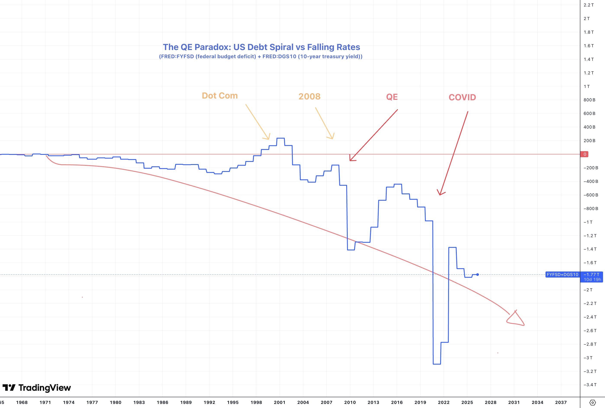
The combination of (Federal Budget Deficit + 10-Year Treasury Yield) shows The deficit  measured in dollars (currently around -$1.8T annually), and the 10 year yield as a percentage (currently ~4.5%) added into one line. 

Free market economics dictates that this line should be mean reverting to $0. To achieve this, as we have in the past, free market discovery of bond yields is necessary, but this trend will continue and reach -$3Trillion again and extend lower as the spiral continues.  

What the trend means - The deficit is so large that even with QE artificially capping yields at 4-5% (implied Yield Curve Control) the combined picture is still deeply negative, our borrowing hole is bigger than what reasonable rate normalization can offset. 

What you'd expect (normal economics - leading into the dot com bubble when we had a slight budget surplus) When the government runs bigger deficits, it has to borrow more. More borrowing means more bond supply - bond prices fall - yields rise. Bigger deficits should mean higher interest rates to close the gap and the chart goes above 0 indicating free market risk in US Treasuries (UST).

QE changes that.

Since the 80s, deficits have grown almost continuously, but the 10-year yield went from ~15% down to nearly 0% instead of up. That's the paradox of QE hiding the debt spiral. When long term treasury yields began to rise too rapidly, the Fed began to buy treasuries (Quantitative Easing) masking price discovery for government debt, and until recently, global demand for UST's as a safe reserve asset held steady too helping keep prices high and yields low despite ballooning supply, but relief is temporary and the fun is over. 

Deficits are too high, liabilities exceed receipts, M2 and inflation will remain elevated to fund everything, and demand for UST's will dry up in a multipolar commodity driven world. 


<br>

<br>
________________________________________________________________   

<br>
<br> *5/19/26* <br>

***If you're not confused, you're lying! High Oil and a semi-permeable strait lead straight to Multipolarity, AI is priced in, and BTC as the liquid macro signal.***

Equity breadth is unexpectedly at multi year highs. The top stocks are carrying the team, but everything else is catching up after lagging for a decade. Does this mark a healthy and recovering trend, or is this an anomaly as EVERYTHING else is in a macro downtrend including GDP, retail sales, the jobs report, payrolls, openings, consumer confidence, and more while inflation remains sticky. But as bubble discussions reach the mainstream, as the hyperscalers reach peak hype and the capex loop slows down, the tide at the top is now turning too. As breadth declines and as the MAG 7 reach PE ratios that can never be justified, both breadth as well as the high flyers may decline at the same time. 
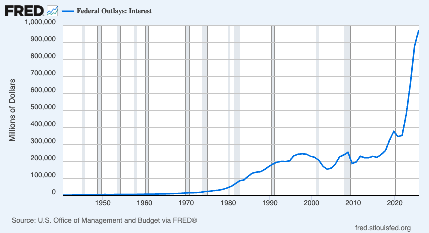
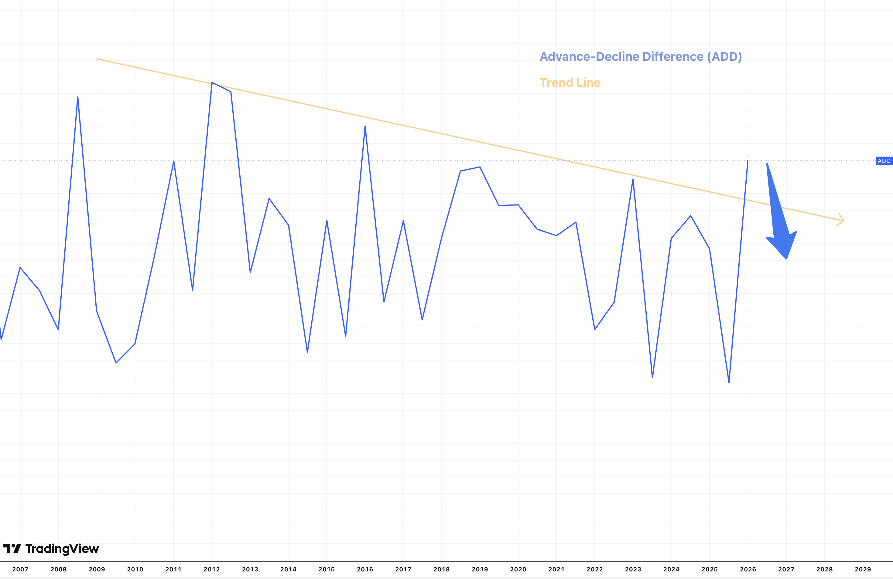

US Govt debt interest payments and entitlements are above income tax and foreign receipts kicking off the debt spiral. The circle is higher interest rates, stronger dollar, slower growth, lower rates, more printing, higher inflation, weaker growth. But we can only kick this can down the road for so long before foreign nations loose interest in the strength of our treasuries and willingness to trade without a re-pricing of trade balances the the US. Inch by inch we move closer to a multipolar world. 

The Iranians operating a taxable closure on the Strait of Hormuz while pricing some percentage of oil in Yuan only accelerates the shift away from USD which will mean more inflation, and by necessity a re-pricing of Gold as a reserve currency at least 3X, and more likely 5-8X higher than it is now even in relation to already high oil. 
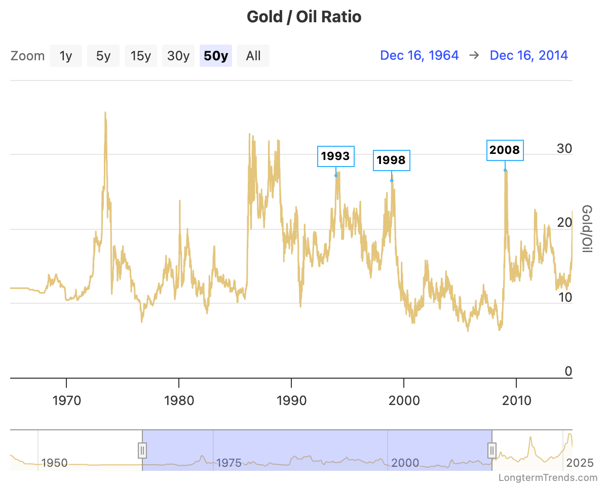
This is the macro that is happening now, and why stocks remain elevated is beyond me. There is a very good chance that we have passed the peak as measured in Gold or Oil for the MAG 7. We have two massive companies that have announced IPO's this year - OpenAI ($850Bn) and SpaceX ($1.75Trillion). 

The market cannot just absorb $2Trillion of new funds into being among the top ten companies on the planet while maintaining the current market caps of (NVDA) $5.41 Trillion (GOOG) $4.66 Trillion (AAPL): $4.44 Trillion (MSFT) $3.13 Trillion (AMZN) $2.85 Trillion (TSLA) $1.57 Trillion (META) $1.54 Trillion

Total Mag 7 Market Cap: ~$23.6 Trillion

The market has finished pricing in the AI hype, and is now officially a bubble. Former Open AI employee Leopold Aschenbrenner who was ousted from the company and started his own AI investment firm recently took out an 8Bn short position against the heavy hitters in the AI space, and only remains long on datacenter buildout companies, physical contractors, and BTC miners who are pivoting. His book includes: 

LONG

BE
SNDK
CRWV
MU 
TSM 
IREN
CORZ
APLD
RIOT
CLSK
BITF
BTDR

SHORT 

SMH
NVDA
ORCL
AVGO
AMD
MU 
TSM 
ASML
INTC
GLW

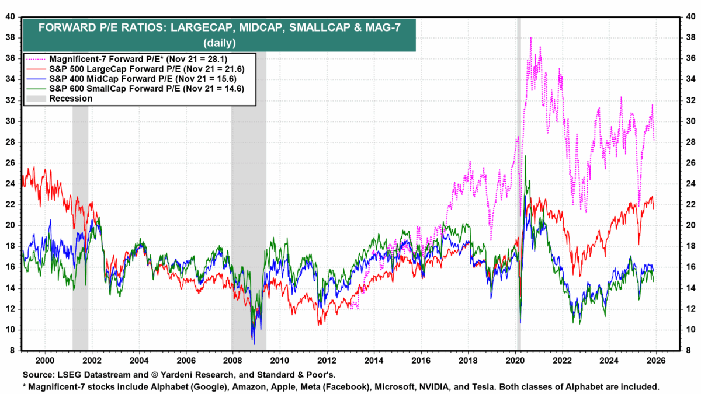

I believe the time between now and the IPO of OpenAI marks a durable top that will last until at least the end of the business cycle. 

Rates will need to come all the way down, commodities will continue to have their day, the dollar will yield, and for at least a couple years, things will be slow. Only after these things happen will the market have a recovery, only next time we will be looking at some definitively different players. 

BTC as the ever present macro signal has just been rejected by the 200DSMA, suggesting at least another six months of winter and weakness through the end of the year. We will see what comes.  

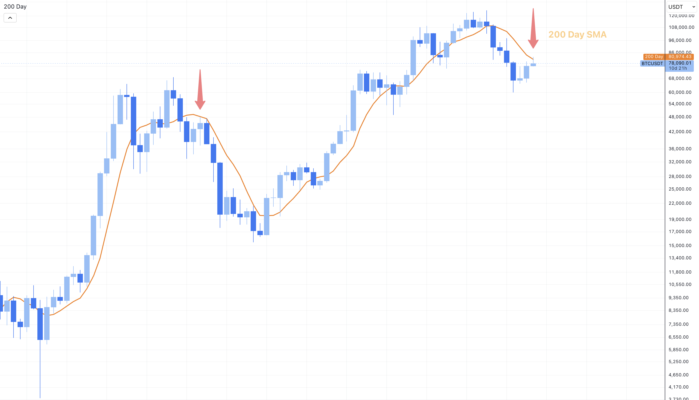


<br>

<br>
<br> *5/19/25* <br>

***US Treasuries are no longer a AAA rated asset, the abyss approaches.***


The market's up...Again.

$8 trillion has come pouring back into the stock market, making up for more than half of the recent $15 trillion destruction of funds since February when the market experienced a 21% drawdown. 

The driving forces are primarily a pause on the worst part of the traiffs, but something more ominous is lurking - Moodys a global credit rating organization has lowered their reliability status of US Treasuries from AAA (the highest tier) to AA1 (Just below) citing the government's potential inability to cover unfunded liabilities. 

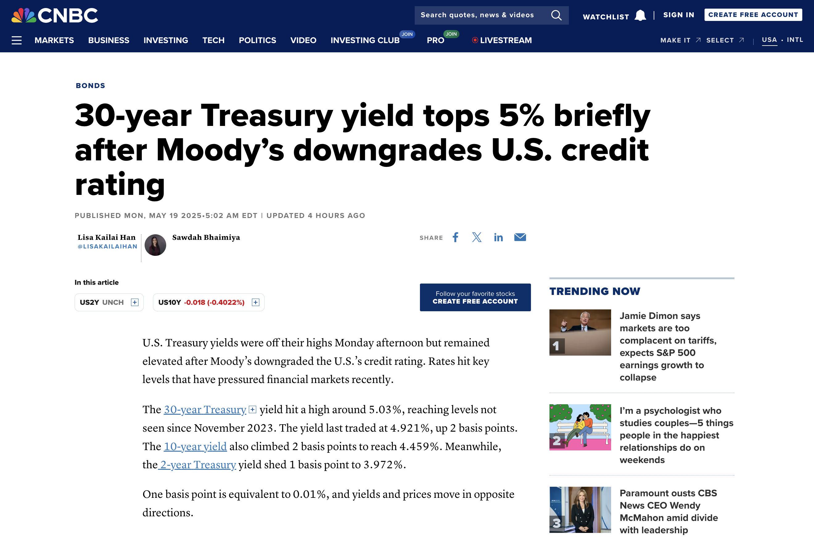

So...Is this a real recovery or just exit liquidity in a bear market rally? Bear market rallies are fast, aggressive, and often short-lived.

Looking back to 2022, the market clawed back over 75% of its losses… then plunged again over inflationary fears.

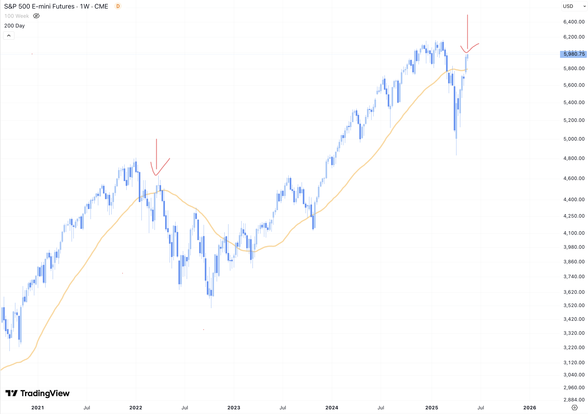

Now in 2025, we’ve recovered just over 75% once again, history may not repeat but it can rhyme. Technicals of this recovery are looking decent—S&P futures are above the 200-day moving average which was a major area of concern. 

Jst remember, the same type of setup in 2022 led to a head-and-shoulders top… and a collapse.

So, it always looks good—until it doesn’t.

What is the real driving force here? It's of course difficult to tell with so much going on, every bear market has its own story.

In 2022, it was the beginning of the Fed’s aggressive rate hikes and inflation panic and markets surged anytime investors thought the Fed might pause.

But 2025 is slightly different and no—it’s not all about tariffs - the the so called 90 day pause doesn’t mean that we're out of the woods yet. The real issue today reduarging treasuries is interest rates and the national deficit.

We just took a big leap forward on on the escalator of America's debt sprial.

While the majority of conservatives and mainstream have stopped worrying about the defecit, hawks have been warning for years that it would come back to bite us. After we hit 120% debt/GDP ratio in 2020, this was the point of no return - no country which has ever accumulated so much debt was able to recover without experiencing either hyper inflation, or a devaluing of the currency to gold or another comodity based assets. 

This is what we have just experienced in 2025 - a devaluing of the currency through Moody's reavaluation of US treasuries as less than a AAA rated asset to own - suggesting that the risk of the US defaulting on its debts has increased significantly. 

Despite this, the current president, love him or hate him has proposed an increase to the federal deficit within his ["One Big Beautiful Bill".](https://time.com/7286837/what-trumps-big-beautiful-bill-would-do-to-the-national-debt/) 


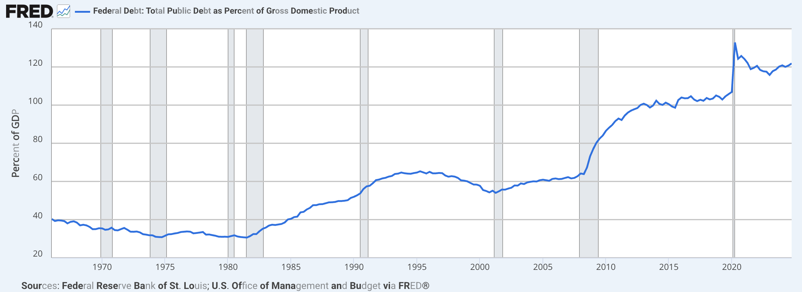

Currently, over $1 trillion now goes toward interest payments—more than we spend on defense or healthcare, and apparently our congress is jointly suggesting that we increase defence spending in order to return order to this world. 

And even with weak economic growth, bond yields are rising. Why? Because investors are demanding higher returns just to hold U.S. debt. America isn’t seen as a safe bet anymore and that's a big problem. 

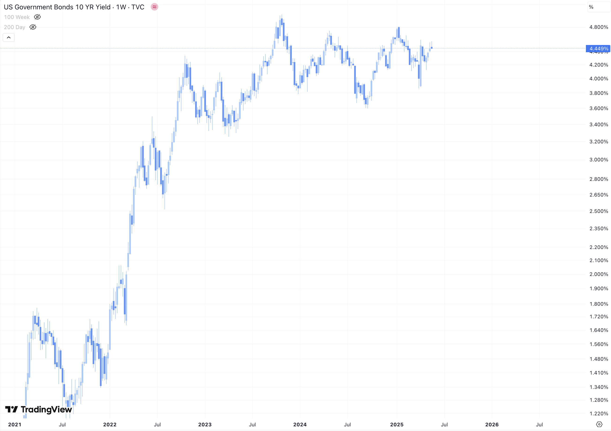


Some believe rate cuts will fix this. They won’t.

Lowering rates may actually push long-term yields higher if investors think we’re just kicking the can down the road again. Despite the efforts of Elon's DOGE, this year we have still managed to add $1 Trillion to the defecit. 

Yet Trump's bill is still proposing tax cuts, tariff hikes and hoping for rate cuts. The CME group which monitors  investor sentiment in order to predict FED rates estimates that there is an 8.6% chance of rate cuts in the FED's June meeting, but an 86.2% chance that the fed cuts rates in October. The question will remain - are they cytting for the right reasons, or the wrong ones? 

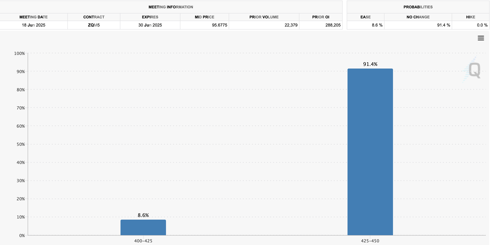
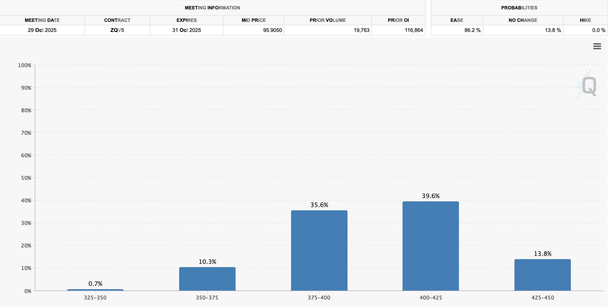


The market might look strong right now, portfolios are up and everyone feels better... but underneath it all the US is staring down the barrel of the largest financial reckoning in a generation. Maybe even the last one the dollar gets to survive in its current form.


Whatever happens next, recovery or relapse, we will be watching. 
<br>
________________________________________________________________ 
<br>
<br>


<br> *9/28/2022* <br>    

***Global economic outlook is the worst it has been since 1929***

Given the USD global reserve currency status, all eyes are on the fed who's DXY dollar index is sucking liquidity from every other global currency, there are only two ways out, one goes up, and the other goes down. Until we see the path resolved, our economy will remain in a downward trending stagflation. 

Is the fed done hiking? The math on total debt and interest along with the credit impulse markets say yes. Powell still needs unemployment and housing signals to come down *significantly* before attempting any sort of pivot, or at least pause in rate hikes. Analysts are saying that they'll pile in at SPX 3500 if we get there, but it's rare to see perfect entries in times of great fear. Look out below & stack cash for some great PE entries. Otherwise a verbal pivot will signal that we're going up from here, Nasdaq and Bitcoin will be the first to rebound. Either way, we could see an october surprise i.e. bear market rally leading into midterm elections and the endgame that comes after, whatever that may be. 

<br>
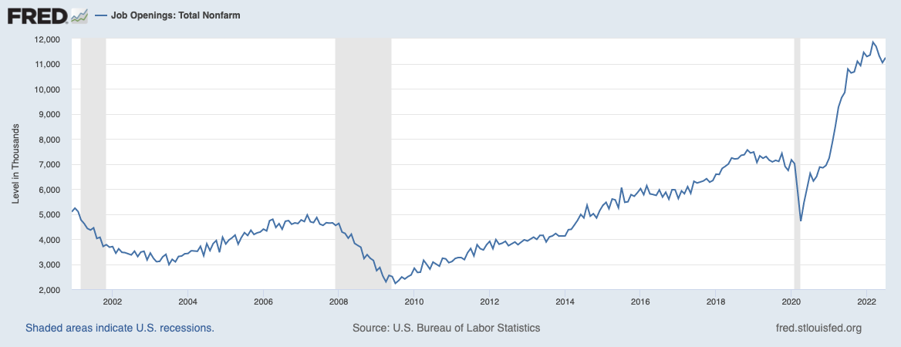
<br>
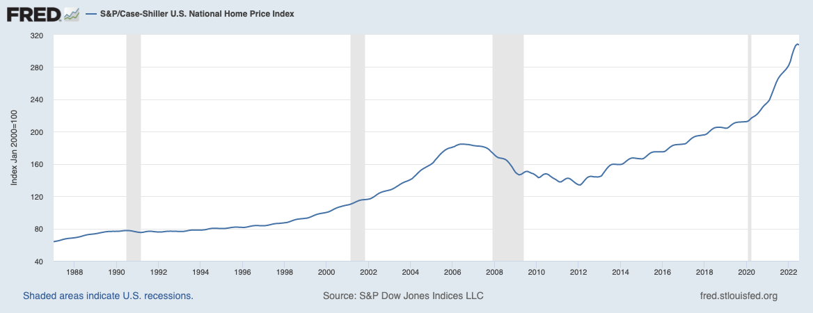
<br>

Charts thanks to Biancoresearch. 

<br>
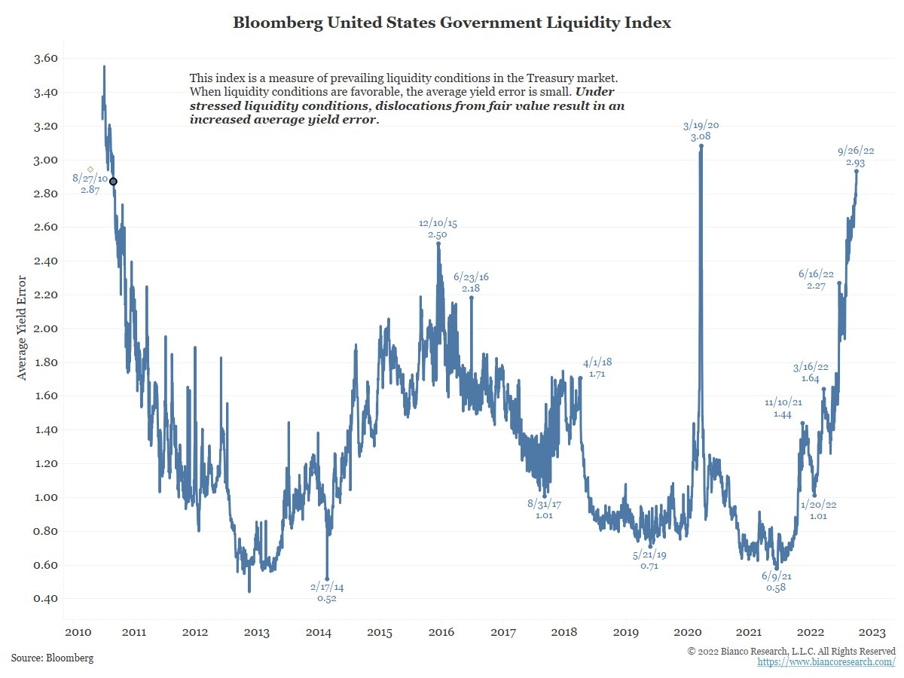
<br><br>
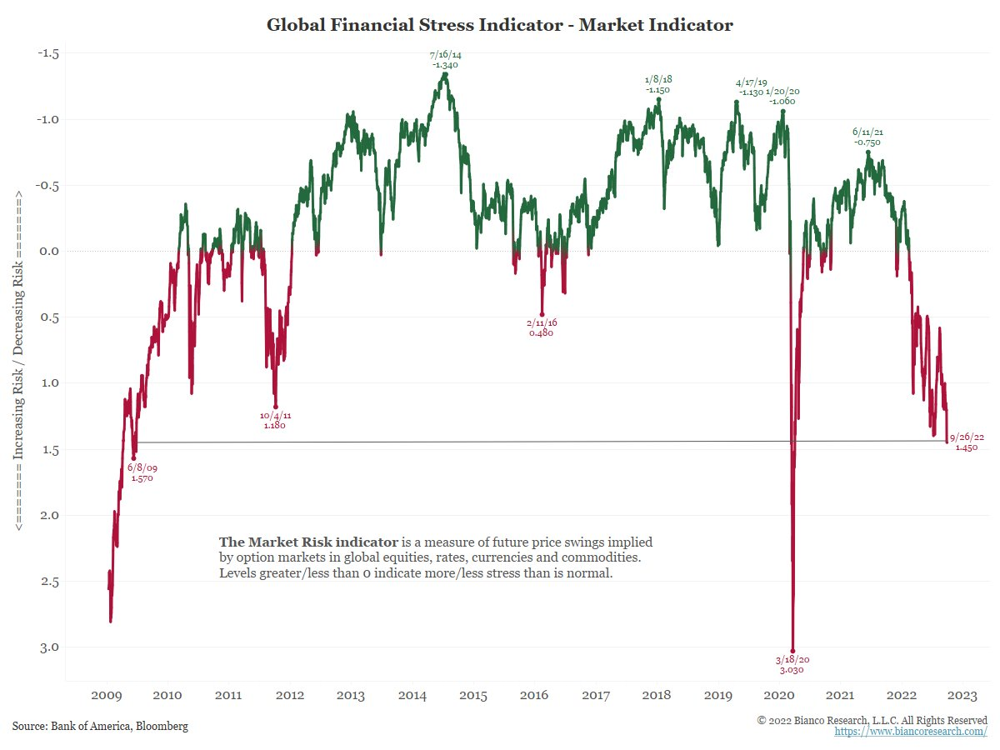
<br><br>
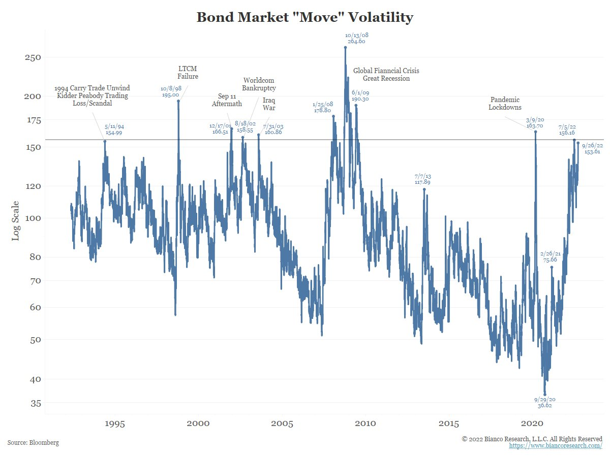
<br><br>
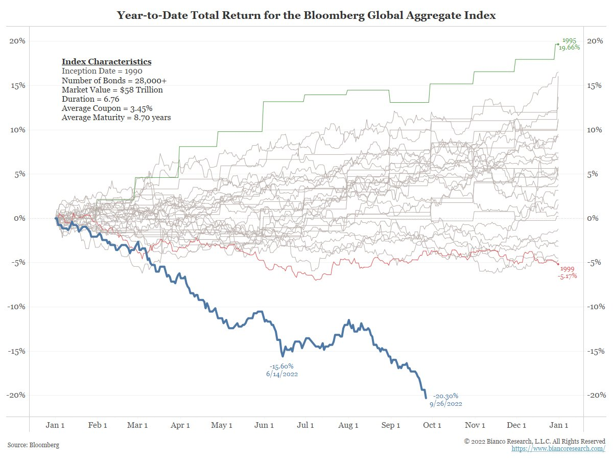
<br><br>
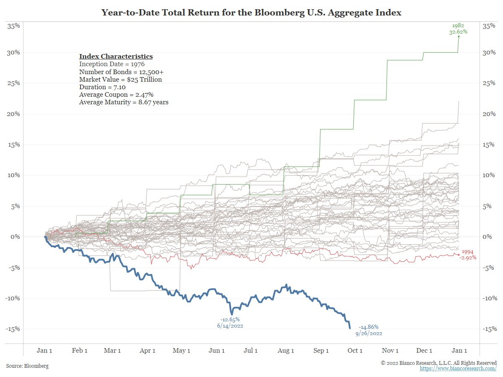
<br>

<br>
<br>

<br>


________________________________________________________________   
<br> *7/1/2022* <br>    

***Atlanta Fed Confirms that we are about to enter a Recession***

Most economists use the 10-2 year yield spread and curve to predict upcoming recessions, however the fed today is using the 10 year - 3 month spread. This is likely because it will be the last to flash the warning sign of recession and allow Biden to say things like "We have a very strong economy" as GDP continues to slow.  

The NY Fed tells us that, "This model uses the slope of the yield curve, or “term spread,” to calculate the probability of a recession in the United States twelve months ahead. Here, the term spread is defined as the difference between 10-year and 3-month Treasury rates." 

The only tool the Fed has to combat high inflation is raising interest rates, typically ABOVE the rate of inflation, as should have been done a year ago when the economy was stronger in order to avoid the stagflation we're seeing today. Higher interest rates mean a stronger dollar, and higher interest rates as term duration increases on bonds - a normal and healthy yield curve which rewards people for saving their money in cash longer. 

The real rate of return when accounting for inflation on any of these bonds is currently several points in the negative due to price inflation, therefore the Fed needs to continue raising rates until inflation calms down from demand destruction and yields on risk free treasuries trends back towards sensible returns. Until this happens, we will continue to see other currencies fall in value compared to the US Dollar denominated hegemony - "The Dollar Milkshake".  

The Fed is far behind the curve, and the government's interest payments on $30 Trillion dollars of debt and much more in foreign obligations, will ensure that the Fed remains behind the curve, actually favoring inflation that goes unnoticed in order to inflate away the debt, the only way out is through a hard landing, a deep recession, or returning to Quantitative Easing in order to simply kick the can down the road. This last option of QE is unfortunately not on the table at the moment because the money printing is what got us here in the first place.  

<br>
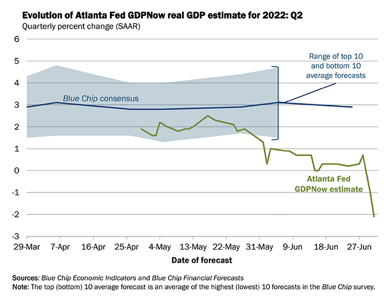
<br>
<br>
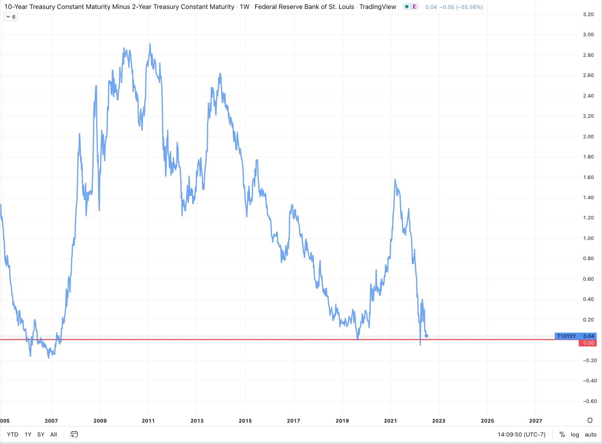
<br>
<br>
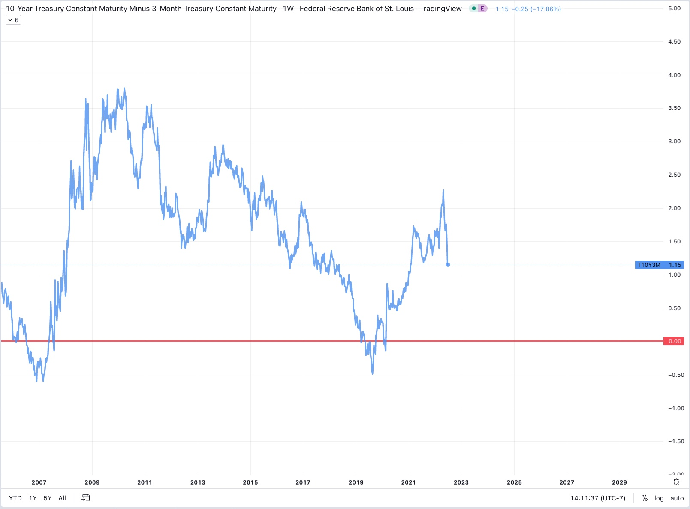  
<br>
________________________________________________________________  

<br> *6/30/2022* <br>    

***Energy Price Inflation Soars in Germany and around the World***

Americans [owe](https://www.freedomsphoenix.com/News/326998-2022-06-12-americans-owe-22-billion-in-late-utility-bills-as-energy.htm) $22 billion in already late utility bills as energy costs in the US rise 34% YOY. 

Europe, more directly affected by the Russia Ukraine War has it much worse, Germany specifically is has experienced a 6X increase in the cost of baseload power since 2020. They managed this by increasing their reliance on Russian oil and gas along with shortsighted energy policies and adherence to the ESG narrative at the expense of their own fragility.

In 2020 Germany's percentage usage of renewables [was](https://foreignpolicy.com/2021/02/10/is-germany-making-too-much-renewable-energy/) 46%, largely coming from wind, solar, and hydro electric. The remainder of their energy was from coal, gas, oil, and nuclear. 

Despite still struggling to meet their stringent carbon related policies, and despite the now soaring energy costs, Germany has recently upheld the pledge to continue with the shut down their remaining nuclear reactors by the end of 2022, a decision that was decided a decade prior, in the wake of the Fukishima disaster in Japan. 

The German government has also pledged to phase out coal - but not until 2038. This series of moves has ensured that their baseload energy consumption is actually getting more carbon intensive, not less. These choices, alongside western imposed Russian sanctions which have increased natural gas prices globally leave the German's supply of baseload power insufficient for meeting modern expectations or demand. 

Germany's Vice Chancellor [warned](https://wattsupwiththat.com/2022/06/26/germany-green-energy-crisis-warns-of-lehman-like-contagion/) of a "Lehman like" economic collapse due to their current energy policy, and we are seeing it play out in fast and slow motion. 

Germany is extremely close to [rationing](https://www.businessinsider.co.za/germany-says-energy-crisis-may-trigger-lehman-like-contagion-2022-6) stores of natural gas, and suggesting it will start with hot water, a luxury some of those living in energy poverty have already forsaken despite their middle class incomes. Today, likely more than 23% of German people are suffering some form of ["Energy Poverty"](http://www.enpover.eu/en/energy-poverty) where a significant enough portion of their income goes towards energy, causing them to cut back on other necessities. 

With prices so high, and natural gas stockpiles at record low levels, the German Government has [announced](https://www.telegraph.co.uk/business/2022/04/19/germany-wont-stop-buying-russian-gas-should-face-sanctions/) that they will re-establish the use of previously decommissioned coal-fired power plants. Coal is far easier to bring back online than nuclear, so any future hiccups will likely see expansion of this more carbon intense base energy. 

German wholesale oil is up ~70% YOY, and even an end to the war wouldn't mean that western nations return to direct purchases from Russia, therefore these price increases are likely to remain.  

Furthermore,UK newspaper The Telegraph [suggests](https://www.telegraph.co.uk/business/2022/04/19/germany-wont-stop-buying-russian-gas-should-face-sanctions/) that if Germans won't stop buying Russian gas, they too should face sanctions. 

Lastly, Reuters reports that; Italy, Portugal, Slovakia, Bulgaria, and Romania have joined Germany's finance minister in opposing the 2035 mandate to ban the sale of new petrol and diesel cars. This move, is postponed would all but ensure that the EU does not meet it's target of reducing greenhouse gas emissions by 55% compared to 1990 levels before 2030. 

Many across the globe will be priced out of the green energy revolution.

<br>
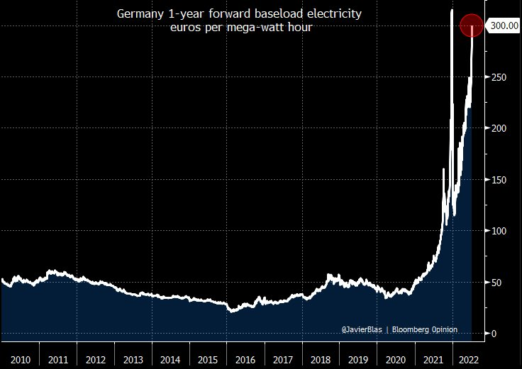
<br>

<br>
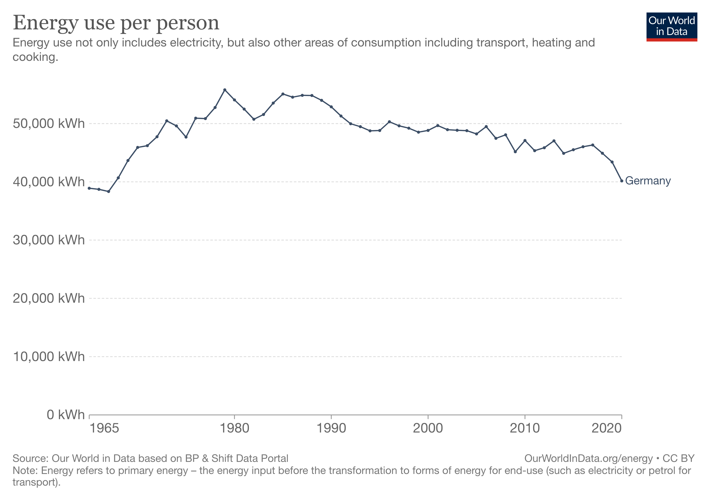
<br>

<br>
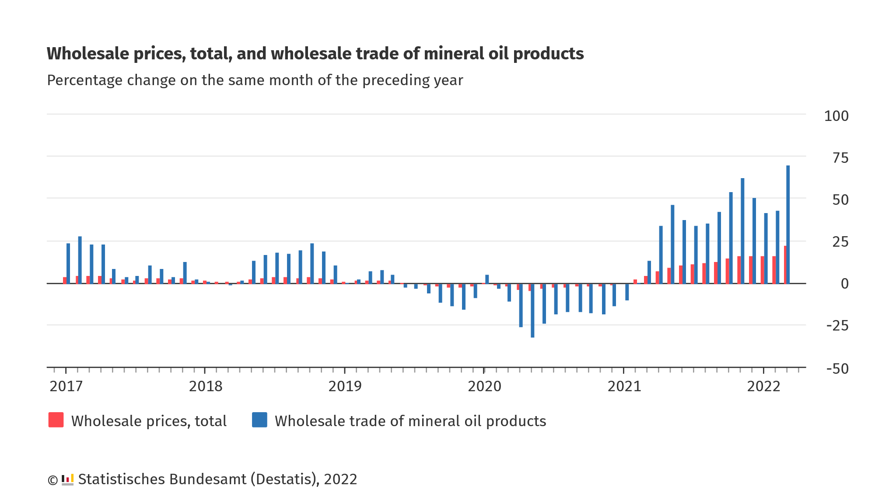
<br>


________________________________________________________________  


<br> *6/18/2022* <br>    

***Update to the Japan Crisis***

Japan's Ponzi Scheme is running out of time. Japan has 12.8 Trillion on the BOJ's balance sheet and their current debt/GDP is nearly 200%.

They have apparently reached their limit to perform Yield Curve Control in both the bond and stock market with newly printed treasuries which cannot find the buyers necessary to prop up the Yen's purchasing power against USD. A panic spike in selling lead to Bond yields jumping up above the governments mandated ability to continue QE driven purchases without becoming insolvent with a debt/gdp ratio too high. Market participants selling bonds lead to higher interest payments for a government that cannot afford it. 
<br>
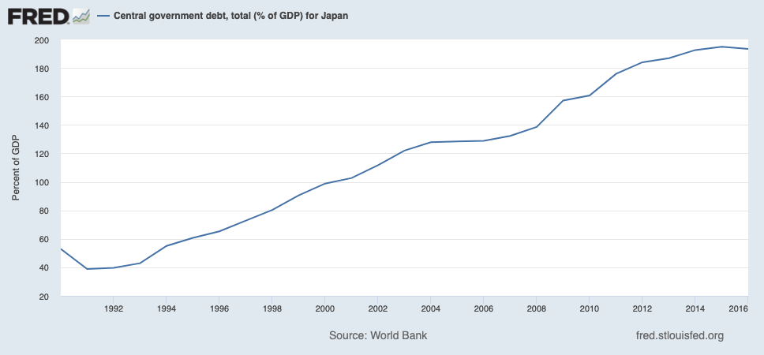
<br>
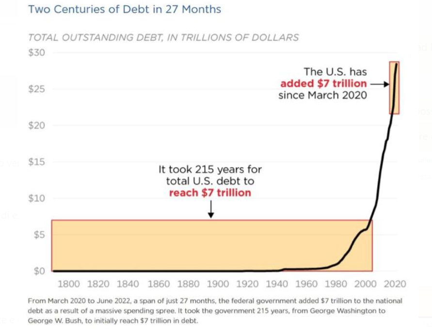
<br>
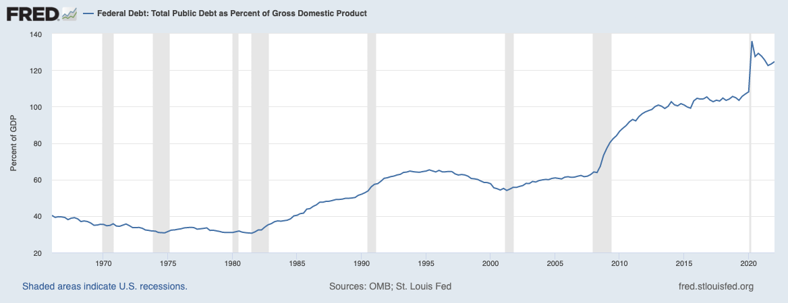
<br>


________________________________________________________________  

<br> *6/9/2022* <br>    

***Japanese Yen spirals against US dollar, the consequences of endless
QE*** 
<br>  

Japan has been the canary in the coal mine for the last decade, forecasting where us
in the US and western nations who are participating in
Quantitative Easing might end up. Japan has apparently reached its limits in how far they can go before trust in assets held on the
central bank's balance sheet is lost. 

Japan's debt/GDP ratio is nearly 200%, the highest of any nation in the
world. 

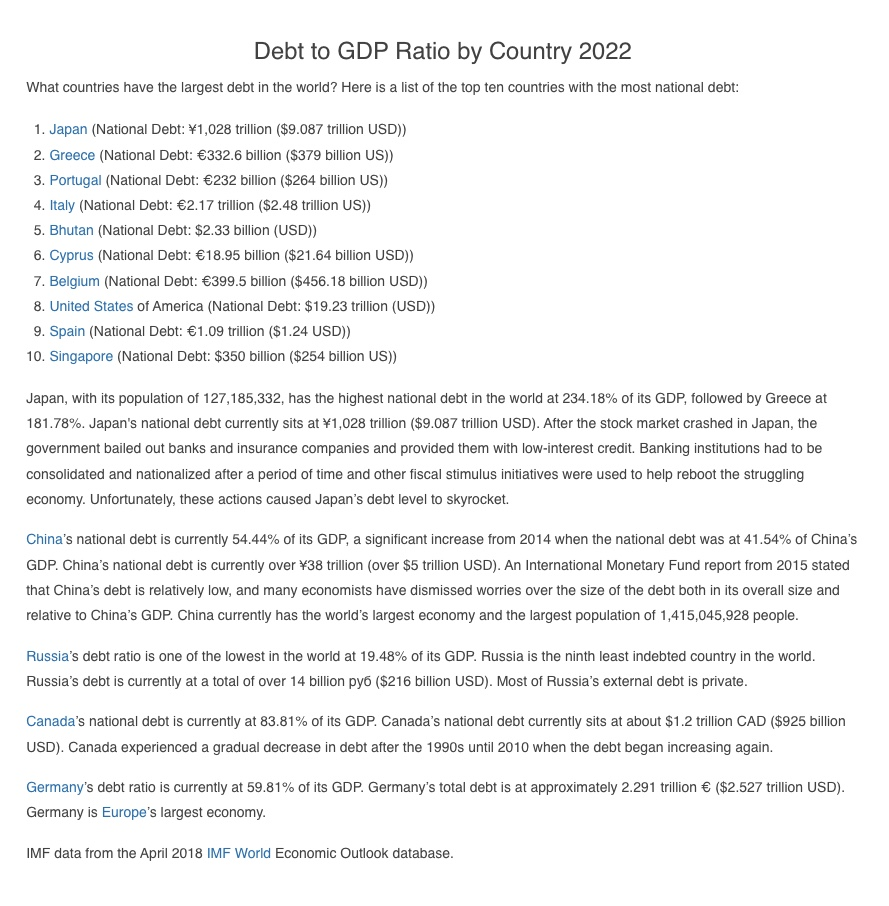

<br>

<iframe
src="https://data.worldbank.org/share/widget?end=2016&indicators=GC.DOD.TOTL.GD.ZS&locations=JP&start=1990&view=chart"
width='450' height='300' frameBorder='0' scrolling="no" ></iframe>


<br>

With a debt/GDP ratio this high, the government technically owes money to
itself through the central bank's deficit printing. The problem with
having so much debt is the interest rates. Once interest rates begin to
rise, so do interest payments needed to remain solvent. Without a robust
and increasing GDP for taxpayer generated income for the government to
fund the debt, the only option becomes - devalue the debt denominated in
fiat currency which has no limitations to creation - inflate it away. 

When the M2 money stock goes up, each dollar held by citizens and the
government goes down when measured against other commodities, or other
currencies which will remain stronger if they are not also printing more
money, though the debt, taken out years, even decades ago remains the
same. The debt positions can thus continually be serviced with newly
created money that has a lesser value, and the longer a nation waits to
pay off the debt, the cheaper it becomes. 

A true sovereign debt crisis occurred in Greece when their debt was
denominated in Euros, instead of their own former Greek currency, the
drachma. Since the Greek centrral bank could not control the newly issued
wupply of Euros, regulated by the ECB, we saw them enter a period of
default where their debts needed to be written down in lieu of a western
humanitarian crisis. 

Central Banks like Japan, or the United States who can self fund have the
advantage especially when interest rates are low, but when entering
a period of tightening, and slower economic growth, or even stagflation as
we are now, the only tool to create demand destruction and thus lower
inflation would traditionally be - raising interest rates to the rate of
inflation. 

The problem with an inflationary environment is that to solve the problem
of inflation, it is all but mandatory to cease the creation of more
dollars. Volker of the FED solved this problem in the 70's by raising
rates to match the rate of inflation which was above 10% at the time. The
only problem with doing that now is that we have too much debt. 

If the US or Japan raised rates this high, to 8-16% to match the current
inflation rate, the governments would not be able to finance the interest
payments on the debt, and would thus default. 

But they can't print more money either, so it's necessary to rely on
jawboning all markets into demand destruction without raising rates, and
so far it's working. 

If this is not effective enough, the US will need to follow Japan's lead,
by implementing Yield Curve Control (YCC).

The aim of YCC is to craft a particular shape to the yield rates on bonds
issued by the government. When any entity including individuals are
holding treasuries issued by the government, they should be expected to at
least retain their value, furthermore, the longer duration of the bond,
the higher the expected yield, but with inflation, this becomes a problem. 

Therefore, it has become necessary for the Bank of Japan to participate
in yield curve control, printing money to directly purchase bonds and prop
up the market. In addition to this, the BOJ is also purchasing stocks on
the open market as well, something previously unheard of. 

This has a two pronged effect; firstly is staves off insolvency for Japan,
for now, they are able to service their debt's on the balance sheet with
new dollars, but secondly, it has eroded trust, and yield from all of
their markets is gone leading investors to seek yield elsewhere. 

If this persists, a debt driven deflationary spiral that leads to
insolvency could follow, and it could be both abrupt, and catastrophic as
it was for Greece who needed a bailout from the ECB. 

Japan's 10 year yield has been below the US 10 year yield for a decade now
leaving less access to liquidity for paying off debts, but also Japan's
stock market has not reached a new all time high since 1990, in fact, it's
still down 26% from that date. Money is fleeing the country and GDP will
remain low, threatening insolvency indefinitely. 

The Japanese Yen is loosing value compared to the dollar, but the Dollar
is loosing value compared to commodities and will inevitably face the same
fate if we continue the current regime. 

<br> 

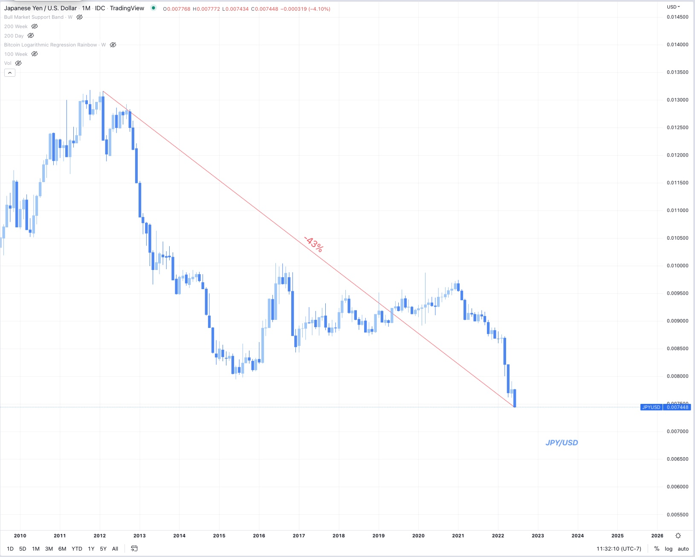 <br> 

<br> 

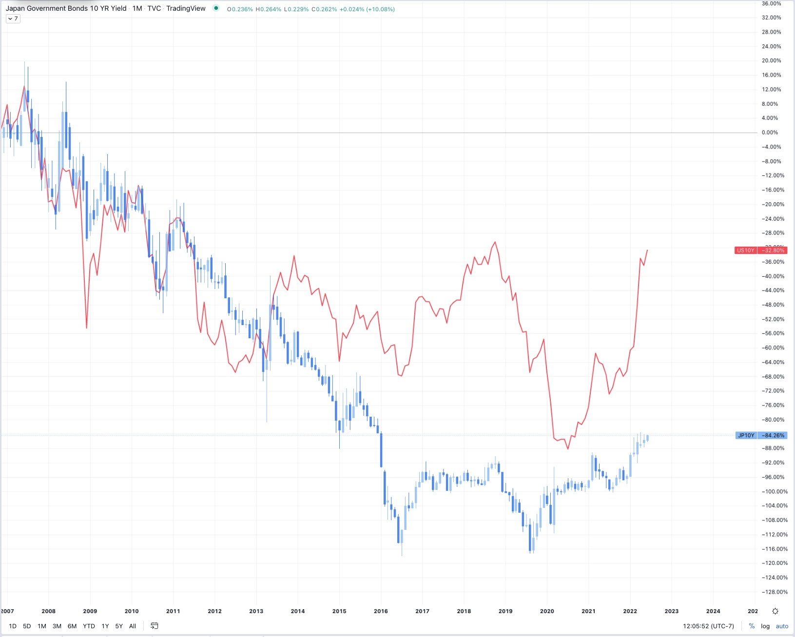 

<br>

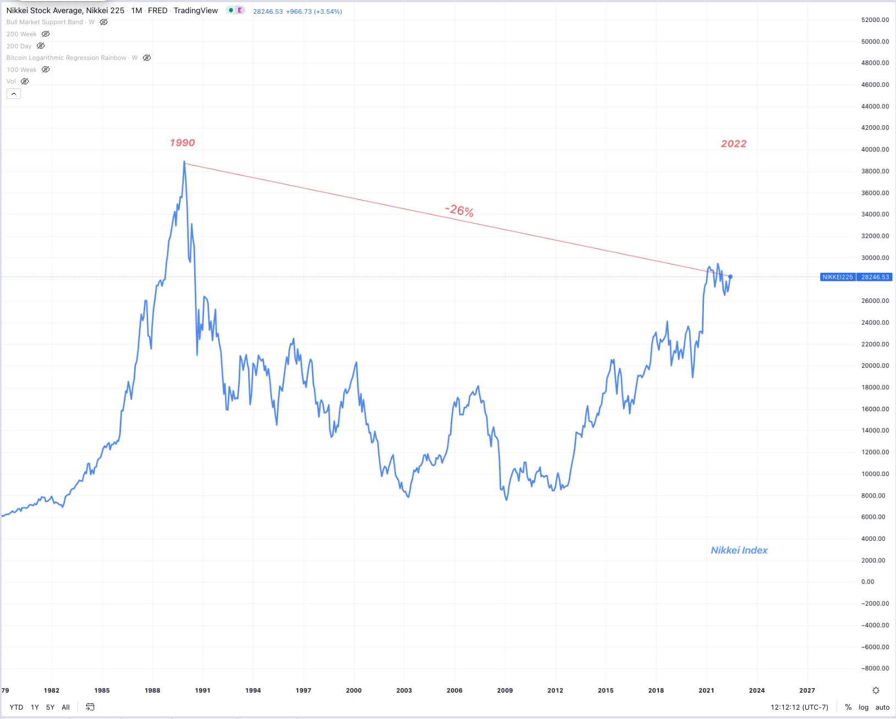
  
<br>
<br> 
<br> 

________________________________________________________________  
<br> 

*6/7/2022* 
<br> 
***Federal Reserve Releases Hilarious Hit Piece on Bitcoin***

The FED has [released](https://fredblog.stlouisfed.org/2022/06/buying-eggs-with-bitcoins/) a chart comparing Bitcoin's purchasing power against the price of supermarket eggs. They suggest that this is the reason Bitcoin is not a good store of value. 

This is the chart presented. 
<br>
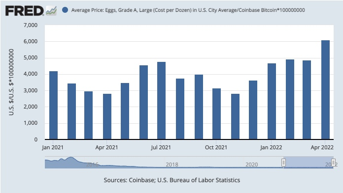
<br>
It only takes a moment to realize that the data is completely cherry picked from the last two years, and if you choose to drag the view options back to the inception of Bitcoin in 2009, their very same chart simply tells the opposite story. 

If you were to have held Bitcoin instead of US dollars for nearly any period of Bitcoin's existence, your purchasing power measured in eggs would have only increased, and significantly. 
<br>
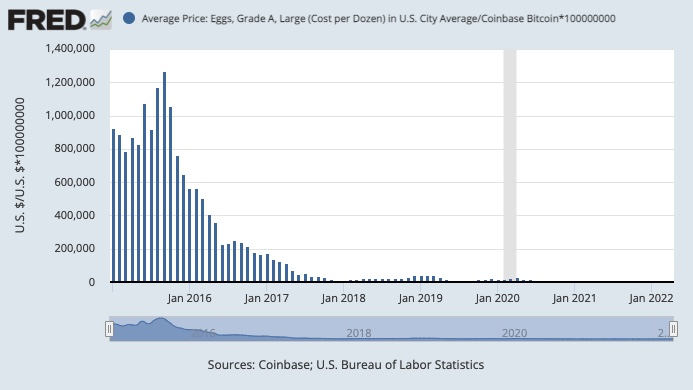
<br>

The US dollar has lost 95% of it's purchasing power against commodities, goods, and services over the last several decades. It is interesting however that the FED finds the need to attempt to make these silly comparisons. 


<br>
<br>
<br>
________________________________________________________________   

<br>
*6/6/2022*
<br>    

**Natural Gas prices spike, World Food Crisis Looms**  

<br>

Many countries are being threatened with immediate food shortages, not next year or next month, right now. The current situation involving Russia-Ukraine is greatly exacerbating the problem. Known as the "bread basket of the world" which also includes Belarus. These countries make up more than 1/4 of all global grain trade, and Russia have announced that they will restrict grain trade within "[Friendly countries](https://www.nbcnews.com/news/world/live-blog/russia-ukraine-war-live-updates-evacuations-launch-mariupol-talks-resume-n1293815/ncrd1293834)." 
<br>
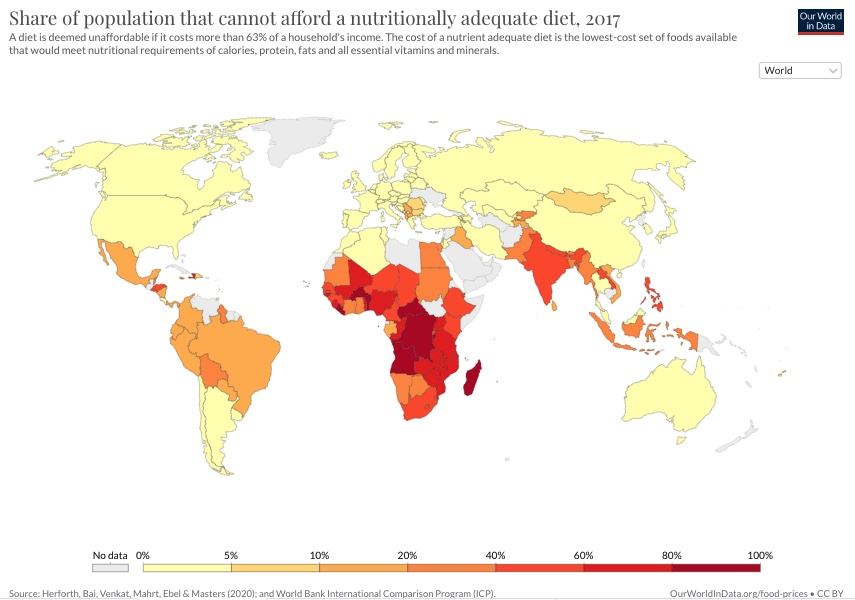
*Note: This is 2017 data, pre pandemic, pre money printing from the FED, and before war in Ukraine, unfortunately it only get's worse from here. 
<br>
Furthermore, fertilizer is made through a process invented by Fritz Haber and Carl Bosch who is often credited alongside Norman Borlaug, inventor of genetic modification, for being the catalysts of the "[Green Revolution](https://en.wikipedia.org/wiki/Green_Revolution)" in the late 50's to which they  are credited with saving hundreds of millions of lives. Today, 50% of peoples food supply relies on both genetic modification of staple food crops which are pest and drought resistant, but also their growth is dependent on the Haber-Bosch process which uses nitrogen fixation to produce ammonia. Previously, many farmers would need to go through the season long process of planting nitrogen fixing plants to revive this necessary chemical. Today, it can be purchased in 1000LB+ quantities and applied at will. This is how we currently feed the world. Cheap fertilizers that contain ammonia are the reason the world population was able to move from 3 Billion people to nearly 8 Billion today. 

<br>
Haber Bosch Process:
{\displaystyle {\ce {N2 + 3 H2 -> 2 NH3}}\quad \Delta H^{\circ }=-91.8~{\text{kJ/mol}}}
<br>
Historically fertilizers have been cheap, relying firstly on the recent boom in availability from the recent discovery of previously untappable oil reserves, this, alongside the deflationary pressures of technology evolution, lead to continually declining prices of methane (CH4) and ultimately the manufacturing process of fertilizers. 

Secondly, fertilizers are made from nitrogen as we know, but also potassium and phosphorous, and Russia and Ukraine previously made up 28% of all global fertilizer supply. Given equal and consistent demand as farms tend to have, supply constraints will mean higher prices. 
<br>
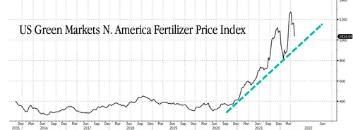
<br>
Recently, after Russia's foreign treasury reserve assets held internationally were seized in the first ever occurrence of this sort which pokes a hole in the supposedly unbiased petrodollar hegemony, Russia retaliated by forcing purchasers of Oil and Gas to procure Russian Rubles to make those purchases through Russian banks who were cut off from the SWIFT network. This new demand for Rubles has caused it to outperform the US dollar, gaining purchasing power, and leading to higher prices on Natural Gas, of which Europe gets 40% of its gas from Russia. 

European citizens have been experiencing a condition known as being "energy poor" where the average middle class family has all the modern amenities that we have in the US for example, but cannot afford to heat their homes, or use a hot water heater due to the skyrocketing prices of natural gas, both over the last decade due to ratcheting carbon tax tightening as well as the European Central Bank's inflationary money printing, both causing prices to rise for end consumers. 

On top of that, Europe has sanctioned  [fertilizers](https://www.politico.eu/article/eu-sanctions-higher-food-prices-potash/) and from Russia and Belarus, which will also lead to inflationary prices for end consumers. While France is the European country that has the closest to a carbonized energy grid, made up of mostly nuclear, Germany has recently decommissioned the last of the nuclear plants and replaced their energy with mostly coal and natural gas from Russia. The German society is now highly dependent on Russian gas, and a global divestment from fossil fuels in general means that there is not much more supply coming online for the next several years. 
<br>
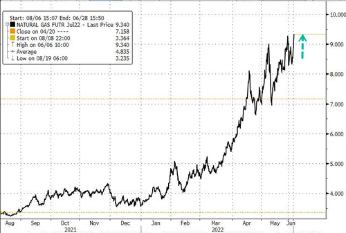
<br>
Together, this makes up the perfect storm  for higher input costs from lack of fertilizers, and direct blockade of supplies from Russia, and now other countries which refuse to export certain items like China who has been accumulating food stores for years, now [hoarding](https://asia.nikkei.com/Spotlight/Datawatch/China-hoards-over-half-the-world-s-grain-pushing-up-global-prices) half of the world's grain. Malaysia is [banning](https://www.scmp.com/week-asia/economics/article/3180039/malaysias-poultry-export-ban-when-will-it-end-how-have-people) the export of Chicken. Indonesia recently took to [banning](https://www.moneycontrol.com/news/opinion/indonesian-palm-oil-export-ban-set-to-raise-indian-inflation-8405201.html) the export of Palm oil due to a poor harvest, which drives the price of palm oil up. This price increase leads to more deforestation in the amazon and southern Asia where palm oil is the majority of export crops, but it also incentives wheat farmers in the US - another large wheat producer- to flip and plant more soybeans for soybean oil instead of wheat, again driving wheat prices higher. India [bans](https://news.yahoo.com/us-urges-india-reverse-ban-083311676.html) the export of wheat. This is a problem because wheat is in basically all the processed foods. 

Joe Biden has been making the rounds to world leaders hoping to convince them to increase supply and drive down prices. He offered India $4 billion to export more wheat which they rejected. He asked Saudi Arabia to export more oil which they said they couldn't do due to already tight supply constraints. We have such a significant problem that America's past actions and alliances can be ignored in the search for more oil. We formerly accused Nicolas Maduro of both election fraud, then later drug trafficking in order to attempt to [install](https://theintercept.com/2019/02/02/venezuela-us-trump-sanctions/) the US-friendly Juan Guaido who never fully assumed [power.](https://www.bloomberg.com/news/articles/2021-09-02/why-venezuela-s-two-presidents-are-ready-to-talk-quicktake) Recently, Biden reached out to Maduro to try to procure more Venezuelan oil that should have originally been destined for our largest refinery owned by the Koch brothers in Corpus Christi, Texas. However, The political blowback of a nation supposedly aligned with Russian interests was nearly enough to shut down these talks, but it looks like we don't actually care about politics or what we used to call Russian aliance, because it looks like Venezuelan oil may begin to be imported soon. This is all a result of US involvement in the Russia Ukraine war when we  banned Russian oil imports to America. 

We have no oil, we've released all of our strategic reserves, and we dont have the wells, refineries, or infrastructure to bring supply online to meet demand, therefore price must rise. Chevron's CEO has [said](https://www.msn.com/en-us/money/markets/chevrons-ceo-says-no-more-us-oil-refineries-what-should-energy-investors-do/ar-AAY6k1N?li=BBnbfcL) that he does not see any new oil refineries ever coming back to the US. This is in part due to the horrendous permitting and regulation process which can take time measured in years, and money measured in the millions, only to get approval, even nearly finish construction, costing billions, to then have the project held up in court for another several years and threaten its very completion. This is what happened to the Mountain Valley Pipeline in Appalacia which contains our largest natural gas reserves, and  the Jordan Cove LNG pipeline in Oregon which developers [abandoned.](https://www.oregonlive.com/business/2021/12/jordan-cove-developers-abandon-plans-for-pipeline-coos-bay-lng-terminal.html) These projects are now sunk costs worth billions on investors balance sheets, definitively scaring away any new investors. 

The environmental movement has a  process of blocking new fossil fuel infrastructure that can sometimes be very effective. petitions, protests, court appeals, biodiversity, larger environmental concerns, damage from spills, air, noise, and unethical pollution, these things are all excellent and effective tactics that the environmental movement uses to block new fossil fuel infrastructure. The majority of the public is simultaneously on the side of the environmentalists wanting to make the world a batter place, but also desiring lower costs for gasoline at the fuel pump. The pendulum has swung too far. 

The realities of economics and commodity inflation have already caught up with us and if we continue to invest in new fossil fuel infrastructure, oil prices will increase and remain high due to constrained supply. Of course, we also need to optimize out investments in green tech as well because many of the environmentalists concerns are warranted. Hoowever, renewables largely do not have the tech or the cost effectiveness to outcompete oil in most places, the cost of EV's and the chips that run them are only going up due to all the supply shortages caused by quantitative easing which is necessary to keep the US from a debt driven collapse. 

These intricate complexities only lead to regressive outcomes hurting those who cannot afford green tech, while also demonizing them for their supposed dirty emissions in what is quickly becoming a class divide driven by inflation and market manipulation from the Federal Reserve. We need to tackle climate change, but we don't need to go overboard, and what we're doing right now is not necessary even according to the IPCC and the IEA who don't see any concerning tipping points until we reach a global temperature over 4 degrees celsius, which they project us to remain well under. Optimal policy is difficult, and the current two sidedness and bias towards extremity in order to gain moderate results is not helping. 
<br>
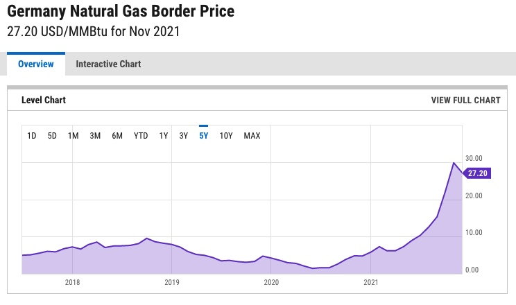
<br>
Reshoring of goods, services and commodities into our borders makes for a self sufficient economy, but globalization and free trade make for cheaper goods and a more diverse and growing global economy which predominantly benefits developing nations, but we cannot have both sides of the extreme. Privatization also matters, Venezuela is rich in oil, but poor in their Bolivar's exchange rate, nationalization does not work when the government is allowed to continually operate at a loss, hyperinflation has arrived for Venezuela, and will continue to increase across the world as energy runs the show and the economy. 

What was previously a perceived environmental win of slowing investment in fossil fuel infrastructure is now causing mass starvation for wage earners across the globe who cannot keep up with food price inflation. Those consumers who will not or cannot pay, will be forced to change their purchasing behavior and some will starve or become malnourished for lack of cheap and healthy food. Famines are created not by God, but by man. 

The Food and Agricultural Organization price index tracking month over month and year over year changes shows every key agricultural product up significantly year over year as well as Cereal prices, which includes wheat, up by 30%. Every food that contains wheat will need to either rise by 30%, or the company selling it will need to choose to take what is for them hopefully* a temporary* loss to keep their customers.

In a United Nations press [Release](https://www.un.org/press/en/2022/sc14894.doc.htm), Antonio Gutierrez said, "“When war is waged, people go hungry...Most important of all, we need to end the war in Ukraine.” The security council quotes Antony J. Blinken, Secretary of State of the United States, "Recalling WFP and FAO estimates that people affected by food insecurity due to conflict would increase to an estimated 161 million in 2022, noted that the Russian Federation’s war in Ukraine could add another 40 million people to that total.  That country’s flagrant disregard of resolution 2417 (2018) is just the latest example of a Government using the hunger of civilians to advance its objectives.  The food supply for millions of Ukrainians and millions more around world “has quite literally been held hostage by the Russian military”, he said, noting 20 million tons of grain sit unused in Ukrainian silos as food prices skyrocket." 

<br>

<br>
Defense spending is both fine and desired, but war is bad for business, let's stop fighting and funding proxy wars that aren't on our soil. 
<br>


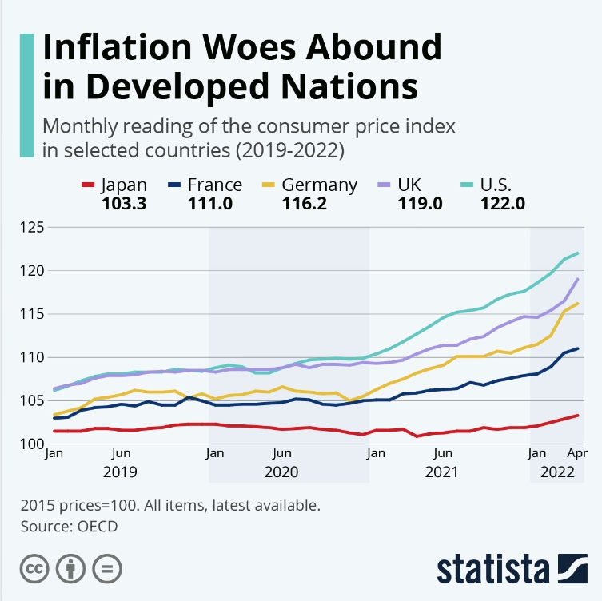
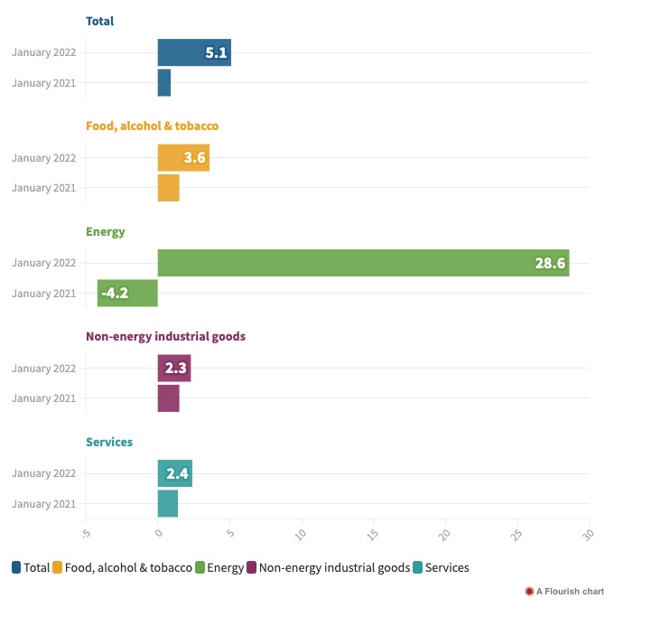

<br>  
There's no use hoping inflation will come down, and producers know this, the debt/GDP ratio shows us that it will continue for the rest of the decade unless the US chooses to default or cause a recession which is far worse than 1929 due the the amount of leverage across all markets. Officials will never choose either of these options, they will always choose inflation with short term periods of demand destruction as we're experiencing now. Macroeconomist Luke Gromen calls this "Peak Cheap Oil."

Shadow Stats is a company currently tracking CPI inflation much more accurately than the massaged US government numbers, they do this by using the US government's former calculation methods instead of the new ones which were recently changed several times to fit the narrative. Currently Shadow Stats has inflation above 16%, much closer to prices in the real world. Wheat inflation is now 30% year over year.  

The healthy and reasonable way to fix this is to cause short term demand destruction in financial markets and commodity futures today, while the economy is still relatively strong and raise interest rates to the rate of inflation - the Volker method. This alongside a significant reduction in federal expenditure is necessary for the economy to recover in real terms, instead of waiting for stagflation to continue, for a recession to get worse, and only then attempting to raise rates into an economy already in a depression. If the FED doesn't pivot within the year, this is where we're headed. The FED is out of options, and not only are they behind the curve, they are also late to the party and too slow to act, and because of this people will starve. 


  
<br>
<br>
<br>
________________________________________________________________  
**6/1/2022**
<br>  
***Federal Reserve Begins Quantitative Tightening Today***  
<br>  
  
- The Fed will begin selling UST's and MBS's. There are many reasons for markets to buy US Treasuries, they are universal pristine collateral across the world, but when the Fed begins selling Mortgage Backed Securities, there becomes more supply of them, less demand for their use as collateral, and there is only one buyer - pension funds forced to purchase them by mandate to "reduce risk." MBS interest rates will increase as selling occurs and price goes down, and the housing market will stall over time. The real risk comes when these investments have negative real yields against inflation and pension funds begin to fail unless they can adjust the regulations in order to find better yields. 
  
- We only have one period of QT to base our expectations off in 2018, and we are now tightening into a slowing economy, interestingly enough the S&P actually was flat/went up slightly during the last period of tightening.  
  
- Let's see how far they get before something breaks. Last time that happened was 2019 when it took a liquidity event in the reverse repo market to abruptly end QT and reverse course to QE infinity.Covid provided excellent cover for this, and climate change will provide the next. 
  
- As M2 money supply increases, so does counter party risk on banks balance sheets. If all the banks are holding are promises of payment, trust can erode quickly. These banks are now (apparently) so concerned that their formerly pristine assets - US treasuries and Mortgage backed securities - will fail, potentially overnight, as happened in 2008 that they are placing ever increasing amounts of risk on the balance sheet of the Federal Reserve in the overnight repo market. The government will print more money before they become insolvent.

<br>    
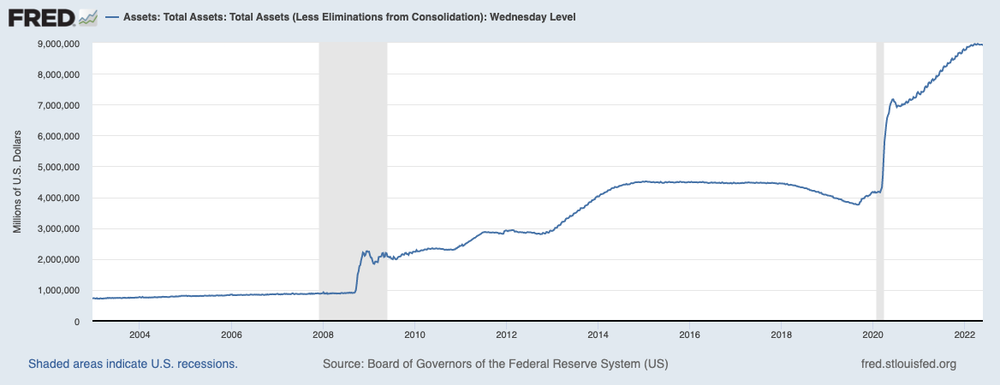
<br>  
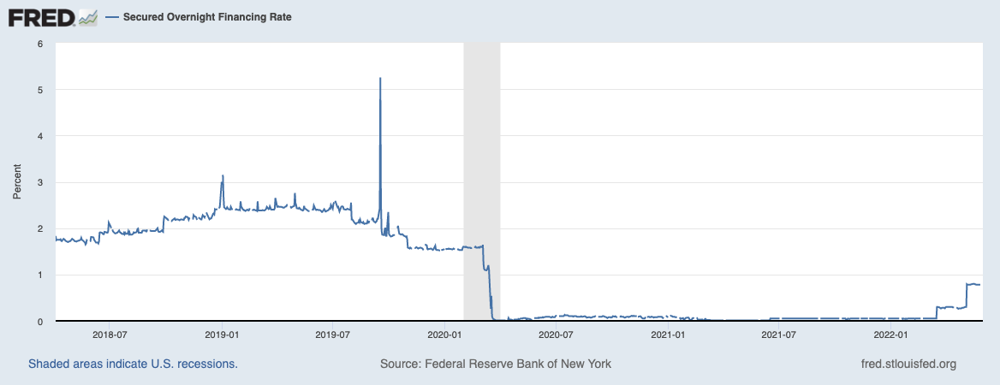
<br>  
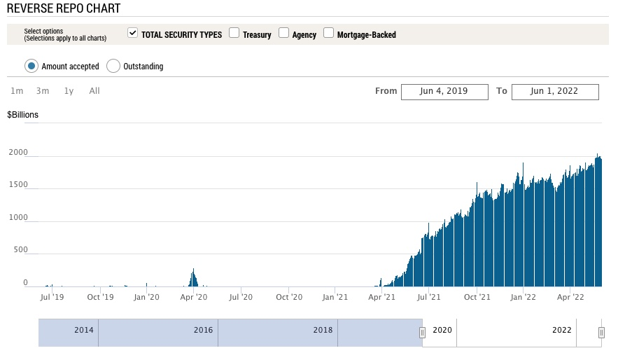
  
<br>
<br>
<br>
_________________________________________________________  

<br>
*5/31/2022*
<br>    

**Biden's Plan to Combat Inflation**  
<br>
Biden wrote an op-ed for the Wall St Journal where he  [announces](https://www.wsj.com/articles/my-plan-for-fighting-inflation-joe-biden-gas-prices-economy-unemployment-jobs-covid-11653940654) his three step plan to fight inflation. This is just after his [previous plan](https://www.whitehouse.gov/briefing-room/statements-releases/2022/05/10/the-biden-harris-inflation-plan-lowering-costs-and-lowering-the-deficit/) released just days ago. 
  
  - *The New Plan:*  
  - 1) "First, the Federal Reserve has a primary responsibility to control inflation. My predecessor demeaned the Fed, and past presidents have sought to influence its decisions inappropriately during periods of elevated inflation. I won’t do this. I have appointed highly qualified people from both parties to lead that institution. I agree with their assessment that fighting inflation is our top economic challenge right now."
  
<br>
  
  - 2) "Second, we need to take every practical step to make things more affordable for families during this moment of economic uncertainty—and to boost the productive capacity of our economy over time. The price at the pump is elevated in large part because Russian oil, gas and refining capacity are off the market. We can’t let up on our global effort to punish Mr. Putin for what he’s done, and we must mitigate these effects for American consumers. That is why I led the largest release from global oil reserves in history. Congress could help right away by passing clean energy tax credits and investments that I have proposed. A dozen CEOs of America’s largest utility companies told me earlier this year that my plan would reduce the average family’s annual utility bills by $500 and accelerate our transition from energy produced by autocrats. We can also reduce the cost of everyday goods by fixing broken supply chains, improving infrastructure, and cracking down on the exorbitant fees that foreign ocean freight companies charge to move products. My Housing Supply Action Plan will make housing more affordable by building more than a million more units, closing the housing shortfall in the next five years. We can reduce the price of prescription drugs by giving Medicare the power to negotiate with pharmaceutical companies and capping the cost of insulin. And we can lower the cost of child and elder care to help parents get back to work. I’ve done what I can on my own to help working families during this challenging time—and will keep acting to lower costs where I can—but now Congress needs to act too."
  
<br>
  
  - 3) "Third, we need to keep reducing the federal deficit, which will help ease price pressures. Last week the nonpartisan Congressional Budget Office projected that the deficit will fall by $1.7 trillion this year—the largest reduction in history. That will leave the deficit as a share of the economy lower than prepandemic levels and lower than CBO projected for this year before the American Rescue Plan passed. This deficit progress wasn’t preordained. In addition to winding down emergency programs responsibly, about half the reduction is driven by an increase in revenue—as my economic policies powered a rapid recovery."

<br>  

- *In other words:*   
- 1) Blame the FED, Trump, Russia, and define the oil industry as "autocrats" - the high inflation, it's not Biden's fault. 

<br>

- 2) Reiterate that even though we continue to choose to sanction Russian oil and gas, like Europe who's [heading towards](https://www.zerohedge.com/geopolitical/vilches-europes-mad-ban-russian-oil) the largest energy shortfall in decades, forcing the public to spend higher and higher percentages of their income on energy (causing the especially vulnerable and elderly to literally freeze to death if they can't afford heat - a real and increasing problem) This is framed as something we need to do it to 'stick it to Putin.' Next, release all US strategic oil reserves to artificially bring down price - temporarily, (this was [already done](https://www.reuters.com/markets/commodities/us-strategic-petroleum-reserve-drops-lowest-level-since-1987-2022-05-16/), reserves are now at decades long lows) then pass green energy tax credits and spend more money to further investments in the space. Then spend more money to fix supply chains and improve infrastructure. Then begin "cracking down on the exorbitant fees that foreign ocean freight companies charge to move products," (here come the price controls). Then build a million homes. Then give pharmaceutical companies the ability to negotiate, but also "cap the cost of insulin." (There they are) 

<br>

- 3) Reduce the federal deficit which is supposedly will contract by $1.7T (That is, if we compare Year over year numbers to the last two years when we printed more than 25% of M2 money supply, causing a massive federal deficit, it's easy to see how the "deficit shortfall" will come down, even while net deficit will go up) 

<br>

- *Analysis:*   
  The problem is that despite the negative connotation, Biden is right - Oil companies are autocrats, they have ultimate control over global energy markets and thus the economies of the world, there are very few things which are more important to our way of life than oil. A reduction in production and consumption of oil and natural gas (or higher prices) means more crop shortages, fertilizer shortages, supply chain issues, mass starvation and malnutrition especially in the third world, decreased economic activity globally, higher unemployment everywhere, individual savings evaporate, wealth inequality is exacerbated, etc. We need oil to run the world, and lots of it. Cheap oil makes everyone better off. 

  Furthermore, if climate change were to enter the conversation, one needs to ask; what is the carbon footprint of spending and sending 40 Billion to Ukraine in our funding of the newest proxy war started immediately after the last. All thew way back in a 2011 interview, Julian Assange [states](https://www.londontimes.live/state-of-affairs/julian-assange-speaking-in-2011-the-goal-is-an-endless-war-not-a-successful-war/), "The goal is to use Afghanistan to wash money out of the tax bases of the US and Europe through Afghanistan and back into the hands of a transnational security elite. The goal is an endless war, not a successful war." Nothing has changed, additionally, EV's are nowhere near cost effective enough for global transportation and they won't be so globally until at least the mid 2030's when the majority of developed nations have gone through a generation of EV cars and they can filter through the used markets into developing nations. Green energy and heating production is not efficient enough in most locations and won't be for some time, tax credits are nice incentives and it's yet to be seen if the average consumer will save $500/year on their energy bill as Biden says. The rest of his plan involves spending more money that GDP is not bringing in as we head into another negative quarter of growth, which will thus increase the deficit. Inflation is always a monetary phenomenon, spending more money will make inflation worse, not better. The same goes for his previous plan mentioned above, every single line item (many taken from build back better) will involve spending massive amounts of money, multiple trillions, created by the Treasury, adding to the federal deficit - which is the primary cause if inflation. 
  
  The way to solve consumer price inflation is to bolster the actual GDP output of the economy, create more literal goods and services without creating more dollars - More goods being chased by fewer dollars drives inflation down. That's the fun way, the alternative is demand destruction by economic recession, if no one has money to buy anything, demand also goes down. That's unfortunately where we're at while simultaneously placing higher taxes and price controls on the very producers who are capable of solving the problem (oil companies etc.) While some of the proposals in the long run (decades) could bring down inflation - now is not the time to increase deficit spending, the time would have been when (real) GDP was strong, when interest rates and (real yields) had already been (much) higher for years, spend when you have the money, not when you don't. 
  
<br>  
  
- *Conclusion*  
Spending now only digs the grave of the debt driven deflationary spiral deeper once it does arrive, we no longer have high interest rates as a tool to combat inflation, the deficit is too high and will drive the US to insolvency, but I imagine they intend to inflate the bubble a few more times before that happens, the 2019 repo crisis is evidence enough of that sentiment. It's getting harder and harder to ignore the missteps at every turn, and incompetence is often indistinguishable from malice. 
  
<br>
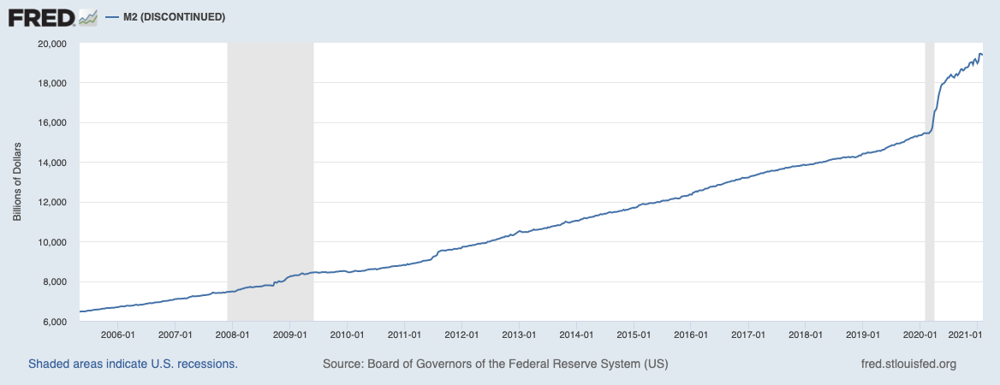
<br>
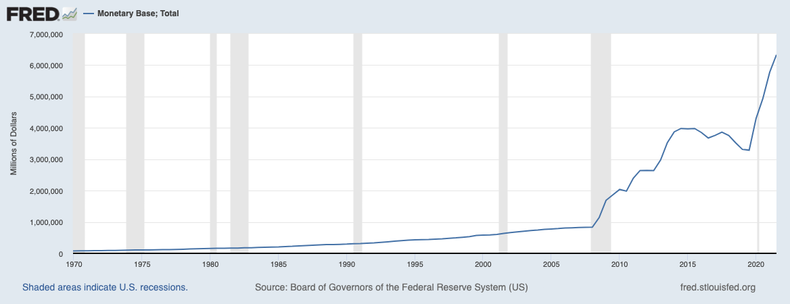
<br>
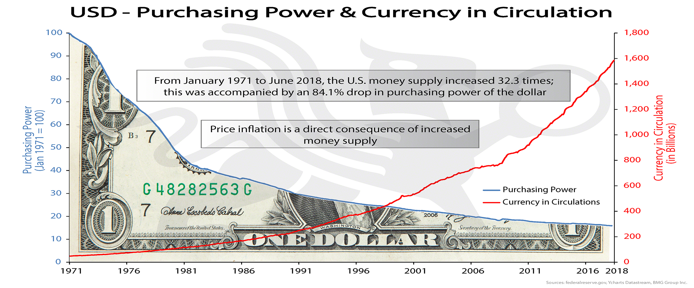
<br>
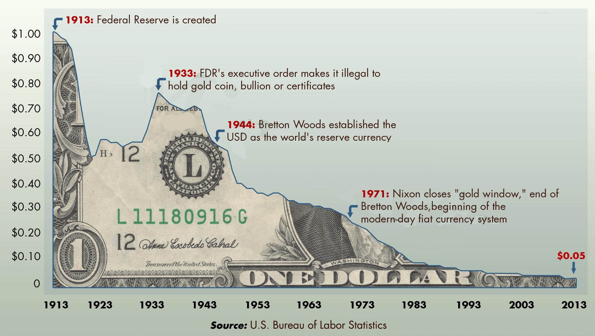
<br>

<br>
<br>
<br>
________________________________________________________________  
<br>
<br>
<br>
*5/29/2022*
<br>    

**Traditional Markets**  

- Gavin Newsom [suggests](https://www.gov.ca.gov/2022/03/23/governor-newsom-proposes-11-billion-relief-package-for-californians-facing-higher-gas-prices/) $11bn in stimulus to combat gas price inflation - lol. Inflation is always a monetary phenomenon - more money in the system chasing the same goods results in higher prices. Next on the list of things not to do will come price controls. Taxes on energy and necessities are always regressive as seen in Europe and well covered by Zero Hedge and Doomberg. CA has the highest taxes on gas, hurting those that can least afford it most, as does inflation. 

- Running to take Newsom's spot as governor, Micheal Shellenberger has a much better understanding of the economy and energy markets as described in his own [Substack.](https://substack.com/profile/2255433-michael-shellenberger) I wish him luck in his candidacy. 

- China's small-medium banks are insolvent? - Customers unable to access funds for a month. Lots of turmoil due to ridiculous lock downs, occams razor pivoting towards China will not open up until Europe is in official recession. US and Europe already in recession, but the time it's acknowledged, it will be nearly over if it still likely ends with a fed pivot. [via Reuters](https://www.reuters.com/markets/asia/chinese-depositors-left-dark-three-local-banks-freeze-deposits-2022-05-18/)

- China is [loosening](https://www.bloomberg.com/news/articles/2022-05-20/china-cuts-borrowing-costs-by-record-to-boost-loan-demand) by record amounts to make up for weak (or collapsing) housing market in China who does a lot more adjustable rate loans. (Evergrande's toxic balance sheet?) China needs citizens taking new loans so they're cutting rates, debt driven systems need more debt and inflationary bailouts. Current system is tight and desperate for new money. 

- Oil likely to rally further (short term) with Strategic Reserve depleted, moreso if China re-opens, in this stagflationary environment, price inflation will continue even if YOY numbers go down slightly. Longer term, demand destruction may prevail alongside low growth to bring down oil prices. 

- Bear market rally confirmed in traditional markets, back to risk on, temporary and short term mean reversion setting up for potential or likely lower lows in line with the high time frame mean reversion after decade long bubble in risk. 

- Fed announces only two more hikes, then data dependent, Powell is great at letting the markets know what should be expected. 

- Redfin [reporting](https://www.redfin.com/news/housing-market-update-price-drops-surge-to-19pct/) 1/5 home sellers drop prices last month

- Redfin "The monthly mortgage payment on the median asking price home declined slightly from a record high to $2,425 at the current 5.1% mortgage rate. This was up 42% from $1,708 a year earlier, when mortgage rates were 2.95%...Pending home sales were down 5.4% year over year."
  
- Fed Raising rates resulting in huge mortgage rate increase, highest since 2008, bond prices set to rally as safe haven compared to real estate. 
  
- University of Michigan "home buying conditions" are the worst they've been since the 1980's - [Zero Hedge](https://www.zerohedge.com/personal-finance/umich-sentiment-tumbles-accelerates-may-home-buying-confidence-collapse)
  
<br>
<br>
**Crypto Markets**  
  
- BTC playing catch up over the weekend, riskiest of risk assets will lag. Eventual decoupling will result in BTC being risk off, but this still seems like a distant future. 

- BTC Peak Fear and greed index recently reached 8 (now 10) - Extreme fear, good long term buy indicator despite potential further downside. 

- Alt/BTC pair is likely to continue to bleed until BTC shows monthly strength, BTC maxi's always have a good point. 

<br>

**Charts**

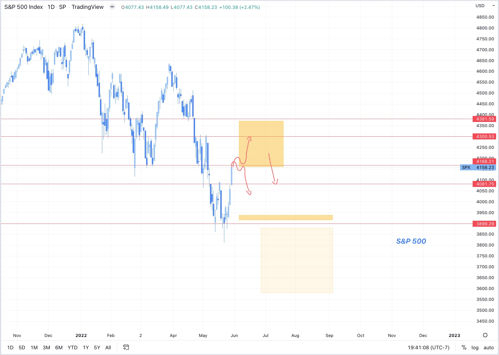
<br>

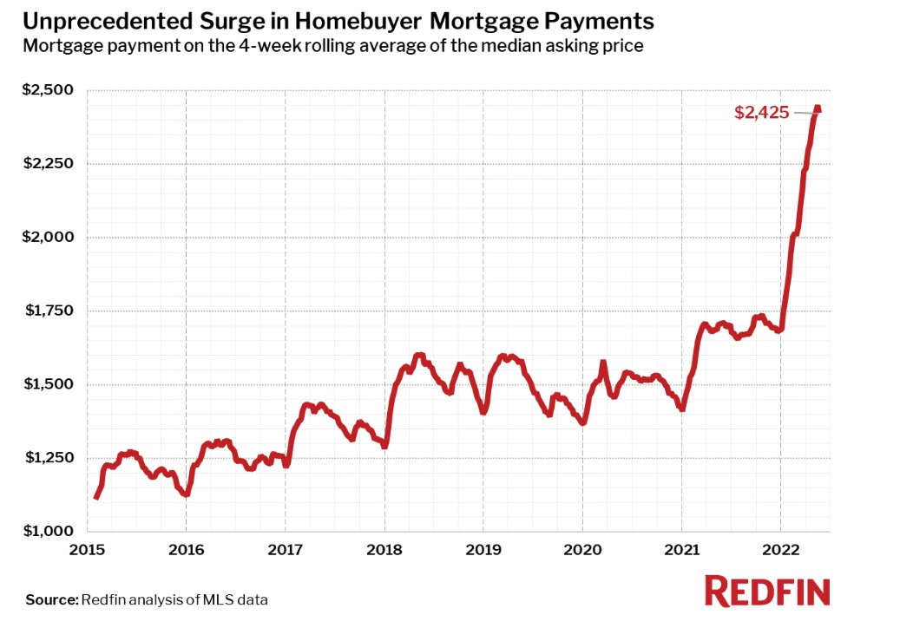
<br>

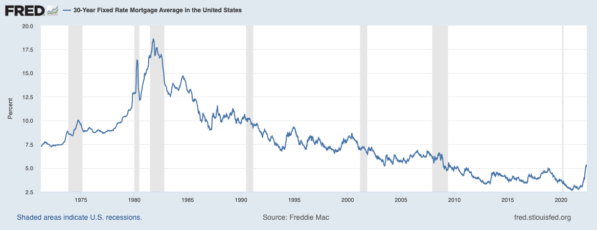
<br>

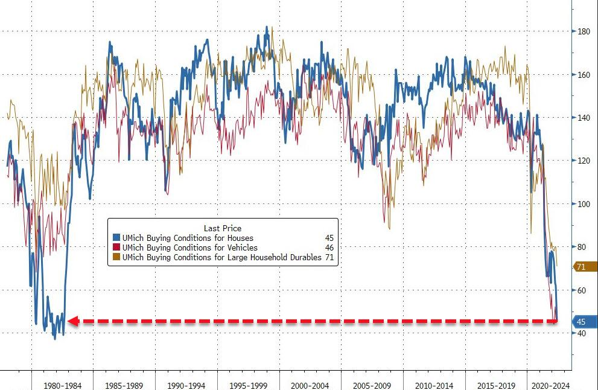
<br>

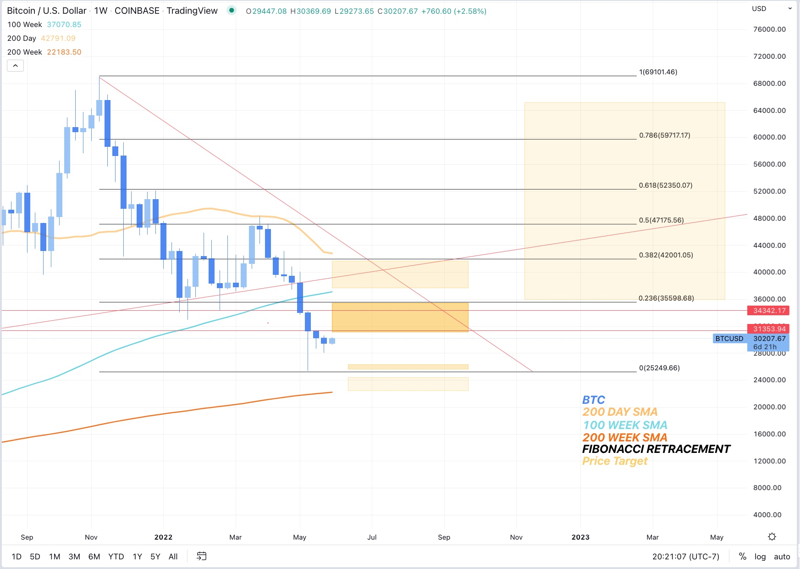
<br>

<br>
<br>
<br>
________________________________________________________________  
<br>
*5/27/2022*
<br>    

- Traditional markets are having a nice rally after solid support at S&P:3900, now above 4100. Still low call volume. 

- Volatility will likely remain high for several weeks. 
  
- Consumer savings accounts shredded, American's are not able to adjust spending to keep up with newly higher prices.  - chart from Zero hedge. 

- BTC Down, everything else up, correlation with risk is breaking, but not in the fun direction. Price action closes hourly low below the range low, Longs getting trimmed until clarity in PA. BTC is the most risky of risk on assets, will potentially rally last under a bear market rally. 

- BTC dominance likely to continue to stay flat or rise whether we go up or down, Alts have been rekt with no end in sight, good prices, but no strength in BTC means alts could drop another 60%+ from here. 

- Lumber futures are down big at peak building season, houses should be being built but no one's buying wood, long term housing shortage will continue until prices fall significantly.  

- NYT changes tune on Ukraine war - Ukraine can't win. (While typing I defaulted to writing "we can't win" - American's don't want or need another proxy war.)

- Voter turnout hits record numbers in Georgia as Dems switch sides leading to massive positive swing for Republicans, could foreshadow future problems for Dems as many have already been forecasting, potentially even more reason for a FED pivot prior to November. 

<br>

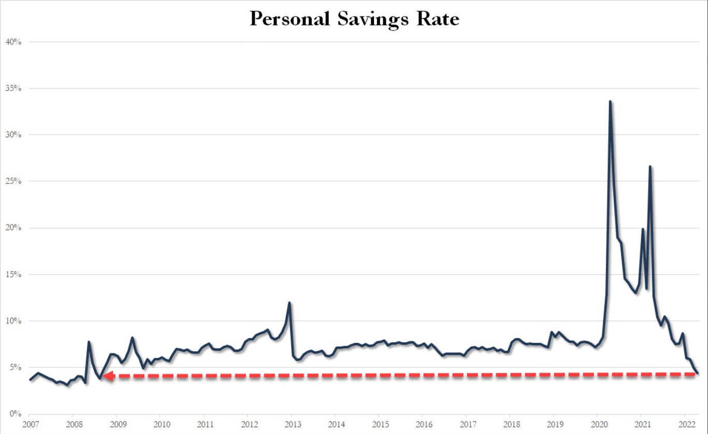
<br>


<br>
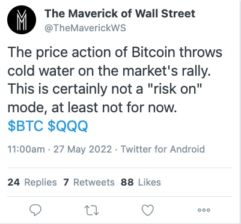
<br>
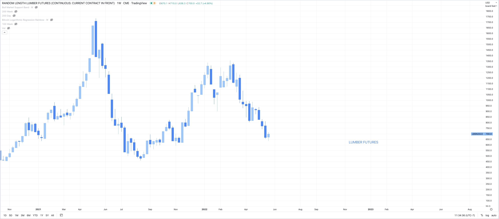
<br>
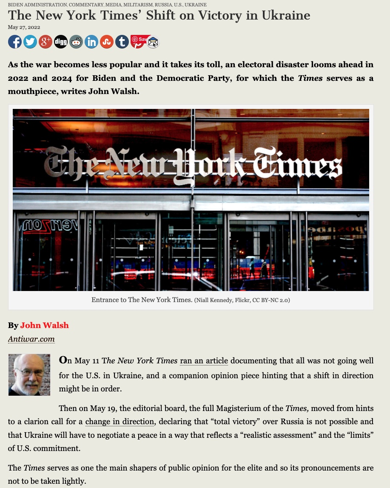
<br>
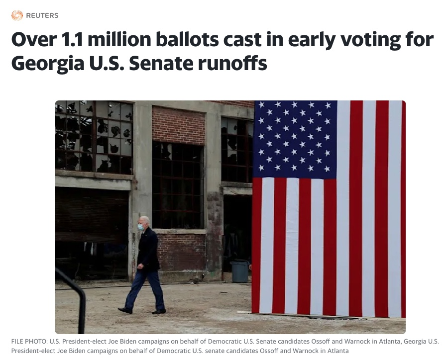
<br>


________________________________________________________________  
*5/25/2022*
<br>  
**Short term outlook:**    
  
- DXY and US10YR threatening to roll over (a point for the bulls, finally)
  
- S&P & QQQ (&BTC) looking at a bear market rally, possibly 7-15% from bottom   
  
- BTC target 35k then possibly run the 25K lows if bottom falls out of tradfi  
  
- Ideally 10 year falls for the right reason (inflation expectations down) rather than the wrong reason (growth expectations down)   
  
- Call option volume remains low, all markets still waiting for buyers despite massively oversold conditions  
  
  
**Longer term outlook:**     
Base case is: 
  
- Possible bounce here

- Possible lower lows after - lots of entities looking for exit liquidity and a rotation out of growth to value and commodities for what is potentially a commodity driven stagflationary supercycle - this would not be great but it's potentially unavoidable (though with more QE, growth will come back as well)

- Possible rally into November midterms, 

- Fed may sell Mortgage backed securities back into the market despite rapid rise in rates, housing will take a hit regardless

- Fed hiking could stop Q4 2022 (Currently market is pricing in later 2023 or 2024 - but they won't get that far) at which point when the hiking stops, the low will already be in, markets are forward looking and will recover far before the economy does. 

- Economy looking at higher unemployment, lower wage growth, higher consumer credit to come, increased home sales and defaults, etc. real stagflation driven mainly by monetary QE, but also sanctions, and supply chains, all with no real painless solution that isn't more governmental jobs programs/Universal basic income/ socialized losses to subsidize government errors etc. 

- They will try to inflate the long term debt bubble a few more times before they let it pop and try to implement CBDC's as the savior, by this time BTC will be in the "early majority" stage of the adoption curve and by enough people learning about the faults BTC corrects in the monetary system, traditional finance will become fractured towards a dual system solution, one forever inflating, one forever deflating.  

<br>

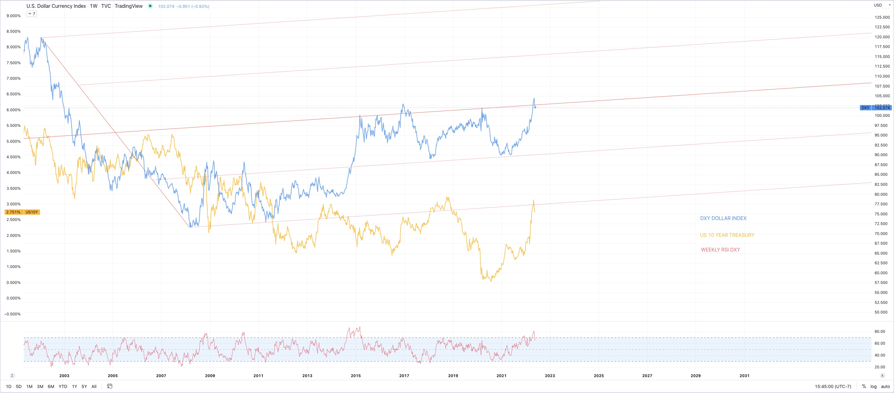
<br>

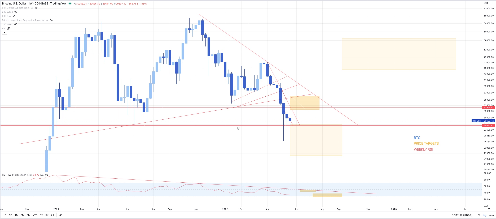
<br>
_________________________________________________________  
**5/24/2022**
<br>  
- Bear market rally in QQQ less obvious  
- Was Friday rally enough to calm these extreme oversold conditions?   
- Larger uncertainty now  
- Still bullish on long term price trend and eventual FED pivot, possibly before NOV midterms, but short term pain seems imminent 

<br>

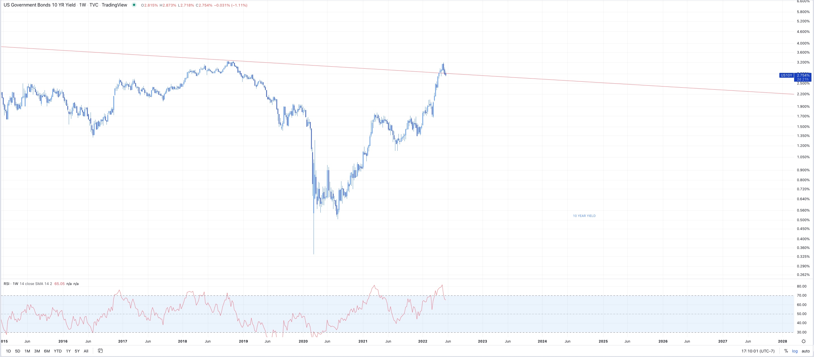
<br>
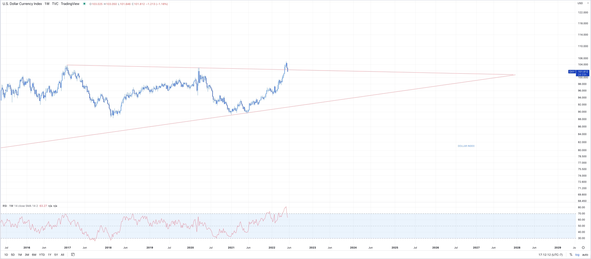
<br>


<br>
_________________________________________________________  
**5/23/2022**
<br>  
- Possible bounce here, then we'll see. Markets on edge, everything oversold but still waiting for buyers. 

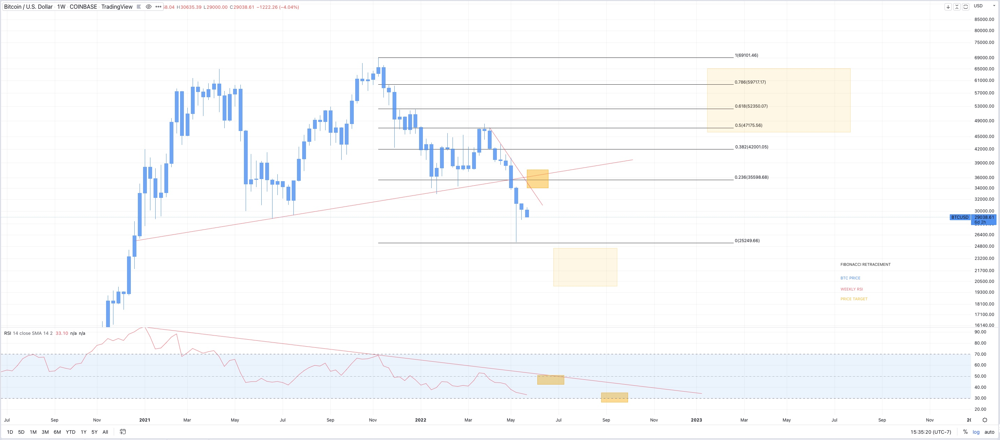

<br>
<br>

:::
