 
 

<h1>**Rafting The Deschutes**</h1> 
<h6>
***White Water To The Gills***
</h6>

*[Tylerisyoung.Substack.com](www.tylerisyoung.substack.com)*   
*[Twitter.com/TylerisYoung](www.twitter.com/Tylerisyoung)*  
 _________________________
  
 04/12/2018
    
 

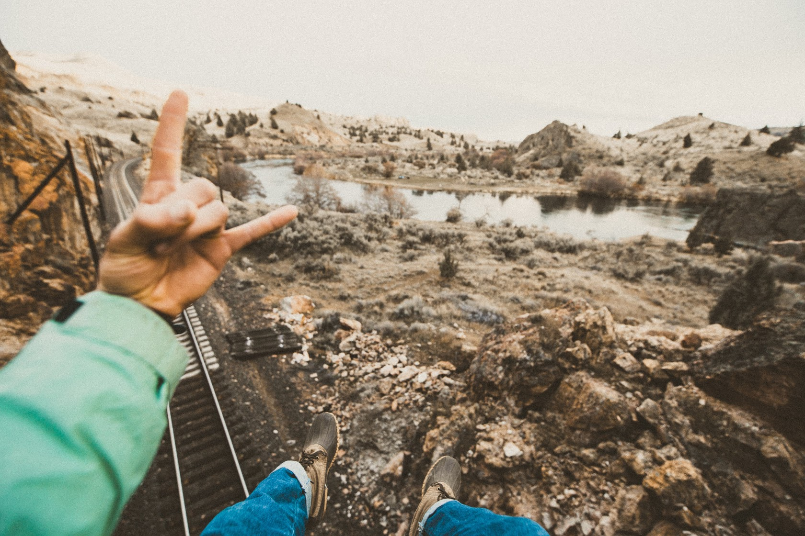

 
 

<h3>
*The thrilling tale of a life thus saved*
</h3>

 

We were being guided by Ethan Wyman down the Deschutes River, Oregon. It was lovely. Sunrise hikes, rafting all day, and sunset walks before campfires. The 7 of us were having a great time. 1 heavy gear raft, 1 floaty boat, and 2 kayaks,
We had it all! 

 

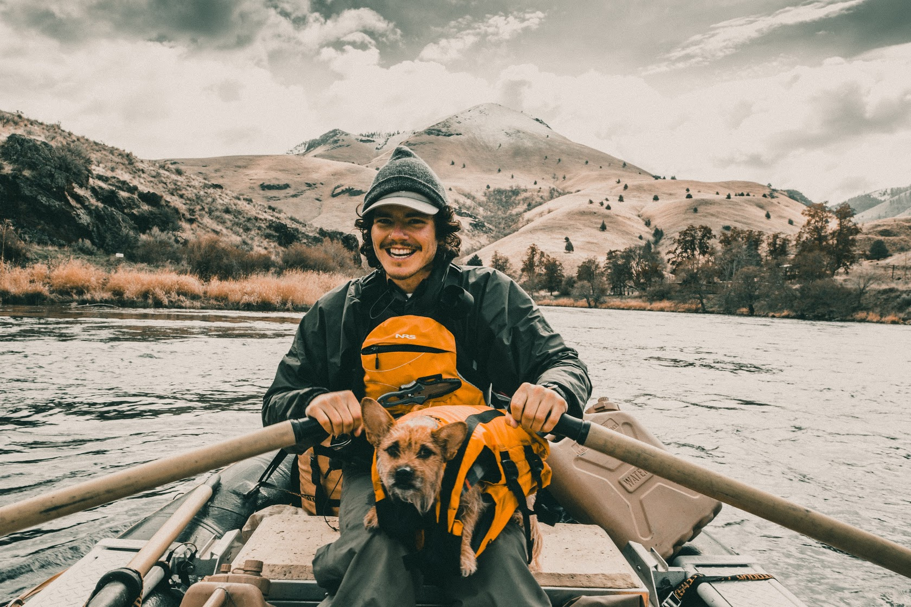

 

After some time on the river, as you might expect, there were rocks that were really better if avoided, but it was doable, we decided to head straight through the center, splitting the first two rocks then a hard right to avoid the next few. Ethan and Kelsey went first on the gear raft to set up rope support if necessary, then it was myself, Graham and Artesia following close behind in a boat with no seatbelts to help.  

 
 

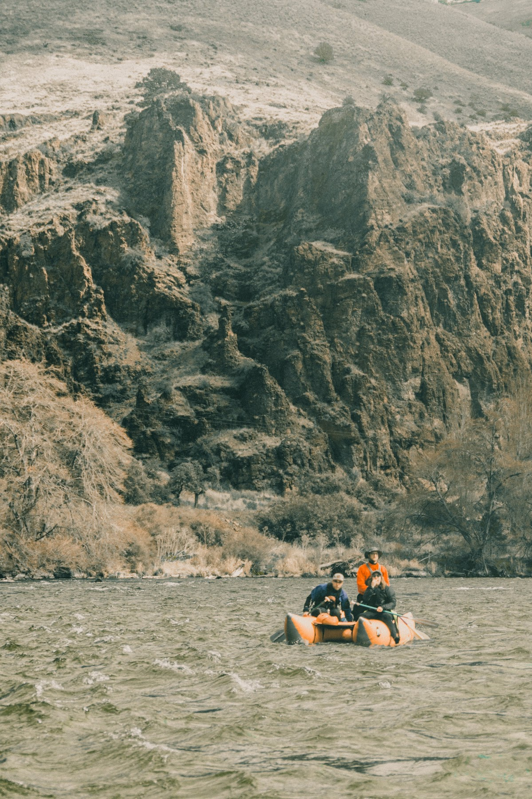

 
 

As we're splitting down the first set of rapids which have a bit of a wild drop between the two rocks, Artesia was out, overboard! Graham and I finished through the rapid to look back, Artesia pops her head up yelling, Graham and I immediately started back paddling for her, she drifted to us and I grabbed her hand, she said
“My knee is fucked.”

 
 

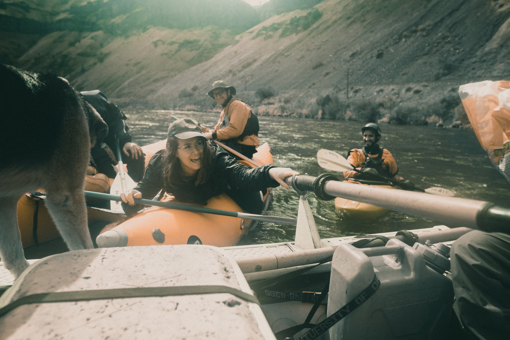  
 
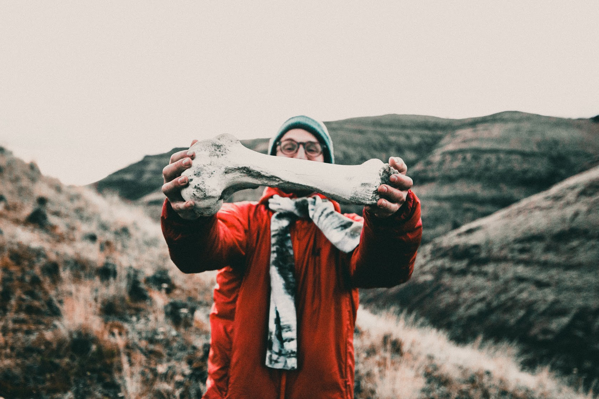

 
 

We were floating downriver and I began to pull her up, she said she would stay in the water for a moment to recover, and we just floated along for now, things were calm, she made it to the boat, she didn't go under,
we were going to be fine.

 
 

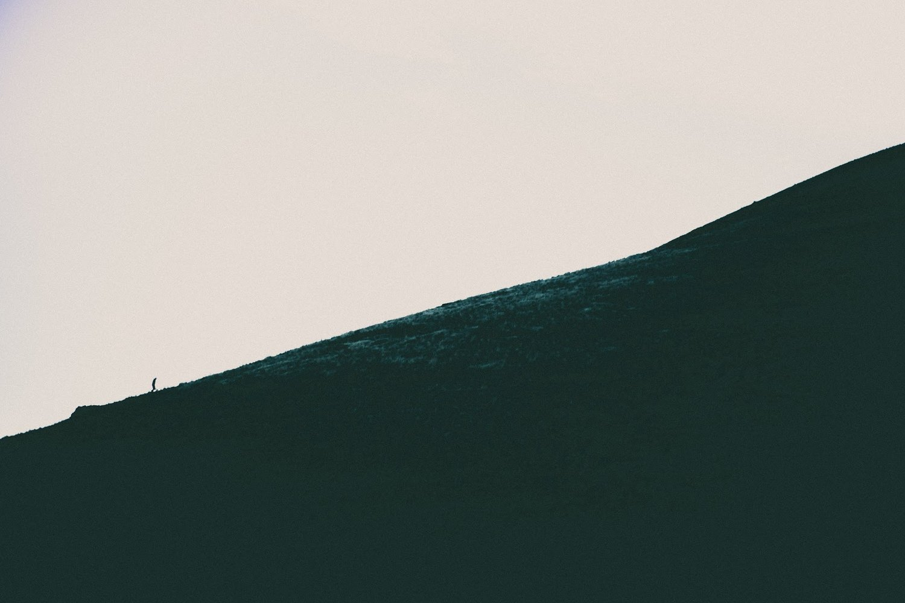
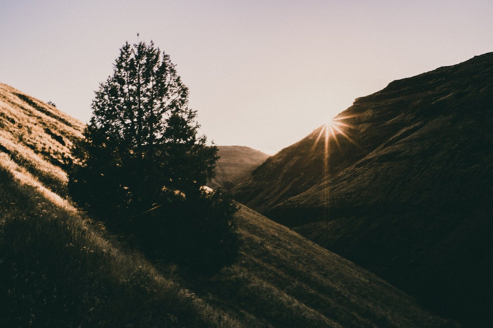

 
 

Suddenly, we hear Ethan yelling, I look over at him and he is standing up in his boat waving his arms frantically towards the sky saying "UP UP UP UP!" I look downriver and we're headed dead center for a day ender. Graham leans over and we yank her up into the center of the boat. We begin paddling as if there's nothing else ever to do, it's only the two of us, Artesia’s paddle was lost in the shuffle.

 
 

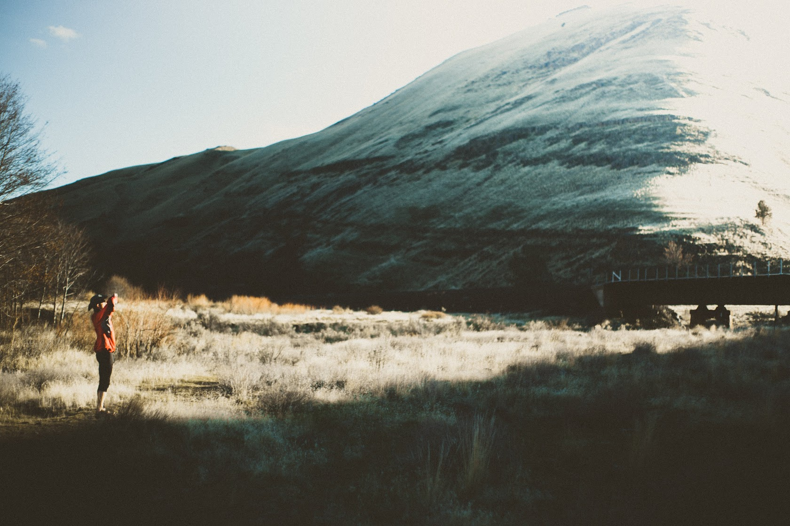

 
 

The rush of the river was loud but I heard nothing, the rock was quickly approaching and we were making no headway. Our boat was sideways. Graham would hit first… we got one two three strokes but not in rhythm, and not in time, when I paddle we turn left, with Graham it’s back right. We continue on forward toward the protruding grey and black mass of rock that's sharp volcanic basalt.  We hit one, a stroke together and we move, we realized, and then we hit another, making headway but not fast enough, it was too late, I gave up paddling,
we braced for impact, still sideways as we were. 

 
 

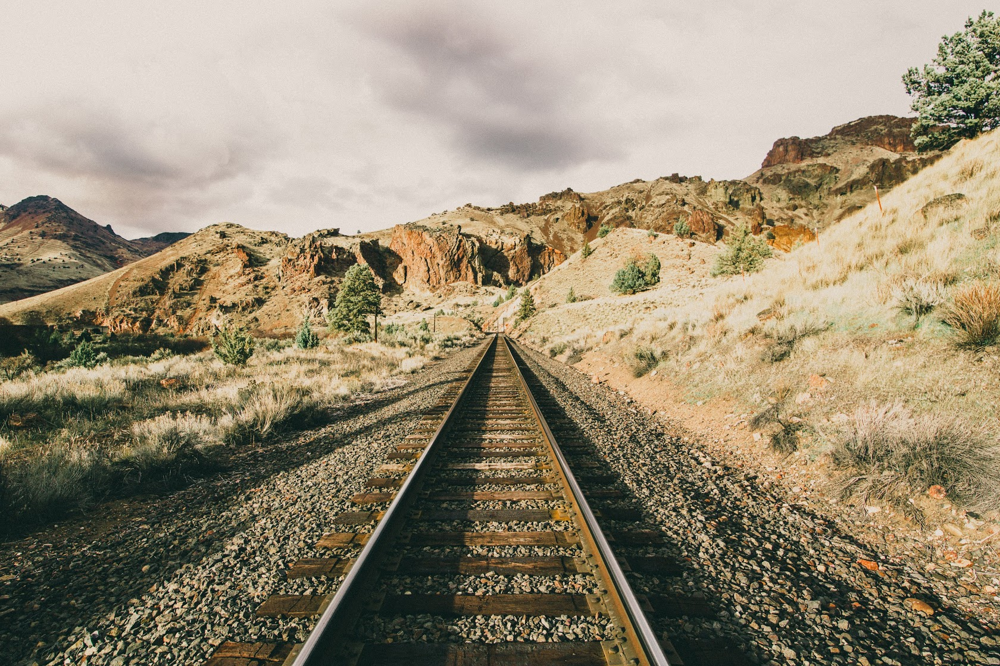

 
 

The noise grew in my head, I heard the rushing of water getting louder and louder as it rushed around the rock in its path, just a few feet away, the rapid began pulling us in, we were at its mercy. The water hitting the rock rushed and rushed around, splitting the path in two and our boat hit the new stream of flowing water from the rock, it pulled us down Into it, accelerating more, the back of the boat drifted first and immediately dragged, flipping Graham upstream and me down. Artesia in the center trying to get into a better position before we collide. Our boat does a 180, and now I'm facing the rock, but the boat keeps spinning as it catches the strong undercurrent. This new current, a new direction flowing strongly in all ways around the rock and bringing us with it, I could have leaned out and touched it, but I didn't dare.
We floated past in what seemed like magic,
the day ender was behind us once and for all. 

 
 

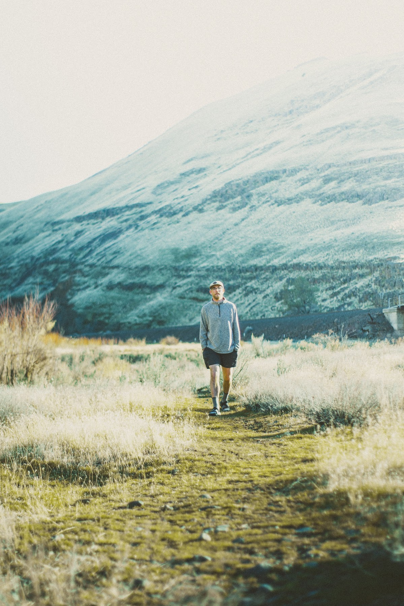
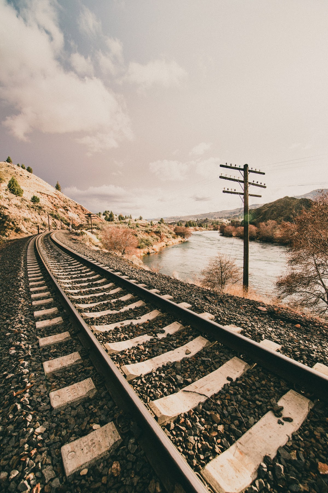  
   
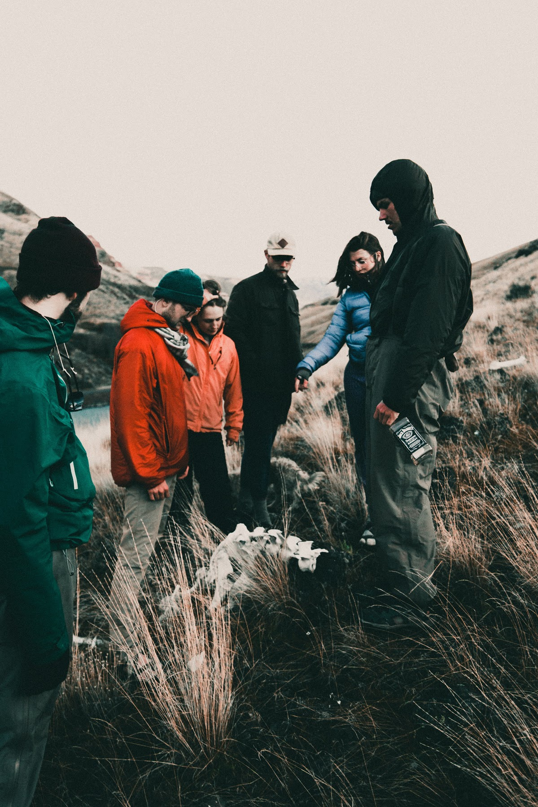

 
 

We were safe. 

 