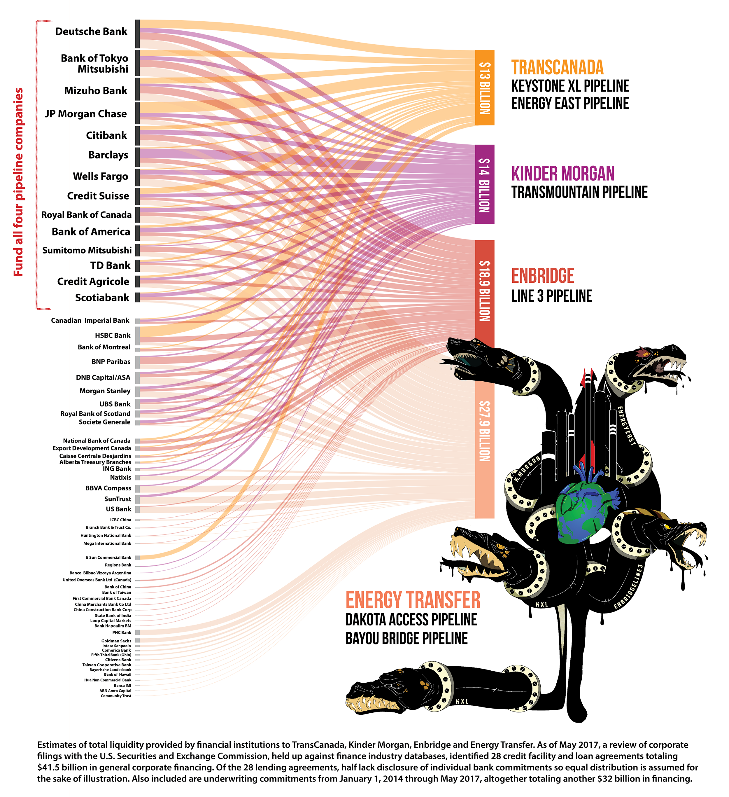
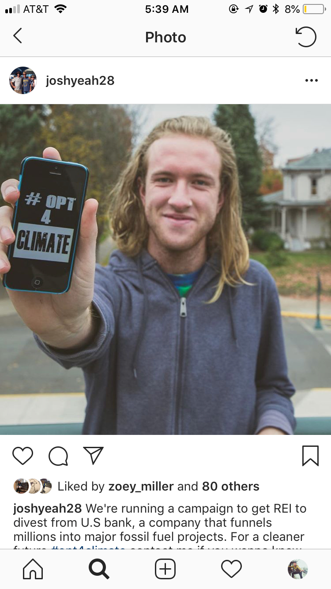
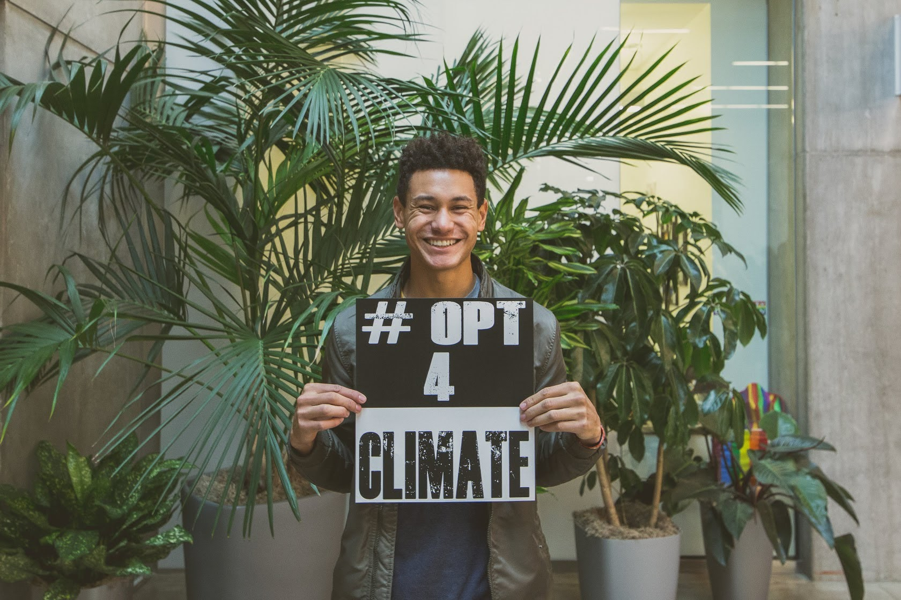
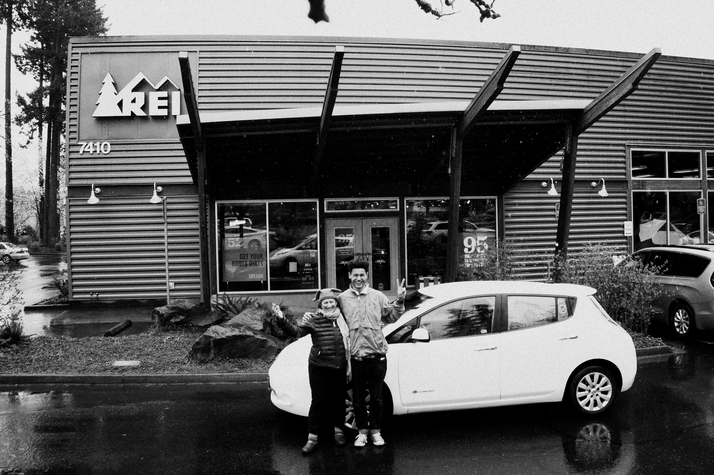
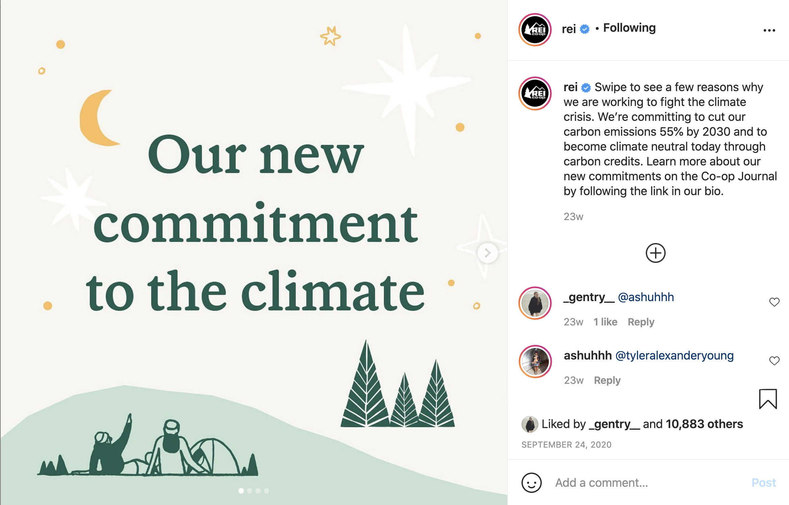

 
 

<h1>**The REI Campaign**</h1> 
<h6>
***An article by Tyler Young.***
</h6>

*[Tylerisyoung.Substack.com](www.tylerisyoung.substack.com)*   
*[Twitter.com/TylerisYoung](www.twitter.com/Tylerisyoung)*  
 _________________________
  
 06/20/2018
  
 
<h3>
We convinced* REI to divest their corporate holdings from the fossil fuel industry.  
</h3>

 

As a senior at the University of Oregon, I partnered with fellow senior Asha Rao, and attorney Alice Warner with support from th student group Cascadia Action Network, in an attempt to convince a brand we have all historically loved and supported to divest their money from the fossil fuel industry. We eventually got a petition with 30,000 signatures and were invited to sit down with REI executives. 

The divestment movement with roots from apartheid in South Africa has proven to effectively put pressure on the most valuable asset of any corporation or nationstate; their finances. We started a movement called "Opt4Climate."

***"Opt 4 Climate is an organization of REI members who are also climate activists. We care about the world and think that one of our favorite brands should too, so join us in helping convince REI that the divestment of our cooperative from fossil fuel companies, and the big banks that fund them is a viable solution that directly helps climate change."***

Climate change is simultaneously threatening  communities, individuals human rights, and more importantly, our ecosystems which we rely on (and hike in). REI currently has investments in big banks like U.S. Bank, and Wells Fargo which are funding the fossil fuel industries driving climate change. These banks have been placed on a list entitled Mazaska Talks (money talks) published by a group of Indigenous activists which formed after the standing rock protest over water rights, and this list shows the banks which are directly funding the fossil fuel industry and driving climate change. Environmental watchdog giants like The Rainforest Action Network are simultaneously calling for the same thing. 

Opt 4 Climate says, “Banking is stewardship, too. REI's banking practices fly in the face of its claim to put environmental purpose above profit and prevent REI from reaching its goal to become carbon-neutral by 2020.”

We targeted REI based on claims like, “our co-op’s health depends on the environment’s health.” REI certainly promotes itself as a very eco-friendly brand though consumeristic at its core. While this is true, it was not lost on our small activist group that while the REI cooperative has become somewhat prepackaged, and sterile, they are certainly good at what they do in terms of encouraging people to get outdoors which in turn, promotes a greater respect for the environment in which we all live, breathe, and play. This sort of adventure based advertising has lead to campaigns like REI’s #OPTOUTSIDE which has since taken off to become an instagram favorite among avid hikers, cyclists, kayakers, and general go getters. And this is where Opt 4 Climate got their name, encouraging people to think about their impact with the #OPT4CLIMATE hashtag and we have encouraged our supporters to post photos with their cell phones or the linked image to show their support for REI to divest their money into banks that are better for the environment. 

 

On our former website we provided education on a variety of topics including climate data like James Hansen’s plea to remain below 350 parts per million of CO2 in the atmosphere, well below the UN target to remain under 450ppm which is roughly 2 degrees celsius, a number we are approaching rather quickly as they also mention the most recent climatic data at Mauna Loa, Hawaii which has placed the current concentration at 411PPM. 

In addition to our successes on social media, the Opt 4 Climate team sat down with REI executives including the head of marketing, and HR, and key staff members at their headquarters in Seattle to discuss divestment. In the end, while the brand did not make any commitments to our team, they were receptive to new ideas, they claimed that they would likely offer a "greener" fund for all employee pensions, and felt their longterm values aligned with the campaign overall. Those following along only wish the apparently eco-friendly outdoor brand would move a bit faster, and be a bit more bold. Overall, it is reassuring that environmentalists like you and I aren’t allowing brands to greenwash their practices as blatantly as just a few years ago. While REI is better off than most, there’s always room for improvement. 

  
 

 
 

<h3>
***2020 UPDATE*** 
</h3>
***REI annouces that they are more committed to the climate than ever before, though some may argue it's the same song and dance...***

 
