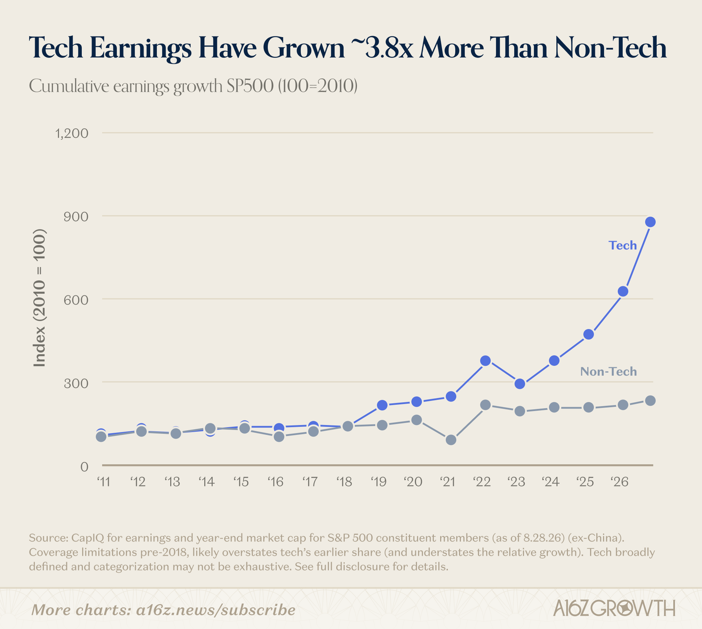
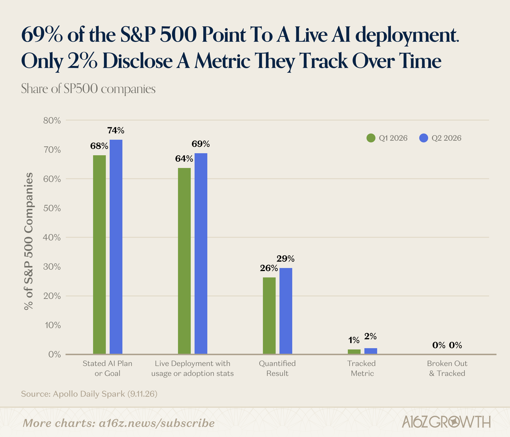
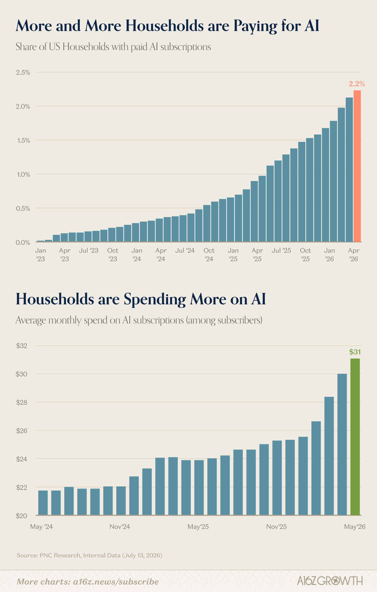
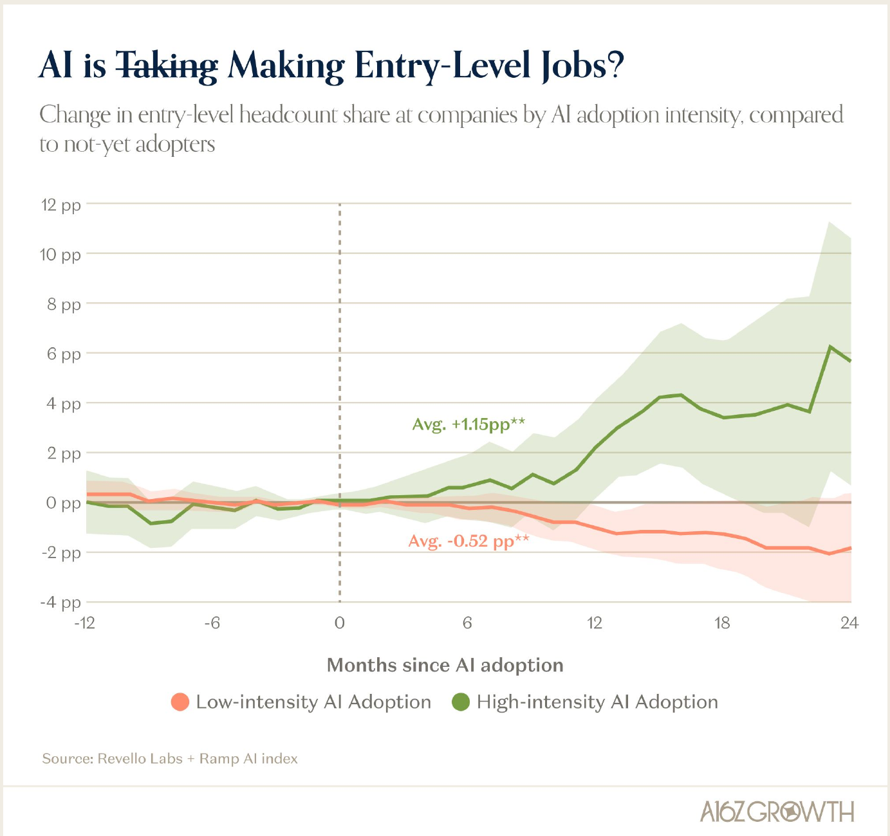

 
 

<h1>**The five most interesting charts from a16z's "State of the Markets II"**</h1>
<h6>
***A blog post by Tyler Young.***
</h6>

*[Tylerisyoung.Substack.com](https://www.tylerisyoung.substack.com)*
*[Twitter.com/TylerisYoung](https://www.twitter.com/Tylerisyoung)*
 _________________________
  
 10/08/2026
  

<h3>

**1. Old GPUs are getting more valuable, not less, and they are running for longer useful lifespans.** Burry continues his recent losing streak.

**2. Tech has grown 3.8x more than non-tech companies, and this gap began in 2023.**

**3. A very nice 69% of companies in the S&P point to a live AI deployment as a part of business as usual.**

**4. More and more households are paying for AI.** From 2023 until now, currently about 2.2% of households pay, and this will likely become an S-curve. The average spend is $31/mo.

**5. Companies adopting AI heavily are actually hiring MORE entry-level positions, not less.** After adopting AI, heavy adopters' entry-level share of headcount rose by an average of +1.15 percentage points compared with companies that haven't adopted yet, while light adopters' fell by an average of -0.52 points.

</h3>

 

<h6>
**Sources**

[State of Markets II (a16z)](https://a16z.com/state-of-markets-ii/)
</h6>
