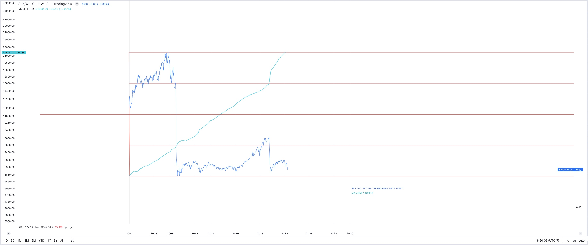
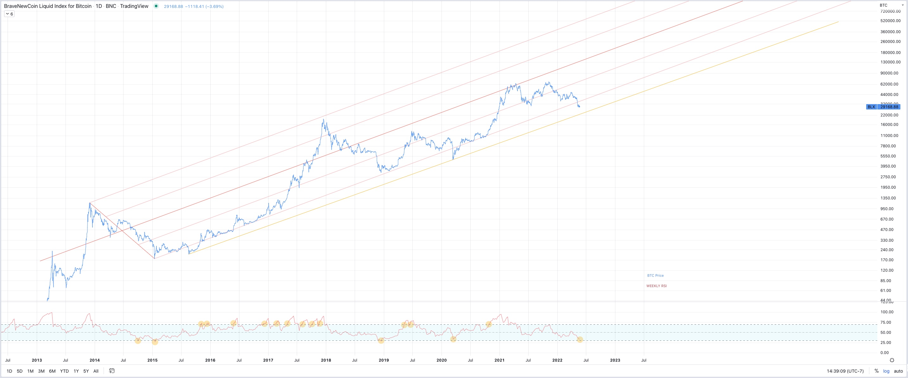
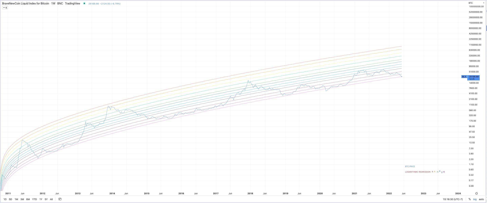
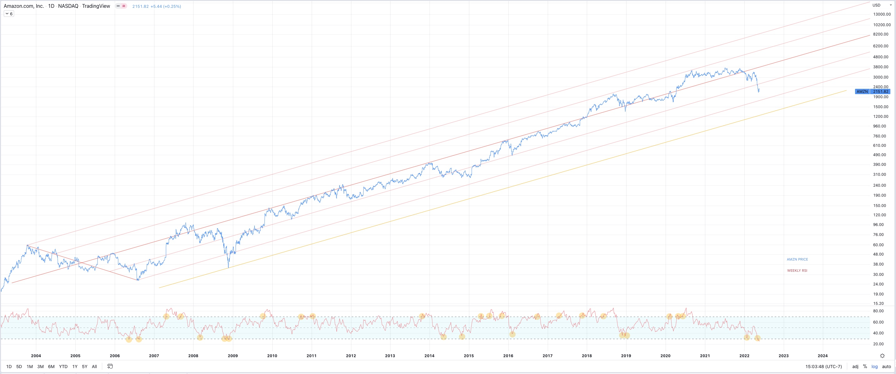
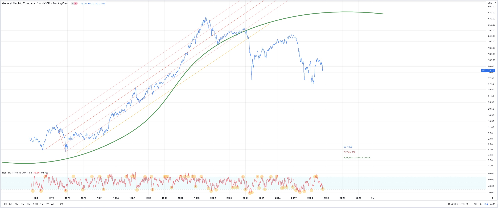
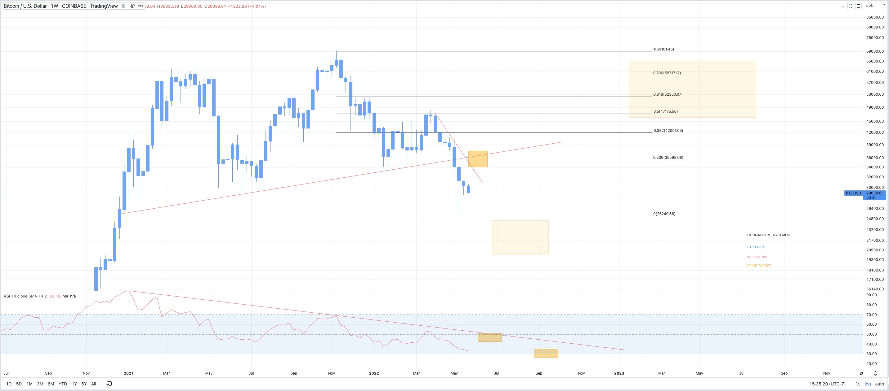

 
 

<h1>**Ongoing Technical Analysis of BTC & Crypto**</h1> 
<h6>
***For sure financial advice***
</h6>

*[Tylerisyoung.Substack.com](www.tylerisyoung.substack.com)*   
*[Twitter.com/TylerisYoung](www.twitter.com/Tylerisyoung)*  
 _________________________
  
 New Posts at the bottom so you can see the carnage all the way down. 
  
 <h3>
 The Macroeconomic Backdrop 
 </h3>
    
 Read: [Modern Monetary Theory - Slow at first, then all at once.](./mmt.html)
    
    
   

 
  
 <h3>
 Fundamental Adoption Curve
 </h3>
  
When a new technology is invented or discovered by the small minority of the population who should be considered true innovators, what follows is a period of skepticism and disbelief which necessitates a proof of concept to convince early adopters to join the party, then the insightful early majority will follow their lead recognizing the utility of the new technology, at this point the technology enters the exponential growth phase. Following them, once all of the quirks and pitfalls are inevitably ironed out of the emerging technology comes the late majority and finally, once the exponential phase slows, the adoption enters a phase of slower growth, or maintenance where the laggards will be the last to adopt. This is the case for all technologies, including Bitcoin. 

This process was detailed in a 1962 book "Diffusion of innovations" by Everett Rogers. He explains how each individual becomes aware of the technology, how they see other adopters and consider the benefits to themselves, experiment with its use case, and ultimately how they are convinced to adopt it, often indefinitely. Rogers also notes that individuals in a population have different risk tolerances and aversions to adopting new technology later in his career he accurately predicted the adoption of things like; FAX, Email, Mobile Phones, and the internet all which follow the same pattern.

 

 
 
 
 

<h3>
Ongoing Technical Analysis
 
 
5/23/2022
   
Bounce here, then we'll see. 

