<br>
<br>

<h1>**Data Science**</h1>
<h6>***A collection of things I am learning & things I'm interested in.***</h6>
*[github.com/Tylerisyoung](https://www.github.com/tylerisyoung)
*

____________________________


```{r setup, include=FALSE}
knitr::opts_chunk$set(echo = TRUE)

library ("ggplot2")
library ("gridExtra")
library ("cowplot")
```

<br>
<br>


<font size="5">
<p style="text-align: center;">Thesis Project: Policy Priorities</p>
</font>
<center>
A benefit-cost ranking of 60 policies built on published estimates, extended into a multi-criteria decision analysis, all in R. Change the assumptions and watch the ranking move. <a href="./cba-dashboard/index.html" target="_blank">Open full screen</a>
</center>
<br>
<div id="cba-launch" style="position:relative;max-width:1100px;margin:0 auto;border:1px solid #ddd;border-radius:8px;overflow:hidden;cursor:pointer" onclick="(function(el){el.outerHTML='<iframe src=\'./cba-dashboard/index.html\' width=\'100%\' height=\'1150\' style=\'border:1px solid #ddd;border-radius:6px\' title=\'Policy Priorities dashboard\'></iframe>';})(this)">
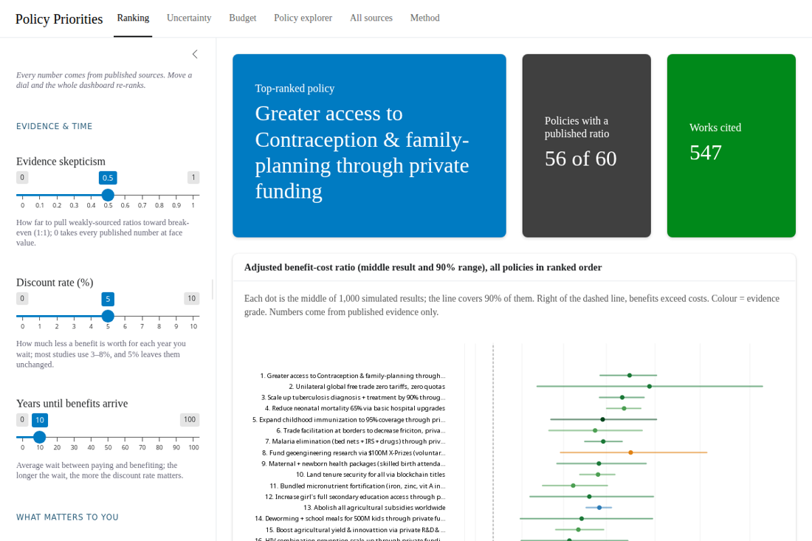
<div style="position:absolute;inset:0;display:flex;flex-direction:column;align-items:center;justify-content:center;text-align:center;color:#fff;padding:20px">
<div style="font-size:1.6em;font-weight:bold;text-shadow:0 2px 8px rgba(0,0,0,.6)">Launch the dashboard</div>
<div style="margin-top:12px;padding:12px 28px;border-radius:99px;background:linear-gradient(90deg,#e07a7a,#f2c46d,#5b8def);font-weight:bold;box-shadow:0 4px 14px rgba(0,0,0,.3)">&#9654; Click to load</div>
<div style="margin-top:12px;max-width:520px;font-size:.9em;text-shadow:0 1px 4px rgba(0,0,0,.7)">It runs the R language inside your browser, so the first load downloads about 43&nbsp;MB and can take from 30 seconds to a few minutes. A progress bar shows the time left.</div>
</div></div>

<br>
<br>

<font size="5">
<p style="text-align: center;">Data Driven Journalism</p>
</font>
<br>
<center>
Current Projects: [Here](./ig.html)
</center>
<br>

Modern Monetary Theory - Slow at first, then all at once.                                                     |  Ongoing Technical Analysis of Financial Markets 
:------------------------------------------------------------------------------------------------------------:|:------------------------------------------------------------------------------------------------------------:
[Read Here:](./mmt.html)                                                                                      |  [Read Here:](./ongoingta.html)
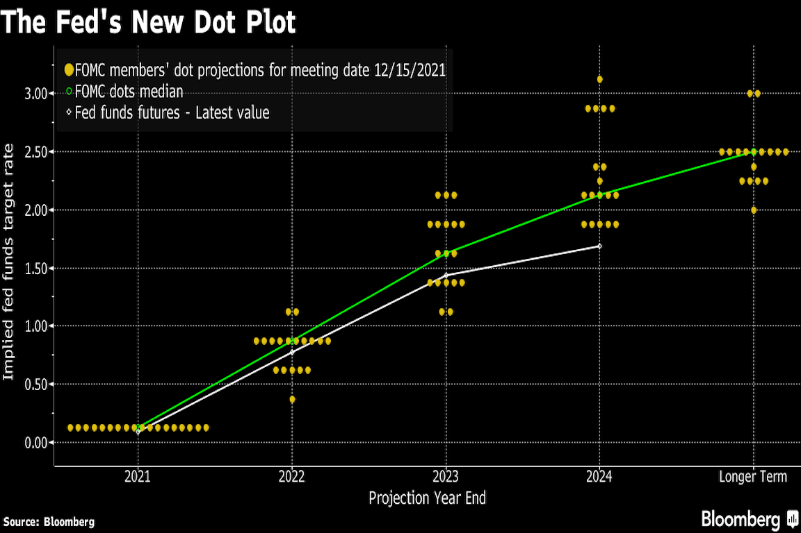                                                                                   |  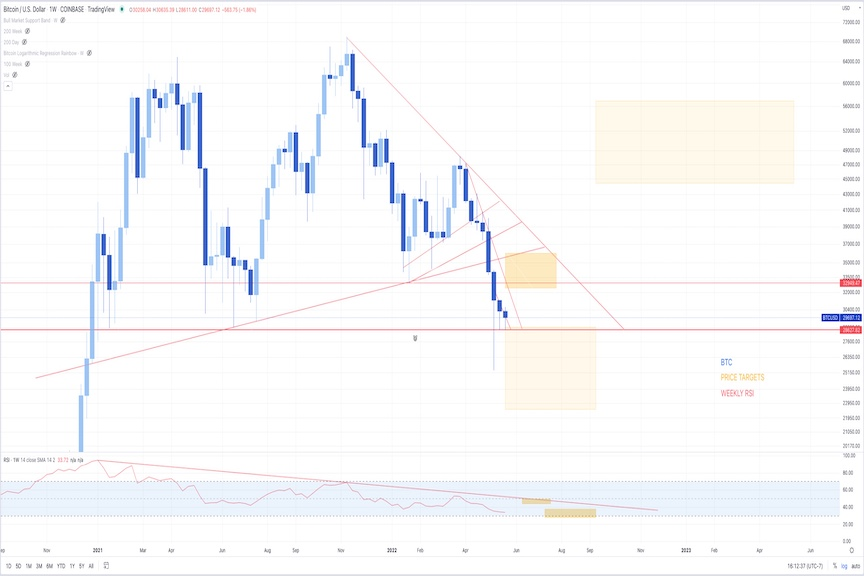
                                         


<br>

<font size="5">
<p style="text-align: center;">Projects in R</p>
</font>
<br>

Predictive Community Change based on Tax Revenue                                                              |  Dashboard: Interactive Car Accident User Investigation 
:------------------------------------------------------------------------------------------------------------:|:------------------------------------------------------------------------------------------------------------:
[Masters Group Project](./projects/community-change/index.html)                                 |  [Accident Characteristics in AZ - ShinyAPP](https://tylerisyoung.shinyapps.io/final-project-dashboard-Young/)
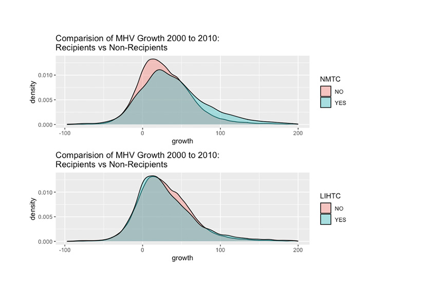                                                                             |  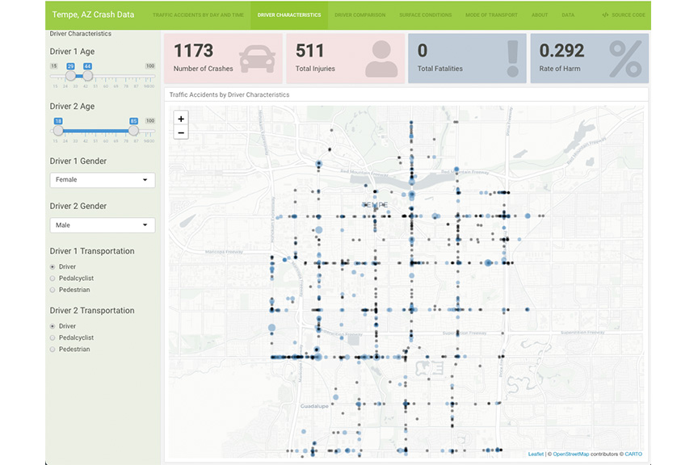
                                                                                                              

<br> 
<br>
<br>
<br>

<font size="5">
<p style="text-align: center;">Technical Statistics Masters Lab Work in R</p>
</font>
<br>

Project 01: Timeseries Analysis - Public Transit                                                              |  Project 02:  Grep Analysis of IRS Data  
:------------------------------------------------------------------------------------------------------------:|:------------------------------------------------------------------------------------------------------------:
[Timeseries Analysis - Public Transit](./DSProj1_Transport.html)                                              |  [Grep Analysis of IRS Data](./DSProj2_Grep.html)
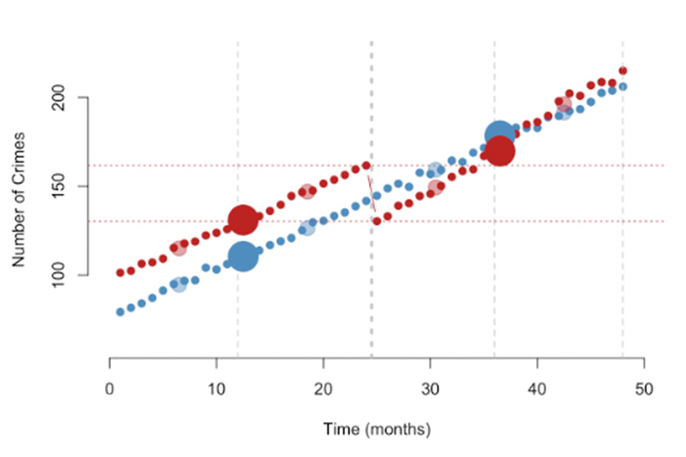                                                                                       |  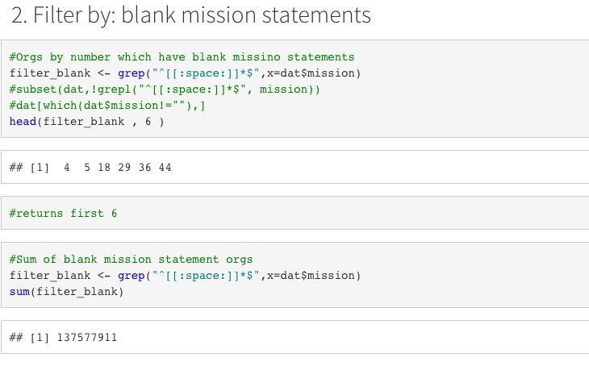
                                                                                                              
Project 03: Chi-Squared Test - Gender in Nonprofits                                                           |  Project 04: Regression Models - Class Sizes on Performance / Exercise and Caffeine 
:------------------------------------------------------------------------------------------------------------:|:------------------------------------------------------------------------------------------------------------:
[Chi-Squared Test - Gender in Nonprofits](./DSProj3_Gender.html)                                              |  [Regression Models - Class Sizes on Performance / Exercise and Caffeine ](./DSProj4_Regression.html)
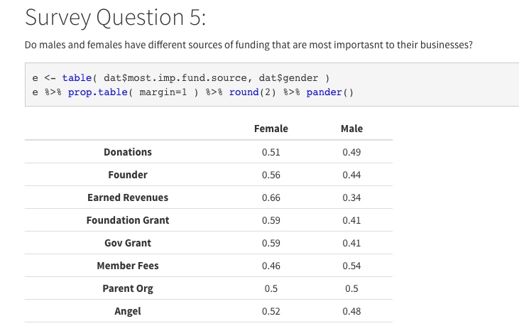                                                                                       |  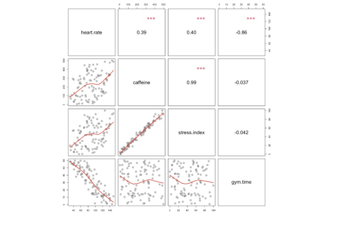

Project 05: Omitted Variable Bias - Happiness & Wellbeing                                                     |  Project 06: Google Viz - A Walkthrough 
:------------------------------------------------------------------------------------------------------------:|:------------------------------------------------------------------------------------------------------------:
[Omitted Variable Bias - Happiness & Wellbeing](./DSProj5_Omitted.html)                                       |  [Google Viz - A Walkthrough](./DSProj6_Google.html)   
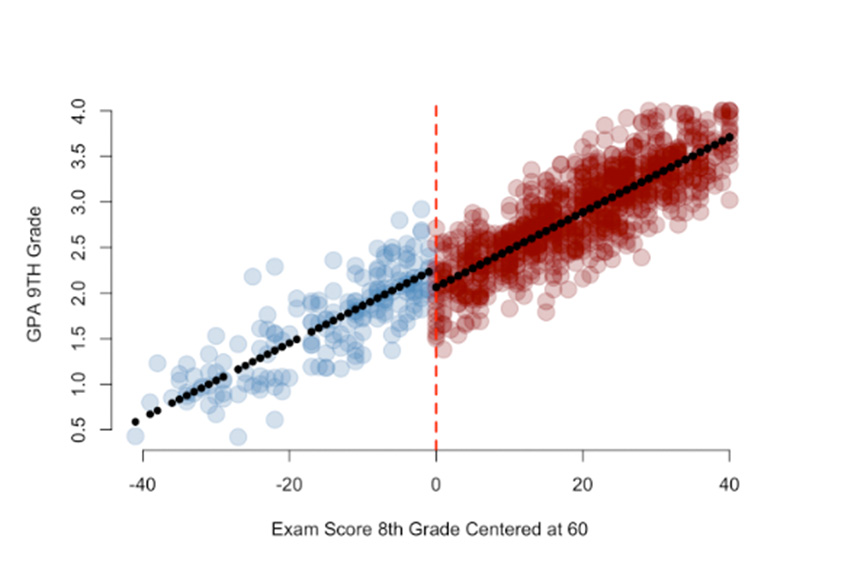                                                                                       |  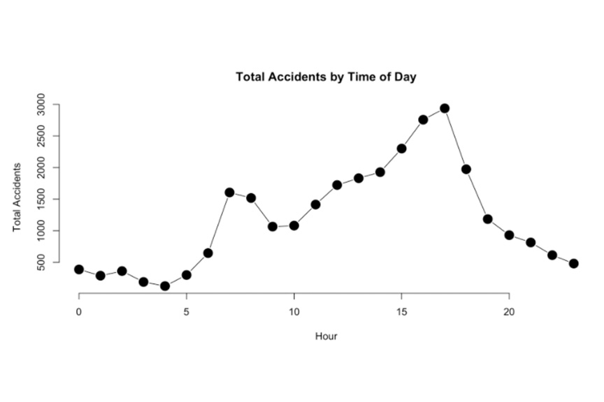
<br>  
<br>
<br>  
<br><br>  
<br>
<br>  
<br>
