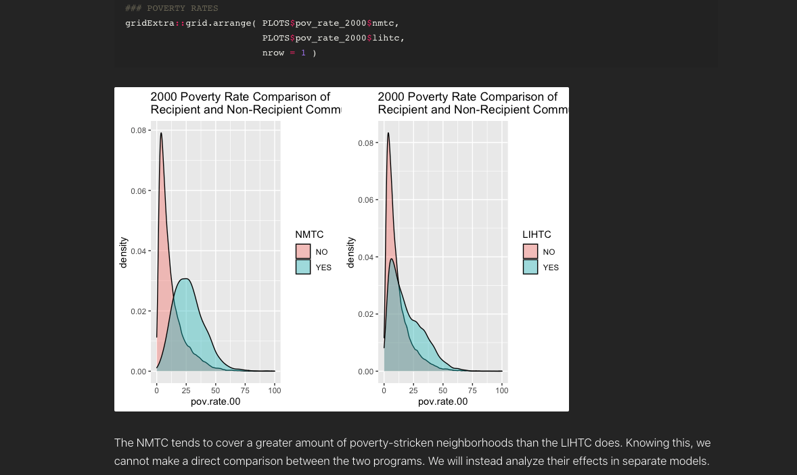
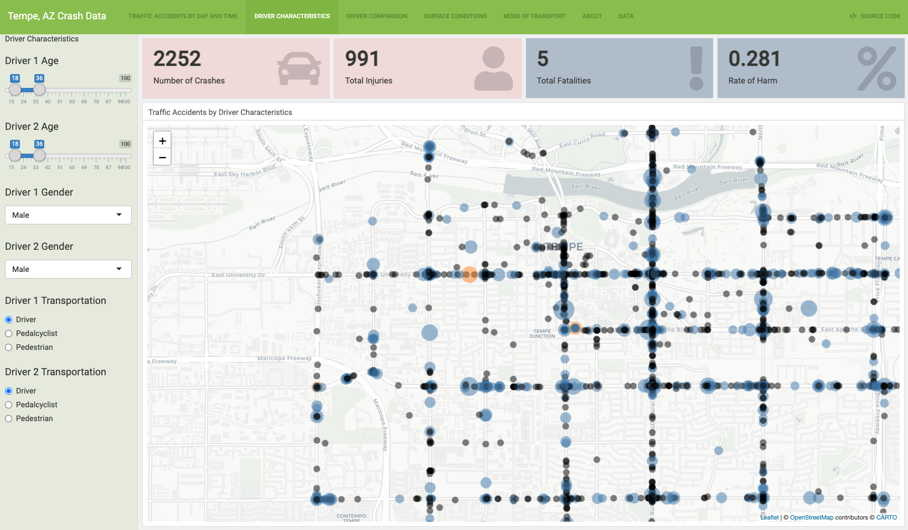

<br>
<br>

<h1>**Data Science**</h1>
<h6>***A Collection of things I am learning & things I'm interested in.***</h6>
*[github.com/Tylerisyoung](https://www.github.com/tylerisyoung)
*

____________________________


```{r setup, include=FALSE}
knitr::opts_chunk$set(echo = TRUE)

library ("ggplot2")
library ("gridExtra")
library ("cowplot")
```

<br>
<br>


<font size="5">
<p style="text-align: center;">Personal Projects</p>
</font>
<br>

Predictive Community Change based on Tax Revenue                                                              |  Dashboard: Car accident frequency in Tempe, AZ
:------------------------------------------------------------------------------------------------------------:|:------------------------------------------------------------------------------------------------------------:
[Masters Project, ASU](https://r-class.github.io/cpp-528-spr-2021-group-04/)                             |  [Dashboard: Car Accident Characteristics in Tempe, AZ](./tempedashboard.html)
                                                                          |  

Predictive Community Change based on Tax Revenue                                                              |  Dashboard: Car accident frequency in Tempe, AZ
:------------------------------------------------------------------------------------------------------------:|:------------------------------------------------------------------------------------------------------------:
[Masters Project, ASU](https://r-class.github.io/cpp-528-spr-2021-group-04/)                             |  [Dashboard: Car Accident Characteristics in Tempe, AZ](./tempedashboard.html)
                                                                          |  

<br>
<br>
<br>
<br>

<font size="5">
<p style="text-align: center;">School Projects</p>
</font>
<br>

Predictive Community Change based on Tax Revenue                                                              |  Dashboard: Interactive Car Accident User Investigation 
:------------------------------------------------------------------------------------------------------------:|:------------------------------------------------------------------------------------------------------------:
[Masters Project, ASU](https://r-class.github.io/cpp-528-spr-2021-group-04/)                             |  [Accident Characteristics in Tempe, AZ](./tempedashboard.html)
                                                                             |  
                                                                                                              

<br>
<br>
<br>
<br>

<font size="5">
<p style="text-align: center;">Technical Statistics Masters Lab Work</p>
</font>
<br>

Lab 01: Stargazer Regression, Difference in Difference Model: Vandalism in Cities                             |  Lab 02:  ChiSquare, T Tests & Bonferetti: Gender in Nonprofit Leadership 
:------------------------------------------------------------------------------------------------------------:|:------------------------------------------------------------------------------------------------------------:
[Regression Model Code Through 01](./lab-001-Young.html)                                                      |  [Regression Model Code Through 02](./lab-02-Young.html)
                                                                                       |  
                                                                                                              
Lab 03: Control Variables, Scatterplot Regressons on Class Size & Learning Outcome                            |  Lab 04: Standard Errors & Omitted Variable Bias
:------------------------------------------------------------------------------------------------------------:|:------------------------------------------------------------------------------------------------------------:
[Regression Model Code Through 03](./lab-03-Young.html)                                                       |  [Regression Model Code Through 04](./lab-04-young_v2.html)
                                                                                       |  

Lab 05: Regression Discontinuity: Grade School Exam Score Predictions                                         |  Lab 06: Car Crash Data Analysis, Tempe AZ
:------------------------------------------------------------------------------------------------------------:|:------------------------------------------------------------------------------------------------------------:
[Regression Model Code Through 05](./lab-05-Young.html)                                                       |  [Regression Model Code Through 06](./lab-06-Young.html)   
                                                                                       |  
<br>  
<br>
<br>  
<br><br>  
<br>
<br>  
<br>