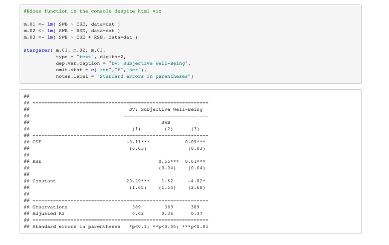

<br>
<br>

<h1>**Data Science**</h1>
<h6>***A collection of things I am learning & things I'm interested in.***</h6>
*[github.com/Tylerisyoung](https://www.github.com/tylerisyoung)
*

____________________________


```{r setup, include=FALSE}
knitr::opts_chunk$set(echo = TRUE)

library ("ggplot2")
library ("gridExtra")
library ("cowplot")
```

<br>
<br>


<font size="5">
<p style="text-align: center;">Data Driven Journalism</p>
</font>
<br>
<center>
Current Projects: [Here](./links.html)
</center>
<br>

Modern Monetary Theory - Slow at first, then all at once.                                                     |  Ongoing Technical Analysis of Financial Markets 
:------------------------------------------------------------------------------------------------------------:|:------------------------------------------------------------------------------------------------------------:
[Read Here:](./mmt.html)                                                                                      |  [Read Here:](./ongoingta.html)
                                                                                   |  
                                         


<br>

<font size="5">
<p style="text-align: center;">Projects</p>
</font>
<br>

Predictive Community Change based on Tax Revenue                                                              |  Dashboard: Interactive Car Accident User Investigation 
:------------------------------------------------------------------------------------------------------------:|:------------------------------------------------------------------------------------------------------------:
[Masters Group Project, ASU](https://r-class.github.io/cpp-528-spr-2021-group-04/)                            |  [Accident Characteristics in AZ - ShinyAPP](https://tylerisyoung.shinyapps.io/final-project-dashboard-Young/)
                                                                             |  
                                                                                                              

<br> 
<br>
<br>
<br>

<font size="5">
<p style="text-align: center;">Technical Statistics Masters Lab Work</p>
</font>
<br>

Project 01: Timeseries Analysis - Public Transit                                                              |  Project 02:  Grep Analysis of IRS Data  
:------------------------------------------------------------------------------------------------------------:|:------------------------------------------------------------------------------------------------------------:
[Timeseries Analysis - Public Transit](./DSProj1_Transport.html)                                              |  [Grep Analysis of IRS Data](./DSProj2_Grep.html)
                                                                                       |  
                                                                                                              
Project 03: Chi-Squared Test - Gender in Nonprofits                                                           |  Project 04: Regression Models - Class Sizes on Performance / Exercise and Caffeine 
:------------------------------------------------------------------------------------------------------------:|:------------------------------------------------------------------------------------------------------------:
[Chi-Squared Test - Gender in Nonprofits](./DSProj3_Gender.html)                                              |  [Regression Models - Class Sizes on Performance / Exercise and Caffeine ](./DSProj4_Regression.html)
                                                                                       |  

Project 05: Omitted Variable Bias - Happiness & Wellbeing                                                     |  Project 06: Google Viz - A Walkthrough 
:------------------------------------------------------------------------------------------------------------:|:------------------------------------------------------------------------------------------------------------:
[Omitted Variable Bias - Happiness & Wellbeing](./DSProj5_Omitted.html)                                       |  [Google Viz - A Walkthrough](./DSProj6_Google.html)   
                                                                                       |  
<br>  
<br>
<br>  
<br><br>  
<br>
<br>  
<br>
