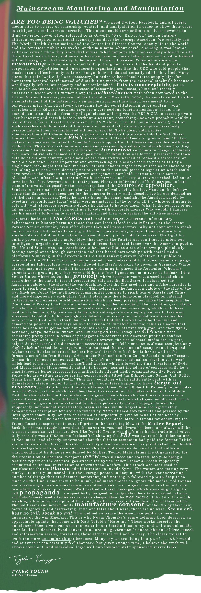

 
 

<h1>**Mainstream Monitoring and Manipulation**</h1> 
<h6>
***An article by Tyler Young.***
</h6>

*[Tylerisyoung.Substack.com](www.tylerisyoung.substack.com)*   
*[Twitter.com/TylerisYoung](www.twitter.com/Tylerisyoung)*  
 _________________________
  
 1/25/2022
  
  *Full text below.*
  
 
<h3>
Are you being watched?
</h3>

Opinion: Mainstream Monitoring and Manipulation Runs Deep

 
We need Twitter, Facebook, and all social media sites to be free of censorship, control, and manipulation in order to allow their users to critique the mainstream narrative. This alone could save millions of lives, however an illusive higher power often refereed to as Orwell's "Big Brother" has an entirely different conception of national security than does the average American. 

  

We recently saw The World Health Organization and the Center for Disease Control openly lie to the world and the American public for weeks, at the minimum, about covid, claiming it was "not an airborne virus," when they [knew](https://www.nationalreview.com/the-morning-jolt/chinas-devastating-lies/) [that](https://townhall.com/tipsheet/katiepavlich/2020/03/20/the-world-health-org-covered-for-china-after-direct-warnings-of-wuhan-virus-spread-n2565366) [it](https://www.nationalreview.com/corner/yes-beijing-lied-to-the-world-but-their-reaction-should-have-warned-us/) [was](https://nypost.com/2020/04/02/chinas-deadly-coronavirus-lie-co-conspirator-the-world-health-organization/). What happens when we are only allowed to site the official institutions, and news, otherwise have our posts taken down and shadow banned without regard for what ends up to be proven true or otherwise.

  

When we advocate for censorship online, we are inevitably putting our lives into the hands of private corporations or political and bureaucratic organizations like the CDC who told people that [masks aren’t effective](https://www.businessinsider.com/americans-dont-need-masks-pence-says-as-demand-increases-2020-2?op=1) only to later change their minds and actually admit they [lied](https://www.youtube.com/watch?v=9tYdeuSebzQ). Many claim that this "white lie" was necessary; In order to keep local stores supply high for hometown hospital staff instead of distributing masks from the national stockpile because it was [illegally](https://www.vox.com/2020/4/15/21210210/coronavirus-covid-19-national-strategic-stockpile) left at low capacity and not replenished.

  

This is unacceptable, yet no one is held accountable.

  

The extreme cases of censorship are Russia, China, and recently Australia which are all further along the authoritarian path when compared to the United States. However, we are not far behind, on May 14th, 2020, the senate voted to allow a reinstatement of the patriot act - an [unconstitutional](https://www.foreffectivegov.org/node/3430) law which was meant to be temporary after 9/11 effectively bypassing the the constitution in favor of NSA “ [702](https://cdt.org/insights/section-702-what-it-is-how-it-works/)” searches which Edward Snowden [says](https://www.theguardian.com/us-news/2016/sep/29/edward-snowden-disclosures-patriot-act-fisa-court) are a very serious fourth amendment issue. The amendment also added a formerly illegal clause which gives the FBI & CIA to access private user browsing and search history without a warrant, something Snowden probably wouldn’t like either. This is [Disaster Capitalism](https://www.theguardian.com/us-news/2017/jul/06/naomi-klein-how-power-profits-from-disaster).

  

In 2017 alone, The FBI conducted over 3 million such [searches](https://www.brennancenter.org/our-work/analysis-opinion/how-fbi-violated-privacy-rights-tens-thousands-americans) into hundreds of thousands of individual citizens to acquire previously private data without warrants, and without oversight. To be clear, both parties administration’s FBI abuse these same powers, as Obama’s top advisors told the [Wall Street Journal](https://www.wsj.com/articles/u-s-spy-net-on-israel-snares-congress-1451425210) they had made use of FISA surveillance of "Jewish American groups” and “US law makers” in congress, in order to “counter” Israeli opposition to Obama's nuclear deal with Iran at the time. This investigation into anyone and everyone desired is a far stretch from “fighting terrorism.”

  

Furthermore, the very definition of terrorism continues to [change](https://www.e-ir.info/2019/09/24/terrorism-as-controversy-the-shifting-definition-of-terrorism-in-state-politics/), including ever more individuals deemed as the opposition. The definition was formerly reserved for those outside of our own country, while now we are consistently warned of "domestic terrorists" on the 5 o'clock news.

  

These important and overreaching bills always seem to pass or fail by a single vote, why might that be? Our hero Bernard Sanders might have an idea as he chose to opt out, along with Ben Sasse, deciding not to vote on this critical piece of legislation which could have revoked the unconstitutional powers our agencies now hold. Former Senator Lamar Alexander was infected & quarantined with coronavirus, and Patty Murray was scheduled out of town for that day. Everyone was in their place.

  

Plenty of individuals, of both partie's, on both sides of the vote, but possibly the most outspoken of the [controlled opposition](https://medium.com/@kevinsarpei/3-reasons-why-bernie-sanders-might-be-controlled-opposition-b6884c492cef), Sanders, was at a gala for climate change instead of, well, doing his job. Many on the left now argue that Sanders is a sheep dog for the democratic party while decades ago he was demanding a third party in America. Today he mostly helps ‘the squad’ gaslight the American people by tweeting "revolutionary ideas” which were mainstream in the 1950’s, all the while continuing to vote with wall street for corporate donors he claims to hate so much.

  

What is the purpose of not taking corporate money, if you continue to vote with corporate money? Why wouldn't Sanders use his massive following to speak out against, and then vote against the anti-free market corporate bailouts of the CARES act, and the largest occurrence of monetary debasement in history harming those that can least afford it via inflation, or the recent Patriot Act amendment, even if he claims they will pass anyway. Why not continue to speak out on twitter while actually voting with your constituents, in case it comes down to a [single](https://www.extremetech.com/internet/310579-us-senate-falls-one-vote-short-of-protecting-your-online-privacy) vote as it did on the patriot act amendment, just for old times sake.

  

The fight for online privacy was dealt a major blow that day as the Patriot Act continues to allow our intelligence organizations warrantless and draconian surveillance over the American public. 

  

The United States was, and continues to be a surveillance state of its own people slowly forcing compliance through contagion and fear based partnerships with social media platforms & moving in the direction of a citizen ranking system, whether it’s public or internal to the FBI, as [China has implemented](https://www.bbc.com/news/world-asia-china-34592186). Few understand that a fear based campaign surrounding tuberculosis was what allowed the Nazi's to [come to power](https://www.eviemagazine.com/post/did-you-know-the-nazis-were-obsessed-with-health-guidelines) in Germany. While history may not repeat itself, it is certainly rhyming in places like [Australia](https://medium.com/discourse/why-and-how-is-australia-becoming-so-authoritarian-123093ed7569). 

  

When my parents were growing up, they were told by the Intelligence community to be in fear of the Soviet Union where no one had privacy, where everyone was encouraged to snitch on each other to the state in fear of persecution, this was the [Red Scare](https://en.wikipedia.org/wiki/Red_Scare). It helped get the American public on the side of the war Machine. Next the CIA used 9/11 and a [false narrative](https://www.rollingstone.com/politics/politics-news/taibbi-the-legacy-of-the-iraq-war-204470/) in order to spark fear of Islamic Terrorism. This helped get the American public on the side of the war Machine.

  

Today the intelligence communities conspire to spark fear of Russia and China, and more dangerously - each other. This it plays into their long-term playbook for internal distractions and external world domination which has been playing out since the inception the CIA.

General Wesley Clark in 2007 when speaking of the decisions in the days after 9/11,  claims Rumsfeld and Wolfowitz possessed no evidence of any parties wrongdoing which could have lead to the bombing Afghanistan; Claiming his colleagues were simply planning to take over governments not due to human rights violations, war crimes, or for ideological reasons that were yet to be tied to the attack, but for the benefit of the Unites States bottom line and demand for power. He then [says on live television](https://www.globalresearch.ca/we-re-going-to-take-out-7-countries-in-5-years-iraq-syria-lebanon-libya-somalia-sudan-iran/5166) of Rumsfeld’s memo; “This is a memo that describes how we’re gonna take out 7 countries in 5 years, starting with Iraq, and then Syria, Lebanon, Libya, Somalia, Sudan, and Finishing off Iran.”

  
Today, the CIA would need something pretty great in terms of propaganda to convince the American public to conduct regime change wars in 7 countries. However, the rise of social media has, in part, helped deliver exactly the distractions necessary as Rumsfeld's mission is almost complete only slightly behind schedule. 

George W Bush announced the invasion and occupation of Iraq and Afghanistan. He also inherited the hostility with Iran from both his father as well as the foregone era of the Iran Hostage Crisis under Ford and the Iran Contra Scandal under Reagan. Obama then famously [announced](https://jonathanturley.org/2014/09/10/obama-i-do-not-need-congressional-approval-to-go-to-war-with-isis/) that he "Doesn't need congressional approval to go to war" which lead to a new precedent in unofficial warfare which allowed the final invasions of Syria and Libya. Lastly, Biden recently [cut aid](https://www.nytimes.com/2019/11/01/world/middleeast/lebanon-military-aid.html) to Lebanon against the advice of congress while he is simultaneously being pressured from militaristic aligned media organizations like Foreign Policy who are writing [articles](https://foreignpolicy.com/2021/11/09/in-ethiopia-and-sudan-u-s-policy-needs-less-talk-and-more-teeth/) for the general public titled "In Ethiopia and Sudan, U.S. Policy Needs Less Talk and More Teeth." Thus the 7 countries will be sufficiently dealt with as Rumsfeld's vision comes to fruition. 

All 7 countries happen to have large oil reserves, or plans for an oil pipeline through them. Which Robert F. Kennedy Junior notes in an EcoWatch [article](https://www.ecowatch.com/syria-another-pipeline-war-1882180532.html) which describes the entire reason for U.S. intervention in the Middle East. He also details how this relates to our governments hawkish view towards Russia who have different plans, for a different route through a formerly soviet aligned middle east. 

Truth becomes an enigma when intertwined by what is potentially covert propaganda seen by supposedly independent investigatory organizations like Bellingcat who are legitimately [exposing](https://www.bellingcat.com/) real corruption but are also [funded](https://thegrayzone.com/2018/08/20/inside-americas-meddling-machine-the-us-funded-group-that-interferes-in-elections-around-the-globe/) by NATO aligned governments and [praised](https://foreignpolicy.com/2020/12/17/bellingcat-can-say-what-u-s-intelligence-cant/) by the intelligence community, only to be accused of purposefully lying on behalf of the west by "whistleblowers" like [award winning](https://www.parkindymedia.org/izzy-awards-2019/) journalist Aaron Mate.

  

Mate is famous for [debunking](https://www.thenation.com/article/archive/rip-russiagate/) the Trump-Russia [conspiracies](https://www.thenation.com/article/politics/trump-russiagate-steele-dossier/) in 2019 all prior to the deafening blow of the Muller Report. Back then it was already known that the narrative was, and always has been, and always will be; A smear campaign against outsiders like Donald Trump who don't play by the traditional rules. Only recently was a FISA [memo](https://www.investors.com/wp-content/uploads/2018/02/FISA_memo_and_white_house_letter.pdf) declassified showing the FBI was aware of the false nature of document, and already understood that the Clinton campaign had paid the former British spy to fabricate the Steele Dossier. This very document was used as justification for the FBI to investigate a sitting president presumably to find some evidence of actual collusion which could not be done as evidenced by Muller.

 

Today, Mate claims the Organization for the Prohibition of Chemical Weapons (OPCW) was silenced and coerced into publishing a falsified report on the chemical gas attacks the Syrian leader Bashar al-Assad supposedly committed at Douma, in violation of international warfare. This attack was later used as [justification](https://www.thenation.com/article/world/opcw-leaks-syria/) for the Obama administration to invade Syria.

 

  

The waters are getting very murky, its nearly impossible for the average person to keep up with the ever increasing number of things that are deemed important, and nothing is followed up with despite  so much on the line. Some seem to be numb, and many choose to ignore the media, politicians, and increasingly institutional consensus. Americans trust in government is at an [all time low](https://news.gallup.com/poll/355124/americans-trust-government-remains-low.aspx) which is a disastrous trend.

  

 Well crafted official messages, which some might rightly call propaganda are specifically designed to manipulate others into a desired outcome, and today's social media tactics are certainly cheaper than the Red Scare of the 50's. It's [worth watching](https://www.youtube.com/watch?v=ksb3KD6DfSI) a few funny examples of these well crafted messages if you haven't seen them before.

  

The politicians and news pundits manufacture consent for the CIA by their new tactic of ignoring and distracting. If no one talks about wars, there are no wars. See no evil, hear no evil, speak no evil. This helped convince the American public to become unaware of the war Machine. This is why Noam Chomsky’s genre defining [book](https://en.wikipedia.org/wiki/Manufacturing_Consent)" deserved an appreciable update that came with Matt Taibbi's “[Hate inc](https://en.wikipedia.org/wiki/Hate_Inc.).” These works describe the unbalanced incentive structures that exist in our institutions today, and while social media does facilitate decentralized conversation around government's encroachment of free speech and information access, correcting these structures will not be easy.

  

The closer we get to truth the more uncomfortable it becomes. Many say we are living in a post-truth world, and at times it can certainly feel that way, but given enough time, I believe the truth will always come out, and individual logic will out-compete state sponsored surveillance.

-Tyler   
@TylerisYoung