 
 

<h2>**Ongoing Technical Analysis of Financial markets and Crypto**</h2> 
<h6>
 
***For sure financial advice - More on Substack & Twitter***
</h6>

*[Tylerisyoung.Substack.com](www.tylerisyoung.substack.com)*   
*[Twitter.com/TylerisYoung](www.twitter.com/Tylerisyoung)*  
 _________________________

 
<h4>
**The Fundamentals**
</h4>
<h6>
Zoom in on browser/mobile to see charts 
<h6>

 

Read: [Modern Monetary Theory - Slow at first, then all at once.](./mmt.html)  

   
<h4>
**The Macroeconomic Backdrop**  
</h4>
The macroeconomics problem displayed in a single chart:

<h4>
 
   
Ongoing Technical Analysis
</h4>
 

________________________________________________________________  
**6/1/2022**
   
***Federal Reserve Begins Quantitative Tightening Today***  
   

- The Fed will begin selling UST's and MBS's. There are many reasons for markets to buy US Treasuries, they are universal pristine collateral across the world, but when the Fed begins selling Mortgage Backed Securities, there becomes more supply of them, less demand for their use as collateral, and there is only one buyer - pension funds forced to purchase them by mandate to "reduce risk." MBS interest rates will increase as selling occurs and price goes down, and the housing market will stall over time. The real risk comes when these investments have negative real yields against inflation and pension funds begin to fail unless they can adjust the regulations in order to find better yields. 
  
- We only have one period of QT to base our expectations off in 2018, and we are now tightening into a slowing economy, interestingly enough the S&P actually was flat/went up slightly during the last period of tightening.  
  
- Let's see how far they get before something breaks. Last time that happened was 2019 when it took a liquidity event in the reverse repo market to abruptly end QT and reverse course to QE infinity.Covid provided excellent cover for this, and climate change will provide the next. 
  
- As M2 money supply increases, so does counter party risk on banks balance sheets. If all the banks are holding are promises of payment, trust can erode quickly. These banks are now (apparently) so concerned that their formerly pristine assets - US treasuries and Mortgage backed securities - will fail, potentially overnight, as happened in 2008 that they are placing ever increasing amounts of risk on the balance sheet of the Federal Reserve in the overnight repo market. The government will print more money before they become insolvent.

   
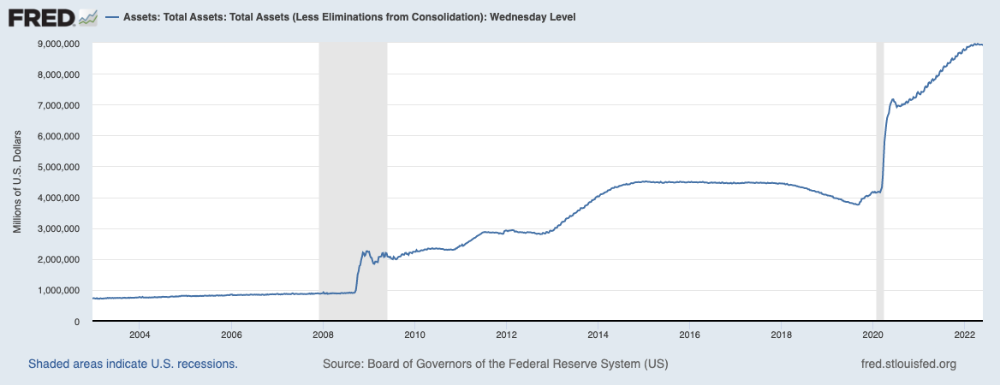
 
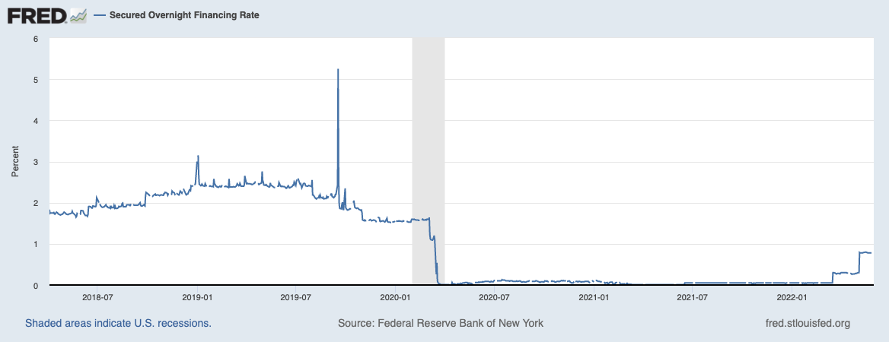
 
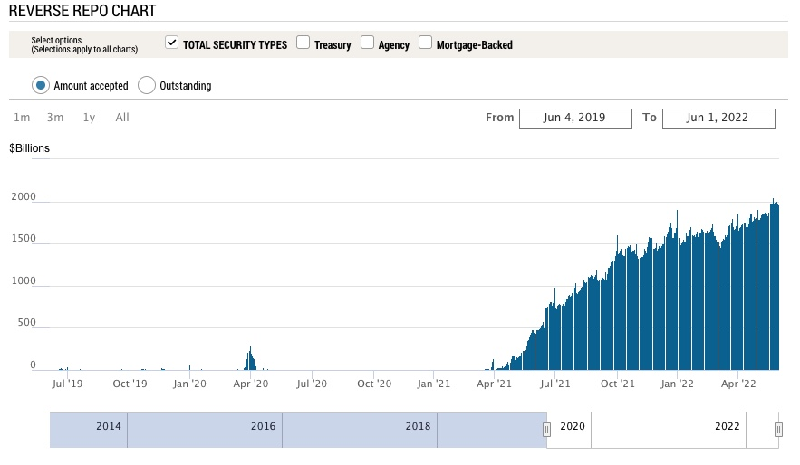

 
 
 
_________________________________________________________  
 
*5/31/2022*
     

**Biden's Plan to Combat Inflation**  
 
Biden wrote an op-ed for the Wall St Journal where he  [announces](https://www.wsj.com/articles/my-plan-for-fighting-inflation-joe-biden-gas-prices-economy-unemployment-jobs-covid-11653940654) his three step plan to fight inflation. This is just after his [previous plan](https://www.whitehouse.gov/briefing-room/statements-releases/2022/05/10/the-biden-harris-inflation-plan-lowering-costs-and-lowering-the-deficit/) released just days ago. 
  
  - *The New Plan:*  
  - 1) "First, the Federal Reserve has a primary responsibility to control inflation. My predecessor demeaned the Fed, and past presidents have sought to influence its decisions inappropriately during periods of elevated inflation. I won’t do this. I have appointed highly qualified people from both parties to lead that institution. I agree with their assessment that fighting inflation is our top economic challenge right now."
  
 
  
  - 2) "Second, we need to take every practical step to make things more affordable for families during this moment of economic uncertainty—and to boost the productive capacity of our economy over time. The price at the pump is elevated in large part because Russian oil, gas and refining capacity are off the market. We can’t let up on our global effort to punish Mr. Putin for what he’s done, and we must mitigate these effects for American consumers. That is why I led the largest release from global oil reserves in history. Congress could help right away by passing clean energy tax credits and investments that I have proposed. A dozen CEOs of America’s largest utility companies told me earlier this year that my plan would reduce the average family’s annual utility bills by $500 and accelerate our transition from energy produced by autocrats. We can also reduce the cost of everyday goods by fixing broken supply chains, improving infrastructure, and cracking down on the exorbitant fees that foreign ocean freight companies charge to move products. My Housing Supply Action Plan will make housing more affordable by building more than a million more units, closing the housing shortfall in the next five years. We can reduce the price of prescription drugs by giving Medicare the power to negotiate with pharmaceutical companies and capping the cost of insulin. And we can lower the cost of child and elder care to help parents get back to work. I’ve done what I can on my own to help working families during this challenging time—and will keep acting to lower costs where I can—but now Congress needs to act too."
  
 
  
  - 3) "Third, we need to keep reducing the federal deficit, which will help ease price pressures. Last week the nonpartisan Congressional Budget Office projected that the deficit will fall by $1.7 trillion this year—the largest reduction in history. That will leave the deficit as a share of the economy lower than prepandemic levels and lower than CBO projected for this year before the American Rescue Plan passed. This deficit progress wasn’t preordained. In addition to winding down emergency programs responsibly, about half the reduction is driven by an increase in revenue—as my economic policies powered a rapid recovery."

   

- *In other words:*   
- 1) Blame the FED, Trump, Russia, and define the oil industry as "autocrats" - the high inflation, it's not Biden's fault. 

 

- 2) Reiterate that even though we continue to choose to sanction Russian oil and gas, like Europe who's [heading towards](https://www.zerohedge.com/geopolitical/vilches-europes-mad-ban-russian-oil) the largest energy shortfall in decades, forcing the public to spend higher and higher percentages of their income on energy (causing the especially vulnerable and elderly to literally freeze to death if they can't afford heat - a real and increasing problem) This is framed as something we need to do it to 'stick it to Putin.' Next, release all US strategic oil reserves to artificially bring down price - temporarily, (this was [already done](https://www.reuters.com/markets/commodities/us-strategic-petroleum-reserve-drops-lowest-level-since-1987-2022-05-16/), reserves are now at decades long lows) then pass green energy tax credits and spend more money to further investments in the space. Then spend more money to fix supply chains and improve infrastructure. Then begin "cracking down on the exorbitant fees that foreign ocean freight companies charge to move products," (here come the price controls). Then build a million homes. Then give pharmaceutical companies the ability to negotiate, but also "cap the cost of insulin." (There they are) 

 

- 3) Reduce the federal deficit which is supposedly will contract by $1.7T (That is, if we compare Year over year numbers to the last two years when we printed more than 25% of M2 money supply, causing a massive federal deficit, it's easy to see how the "deficit shortfall" will come down, even while net deficit will go up) 

 

- *Analysis:*   
  The problem is that despite the negative connotation, Biden is right - Oil companies are autocrats, they have ultimate control over global energy markets and thus the economies of the world, there are very few things which are more important to our way of life than oil. A reduction in production and consumption of oil and natural gas (or higher prices) means more crop shortages, fertilizer shortages, supply chain issues, mass starvation and malnutrition especially in the third world, decreased economic activity globally, higher unemployment everywhere, individual savings evaporate, wealth inequality is exacerbated, etc. We need oil to run the world, and lots of it. Cheap oil makes everyone better off. 

  Furthermore, if climate change were to enter the conversation, one needs to ask; what is the carbon footprint of spending and sending 40 Billion to Ukraine in our funding of the newest proxy war started immediately after the last. All thew way back in a 2011 interview, Julian Assange [states](https://www.londontimes.live/state-of-affairs/julian-assange-speaking-in-2011-the-goal-is-an-endless-war-not-a-successful-war/), "The goal is to use Afghanistan to wash money out of the tax bases of the US and Europe through Afghanistan and back into the hands of a transnational security elite. The goal is an endless war, not a successful war." Nothing has changed, additionally, EV's are nowhere near cost effective enough for global transportation and they won't be so globally until at least the mid 2030's when the majority of developed nations have gone through a generation of EV cars and they can filter through the used markets into developing nations. Green energy and heating production is not efficient enough in most locations and won't be for some time, tax credits are nice incentives and it's yet to be seen if the average consumer will save $500/year on their energy bill as Biden says. The rest of his plan involves spending more money that GDP is not bringing in as we head into another negative quarter of growth, which will thus increase the deficit. Inflation is always a monetary phenomenon, spending more money will make inflation worse, not better. The same goes for his previous plan mentioned above, every single line item (many taken from build back better) will involve spending massive amounts of money, multiple trillions, created by the Treasury, adding to the federal deficit - which is the primary cause if inflation. 
  
  The way to solve consumer price inflation is to bolster the actual GDP output of the economy, create more literal goods and services without creating more dollars - More goods being chased by fewer dollars drives inflation down. That's the fun way, the alternative is demand destruction by economic recession, if no one has money to buy anything, demand also goes down. That's unfortunately where we're at while simultaneously placing higher taxes and price controls on the very producers who are capable of solving the problem (oil companies etc.) While some of the proposals in the long run (decades) could bring down inflation - now is not the time to increase deficit spending, the time would have been when (real) GDP was strong, when interest rates and (real yields) had already been (much) higher for years, spend when you have the money, not when you don't. 
  
   
  
- *Conclusion*  
Spending now only digs the grave of the debt driven deflationary spiral deeper once it does arrive, we no longer have high interest rates as a tool to combat inflation, the deficit is too high and will drive the US to insolvency, but I imagine they intend to inflate the bubble a few more times before that happens, the 2019 repo crisis is evidence enough of that sentiment. It's getting harder and harder to ignore the missteps at every turn, and incompetence is often indistinguishable from malice. 
  
 
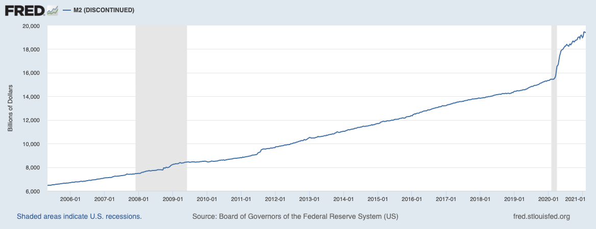
 
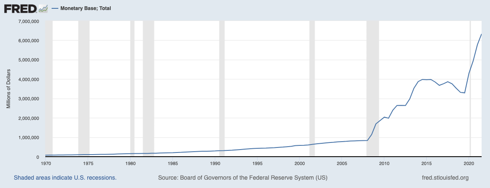
 
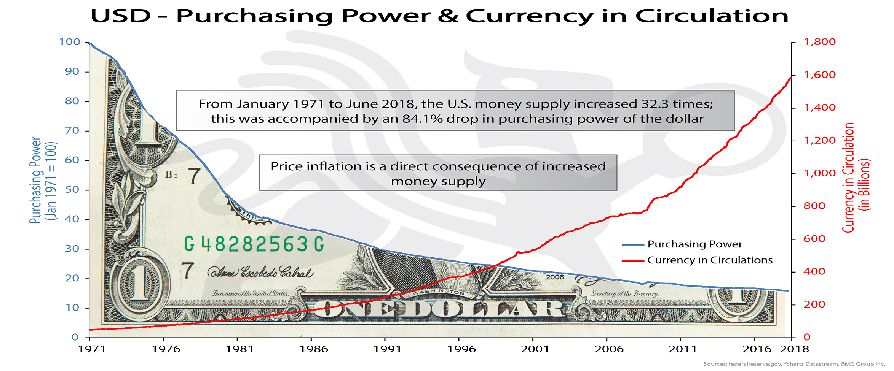
 
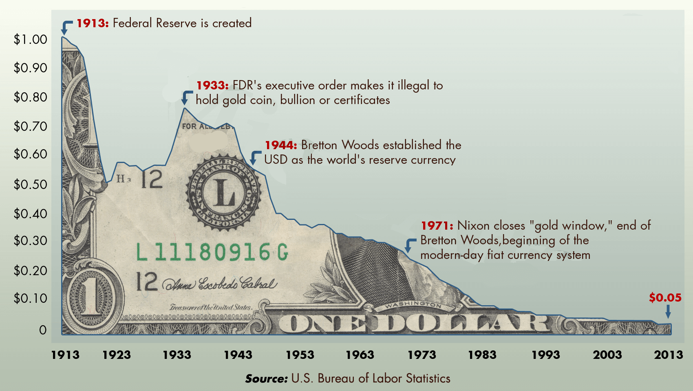
 

 
 
 
________________________________________________________________  
 
 
 
*5/29/2022*
     

**Traditional Markets**  

- Gavin Newsom [suggests](https://www.gov.ca.gov/2022/03/23/governor-newsom-proposes-11-billion-relief-package-for-californians-facing-higher-gas-prices/) $11bn in stimulus to combat gas price inflation - lol. Inflation is always a monetary phenomenon - more money in the system chasing the same goods results in higher prices. Next on the list of things not to do will come price controls. Taxes on energy and necessities are always regressive as seen in Europe and well covered by Zero Hedge and Doomberg. CA has the highest taxes on gas, hurting those that can least afford it most, as does inflation. 

- Running to take Newsom's spot as governor, Micheal Shellenberger has a much better understanding of the economy and energy markets as described in his own [Substack.](https://substack.com/profile/2255433-michael-shellenberger) I wish him luck in his candidacy. 

- China's small-medium banks are insolvent? - Customers unable to access funds for a month. Lots of turmoil due to ridiculous lock downs, occams razor pivoting towards China will not open up until Europe is in official recession. US and Europe already in recession, but the time it's acknowledged, it will be nearly over if it still likely ends with a fed pivot. [via Reuters](https://www.reuters.com/markets/asia/chinese-depositors-left-dark-three-local-banks-freeze-deposits-2022-05-18/)

- China is [loosening](https://www.bloomberg.com/news/articles/2022-05-20/china-cuts-borrowing-costs-by-record-to-boost-loan-demand) by record amounts to make up for weak (or collapsing) housing market in China who does a lot more adjustable rate loans. (Evergrande's toxic balance sheet?) China needs citizens taking new loans so they're cutting rates, debt driven systems need more debt and inflationary bailouts. Current system is tight and desperate for new money. 

- Oil likely to rally further (short term) with Strategic Reserve depleted, moreso if China re-opens, in this stagflationary environment, price inflation will continue even if YOY numbers go down slightly. Longer term, demand destruction may prevail alongside low growth to bring down oil prices. 

- Bear market rally confirmed in traditional markets, back to risk on, temporary and short term mean reversion setting up for potential or likely lower lows in line with the high time frame mean reversion after decade long bubble in risk. 

- Fed announces only two more hikes, then data dependent, Powell is great at letting the markets know what should be expected. 

- Redfin [reporting](https://www.redfin.com/news/housing-market-update-price-drops-surge-to-19pct/) 1/5 home sellers drop prices last month

- Redfin "The monthly mortgage payment on the median asking price home declined slightly from a record high to $2,425 at the current 5.1% mortgage rate. This was up 42% from $1,708 a year earlier, when mortgage rates were 2.95%...Pending home sales were down 5.4% year over year."
  
- Fed Raising rates resulting in huge mortgage rate increase, highest since 2008, bond prices set to rally as safe haven compared to real estate. 
  
- University of Michigan "home buying conditions" are the worst they've been since the 1980's - [Zero Hedge](https://www.zerohedge.com/personal-finance/umich-sentiment-tumbles-accelerates-may-home-buying-confidence-collapse)
  
 
 
**Crypto Markets**  
  
- BTC playing catch up over the weekend, riskiest of risk assets will lag. Eventual decoupling will result in BTC being risk off, but this still seems like a distant future. 

- BTC Peak Fear and greed index recently reached 8 (now 10) - Extreme fear, good long term buy indicator despite potential further downside. 

- Alt/BTC pair is likely to continue to bleed until BTC shows monthly strength, BTC maxi's always have a good point. 

 

**Charts**

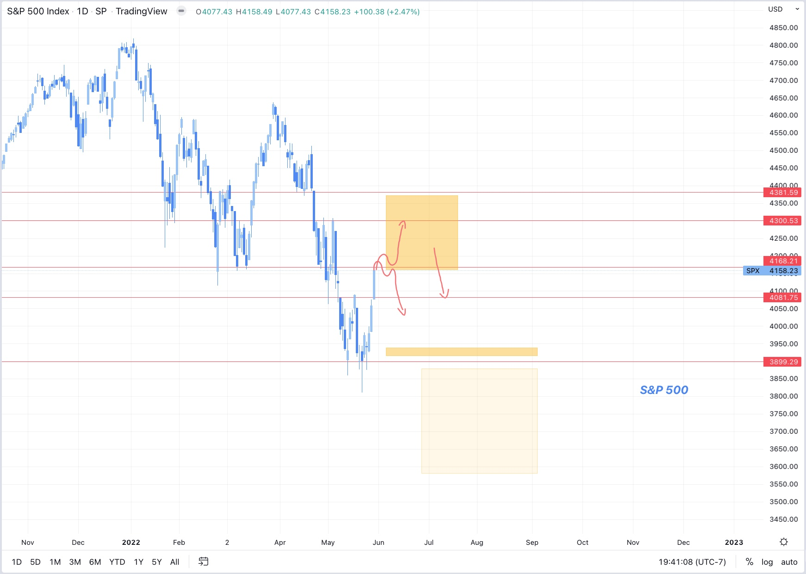
 

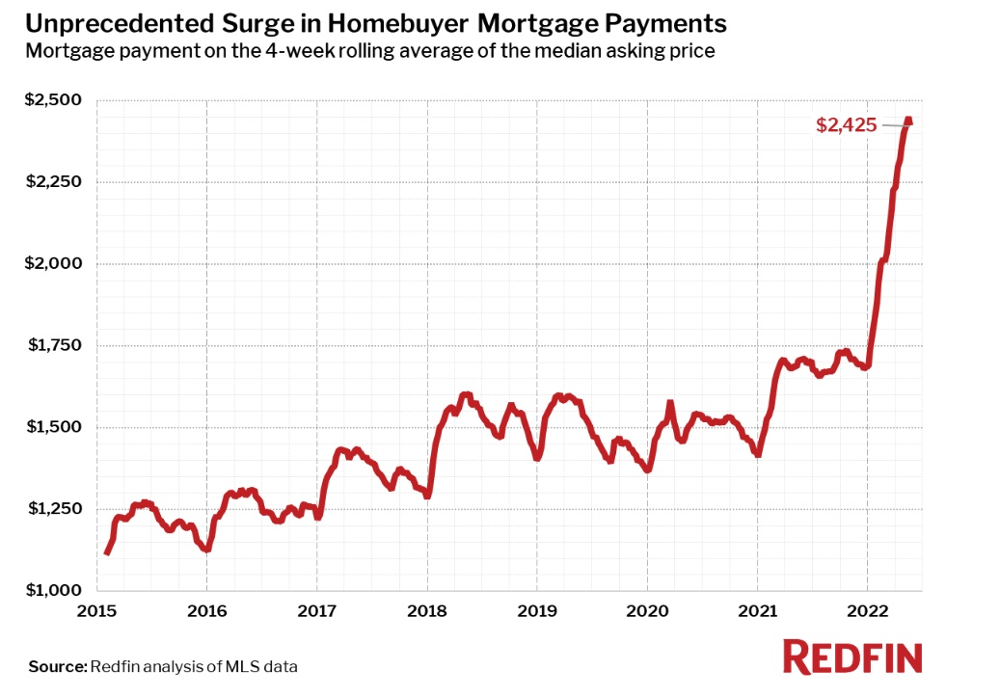
 

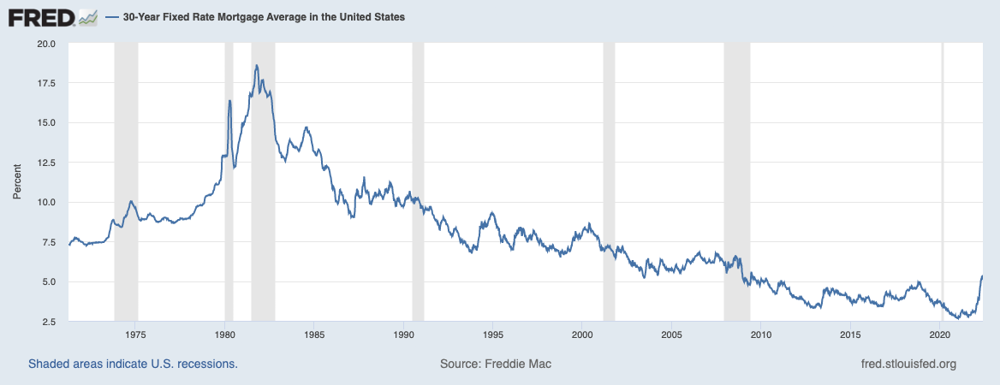
 

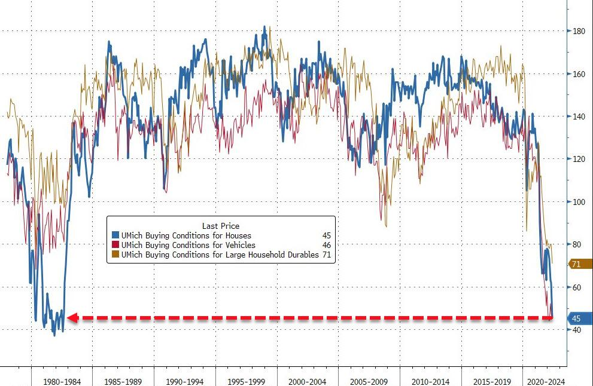
 

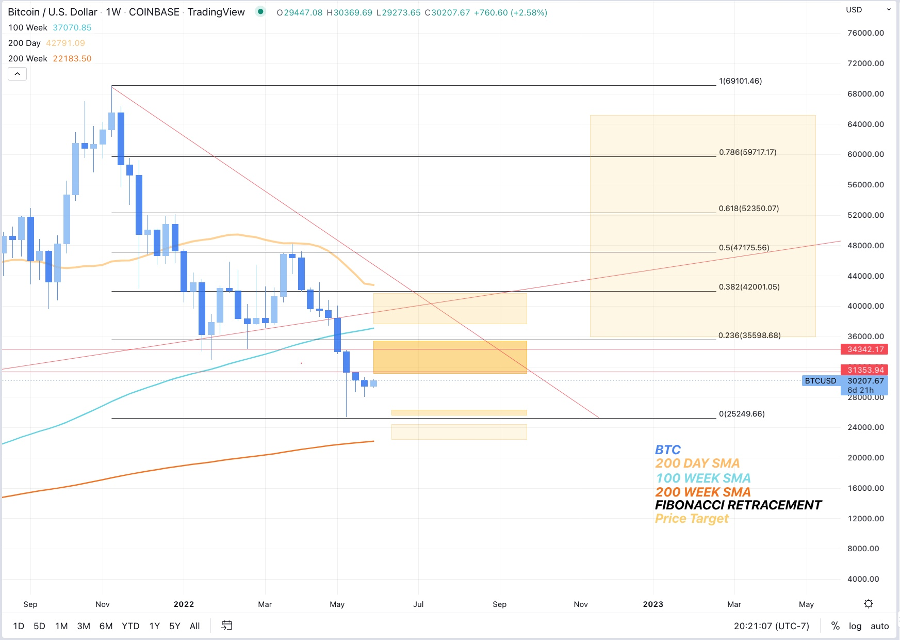
 

 
 
 
________________________________________________________________  
 
*5/27/2022*
     

- Traditional markets are having a nice rally after solid support at S&P:3900, now above 4100. Still low call volume. 

- Volatility will likely remain high for several weeks. 
  
- Consumer savings accounts shredded, American's are not able to adjust spending to keep up with newly higher prices.  - chart from Zero hedge. 

- BTC Down, everything else up, correlation with risk is breaking, but not in the fun direction. Price action closes hourly low below the range low, Longs getting trimmed until clarity in PA. BTC is the most risky of risk on assets, will potentially rally last under a bear market rally. 

- BTC dominance likely to continue to stay flat or rise whether we go up or down, Alts have been rekt with no end in sight, good prices, but no strength in BTC means alts could drop another 60%+ from here. 

- Lumber futures are down big at peak building season, houses should be being built but no one's buying wood, long term housing shortage will continue until prices fall significantly.  

- NYT changes tune on Ukraine war - Ukraine can't win. (While typing I defaulted to writing "we can't win" - American's don't want or need another proxy war.)

- Voter turnout hits record numbers in Georgia as Dems switch sides leading to massive positive swing for Republicans, could foreshadow future problems for Dems as many have already been forecasting, potentially even more reason for a FED pivot prior to November. 

 

 

 
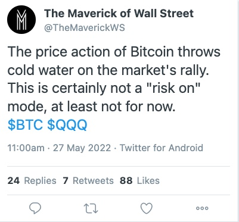
 
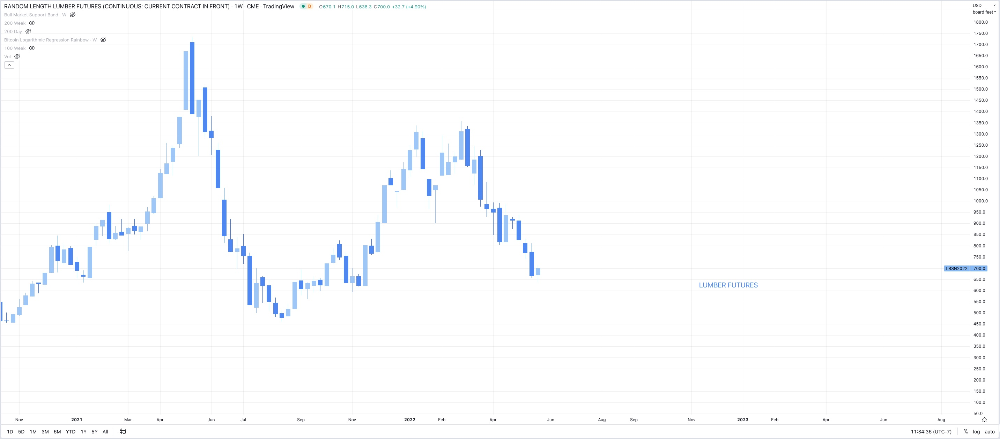
 
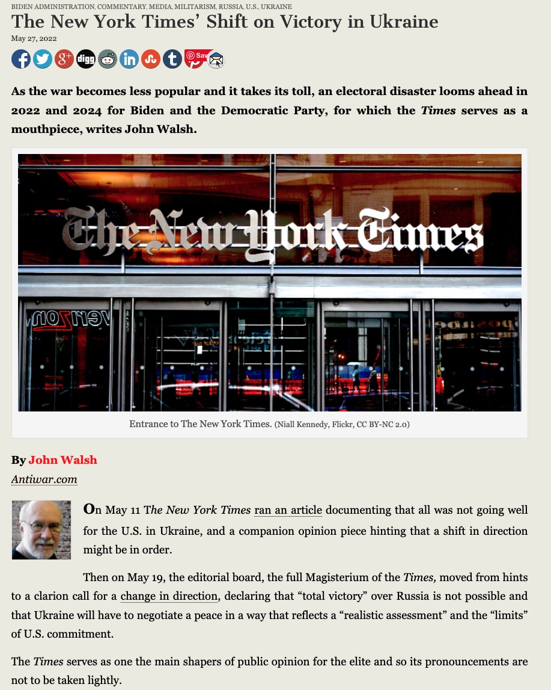
 
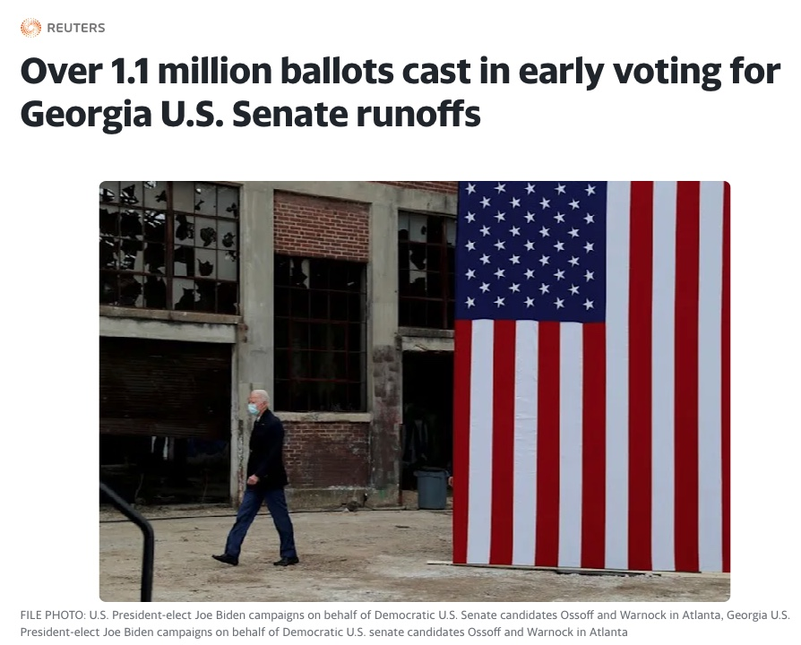
 

________________________________________________________________  
*5/25/2022*
   
**Short term outlook:**    
  
- DXY and US10YR threatening to roll over (a point for the bulls, finally)
  
- S&P & QQQ (&BTC) looking at a bear market rally, possibly 7-15% from bottom   
  
- BTC target 35k then possibly run the 25K lows if bottom falls out of tradfi  
  
- Ideally 10 year falls for the right reason (inflation expectations down) rather than the wrong reason (growth expectations down)   
  
- Call option volume remains low, all markets still waiting for buyers despite massively oversold conditions  
  
  
**Longer term outlook:**     
Base case is: 
  
- Possible bounce here

- Possible lower lows after - lots of entities looking for exit liquidity and a rotation out of growth to value and commodities for what is potentially a commodity driven stagflationary supercycle - this would not be great but it's potentially unavoidable (though with more QE, growth will come back as well)

- Possible rally into November midterms, 

- Fed may sell Mortgage backed securities back into the market despite rapid rise in rates, housing will take a hit regardless

- Fed hiking could stop Q4 2022 (Currently market is pricing in later 2023 or 2024 - but they won't get that far) at which point when the hiking stops, the low will already be in, markets are forward looking and will recover far before the economy does. 

- Economy looking at higher unemployment, lower wage growth, higher consumer credit to come, increased home sales and defaults, etc. real stagflation driven mainly by monetary QE, but also sanctions, and supply chains, all with no real painless solution that isn't more governmental jobs programs/Universal basic income/ socialized losses to subsidize government errors etc. 

- They will try to inflate the long term debt bubble a few more times before they let it pop and try to implement CBDC's as the savior, by this time BTC will be in the "early majority" stage of the adoption curve and by enough people learning about the faults BTC corrects in the monetary system, traditional finance will become fractured towards a dual system solution, one forever inflating, one forever deflating.  

 

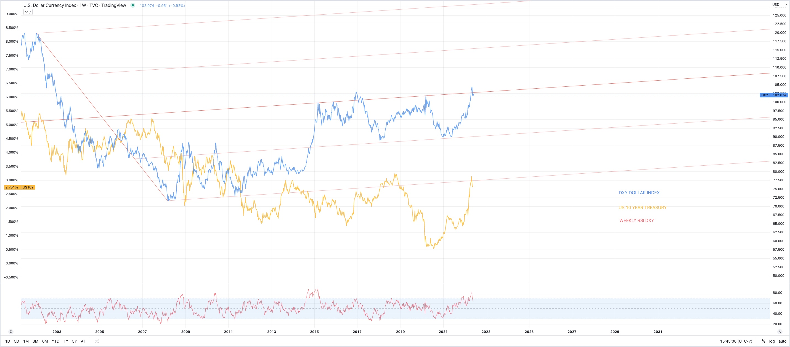
 

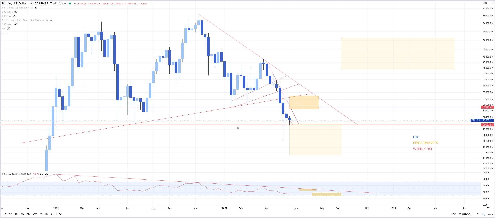
 
_________________________________________________________  
**5/24/2022**
   
- Bear market rally in QQQ less obvious  
- Was Friday rally enough to calm these extreme oversold conditions?   
- Larger uncertainty now  
- Still bullish on long term price trend and eventual FED pivot, possibly before NOV midterms, but short term pain seems imminent 

 

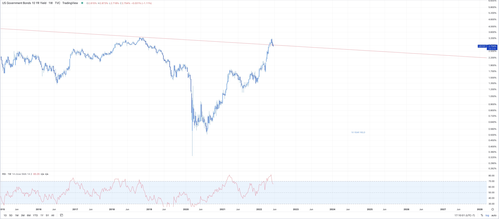
 
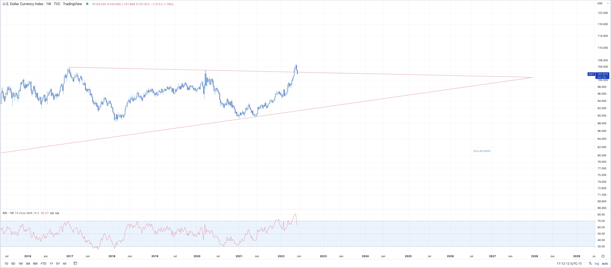
 

 
_________________________________________________________  
**5/23/2022**
   
- Possible bounce here, then we'll see. Markets on edge, everything oversold but still waiting for buyers. 

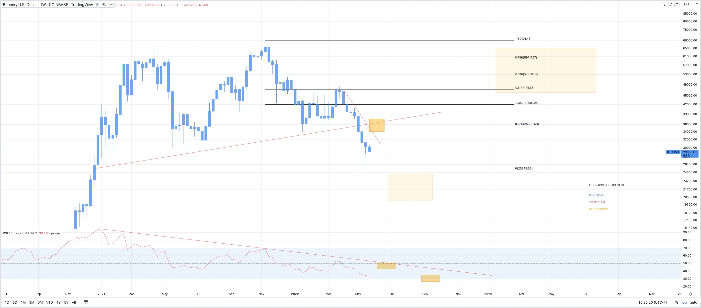

 
 

