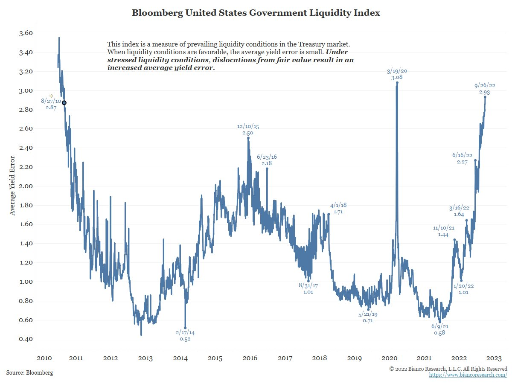

<br>
<br>

<h2>**Ongoing Technical and Political Analysis of Financial Markets**</h2> 
<h6>
<br>
***This is definitely financial advice - More on Substack & Twitter***
</h6>

*[Tylerisyoung.Substack.com](www.tylerisyoung.substack.com)*   
*[Twitter.com/TylerisYoung](www.twitter.com/Tylerisyoung)*  
 _________________________

<center>
<br>
<h4>
**The Fundamentals**
</h4>
Read: [Modern Monetary Theory - Slow at first, then all at once.](./mmt.html)  
</center>
<br>  
<h4>
**The Macroeconomic Backdrop**  
</h4>
The macroeconomic problem displayed in a single chart:


<h4>
<br>
<br>  
Ongoing Technical Analysis
</h4>
<br>


<br>


<br> *1/21/2024* <br>    

***The New Western World is at a Crossroads: Freedom or Force***

<br>

*In reference to the Special address by Javier Milei, President of Argentina | Davos 2024 | World Economic Forum*

Not everything that happens at the WEF is bad.

[LINK to Speech at the WEF](https://www.weforum.org/events/world-economic-forum-annual-meeting-2024/sessions/special-address-by-javier-milei-president-of-argentina/)

Argentina is a country that has experienced great financial turmoil over the last several decades. Going through rounds of prosperity, disparity, debt, default, inflation, and is now one of the most recent examples of hyperinflation and a debt spiral similar to that which the US is staring down the barrel of itself. 

The newly elected president Javier Milei recently gave a speech to the World Economic Forum at Davos. 


His key points:

- This was intentionally his first foreign trip and speech after the election.

- He as the most recent democratically elected leader of Argentina claims that  a new spirit has been introduced to Argentina in which the people are calling for  free enterprise and rule of law.

- He gives a warning to a danger the Western World is knowingly or unknowingly facing as its leaders are increasingly coopted by a vision that leads to socialism.

- Argentina's former prosperity under freedom and its return impoverishment under collectivism.

- He notes Capitalism's key role in actual equitable growth, contrasting with stagnation before the industrial revolution. 

- Capitalism's impact on poverty reduction is at this point very clear, free market capitalism credited as the instrument to end hunger, poverty, and extreme poverty. 

- Per capita GDP multiplied by over 15 times since the Industrial Revolution.

- He give a clear and concise critique of the leftwing argument against capitalism on moral grounds, advocating for social justice.

- He rejects social justice as an end that is intrinsically unfair and violent, financed coercively through mandatory taxes misused by bureaucracy and committee.

- There is a clear emphasis on the market as a discovery process, finding optimization and positive impact through successful businesses which has been prooven time and again. 

- He gives an introduction to libertarianism, defined as unrestricted respect for others' life, liberty, property and pursuit of happiness - As intended in the constitution of the United States who has lost its way. 

- He contends that Capitalists ought to be portrayed as social benefactors and heroes, contributing to a measurable increase in general and entirely voluntary well-being.

- He gives a dire warning that the West is in danger of too drastically undermining its former libertarian values by formerly respected political and economic institutions.

- He also gives a critique of modern monetary theory, accusing disingenuous economists of inadvertently serving state intervention and socialism.

- He concludes with an identification of new and evasive social battles introduced by knowing or unknowing socialists, such as gender and racial conflicts. 

- Finally, he gives a call to action for Western countries to return to the path of prosperity through economic freedom, limited government, and respect for private property and notes that from this day forward, Argentina will remain a staunch and unconditional Ally that will stand for a "A staunch and long living freedom damnit!"


This speech was met with applause from the crowd and likely surprised many including Klaus Schwab who introduced the new and provocative president of argentina: Javier Milei. 


In a recent interview with a former mainstream news host, Evolutionary Biologist Bret Weinstein echoes the Argentinian President's speech saying, "If people somehow put aside the obvious danger in their ability to earn and maybe to their lives in saying what needs to be said, then we greatly outnumber those we are pitted against. They are ferociously powerful, but I would also point out this interesting error; So I call the force we are up against: Goliath, so that I can remember what the battle is. Goliath made a terrible mistake and it made it most egregiously during covid, which is it took all of the competent people took all of the courageous people, and it shoved them out of the institutions where they were hanging on, and created in so doing, The Dream Team. It created every player you could possibly want on your team to fight some historic battle against a terrible evil. All of those people are now at least somewhat awake, and they've now been picked on by the same enemy, and yeah alright, we're out gunned, it has a tremendous amount of power, but we've got all of the people who know how to think. So I hate to say it, or maybe I like to say it, I don"t think it's a slam dunk, but I like out odds. 


<br>
<br>


________________________________________________________________   

<br>
<br> *11/10/2023* <br>    

***How And Why The US Cannot Afford To Fight Two Proxy Wars***

<br>

*A Monetary Issue*

Those supporting war for any reason often discount the deaths of many more across the world for strictly monetary reasons. Governments do not have unlimited money, and we are now seeing the effects of this through rampant consumer price inflation and unpayable debt. 

The US cannot afford to fight two proxy wars because our debt/GDP ratio in 2020 was 130%, and is currently 120%. This is well beyond the established 'tipping point' for a sovereign debt crisis. 

Debt has interest which requires paying even if the principle does not decline, and this becomes an issue at the point when the debt is so high that interest payments have a negative effect on GDP growth. This can be measured. 

The World Bank published a paper in 2010 stating that each additional percentage point added to the debt has an equal and opposite reaction to a nations GDP. For each point added to debt, GDP declines by 0.017 percent. This applies to nations who have a Debt/GDP ratio higher than 77%. ([Caner, Mehmet & Grennes, 2010](https://documents1.worldbank.org/curated/en/509771468337915456/pdf/WPS5391.pdf)) 


```{r, eval=TRUE}
#Debt to GDP Ratio 130% subtracted from 77% tipping point, to get the total percent negatively affecting GDP times the 0.17 multiplier from the world bank.  
(130-77)*.017
```

The US topping out at 130% meant that interest payments on this debt caused USGDP to decrease cumulatively by .9%. 

On average, the US economy and GDP increases by anywhere from 2-3% year over year, so that means that the Federal Reserve's decision to keep interest rates low and perform Quantitative Easing in 2020, printing an additional 1/3 of all the currency currently in circulation, and the US Treasury issuing the corresponding bonds meant that these institutions who supposedly have the average American's best interest in mind both caused [record inflation ](https://www.shadowstats.com/alternate_data/inflation-charts) as well as nearly a 1% decline in the economy simply by increasing the debt ceiling and adding to the debt. 

The World Bank states that "If debt explosions move debt ratios above the threshold and keep them there...economic growth is likely to suffer... The most extreme case is Nicaragua, where the average annual real growth rate could have been 4.7 percent higher had debt been at the 64 percent debt threshold for developing countries. High indebtedness was responsible for an annual loss of 4.7 percentage points of real GDP growth, equivalent to a 264 percentage point loss over the 28 years of the study. This example illustrates the high costs of persistent violations of debt threshold levels."


The Nicaraguan government has been facing a debt spiral since the  "Lost Decade" of the 1980's when Latin American countries were unable to service their foreign debt.  

The World Bank and International Monetary Fund bailed them out in the early 2000's, however there is no one who would be able to bail out the *$*33 Trillion of debt and *$*181 Trillion of unfunded liabilities owned by US Government, and furthermore, this could collapse the global economy leading to millions more entering poverty and food insecurity. This is the issue.  

Each time any nation's debt/GDP exceeds 120% without fail, throughout all of history, this nation will either default on its debts, or experience hyper inflation. Any further defecit spending will only accelerate the debt driven inflationary or deflationary cycle, our government bureaucracy and foreign aid budgets will eventually need to either be cut back in an extreme way, or we will continue to experience growing inflation and/or global monerary collapse. Theoretically, we can pick our poison, though both will cost lives and therefore we should prioritize our path to minimize deaths and despair.  


*The Debt Spiral*


Debt matters; We can only print money so long as the rest of the world believes our dollars are worth something, and the US dollar has lost 95% of its value in the last 100 years, and Modern Monetary Theory does not work, as previously discussed [here](./mmt.html). 


In short:  
- US GDP is $27.6 Trillion  
- US National Debt is $32.3 Trillion  
- US Unfunded Liabilities  are $181 Trillion   

The unfunded liabilities like social security, pensions, medicare and medicaid are significant for two reasons; First because they are completely unfunded and the government has no cash reserves or program in place to pay them over time, these payments must come out of each years current budget at an increasing percentage of GDP. Second that the majority of them have a component of Cost of Living Adjustments (COLA) which largely tracks Consumer Price Inflation (CPI) so even when the official massaged numbers coming out, this means that increasing inflation will always increase our liabilities as well, contributing further towards the unpayable debt spiral. 

Total liabilities are therefore ~$200+ Trillion, and rising simultaneously with inflation. 

Ideally a growing nation takes out some loans to make improvements, and you can then use the resulting growing economy to service the debt, these principle amounts as well as interest payments would be funded via citizen tax revenue, though taxes can only be raised so high... Even if there was an unjust means of the federal government confiscating 100% of GDP through taxation (an effective 100% tax rate), in effect, it would still take more than 10 years to pay the $200 Trillion off without accounting for the COLA. Higher taxes cannot work to solve this problem, in fact they make it worse allowing the government to simply waste more money. 

Additionally, taxing billionaires will not help at all either, and in principle, billionaires are by necessity more efficient in spending their money as they must spend it through their own business, or others businesses in addition to any frivolous spending back into the economy employing real people, rather than wasting that money on inflated government expenditures and contracts like the famous $1280 mugs purchased for the US Airforce - After a recent audit, it was discovered that the Airforce is spending $1,280 per coffee cup. Admittedly these cups were a self heating type of coffee cup, similar to the ones found on amazon today for $20. This type of monetary waste of the collective US Taxpayer dollars, both lowering GDP and causing inflation is only possible by the federal government. 

The issue with this much defecit spending quickly becomes not "How will we pay it back?" but simply "Can we even afford to pay the interest on the debt that we owe to other nations who own our US treasuries and have claim to those payments?"

China and Saudi Arabia were formerly the largest buyers of US treasury bonds, and both have stopped their buying programs because they have presumably lost confidence in the US government's ability to pay them in a currency that has not been devalued through inflation. Both nations are buying far more gold and other commodities now instead leading to a debt spiral in the US and a renewed Multipolarity in the world.  

*Debt Spiral Endgame*

Inflation is a monetary phenomenon - The more money we print into the economy, the higher inflation rises. The only way to "fight inflation" is for the federal reserve to raise interest rates, and cause unemployment. These two things effectively tighten the purse strings of average consumers and slow down spending and monetary velocity over time, in short, lowering inflation. 

  


<iframe src="//www.classtools.net/Venn/202310-gRm6WP" style="position:relative;top:0;left:0;width:1400px;height:700px;overflow:none;border:none"></iframe>

<br>


*War Spending vs Poverty Alleviation*


For better or worse, there are many reasons for war, there are plenty of alliances, treaties, resources and unjust killings, and at times we may want to support our side or the other, though we need to collectively understand what's at stake and decide what we would like to prioritize. Wars are not without cost, and fixing the money both fixes the world, and ultimately saves more lives. 


The US Congress has already [spent](https://www.nytimes.com/2023/10/06/us/politics/ukraine-aid-congress.html) $113 Billion on aid to Ukraine. For the 330 Million Americans, this is nearly $350 per American. This is also 1.8% of the US Governments $6.3 Trillion dollar budget, and nearly 0.5% of the 25 Trillion total GDP - a rather large expenditure. 

Adding another war in the middle east to the tab, likely more doubling this expenditure to nearly 4% of the US budget is unattainable.  We cannot even currently afford to fund the government, or service our debts as it is. By necessity we will need to issue more treasuries, and print more money, causing exponentially increasing inflation (and further decreases in GDP according to the world bank) in order to fund these wars, adding to the debt spiral. 

The US has spent by far the most money in Ukraine compared to those nations who are much closer regionally, geopolitically and who possibly have more incentive to contend with Russian influence than we do.  

Though the reasons for war vary, what we want to answer is how many lives can we save, and which investments save the most lives?


By any metric war is expensive, and alleviating poverty is cheap. The best investments on the United Nations Sustainable Development Goals return thousands of dollars pre dollar invested when valued in the World Bank's standardized Disability Adjusted Life Years (DALY's). Many will say that you cannot put a value on human life, and they are correct, but avoiding assigning value does not save any lives either, and we tend to value the things we can measure. 

World Bank DALY calculation: Disability Adjusted Life Year (DALY) = Years of Life Lost (YLL) + Years of Life Lose due to Disability (YLD). 

That way, we can directly compare investment projects like considering whether to fund an HIV education testing and treatment center, or to fund a Teberculosis prevention program through free drug distribution. By comparing the estimated reach and numbers of lives saved from each, we can review which is the better investment. There are varying debates surrounding cost benefit analysis, and many political reasons to over complicate things, but it really is this easy. 


As assessed by the Copenhagen Concensus Center when considering the United Nations Sustainable Development Goals; For every $1 invested in  Tuberculosis treatments for those who cannot afford, it will return $43 and can result in millions of lives saved. For every $1 invested in universal access to contraception, it will return $120, and save millions more, these are near the top of the list of best possible investments for humanity, and these will result in a positive effect on GDP, but what are the best ones? 

The best investments dollar for dollar are implementing the proposed global free trade agreements, like the Full Doha Program, which will result in $2,011 dollars of return on investment as measured in DALY's for every $1 spent. Wasting money on taxes and tariffs famously hurts all countries involved and are merely political theater. Statistically, these are the best way to save human lives (Copenhagen Consensus Center, 2016).

War, likely for any reason will never make this list, though one can think of times when it might have. There are of course many things that could be said about the necessity of fighting the world wars, and there is an argument to be made there, however there is often no metric of measurement. What we do have, is the metrics and measurements of Humanitarian spending in comparison to the US fiscal budget, defecit, and inevitable outcomes affected by interest rates, treasury yields, and domestic and international GDP. These things are worth considering before funding any new wars, because the US dollar as the global currency is quickly losing its value to inflation, while simultaneously loosing its grip on global hegemony. As these happen, and a Multipolar world arises swinging the balance of power towards more fiscally responsible nations, or those with commodities & resources, namely China and Russia. In this scenario, the US could still benefit if done wisely, though if we continue down the current path, global GDP and well being will be affected negatively, global resources will be constrained, and global poverty will rise. 

Economist Gregory Mankiw is credited with calculating the famous quote from the movie "The Big Short" when Brad Pitt's character says "40,000 people die for every 1% that unemployment goes up." In reference to America alone, the number is generally true, and significantly larger for third world countries. Millions loose their jobs, income streams, housing, food sources and more when global GDP drops or slows at all. Economic growth should be admired for its ability to bring millions or billions out of poverty and put food on the table, rather than chastised for its various externalities that pail in comparison when measured in life years or lives saved. 


*Total Costs of War* 

The total number of people killed in both Ukraine & Russia is nearly 500,000 people. These lives were taken largely from fighting aged men, and this is particularly destructive to societies let alone when measured in DALYS resulting in millions of life years lost, and a bill for taking them. 

While we cannot measure the potential lives saved, we can compare this with the "No War" scenario.   

So for a total of $113bn in Ukraine aid, and sacrificing nearly 1% of US GDP growth to inflation during the same year, what could this $113bn have bought us, or done for those in need of humanitarian aid throughout the world instead?  

This question is remarkably similar to the Copenhagen Concensus Center's final recommendation in their published work featuring 5 of the world's top economists, four of whom were nobel laureates, titled: How to spend *$*75 Billion To Make the World a Better Place* The aim of this final chapter was to priority rank the best investments to advance global welfare particularly in developing nations.  

In the books conclusion, writing alongside Bjorn Lomborg, director of the Copenhagen Concensus Center, an institution which performs this exact task for governments like Haiti, India, Malawi, Ghana, Bangladesh, and a group of African Nations, The Author, Bjorn Lomborg alongside three of the world's top economists, including Finn Kydland from The University of California Santa Barbara who won a Nobel prize in economics, Tom Schelling, a professor at the University of Maryland who also won a Nobel prize in economics, Nancy Stokey, former Harvard professor, and current professor in mathematical economics at the University of Chicago, together they implore the concerned parties, governments, international bodies, NGO's and all stakeholders to take steps to take towards prioritization over the next several years as we get closer to the United Nations target year of achieving the Sustainable Development Goals to 2030.
  
The following priority goals are the product of the expert panel of more than 80 different authors and contributors brought together by the CCC to tackle such a daunting task for the world. Their analysis suggests that an over weighed funding of these interventions would provide the best value for money in terms of fulfilling the aims of the Sustainable Development Goals. 

  
Rank Ordered List of Priority Goals
1. Bundled interventions to reduce undernutrition in preschoolers (to fight hunger and improve education)
2. Expanding the subsidy for malaria combination treatment
3. Expanded childhood immunization coverage
4. Deworming of schoolchildren, to improve educational and health outcomes
5 Expanding tuberculosis treatment
6. R&D to increase yield enhancements, to de- crease hunger, fight biodiversity destruction, and lessen the effects of climate change
7. Investing in effective early warning systems to protect populations against natural disaster
8. Strengthening surgical capacity
9. Hepatitis B immunization
10. Using low-cost drugs in the case of acute heart attacks in poorer nations (these are already available in developed countries) 11. Salt reduction campaign to reduce chronic disease.
12. Geoengineering R&D into the feasibility of solar radiation management 
13. Conditional Cash Transfers for School Attendance 
14. Accelerated HIV Vaccine R&D
15. Extended field trial of information campaigns on the benefits of schooling 
16. Borehole and public hand-pump intervention
 
Any number of these goals having been solved would easily provide more return to human wellfare than would the war in Ukraine, or another war in the middle east. Let's keep this in mind as we move  closer to a nation that sees supporting war as the virtuous thing to do. 


<br>
<br>


________________________________________________________________   
<br> *10/9/2023* <br>    

***Turning Point in the market?***

Admittedly an unexpected rally over this past six months, though Janet Yellen tells us that the market won't be allowed to collapse again in our lifetimes, should we believe her, or is it a suckers game? 

Most economists use the 10-2 year yield spread and curve to predict upcoming recessions, however the fed today is using the 10 year - 3 month spread. This is likely because it will be the last to flash the warning sign of recession and allow Biden to say things like "We have a very strong economy" as GDP continues to slow.  

Currently the Fed's mandate is simply to kick the can down the road, and delay the inevitable - either recessionary deflation, or continued devaluation through inflation.  

Markets have seemingly temporarily recovered from SVB collapse, though banks holding long term treasuries are not out of the woods yet. This recent correction might mean a shift in narrative. The previous year was "rising inflation, the Federal Reserve raising rates to combat it", and the looming possibility of a recession to control inflation. However, it appears that the market is finally beginning to pay attention to these concerns of bond yields and stagflation possibilities, at least in certain sectors. Watching major Moving averages, S&P has fallen below the 20 Week and for now seen a bounce off of the 200 day, though a rejection from the 20 week is likely in store signaling further downside. 

Surge in bond rates are due to foreign nations dumping U.S. bonds and the massive issuance of bonds flooding the market. Resolving this issue would require either a systemic risk event, such as a major bank collapse, or a massive stock market sell-off to redirect funds into the safety of bonds.The recent hot jobs report )which seem to be continually revised lower months after they're published) drove bond yields higher. These fundamental issues will persist without the occurrence of a systemic risk event or a significant market crash. Significant good news (or war) would need to occur to push us back above the 20 week, otherwise lower for longer is expected. Timing remains uncertain. 


<br>
<br>
________________________________________________________________   


<br> *9/28/2022* <br>    

***Global economic outlook is the worst it has been since 1929***

Given the USD global reserve currency status, all eyes are on the fed who's DXY dollar index is sucking liquidity from every other global currency, there are only two ways out, one goes up, and the other goes down. Until we see the path resolved, our economy will remain in a downward trending stagflation. 

Is the fed done hiking? The math on total debt and interest along with the credit impulse markets say yes. Powell still needs unemployment and housing signals to come down *significantly* before attempting any sort of pivot, or at least pause in rate hikes. Analysts are saying that they'll pile in at SPX 3500 if we get there, but it's rare to see perfect entries in times of great fear. Look out below & stack cash for some great PE entries. Otherwise a verbal pivot will signal that we're going up from here, Nasdaq and Bitcoin will be the first to rebound. Either way, we could see an october surprise i.e. bear market rally leading into midterm elections and the endgame that comes after, whatever that may be. 

<br>

<br>

<br>

Charts thanks to Biancoresearch. 

<br>

<br><br>

<br><br>

<br><br>

<br><br>

<br>

<br>
<br>

<br>


________________________________________________________________   
<br> *7/1/2022* <br>    

***Atlanta Fed Confirms that we are about to enter a Recession***

Most economists use the 10-2 year yield spread and curve to predict upcoming recessions, however the fed today is using the 10 year - 3 month spread. This is likely because it will be the last to flash the warning sign of recession and allow Biden to say things like "We have a very strong economy" as GDP continues to slow.  

The NY Fed tells us that, "This model uses the slope of the yield curve, or “term spread,” to calculate the probability of a recession in the United States twelve months ahead. Here, the term spread is defined as the difference between 10-year and 3-month Treasury rates." 

The only tool the Fed has to combat high inflation is raising interest rates, typically ABOVE the rate of inflation, as should have been done a year ago when the economy was stronger in order to avoid the stagflation we're seeing today. Higher interest rates mean a stronger dollar, and higher interest rates as term duration increases on bonds - a normal and healthy yield curve which rewards people for saving their money in cash longer. 

The real rate of return when accounting for inflation on any of these bonds is currently several points in the negative due to price inflation, therefore the Fed needs to continue raising rates until inflation calms down from demand destruction and yields on risk free treasuries trends back towards sensible returns. Until this happens, we will continue to see other currencies fall in value compared to the US Dollar denominated hegemony - "The Dollar Milkshake".  

The Fed is far behind the curve, and the government's interest payments on $30 Trillion dollars of debt and much more in foreign obligations, will ensure that the Fed remains behind the curve, actually favoring inflation that goes unnoticed in order to inflate away the debt, the only way out is through a hard landing, a deep recession, or returning to Quantitative Easing in order to simply kick the can down the road. This last option of QE is unfortunately not on the table at the moment because the money printing is what got us here in the first place.  

<br>

<br>
<br>

<br>
<br>
  
<br>
________________________________________________________________  

<br> *6/30/2022* <br>    

***Energy Price Inflation Soars in Germany and around the World***

Americans [owe](https://www.freedomsphoenix.com/News/326998-2022-06-12-americans-owe-22-billion-in-late-utility-bills-as-energy.htm) $22 billion in already late utility bills as energy costs in the US rise 34% YOY. 

Europe, more directly affected by the Russia Ukraine War has it much worse, Germany specifically is has experienced a 6X increase in the cost of baseload power since 2020. They managed this by increasing their reliance on Russian oil and gas along with shortsighted energy policies and adherence to the ESG narrative at the expense of their own fragility.

In 2020 Germany's percentage usage of renewables [was](https://foreignpolicy.com/2021/02/10/is-germany-making-too-much-renewable-energy/) 46%, largely coming from wind, solar, and hydro electric. The remainder of their energy was from coal, gas, oil, and nuclear. 

Despite still struggling to meet their stringent carbon related policies, and despite the now soaring energy costs, Germany has recently upheld the pledge to continue with the shut down their remaining nuclear reactors by the end of 2022, a decision that was decided a decade prior, in the wake of the Fukishima disaster in Japan. 

The German government has also pledged to phase out coal - but not until 2038. This series of moves has ensured that their baseload energy consumption is actually getting more carbon intensive, not less. These choices, alongside western imposed Russian sanctions which have increased natural gas prices globally leave the German's supply of baseload power insufficient for meeting modern expectations or demand. 

Germany's Vice Chancellor [warned](https://wattsupwiththat.com/2022/06/26/germany-green-energy-crisis-warns-of-lehman-like-contagion/) of a "Lehman like" economic collapse due to their current energy policy, and we are seeing it play out in fast and slow motion. 

Germany is extremely close to [rationing](https://www.businessinsider.co.za/germany-says-energy-crisis-may-trigger-lehman-like-contagion-2022-6) stores of natural gas, and suggesting it will start with hot water, a luxury some of those living in energy poverty have already forsaken despite their middle class incomes. Today, likely more than 23% of German people are suffering some form of ["Energy Poverty"](http://www.enpover.eu/en/energy-poverty) where a significant enough portion of their income goes towards energy, causing them to cut back on other necessities. 

With prices so high, and natural gas stockpiles at record low levels, the German Government has [announced](https://www.telegraph.co.uk/business/2022/04/19/germany-wont-stop-buying-russian-gas-should-face-sanctions/) that they will re-establish the use of previously decommissioned coal-fired power plants. Coal is far easier to bring back online than nuclear, so any future hiccups will likely see expansion of this more carbon intense base energy. 

German wholesale oil is up ~70% YOY, and even an end to the war wouldn't mean that western nations return to direct purchases from Russia, therefore these price increases are likely to remain.  

Furthermore,UK newspaper The Telegraph [suggests](https://www.telegraph.co.uk/business/2022/04/19/germany-wont-stop-buying-russian-gas-should-face-sanctions/) that if Germans won't stop buying Russian gas, they too should face sanctions. 

Lastly, Reuters reports that; Italy, Portugal, Slovakia, Bulgaria, and Romania have joined Germany's finance minister in opposing the 2035 mandate to ban the sale of new petrol and diesel cars. This move, is postponed would all but ensure that the EU does not meet it's target of reducing greenhouse gas emissions by 55% compared to 1990 levels before 2030. 

Many across the globe will be priced out of the green energy revolution.

<br>

<br>

<br>

<br>

<br>

<br>


________________________________________________________________  


<br> *6/18/2022* <br>    

***Update to the Japan Crisis***

Japan's Ponzi Scheme is running out of time. Japan has 12.8 Trillion on the BOJ's balance sheet and their current debt/GDP is nearly 200%.

They have apparently reached their limit to perform Yield Curve Control in both the bond and stock market with newly printed treasuries which cannot find the buyers necessary to prop up the Yen's purchasing power against USD. A panic spike in selling lead to Bond yields jumping up above the governments mandated ability to continue QE driven purchases without becoming insolvent with a debt/gdp ratio too high. Market participants selling bonds lead to higher interest payments for a government that cannot afford it. 
<br>

<br>

<br>

<br>


________________________________________________________________  

<br> *6/9/2022* <br>    

***Japanese Yen spirals against US dollar, the consequences of endless
QE*** 
<br>  

Japan has been the canary in the coal mine for the last decade, forecasting where us
in the US and western nations who are participating in
Quantitative Easing might end up. Japan has apparently reached its limits in how far they can go before trust in assets held on the
central bank's balance sheet is lost. 

Japan's debt/GDP ratio is nearly 200%, the highest of any nation in the
world. 


<br>

<iframe
src="https://data.worldbank.org/share/widget?end=2016&indicators=GC.DOD.TOTL.GD.ZS&locations=JP&start=1990&view=chart"
width='450' height='300' frameBorder='0' scrolling="no" ></iframe>


<br>

With a debt/GDP ratio this high, the government technically owes money to
itself through the central bank's deficit printing. The problem with
having so much debt is the interest rates. Once interest rates begin to
rise, so do interest payments needed to remain solvent. Without a robust
and increasing GDP for taxpayer generated income for the government to
fund the debt, the only option becomes - devalue the debt denominated in
fiat currency which has no limitations to creation - inflate it away. 

When the M2 money stock goes up, each dollar held by citizens and the
government goes down when measured against other commodities, or other
currencies which will remain stronger if they are not also printing more
money, though the debt, taken out years, even decades ago remains the
same. The debt positions can thus continually be serviced with newly
created money that has a lesser value, and the longer a nation waits to
pay off the debt, the cheaper it becomes. 

A true sovereign debt crisis occurred in Greece when their debt was
denominated in Euros, instead of their own former Greek currency, the
drachma. Since the Greek centrral bank could not control the newly issued
wupply of Euros, regulated by the ECB, we saw them enter a period of
default where their debts needed to be written down in lieu of a western
humanitarian crisis. 

Central Banks like Japan, or the United States who can self fund have the
advantage especially when interest rates are low, but when entering
a period of tightening, and slower economic growth, or even stagflation as
we are now, the only tool to create demand destruction and thus lower
inflation would traditionally be - raising interest rates to the rate of
inflation. 

The problem with an inflationary environment is that to solve the problem
of inflation, it is all but mandatory to cease the creation of more
dollars. Volker of the FED solved this problem in the 70's by raising
rates to match the rate of inflation which was above 10% at the time. The
only problem with doing that now is that we have too much debt. 

If the US or Japan raised rates this high, to 8-16% to match the current
inflation rate, the governments would not be able to finance the interest
payments on the debt, and would thus default. 

But they can't print more money either, so it's necessary to rely on
jawboning all markets into demand destruction without raising rates, and
so far it's working. 

If this is not effective enough, the US will need to follow Japan's lead,
by implementing Yield Curve Control (YCC).

The aim of YCC is to craft a particular shape to the yield rates on bonds
issued by the government. When any entity including individuals are
holding treasuries issued by the government, they should be expected to at
least retain their value, furthermore, the longer duration of the bond,
the higher the expected yield, but with inflation, this becomes a problem. 

Therefore, it has become necessary for the Bank of Japan to participate
in yield curve control, printing money to directly purchase bonds and prop
up the market. In addition to this, the BOJ is also purchasing stocks on
the open market as well, something previously unheard of. 

This has a two pronged effect; firstly is staves off insolvency for Japan,
for now, they are able to service their debt's on the balance sheet with
new dollars, but secondly, it has eroded trust, and yield from all of
their markets is gone leading investors to seek yield elsewhere. 

If this persists, a debt driven deflationary spiral that leads to
insolvency could follow, and it could be both abrupt, and catastrophic as
it was for Greece who needed a bailout from the ECB. 

Japan's 10 year yield has been below the US 10 year yield for a decade now
leaving less access to liquidity for paying off debts, but also Japan's
stock market has not reached a new all time high since 1990, in fact, it's
still down 26% from that date. Money is fleeing the country and GDP will
remain low, threatening insolvency indefinitely. 

The Japanese Yen is loosing value compared to the dollar, but the Dollar
is loosing value compared to commodities and will inevitably face the same
fate if we continue the current regime. 

<br> 

 <br> 

<br> 

 

<br>


  
<br>
<br> 
<br> 

________________________________________________________________  
<br> 

*6/7/2022* 
<br> 
***Federal Reserve Releases Hilarious Hit Piece on Bitcoin***

The FED has [released](https://fredblog.stlouisfed.org/2022/06/buying-eggs-with-bitcoins/) a chart comparing Bitcoin's purchasing power against the price of supermarket eggs. They suggest that this is the reason Bitcoin is not a good store of value. 

This is the chart presented. 
<br>

<br>
It only takes a moment to realize that the data is completely cherry picked from the last two years, and if you choose to drag the view options back to the inception of Bitcoin in 2009, their very same chart simply tells the opposite story. 

If you were to have held Bitcoin instead of US dollars for nearly any period of Bitcoin's existence, your purchasing power measured in eggs would have only increased, and significantly. 
<br>

<br>

The US dollar has lost 95% of it's purchasing power against commodities, goods, and services over the last several decades. It is interesting however that the FED finds the need to attempt to make these silly comparisons. 


<br>
<br>
<br>
________________________________________________________________   

<br>
*6/6/2022*
<br>    

**Natural Gas prices spike, World Food Crisis Looms**  

<br>

Many countries are being threatened with immediate food shortages, not next year or next month, right now. The current situation involving Russia-Ukraine is greatly exacerbating the problem. Known as the "bread basket of the world" which also includes Belarus. These countries make up more than 1/4 of all global grain trade, and Russia have announced that they will restrict grain trade within "[Friendly countries](https://www.nbcnews.com/news/world/live-blog/russia-ukraine-war-live-updates-evacuations-launch-mariupol-talks-resume-n1293815/ncrd1293834)." 
<br>

*Note: This is 2017 data, pre pandemic, pre money printing from the FED, and before war in Ukraine, unfortunately it only get's worse from here. 
<br>
Furthermore, fertilizer is made through a process invented by Fritz Haber and Carl Bosch who is often credited alongside Norman Borlaug, inventor of genetic modification, for being the catalysts of the "[Green Revolution](https://en.wikipedia.org/wiki/Green_Revolution)" in the late 50's to which they  are credited with saving hundreds of millions of lives. Today, 50% of peoples food supply relies on both genetic modification of staple food crops which are pest and drought resistant, but also their growth is dependent on the Haber-Bosch process which uses nitrogen fixation to produce ammonia. Previously, many farmers would need to go through the season long process of planting nitrogen fixing plants to revive this necessary chemical. Today, it can be purchased in 1000LB+ quantities and applied at will. This is how we currently feed the world. Cheap fertilizers that contain ammonia are the reason the world population was able to move from 3 Billion people to nearly 8 Billion today. 

<br>
Haber Bosch Process:
{\displaystyle {\ce {N2 + 3 H2 -> 2 NH3}}\quad \Delta H^{\circ }=-91.8~{\text{kJ/mol}}}
<br>
Historically fertilizers have been cheap, relying firstly on the recent boom in availability from the recent discovery of previously untappable oil reserves, this, alongside the deflationary pressures of technology evolution, lead to continually declining prices of methane (CH4) and ultimately the manufacturing process of fertilizers. 

Secondly, fertilizers are made from nitrogen as we know, but also potassium and phosphorous, and Russia and Ukraine previously made up 28% of all global fertilizer supply. Given equal and consistent demand as farms tend to have, supply constraints will mean higher prices. 
<br>

<br>
Recently, after Russia's foreign treasury reserve assets held internationally were seized in the first ever occurrence of this sort which pokes a hole in the supposedly unbiased petrodollar hegemony, Russia retaliated by forcing purchasers of Oil and Gas to procure Russian Rubles to make those purchases through Russian banks who were cut off from the SWIFT network. This new demand for Rubles has caused it to outperform the US dollar, gaining purchasing power, and leading to higher prices on Natural Gas, of which Europe gets 40% of its gas from Russia. 

European citizens have been experiencing a condition known as being "energy poor" where the average middle class family has all the modern amenities that we have in the US for example, but cannot afford to heat their homes, or use a hot water heater due to the skyrocketing prices of natural gas, both over the last decade due to ratcheting carbon tax tightening as well as the European Central Bank's inflationary money printing, both causing prices to rise for end consumers. 

On top of that, Europe has sanctioned  [fertilizers](https://www.politico.eu/article/eu-sanctions-higher-food-prices-potash/) and from Russia and Belarus, which will also lead to inflationary prices for end consumers. While France is the European country that has the closest to a carbonized energy grid, made up of mostly nuclear, Germany has recently decommissioned the last of the nuclear plants and replaced their energy with mostly coal and natural gas from Russia. The German society is now highly dependent on Russian gas, and a global divestment from fossil fuels in general means that there is not much more supply coming online for the next several years. 
<br>

<br>
Together, this makes up the perfect storm  for higher input costs from lack of fertilizers, and direct blockade of supplies from Russia, and now other countries which refuse to export certain items like China who has been accumulating food stores for years, now [hoarding](https://asia.nikkei.com/Spotlight/Datawatch/China-hoards-over-half-the-world-s-grain-pushing-up-global-prices) half of the world's grain. Malaysia is [banning](https://www.scmp.com/week-asia/economics/article/3180039/malaysias-poultry-export-ban-when-will-it-end-how-have-people) the export of Chicken. Indonesia recently took to [banning](https://www.moneycontrol.com/news/opinion/indonesian-palm-oil-export-ban-set-to-raise-indian-inflation-8405201.html) the export of Palm oil due to a poor harvest, which drives the price of palm oil up. This price increase leads to more deforestation in the amazon and southern Asia where palm oil is the majority of export crops, but it also incentives wheat farmers in the US - another large wheat producer- to flip and plant more soybeans for soybean oil instead of wheat, again driving wheat prices higher. India [bans](https://news.yahoo.com/us-urges-india-reverse-ban-083311676.html) the export of wheat. This is a problem because wheat is in basically all the processed foods. 

Joe Biden has been making the rounds to world leaders hoping to convince them to increase supply and drive down prices. He offered India $4 billion to export more wheat which they rejected. He asked Saudi Arabia to export more oil which they said they couldn't do due to already tight supply constraints. We have such a significant problem that America's past actions and alliances can be ignored in the search for more oil. We formerly accused Nicolas Maduro of both election fraud, then later drug trafficking in order to attempt to [install](https://theintercept.com/2019/02/02/venezuela-us-trump-sanctions/) the US-friendly Juan Guaido who never fully assumed [power.](https://www.bloomberg.com/news/articles/2021-09-02/why-venezuela-s-two-presidents-are-ready-to-talk-quicktake) Recently, Biden reached out to Maduro to try to procure more Venezuelan oil that should have originally been destined for our largest refinery owned by the Koch brothers in Corpus Christi, Texas. However, The political blowback of a nation supposedly aligned with Russian interests was nearly enough to shut down these talks, but it looks like we don't actually care about politics or what we used to call Russian aliance, because it looks like Venezuelan oil may begin to be imported soon. This is all a result of US involvement in the Russia Ukraine war when we  banned Russian oil imports to America. 

We have no oil, we've released all of our strategic reserves, and we dont have the wells, refineries, or infrastructure to bring supply online to meet demand, therefore price must rise. Chevron's CEO has [said](https://www.msn.com/en-us/money/markets/chevrons-ceo-says-no-more-us-oil-refineries-what-should-energy-investors-do/ar-AAY6k1N?li=BBnbfcL) that he does not see any new oil refineries ever coming back to the US. This is in part due to the horrendous permitting and regulation process which can take time measured in years, and money measured in the millions, only to get approval, even nearly finish construction, costing billions, to then have the project held up in court for another several years and threaten its very completion. This is what happened to the Mountain Valley Pipeline in Appalacia which contains our largest natural gas reserves, and  the Jordan Cove LNG pipeline in Oregon which developers [abandoned.](https://www.oregonlive.com/business/2021/12/jordan-cove-developers-abandon-plans-for-pipeline-coos-bay-lng-terminal.html) These projects are now sunk costs worth billions on investors balance sheets, definitively scaring away any new investors. 

The environmental movement has a  process of blocking new fossil fuel infrastructure that can sometimes be very effective. petitions, protests, court appeals, biodiversity, larger environmental concerns, damage from spills, air, noise, and unethical pollution, these things are all excellent and effective tactics that the environmental movement uses to block new fossil fuel infrastructure. The majority of the public is simultaneously on the side of the environmentalists wanting to make the world a batter place, but also desiring lower costs for gasoline at the fuel pump. The pendulum has swung too far. 

The realities of economics and commodity inflation have already caught up with us and if we continue to invest in new fossil fuel infrastructure, oil prices will increase and remain high due to constrained supply. Of course, we also need to optimize out investments in green tech as well because many of the environmentalists concerns are warranted. Hoowever, renewables largely do not have the tech or the cost effectiveness to outcompete oil in most places, the cost of EV's and the chips that run them are only going up due to all the supply shortages caused by quantitative easing which is necessary to keep the US from a debt driven collapse. 

These intricate complexities only lead to regressive outcomes hurting those who cannot afford green tech, while also demonizing them for their supposed dirty emissions in what is quickly becoming a class divide driven by inflation and market manipulation from the Federal Reserve. We need to tackle climate change, but we don't need to go overboard, and what we're doing right now is not necessary even according to the IPCC and the IEA who don't see any concerning tipping points until we reach a global temperature over 4 degrees celsius, which they project us to remain well under. Optimal policy is difficult, and the current two sidedness and bias towards extremity in order to gain moderate results is not helping. 
<br>

<br>
Reshoring of goods, services and commodities into our borders makes for a self sufficient economy, but globalization and free trade make for cheaper goods and a more diverse and growing global economy which predominantly benefits developing nations, but we cannot have both sides of the extreme. Privatization also matters, Venezuela is rich in oil, but poor in their Bolivar's exchange rate, nationalization does not work when the government is allowed to continually operate at a loss, hyperinflation has arrived for Venezuela, and will continue to increase across the world as energy runs the show and the economy. 

What was previously a perceived environmental win of slowing investment in fossil fuel infrastructure is now causing mass starvation for wage earners across the globe who cannot keep up with food price inflation. Those consumers who will not or cannot pay, will be forced to change their purchasing behavior and some will starve or become malnourished for lack of cheap and healthy food. Famines are created not by God, but by man. 

The Food and Agricultural Organization price index tracking month over month and year over year changes shows every key agricultural product up significantly year over year as well as Cereal prices, which includes wheat, up by 30%. Every food that contains wheat will need to either rise by 30%, or the company selling it will need to choose to take what is for them hopefully* a temporary* loss to keep their customers.

In a United Nations press [Release](https://www.un.org/press/en/2022/sc14894.doc.htm), Antonio Gutierrez said, "“When war is waged, people go hungry...Most important of all, we need to end the war in Ukraine.” The security council quotes Antony J. Blinken, Secretary of State of the United States, "Recalling WFP and FAO estimates that people affected by food insecurity due to conflict would increase to an estimated 161 million in 2022, noted that the Russian Federation’s war in Ukraine could add another 40 million people to that total.  That country’s flagrant disregard of resolution 2417 (2018) is just the latest example of a Government using the hunger of civilians to advance its objectives.  The food supply for millions of Ukrainians and millions more around world “has quite literally been held hostage by the Russian military”, he said, noting 20 million tons of grain sit unused in Ukrainian silos as food prices skyrocket." 

<br>

<br>
Defense spending is both fine and desired, but war is bad for business, let's stop fighting and funding proxy wars that aren't on our soil. 
<br>


<br>  
There's no use hoping inflation will come down, and producers know this, the debt/GDP ratio shows us that it will continue for the rest of the decade unless the US chooses to default or cause a recession which is far worse than 1929 due the the amount of leverage across all markets. Officials will never choose either of these options, they will always choose inflation with short term periods of demand destruction as we're experiencing now. Macroeconomist Luke Gromen calls this "Peak Cheap Oil."

Shadow Stats is a company currently tracking CPI inflation much more accurately than the massaged US government numbers, they do this by using the US government's former calculation methods instead of the new ones which were recently changed several times to fit the narrative. Currently Shadow Stats has inflation above 16%, much closer to prices in the real world. Wheat inflation is now 30% year over year.  

The healthy and reasonable way to fix this is to cause short term demand destruction in financial markets and commodity futures today, while the economy is still relatively strong and raise interest rates to the rate of inflation - the Volker method. This alongside a significant reduction in federal expenditure is necessary for the economy to recover in real terms, instead of waiting for stagflation to continue, for a recession to get worse, and only then attempting to raise rates into an economy already in a depression. If the FED doesn't pivot within the year, this is where we're headed. The FED is out of options, and not only are they behind the curve, they are also late to the party and too slow to act, and because of this people will starve. 


  
<br>
<br>
<br>
________________________________________________________________  
**6/1/2022**
<br>  
***Federal Reserve Begins Quantitative Tightening Today***  
<br>  
  
- The Fed will begin selling UST's and MBS's. There are many reasons for markets to buy US Treasuries, they are universal pristine collateral across the world, but when the Fed begins selling Mortgage Backed Securities, there becomes more supply of them, less demand for their use as collateral, and there is only one buyer - pension funds forced to purchase them by mandate to "reduce risk." MBS interest rates will increase as selling occurs and price goes down, and the housing market will stall over time. The real risk comes when these investments have negative real yields against inflation and pension funds begin to fail unless they can adjust the regulations in order to find better yields. 
  
- We only have one period of QT to base our expectations off in 2018, and we are now tightening into a slowing economy, interestingly enough the S&P actually was flat/went up slightly during the last period of tightening.  
  
- Let's see how far they get before something breaks. Last time that happened was 2019 when it took a liquidity event in the reverse repo market to abruptly end QT and reverse course to QE infinity.Covid provided excellent cover for this, and climate change will provide the next. 
  
- As M2 money supply increases, so does counter party risk on banks balance sheets. If all the banks are holding are promises of payment, trust can erode quickly. These banks are now (apparently) so concerned that their formerly pristine assets - US treasuries and Mortgage backed securities - will fail, potentially overnight, as happened in 2008 that they are placing ever increasing amounts of risk on the balance sheet of the Federal Reserve in the overnight repo market. The government will print more money before they become insolvent.

<br>    

<br>  

<br>  

  
<br>
<br>
<br>
_________________________________________________________  

<br>
*5/31/2022*
<br>    

**Biden's Plan to Combat Inflation**  
<br>
Biden wrote an op-ed for the Wall St Journal where he  [announces](https://www.wsj.com/articles/my-plan-for-fighting-inflation-joe-biden-gas-prices-economy-unemployment-jobs-covid-11653940654) his three step plan to fight inflation. This is just after his [previous plan](https://www.whitehouse.gov/briefing-room/statements-releases/2022/05/10/the-biden-harris-inflation-plan-lowering-costs-and-lowering-the-deficit/) released just days ago. 
  
  - *The New Plan:*  
  - 1) "First, the Federal Reserve has a primary responsibility to control inflation. My predecessor demeaned the Fed, and past presidents have sought to influence its decisions inappropriately during periods of elevated inflation. I won’t do this. I have appointed highly qualified people from both parties to lead that institution. I agree with their assessment that fighting inflation is our top economic challenge right now."
  
<br>
  
  - 2) "Second, we need to take every practical step to make things more affordable for families during this moment of economic uncertainty—and to boost the productive capacity of our economy over time. The price at the pump is elevated in large part because Russian oil, gas and refining capacity are off the market. We can’t let up on our global effort to punish Mr. Putin for what he’s done, and we must mitigate these effects for American consumers. That is why I led the largest release from global oil reserves in history. Congress could help right away by passing clean energy tax credits and investments that I have proposed. A dozen CEOs of America’s largest utility companies told me earlier this year that my plan would reduce the average family’s annual utility bills by $500 and accelerate our transition from energy produced by autocrats. We can also reduce the cost of everyday goods by fixing broken supply chains, improving infrastructure, and cracking down on the exorbitant fees that foreign ocean freight companies charge to move products. My Housing Supply Action Plan will make housing more affordable by building more than a million more units, closing the housing shortfall in the next five years. We can reduce the price of prescription drugs by giving Medicare the power to negotiate with pharmaceutical companies and capping the cost of insulin. And we can lower the cost of child and elder care to help parents get back to work. I’ve done what I can on my own to help working families during this challenging time—and will keep acting to lower costs where I can—but now Congress needs to act too."
  
<br>
  
  - 3) "Third, we need to keep reducing the federal deficit, which will help ease price pressures. Last week the nonpartisan Congressional Budget Office projected that the deficit will fall by $1.7 trillion this year—the largest reduction in history. That will leave the deficit as a share of the economy lower than prepandemic levels and lower than CBO projected for this year before the American Rescue Plan passed. This deficit progress wasn’t preordained. In addition to winding down emergency programs responsibly, about half the reduction is driven by an increase in revenue—as my economic policies powered a rapid recovery."

<br>  

- *In other words:*   
- 1) Blame the FED, Trump, Russia, and define the oil industry as "autocrats" - the high inflation, it's not Biden's fault. 

<br>

- 2) Reiterate that even though we continue to choose to sanction Russian oil and gas, like Europe who's [heading towards](https://www.zerohedge.com/geopolitical/vilches-europes-mad-ban-russian-oil) the largest energy shortfall in decades, forcing the public to spend higher and higher percentages of their income on energy (causing the especially vulnerable and elderly to literally freeze to death if they can't afford heat - a real and increasing problem) This is framed as something we need to do it to 'stick it to Putin.' Next, release all US strategic oil reserves to artificially bring down price - temporarily, (this was [already done](https://www.reuters.com/markets/commodities/us-strategic-petroleum-reserve-drops-lowest-level-since-1987-2022-05-16/), reserves are now at decades long lows) then pass green energy tax credits and spend more money to further investments in the space. Then spend more money to fix supply chains and improve infrastructure. Then begin "cracking down on the exorbitant fees that foreign ocean freight companies charge to move products," (here come the price controls). Then build a million homes. Then give pharmaceutical companies the ability to negotiate, but also "cap the cost of insulin." (There they are) 

<br>

- 3) Reduce the federal deficit which is supposedly will contract by $1.7T (That is, if we compare Year over year numbers to the last two years when we printed more than 25% of M2 money supply, causing a massive federal deficit, it's easy to see how the "deficit shortfall" will come down, even while net deficit will go up) 

<br>

- *Analysis:*   
  The problem is that despite the negative connotation, Biden is right - Oil companies are autocrats, they have ultimate control over global energy markets and thus the economies of the world, there are very few things which are more important to our way of life than oil. A reduction in production and consumption of oil and natural gas (or higher prices) means more crop shortages, fertilizer shortages, supply chain issues, mass starvation and malnutrition especially in the third world, decreased economic activity globally, higher unemployment everywhere, individual savings evaporate, wealth inequality is exacerbated, etc. We need oil to run the world, and lots of it. Cheap oil makes everyone better off. 

  Furthermore, if climate change were to enter the conversation, one needs to ask; what is the carbon footprint of spending and sending 40 Billion to Ukraine in our funding of the newest proxy war started immediately after the last. All thew way back in a 2011 interview, Julian Assange [states](https://www.londontimes.live/state-of-affairs/julian-assange-speaking-in-2011-the-goal-is-an-endless-war-not-a-successful-war/), "The goal is to use Afghanistan to wash money out of the tax bases of the US and Europe through Afghanistan and back into the hands of a transnational security elite. The goal is an endless war, not a successful war." Nothing has changed, additionally, EV's are nowhere near cost effective enough for global transportation and they won't be so globally until at least the mid 2030's when the majority of developed nations have gone through a generation of EV cars and they can filter through the used markets into developing nations. Green energy and heating production is not efficient enough in most locations and won't be for some time, tax credits are nice incentives and it's yet to be seen if the average consumer will save $500/year on their energy bill as Biden says. The rest of his plan involves spending more money that GDP is not bringing in as we head into another negative quarter of growth, which will thus increase the deficit. Inflation is always a monetary phenomenon, spending more money will make inflation worse, not better. The same goes for his previous plan mentioned above, every single line item (many taken from build back better) will involve spending massive amounts of money, multiple trillions, created by the Treasury, adding to the federal deficit - which is the primary cause if inflation. 
  
  The way to solve consumer price inflation is to bolster the actual GDP output of the economy, create more literal goods and services without creating more dollars - More goods being chased by fewer dollars drives inflation down. That's the fun way, the alternative is demand destruction by economic recession, if no one has money to buy anything, demand also goes down. That's unfortunately where we're at while simultaneously placing higher taxes and price controls on the very producers who are capable of solving the problem (oil companies etc.) While some of the proposals in the long run (decades) could bring down inflation - now is not the time to increase deficit spending, the time would have been when (real) GDP was strong, when interest rates and (real yields) had already been (much) higher for years, spend when you have the money, not when you don't. 
  
<br>  
  
- *Conclusion*  
Spending now only digs the grave of the debt driven deflationary spiral deeper once it does arrive, we no longer have high interest rates as a tool to combat inflation, the deficit is too high and will drive the US to insolvency, but I imagine they intend to inflate the bubble a few more times before that happens, the 2019 repo crisis is evidence enough of that sentiment. It's getting harder and harder to ignore the missteps at every turn, and incompetence is often indistinguishable from malice. 
  
<br>

<br>

<br>

<br>

<br>

<br>
<br>
<br>
________________________________________________________________  
<br>
<br>
<br>
*5/29/2022*
<br>    

**Traditional Markets**  

- Gavin Newsom [suggests](https://www.gov.ca.gov/2022/03/23/governor-newsom-proposes-11-billion-relief-package-for-californians-facing-higher-gas-prices/) $11bn in stimulus to combat gas price inflation - lol. Inflation is always a monetary phenomenon - more money in the system chasing the same goods results in higher prices. Next on the list of things not to do will come price controls. Taxes on energy and necessities are always regressive as seen in Europe and well covered by Zero Hedge and Doomberg. CA has the highest taxes on gas, hurting those that can least afford it most, as does inflation. 

- Running to take Newsom's spot as governor, Micheal Shellenberger has a much better understanding of the economy and energy markets as described in his own [Substack.](https://substack.com/profile/2255433-michael-shellenberger) I wish him luck in his candidacy. 

- China's small-medium banks are insolvent? - Customers unable to access funds for a month. Lots of turmoil due to ridiculous lock downs, occams razor pivoting towards China will not open up until Europe is in official recession. US and Europe already in recession, but the time it's acknowledged, it will be nearly over if it still likely ends with a fed pivot. [via Reuters](https://www.reuters.com/markets/asia/chinese-depositors-left-dark-three-local-banks-freeze-deposits-2022-05-18/)

- China is [loosening](https://www.bloomberg.com/news/articles/2022-05-20/china-cuts-borrowing-costs-by-record-to-boost-loan-demand) by record amounts to make up for weak (or collapsing) housing market in China who does a lot more adjustable rate loans. (Evergrande's toxic balance sheet?) China needs citizens taking new loans so they're cutting rates, debt driven systems need more debt and inflationary bailouts. Current system is tight and desperate for new money. 

- Oil likely to rally further (short term) with Strategic Reserve depleted, moreso if China re-opens, in this stagflationary environment, price inflation will continue even if YOY numbers go down slightly. Longer term, demand destruction may prevail alongside low growth to bring down oil prices. 

- Bear market rally confirmed in traditional markets, back to risk on, temporary and short term mean reversion setting up for potential or likely lower lows in line with the high time frame mean reversion after decade long bubble in risk. 

- Fed announces only two more hikes, then data dependent, Powell is great at letting the markets know what should be expected. 

- Redfin [reporting](https://www.redfin.com/news/housing-market-update-price-drops-surge-to-19pct/) 1/5 home sellers drop prices last month

- Redfin "The monthly mortgage payment on the median asking price home declined slightly from a record high to $2,425 at the current 5.1% mortgage rate. This was up 42% from $1,708 a year earlier, when mortgage rates were 2.95%...Pending home sales were down 5.4% year over year."
  
- Fed Raising rates resulting in huge mortgage rate increase, highest since 2008, bond prices set to rally as safe haven compared to real estate. 
  
- University of Michigan "home buying conditions" are the worst they've been since the 1980's - [Zero Hedge](https://www.zerohedge.com/personal-finance/umich-sentiment-tumbles-accelerates-may-home-buying-confidence-collapse)
  
<br>
<br>
**Crypto Markets**  
  
- BTC playing catch up over the weekend, riskiest of risk assets will lag. Eventual decoupling will result in BTC being risk off, but this still seems like a distant future. 

- BTC Peak Fear and greed index recently reached 8 (now 10) - Extreme fear, good long term buy indicator despite potential further downside. 

- Alt/BTC pair is likely to continue to bleed until BTC shows monthly strength, BTC maxi's always have a good point. 

<br>

**Charts**


<br>


<br>


<br>


<br>


<br>

<br>
<br>
<br>
________________________________________________________________  
<br>
*5/27/2022*
<br>    

- Traditional markets are having a nice rally after solid support at S&P:3900, now above 4100. Still low call volume. 

- Volatility will likely remain high for several weeks. 
  
- Consumer savings accounts shredded, American's are not able to adjust spending to keep up with newly higher prices.  - chart from Zero hedge. 

- BTC Down, everything else up, correlation with risk is breaking, but not in the fun direction. Price action closes hourly low below the range low, Longs getting trimmed until clarity in PA. BTC is the most risky of risk on assets, will potentially rally last under a bear market rally. 

- BTC dominance likely to continue to stay flat or rise whether we go up or down, Alts have been rekt with no end in sight, good prices, but no strength in BTC means alts could drop another 60%+ from here. 

- Lumber futures are down big at peak building season, houses should be being built but no one's buying wood, long term housing shortage will continue until prices fall significantly.  

- NYT changes tune on Ukraine war - Ukraine can't win. (While typing I defaulted to writing "we can't win" - American's don't want or need another proxy war.)

- Voter turnout hits record numbers in Georgia as Dems switch sides leading to massive positive swing for Republicans, could foreshadow future problems for Dems as many have already been forecasting, potentially even more reason for a FED pivot prior to November. 

<br>


<br>


<br>

<br>

<br>

<br>

<br>


________________________________________________________________  
*5/25/2022*
<br>  
**Short term outlook:**    
  
- DXY and US10YR threatening to roll over (a point for the bulls, finally)
  
- S&P & QQQ (&BTC) looking at a bear market rally, possibly 7-15% from bottom   
  
- BTC target 35k then possibly run the 25K lows if bottom falls out of tradfi  
  
- Ideally 10 year falls for the right reason (inflation expectations down) rather than the wrong reason (growth expectations down)   
  
- Call option volume remains low, all markets still waiting for buyers despite massively oversold conditions  
  
  
**Longer term outlook:**     
Base case is: 
  
- Possible bounce here

- Possible lower lows after - lots of entities looking for exit liquidity and a rotation out of growth to value and commodities for what is potentially a commodity driven stagflationary supercycle - this would not be great but it's potentially unavoidable (though with more QE, growth will come back as well)

- Possible rally into November midterms, 

- Fed may sell Mortgage backed securities back into the market despite rapid rise in rates, housing will take a hit regardless

- Fed hiking could stop Q4 2022 (Currently market is pricing in later 2023 or 2024 - but they won't get that far) at which point when the hiking stops, the low will already be in, markets are forward looking and will recover far before the economy does. 

- Economy looking at higher unemployment, lower wage growth, higher consumer credit to come, increased home sales and defaults, etc. real stagflation driven mainly by monetary QE, but also sanctions, and supply chains, all with no real painless solution that isn't more governmental jobs programs/Universal basic income/ socialized losses to subsidize government errors etc. 

- They will try to inflate the long term debt bubble a few more times before they let it pop and try to implement CBDC's as the savior, by this time BTC will be in the "early majority" stage of the adoption curve and by enough people learning about the faults BTC corrects in the monetary system, traditional finance will become fractured towards a dual system solution, one forever inflating, one forever deflating.  

<br>


<br>


<br>
_________________________________________________________  
**5/24/2022**
<br>  
- Bear market rally in QQQ less obvious  
- Was Friday rally enough to calm these extreme oversold conditions?   
- Larger uncertainty now  
- Still bullish on long term price trend and eventual FED pivot, possibly before NOV midterms, but short term pain seems imminent 

<br>


<br>

<br>


<br>
_________________________________________________________  
**5/23/2022**
<br>  
- Possible bounce here, then we'll see. Markets on edge, everything oversold but still waiting for buyers. 


<br>
<br>

