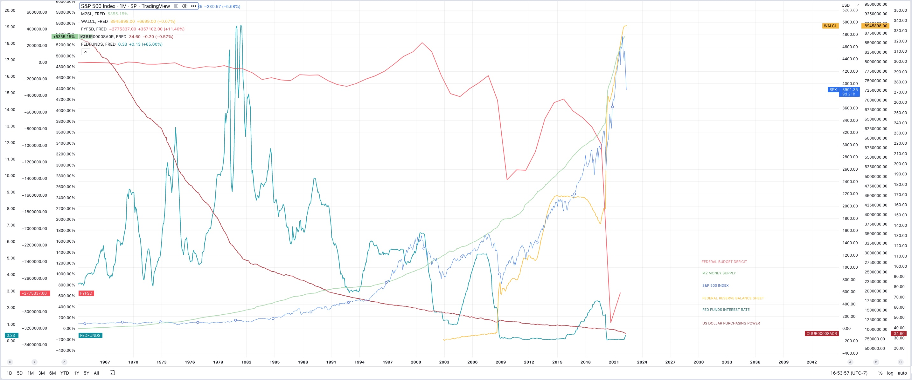

 
 

<h2>**Ongoing Technical Analysis of Financial markets and Crypto**</h2> 
<h6>
 
***For sure financial advice - More on Substack & Twitter***
</h6>

*[Tylerisyoung.Substack.com](www.tylerisyoung.substack.com)*   
*[Twitter.com/TylerisYoung](www.twitter.com/Tylerisyoung)*  
 _________________________

 
<h4>
**The Fundamentals**
</h4>
<h6>
Zoom in on browser/mobile to see charts 
<h6>

 
Read: [Modern Monetary Theory - Slow at first, then all at once.](./mmt.html)  
Read: [Bitcoin(soon)](./.html)
   
<h4>
**The Macroeconomic Backdrop**  
</h4>
The macroeconomics problem displayed in a single chart:

<h4>
 
   
Ongoing Technical Analysis
</h4>
 
________________________________________________________________  
*5/25/2022*
   
**Short term outlook:**    
  
- DXY and US10YR threatening to roll over (a point for the bulls, finally)
  
- S&P & QQQ (&BTC) looking at a bear market rally, possibly 7-15% from bottom   
  
- BTC target 35k then possibly run the 25K lows if bottom falls out of tradfi  
  
- Ideally 10 year falls for the right reason (inflation expectations down) rather than the wrong reason (growth expectations down)   
  
- Call option volume remains low, all markets still waiting for buyers despite massively oversold conditions  
  
  
**Longer term outlook:**     
Base case is: 
  
- Possible bounce here

- Possible lower lows after - lots of entities looking for exit liquidity and a rotation out of growth to value and commodities for what is potentially a commodity driven stagflationary supercycle - this would not be great but it's potentially unavoidable (though with more QE, growth will come back as well)

- Possible rally into November midterms, 

- Fed may sell Mortgage backed securities back into the market despite rapid rise in rates, housing will take a hit regardless

- Fed hiking could stop Q4 2022 (Currently market is pricing in later 2023 or 2024 - but they won't get that far) at which point when the hiking stops, the low will already be in, markets are forward looking and will recover far before the economy does. 

- Economy looking at higher unemployment, lower wage growth, higher consumer credit to come, increased home sales and defaults, etc. real stagflation driven mainly by monetary QE, but also sanctions, and supply chains, all with no real painless solution that isn't more governmental jobs programs/Universal basic income/ socialized losses to subsidize government errors etc. 

- They will try to inflate the long term debt bubble a few more times before they let it pop and try to implement CBDC's as the savior, by this time BTC will be in the "early majority" stage of the adoption curve and by enough people learning about the faults BTC corrects in the monetary system, traditional finance will become fractured towards a dual system solution, one forever inflating, one forever deflating.  

 

 

 
_________________________________________________________  
**5/24/2022**
   
- Bear market rally in QQQ less obvious  
- Was Friday rally enough to calm these extreme oversold conditions?   
- Larger uncertainty now  
- Still bullish on long term price trend and eventual FED pivot, possibly before NOV midterms, but short term pain seems imminent 

 

 

 

 
_________________________________________________________  
**5/23/2022**
   
- Possible bounce here, then we'll see. Markets on edge, everything oversold but still waiting for buyers. 

 
 

