 
 

<h2>**Ongoing Technical Analysis of Financial markets and Crypto**</h2> 
<h6>
 
***For sure financial advice - More on Substack & Twitter***
</h6>

*[Tylerisyoung.Substack.com](www.tylerisyoung.substack.com)*   
*[Twitter.com/TylerisYoung](www.twitter.com/Tylerisyoung)*  
 _________________________

 
<h4>
**The Fundamentals**
</h4>
<h6>
Zoom in on browser/mobile to see charts 
<h6>

 

Read: [Modern Monetary Theory - Slow at first, then all at once.](./mmt.html)  

   
<h4>
**The Macroeconomic Backdrop**  
</h4>
The macroeconomics problem displayed in a single chart:
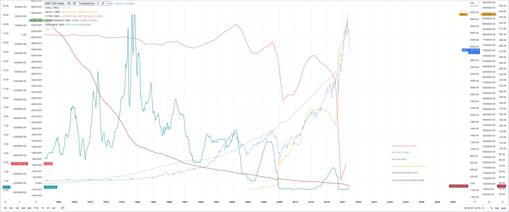

<h4>
 
   
Ongoing Technical Analysis
</h4>
 

________________________________________________________________   

  *6/9/2022*      

***Japanese Yen spirals against US dollar, the consequences of endless
QE*** 
   

Japan has been the canary in the coal mine for the last decade, helping us
in the US and the rest of the western nations all participating in
Quantative Easing, how far can we go before trust in assets held on the
central bank's balance sheet is lost? 

Japan's debt/GDP ratio is nearly 200%, the highest of any nation in the
world. 

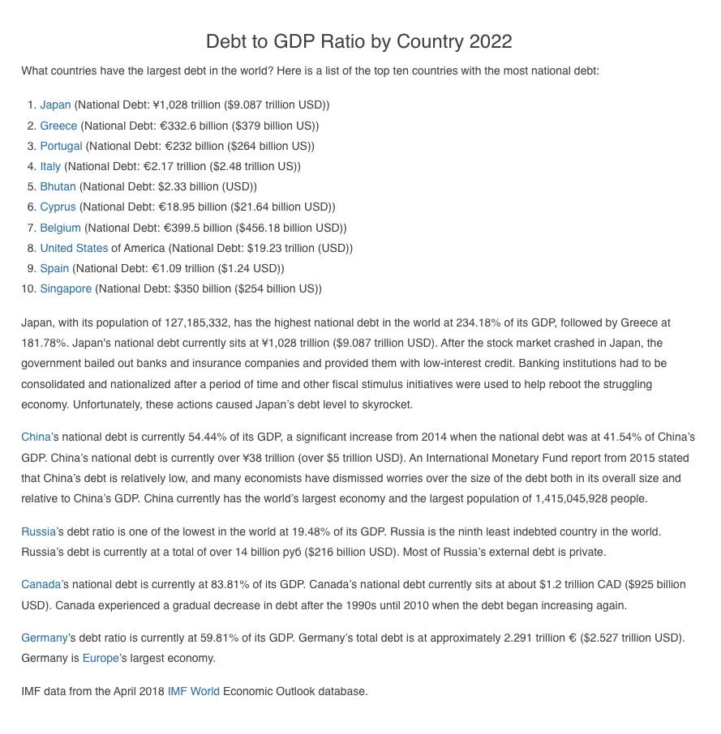

 

<iframe
src="https://data.worldbank.org/share/widget?end=2016&indicators=GC.DOD.TOTL.GD.ZS&locations=JP&start=1990&view=chart"
width='450' height='300' frameBorder='0' scrolling="no" ></iframe>

 

With a debt/GDP ratio this high, the government techniocally owes money to
itself through the central bank's deficit printing. The problem with
having so much debt is the interest rates. Once interest rates begin to
rise, so do interest payments needed to remain solvent. Without a robust
and increasing GDP for taxpayer generated income for the government to
fund the debt, th eonly option becomes - devalue the debt denominated in
fiat currency which has no limitations to creation - inflate it away. 

When the M2 money stock goes up, each dollar held by citizens and the
government goes down when measured against other comodities, or other
currencies which will remain stronger if they are not also printing more
money, though the debt, taken out years, even decades ago remains the
same. The debt positions can thus continnually be serviced with newly
created money that has a lesser value, and the longer a nation waits to
pay off the debt, the cheaper it becoems. 

A true sovreign debt crisis occured in Greece when their debt was
denominated in Euros, instead of their own former Greek currency, the
drachma. Since the Greek centrral bank could not control the newly issued
wupply of Euros, regulated by the ECB, we saw them enter a period of
default where their debts needed to be written down in lieu of a western
humanitarian crisis. 

Central Banks like Japan, or the United States who can self fund have the
advantage especially when interest rates are low, but when entering
a period of tightening, and slower economic growth, or even stagflation as
we are now, the only tool to create demand destruction and thus lower
inflation would traditionally be - raising interest rates to the rate of
inflation. 

The problem with an inflationary environment is that to solve the problem
of inflation, it is all but mandatory to cease the creation of more
dollars. Volker of the FED solved this problem in the 70's by raising
rates to match the rate of inflation which was above 10% at the time. The
only problem with doing that now is that we have too much debt. 

If the US or Japan raised rates this high, to 8-16% to match the current
inflation rate, the governments would not be able to finaince the interest
payments on the debt, and would thus default. 

But they can't print more money either, so it's necessary to rely on
jawboning all markets into demand destruction without raising rates, and
so far it's working. 

If this is not effective enough, the US will need to follow Japan's lead,
by implimenting Yield Curve Control (YCC).

The aim of YCC is to craft a particular shape to the yield rates on bonds
issued by the government. When any entity including individuals are
holding treasuries issued by the government, they should be expected to at
least retain their value, furthermore, the longer duration of the bond,
the higher the expected yield, but with inflation, this becomes a problem. 

Therefore, it has become necessarty for the Bank of Japan to participate
in yield curve control, printing money to directly purchase bonds andprop
up the market. In addition to this, the BOJ is also purchasing stockson
the open market as well, something previously unheard of. 

This has a two pronged effect; firstly is staves off insolvency for Japan,
for now, they are able to service their debt's on the balance sheet with
new dollars, but secondly, it has eroded trust, and yield from all of
their markets is gone leading investors to seek yield elsewhere. 

If this persists, a debt driven deflationary spiral that leads to
insolvency could follow, and it could be both abrupt, and catastrophic as
it was for Greece who needed a bailout from the ECB. 

Japan's 10 year yield has been below the US 10 year yield for a decade now
leaving less access to liquidity for paying off debts, but also Japan's
stock market has not reached a new all time high since 1990, in fact, it's
still down 26% from that date. Money is fleeing the country and GDP will
remain low, threatening insolvency indefinitely. 

The Japanese Yen is loosing value compared to the dollar, but the Dollar
is loosing value compared to comodities and will inevitably face the same
fate if we continue the current regime. 

  

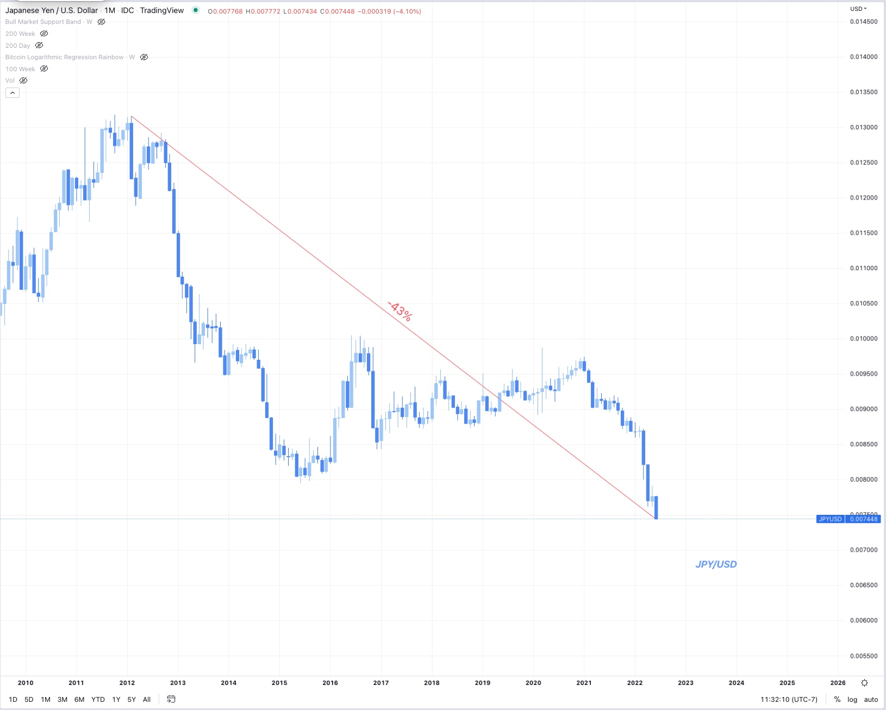   

  

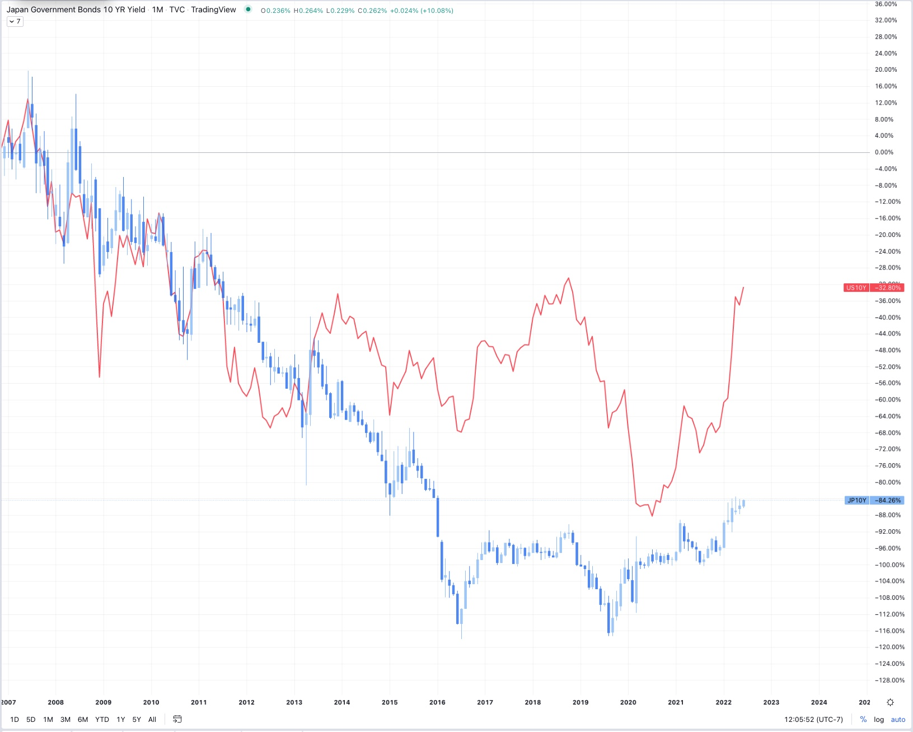 

 

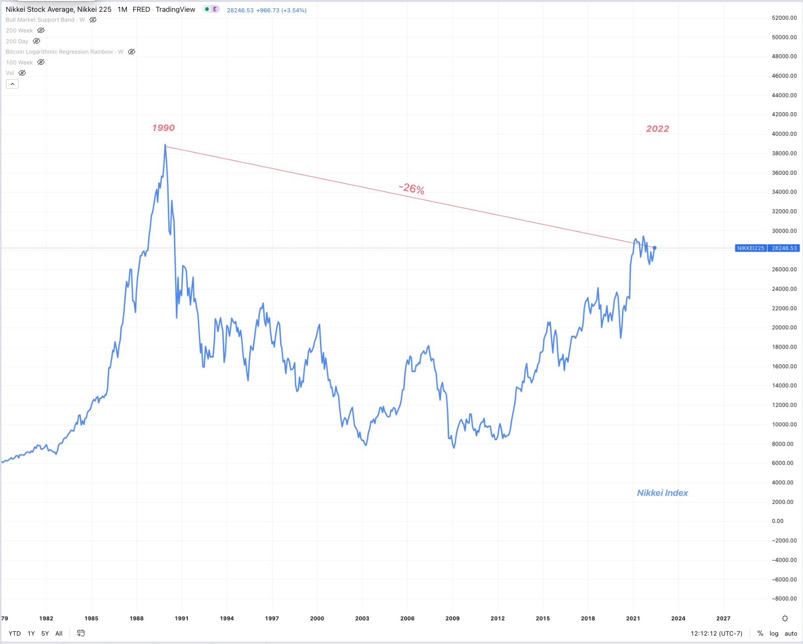
  
 
  
  

________________________________________________________________  
  

*6/7/2022* 
  
***Federal Reserve Releases Hilarious Hit Piece on Bitcoin***

The FED has [released](https://fredblog.stlouisfed.org/2022/06/buying-eggs-with-bitcoins/) a chart comparing Bitcoin's purchasing power against the price of supermarket eggs. They suggest that this is the reason Bitcoin is not a good store of value. 

This is the chart presented. 
 

 
It only takes a moment to realize that the data is completely cherry picked from the last two years, and if you choose to drag the view options back to the inception of Bitcoin in 2009, their very same chart simply tells the opposite story. 

If you were to have held Bitcoin instead of US dollars for nearly any period of Bitcoin's existence, your purchasing power measured in eggs would have only increased, and significantly. 
 

 

The US dollar has lost 95% of it's purchasing power against commodities, goods, and services over the last several decades. It is interesting however that the FED finds the need to attempt to make these silly comparisons. 

 
 
 
________________________________________________________________   

 
*6/6/2022*
     

**Natural Gas prices spike, World Food Crisis Looms**  

 

Many countries are being threatened with immediate food shortages, not next year or next month, right now. The current situation involving Russia-Ukraine is greatly exacerbating the problem. Known as the "bread basket of the world" which also includes Belarus. These countries make up more than 1/4 of all global grain trade, and Russia have announced that they will restrict grain trade within "[Friendly countries](https://www.nbcnews.com/news/world/live-blog/russia-ukraine-war-live-updates-evacuations-launch-mariupol-talks-resume-n1293815/ncrd1293834)." 
 
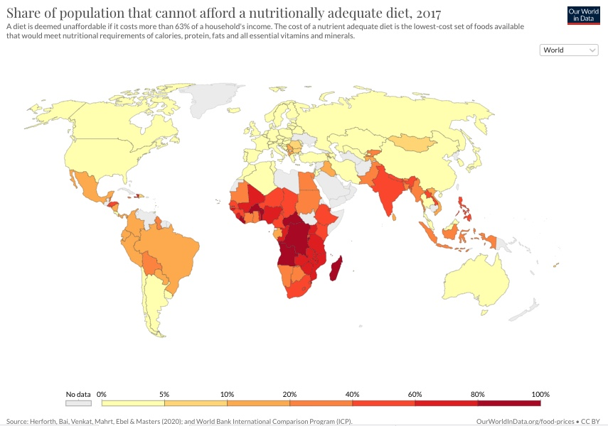
*Note: This is 2017 data, pre pandemic, pre money printing from the FED, and before war in Ukraine, unfortunately it only get's worse from here. 
 
Furthermore, fertilizer is made through a process invented by Fritz Haber and Carl Bosch who is often credited alongside Norman Borlaug, inventor of genetic modification, for being the catalysts of the "[Green Revolution](https://en.wikipedia.org/wiki/Green_Revolution)" in the late 50's to which they  are credited with saving hundreds of millions of lives. Today, 50% of peoples food supply relies on both genetic modification of staple food crops which are pest and drought resistant, but also their growth is dependent on the Haber-Bosch process which uses nitrogen fixation to produce ammonia. Previously, many farmers would need to go through the season long process of planting nitrogen fixing plants to revive this necessary chemical. Today, it can be purchased in 1000LB+ quantities and applied at will. This is how we currently feed the world. Cheap fertilizers that contain ammonia are the reason the world population was able to move from 3 Billion people to nearly 8 Billion today. 

 
Haber Bosch Process:
{\displaystyle {\ce {N2 + 3 H2 -> 2 NH3}}\quad \Delta H^{\circ }=-91.8~{\text{kJ/mol}}}
 
Historically fertilizers have been cheap, relying firstly on the recent boom in availability from the recent discovery of previously untappable oil reserves, this, alongside the deflationary pressures of technology evolution, lead to continually declining prices of methane (CH4) and ultimately the manufacturing process of fertilizers. 

Secondly, fertilizers are made from nitrogen as we know, but also potassium and phosphorous, and Russia and Ukraine previously made up 28% of all global fertilizer supply. Given equal and consistent demand as farms tend to have, supply constraints will mean higher prices. 
 
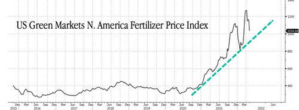
 
Recently, after Russia's foreign treasury reserve assets held internationally were seized in the first ever occurrence of this sort which pokes a hole in the supposedly unbiased petrodollar hegemony, Russia retaliated by forcing purchasers of Oil and Gas to procure Russian Rubles to make those purchases through Russian banks who were cut off from the SWIFT network. This new demand for Rubles has caused it to outperform the US dollar, gaining purchasing power, and leading to higher prices on Natural Gas, of which Europe gets 40% of its gas from Russia. 

European citizens have been experiencing a condition known as being "energy poor" where the average middle class family has all the modern amenities that we have in the US for example, but cannot afford to heat their homes, or use a hot water heater due to the skyrocketing prices of natural gas, both over the last decade due to ratcheting carbon tax tightening as well as the European Central Bank's inflationary money printing, both causing prices to rise for end consumers. 

On top of that, Europe has sanctioned  [fertilizers](https://www.politico.eu/article/eu-sanctions-higher-food-prices-potash/) and from Russia and Belarus, which will also lead to inflationary prices for end consumers. While France is the European country that has the closest to a carbonized energy grid, made up of mostly nuclear, Germany has recently decommissioned the last of the nuclear plants and replaced their energy with mostly coal and natural gas from Russia. The German society is now highly dependent on Russian gas, and a global divestment from fossil fuels in general means that there is not much more supply coming online for the next several years. 
 

 
Together, this makes up the perfect storm  for higher input costs from lack of fertilizers, and direct blockade of supplies from Russia, and now other countries which refuse to export certain items like China who has been accumulating food stores for years, now [hoarding](https://asia.nikkei.com/Spotlight/Datawatch/China-hoards-over-half-the-world-s-grain-pushing-up-global-prices) half of the world's grain. Malaysia is [banning](https://www.scmp.com/week-asia/economics/article/3180039/malaysias-poultry-export-ban-when-will-it-end-how-have-people) the export of Chicken. Indonesia recently took to [banning](https://www.moneycontrol.com/news/opinion/indonesian-palm-oil-export-ban-set-to-raise-indian-inflation-8405201.html) the export of Palm oil due to a poor harvest, which drives the price of palm oil up. This price increase leads to more deforestation in the amazon and southern Asia where palm oil is the majority of export crops, but it also incentives wheat farmers in the US - another large wheat producer- to flip and plant more soybeans for soybean oil instead of wheat, again driving wheat prices higher. India [bans](https://news.yahoo.com/us-urges-india-reverse-ban-083311676.html) the export of wheat. This is a problem because wheat is in basically all the processed foods. 

Joe Biden has been making the rounds to world leaders hoping to convince them to increase supply and drive down prices. He offered India $4 billion to export more wheat which they rejected. He asked Saudi Arabia to export more oil which they said they couldn't do due to already tight supply constraints. We have such a significant problem that America's past actions and alliances can be ignored in the search for more oil. We formerly accused Nicolas Maduro of both election fraud, then later drug trafficking in order to attempt to [install](https://theintercept.com/2019/02/02/venezuela-us-trump-sanctions/) the US-friendly Juan Guaido who never fully assumed [power.](https://www.bloomberg.com/news/articles/2021-09-02/why-venezuela-s-two-presidents-are-ready-to-talk-quicktake) Recently, Biden reached out to Maduro to try to procure more Venezuelan oil that should have originally been destined for our largest refinery owned by the Koch brothers in Corpus Christi, Texas. However, The political blowback of a nation supposedly aligned with Russian interests was nearly enough to shut down these talks, but it looks like we don't actually care about politics or what we used to call Russian aliance, because it looks like Venezuelan oil may begin to be imported soon. This is all a result of US involvement in the Russia Ukraine war when we  banned Russian oil imports to America. 

We have no oil, we've released all of our strategic reserves, and we dont have the wells, refineries, or infrastructure to bring supply online to meet demand, therefore price must rise. Chevron's CEO has [said](https://www.msn.com/en-us/money/markets/chevrons-ceo-says-no-more-us-oil-refineries-what-should-energy-investors-do/ar-AAY6k1N?li=BBnbfcL) that he does not see any new oil refineries ever coming back to the US. This is in part due to the horrendous permitting and regulation process which can take time measured in years, and money measured in the millions, only to get approval, even nearly finish construction, costing billions, to then have the project held up in court for another several years and threaten its very completion. This is what happened to the Mountain Valley Pipeline in Appalacia which contains our largest natural gas reserves, and  the Jordan Cove LNG pipeline in Oregon which developers [abandoned.](https://www.oregonlive.com/business/2021/12/jordan-cove-developers-abandon-plans-for-pipeline-coos-bay-lng-terminal.html) These projects are now sunk costs worth billions on investors balance sheets, definitively scaring away any new investors. 

The environmental movement has a  process of blocking new fossil fuel infrastructure that can sometimes be very effective. petitions, protests, court appeals, biodiversity, larger environmental concerns, damage from spills, air, noise, and unethical pollution, these things are all excellent and effective tactics that the environmental movement uses to block new fossil fuel infrastructure. The majority of the public is simultaneously on the side of the environmentalists wanting to make the world a batter place, but also desiring lower costs for gasoline at the fuel pump. The pendulum has swung too far. 

The realities of economics and commodity inflation have already caught up with us and if we continue to invest in new fossil fuel infrastructure, oil prices will increase and remain high due to constrained supply. Of course, we also need to optimize out investments in green tech as well because many of the environmentalists concerns are warranted. Hoowever, renewables largely do not have the tech or the cost effectiveness to outcompete oil in most places, the cost of EV's and the chips that run them are only going up due to all the supply shortages caused by quantitative easing which is necessary to keep the US from a debt driven collapse. 

These intricate complexities only lead to regressive outcomes hurting those who cannot afford green tech, while also demonizing them for their supposed dirty emissions in what is quickly becoming a class divide driven by inflation and market manipulation from the Federal Reserve. We need to tackle climate change, but we don't need to go overboard, and what we're doing right now is not necessary even according to the IPCC and the IEA who don't see any concerning tipping points until we reach a global temperature over 4 degrees celsius, which they project us to remain well under. Optimal policy is difficult, and the current two sidedness and bias towards extremity in order to gain moderate results is not helping. 
 

 
Reshoring of goods, services and commodities into our borders makes for a self sufficient economy, but globalization and free trade make for cheaper goods and a more diverse and growing global economy which predominantly benefits developing nations, but we cannot have both sides of the extreme. Privatization also matters, Venezuela is rich in oil, but poor in their Bolivar's exchange rate, nationalization does not work when the government is allowed to continually operate at a loss, hyperinflation has arrived for Venezuela, and will continue to increase across the world as energy runs the show and the economy. 

What was previously a perceived environmental win of slowing investment in fossil fuel infrastructure is now causing mass starvation for wage earners across the globe who cannot keep up with food price inflation. Those consumers who will not or cannot pay, will be forced to change their purchasing behavior and some will starve or become malnourished for lack of cheap and healthy food. Famines are created not by God, but by man. 

The Food and Agricultural Organization price index tracking month over month and year over year changes shows every key agricultural product up significantly year over year as well as Cereal prices, which includes wheat, up by 30%. Every food that contains wheat will need to either rise by 30%, or the company selling it will need to choose to take what is for them hopefully* a temporary* loss to keep their customers.

In a United Nations press [Release](https://www.un.org/press/en/2022/sc14894.doc.htm), Antonio Gutierrez said, "“When war is waged, people go hungry...Most important of all, we need to end the war in Ukraine.” The security council quotes Antony J. Blinken, Secretary of State of the United States, "Recalling WFP and FAO estimates that people affected by food insecurity due to conflict would increase to an estimated 161 million in 2022, noted that the Russian Federation’s war in Ukraine could add another 40 million people to that total.  That country’s flagrant disregard of resolution 2417 (2018) is just the latest example of a Government using the hunger of civilians to advance its objectives.  The food supply for millions of Ukrainians and millions more around world “has quite literally been held hostage by the Russian military”, he said, noting 20 million tons of grain sit unused in Ukrainian silos as food prices skyrocket." 

 

 
Defense spending is both fine and desired, but war is bad for business, let's stop fighting and funding proxy wars that aren't on our soil. 
 

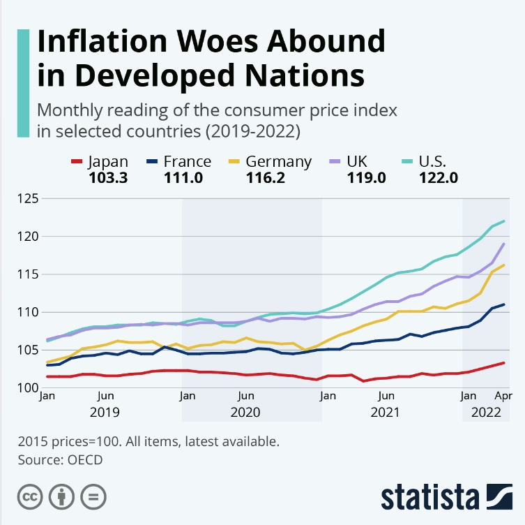
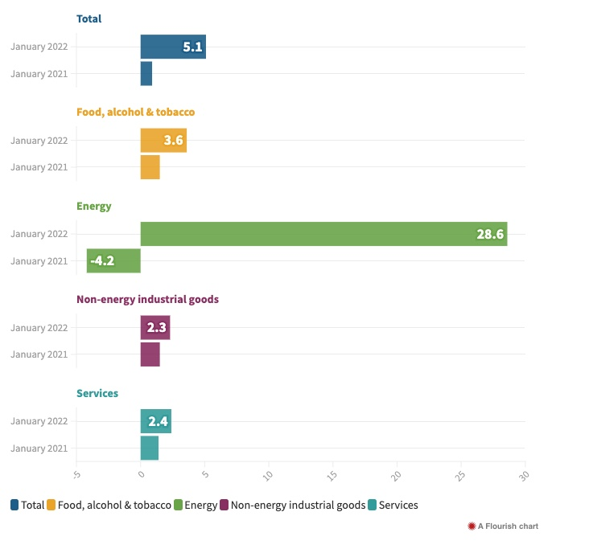

   
There's no use hoping inflation will come down, and producers know this, the debt/GDP ratio shows us that it will continue for the rest of the decade unless the US chooses to default or cause a recession which is far worse than 1929 due the the amount of leverage across all markets. Officials will never choose either of these options, they will always choose inflation with short term periods of demand destruction as we're experiencing now. Macroeconomist Luke Gromen calls this "Peak Cheap Oil."

Shadow Stats is a company currently tracking CPI inflation much more accurately than the massaged US government numbers, they do this by using the US government's former calculation methods instead of the new ones which were recently changed several times to fit the narrative. Currently Shadow Stats has inflation above 16%, much closer to prices in the real world. Wheat inflation is now 30% year over year.  

The healthy and reasonable way to fix this is to cause short term demand destruction in financial markets and commodity futures today, while the economy is still relatively strong and raise interest rates to the rate of inflation - the Volker method. This alongside a significant reduction in federal expenditure is necessary for the economy to recover in real terms, instead of waiting for stagflation to continue, for a recession to get worse, and only then attempting to raise rates into an economy already in a depression. If the FED doesn't pivot within the year, this is where we're headed. The FED is out of options, and not only are they behind the curve, they are also late to the party and too slow to act, and because of this people will starve. 

  
 
 
 
________________________________________________________________  
**6/1/2022**
   
***Federal Reserve Begins Quantitative Tightening Today***  
   
  
- The Fed will begin selling UST's and MBS's. There are many reasons for markets to buy US Treasuries, they are universal pristine collateral across the world, but when the Fed begins selling Mortgage Backed Securities, there becomes more supply of them, less demand for their use as collateral, and there is only one buyer - pension funds forced to purchase them by mandate to "reduce risk." MBS interest rates will increase as selling occurs and price goes down, and the housing market will stall over time. The real risk comes when these investments have negative real yields against inflation and pension funds begin to fail unless they can adjust the regulations in order to find better yields. 
  
- We only have one period of QT to base our expectations off in 2018, and we are now tightening into a slowing economy, interestingly enough the S&P actually was flat/went up slightly during the last period of tightening.  
  
- Let's see how far they get before something breaks. Last time that happened was 2019 when it took a liquidity event in the reverse repo market to abruptly end QT and reverse course to QE infinity.Covid provided excellent cover for this, and climate change will provide the next. 
  
- As M2 money supply increases, so does counter party risk on banks balance sheets. If all the banks are holding are promises of payment, trust can erode quickly. These banks are now (apparently) so concerned that their formerly pristine assets - US treasuries and Mortgage backed securities - will fail, potentially overnight, as happened in 2008 that they are placing ever increasing amounts of risk on the balance sheet of the Federal Reserve in the overnight repo market. The government will print more money before they become insolvent.

     
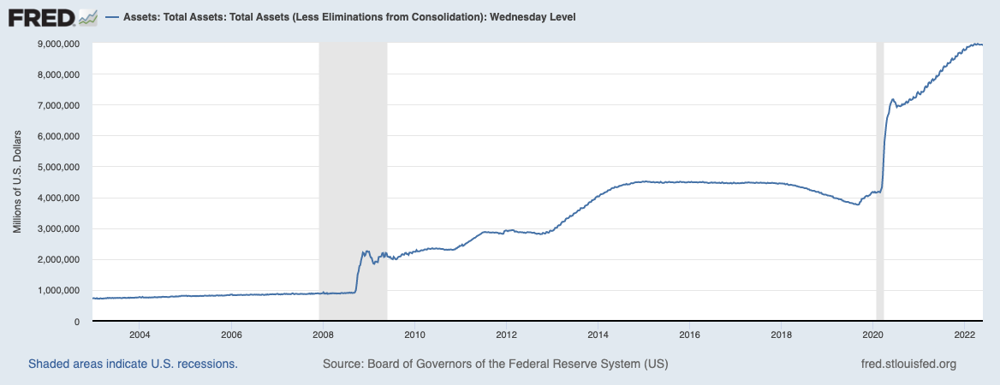
   

   
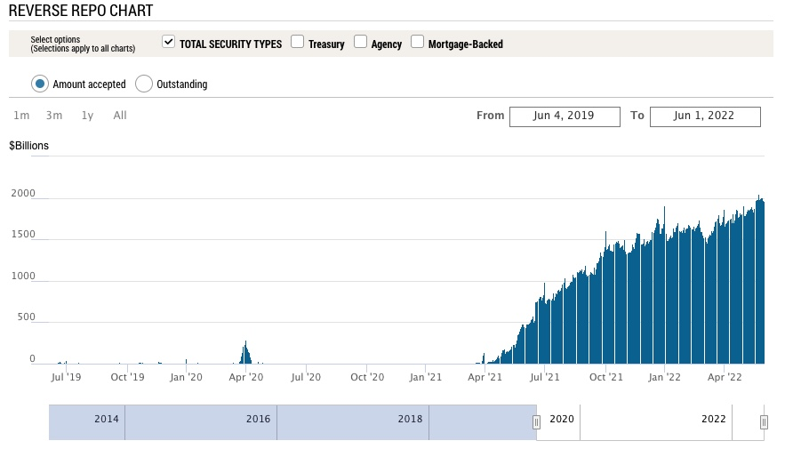
  
 
 
 
_________________________________________________________  

 
*5/31/2022*
     

**Biden's Plan to Combat Inflation**  
 
Biden wrote an op-ed for the Wall St Journal where he  [announces](https://www.wsj.com/articles/my-plan-for-fighting-inflation-joe-biden-gas-prices-economy-unemployment-jobs-covid-11653940654) his three step plan to fight inflation. This is just after his [previous plan](https://www.whitehouse.gov/briefing-room/statements-releases/2022/05/10/the-biden-harris-inflation-plan-lowering-costs-and-lowering-the-deficit/) released just days ago. 
  
  - *The New Plan:*  
  - 1) "First, the Federal Reserve has a primary responsibility to control inflation. My predecessor demeaned the Fed, and past presidents have sought to influence its decisions inappropriately during periods of elevated inflation. I won’t do this. I have appointed highly qualified people from both parties to lead that institution. I agree with their assessment that fighting inflation is our top economic challenge right now."
  
 
  
  - 2) "Second, we need to take every practical step to make things more affordable for families during this moment of economic uncertainty—and to boost the productive capacity of our economy over time. The price at the pump is elevated in large part because Russian oil, gas and refining capacity are off the market. We can’t let up on our global effort to punish Mr. Putin for what he’s done, and we must mitigate these effects for American consumers. That is why I led the largest release from global oil reserves in history. Congress could help right away by passing clean energy tax credits and investments that I have proposed. A dozen CEOs of America’s largest utility companies told me earlier this year that my plan would reduce the average family’s annual utility bills by $500 and accelerate our transition from energy produced by autocrats. We can also reduce the cost of everyday goods by fixing broken supply chains, improving infrastructure, and cracking down on the exorbitant fees that foreign ocean freight companies charge to move products. My Housing Supply Action Plan will make housing more affordable by building more than a million more units, closing the housing shortfall in the next five years. We can reduce the price of prescription drugs by giving Medicare the power to negotiate with pharmaceutical companies and capping the cost of insulin. And we can lower the cost of child and elder care to help parents get back to work. I’ve done what I can on my own to help working families during this challenging time—and will keep acting to lower costs where I can—but now Congress needs to act too."
  
 
  
  - 3) "Third, we need to keep reducing the federal deficit, which will help ease price pressures. Last week the nonpartisan Congressional Budget Office projected that the deficit will fall by $1.7 trillion this year—the largest reduction in history. That will leave the deficit as a share of the economy lower than prepandemic levels and lower than CBO projected for this year before the American Rescue Plan passed. This deficit progress wasn’t preordained. In addition to winding down emergency programs responsibly, about half the reduction is driven by an increase in revenue—as my economic policies powered a rapid recovery."

   

- *In other words:*   
- 1) Blame the FED, Trump, Russia, and define the oil industry as "autocrats" - the high inflation, it's not Biden's fault. 

 

- 2) Reiterate that even though we continue to choose to sanction Russian oil and gas, like Europe who's [heading towards](https://www.zerohedge.com/geopolitical/vilches-europes-mad-ban-russian-oil) the largest energy shortfall in decades, forcing the public to spend higher and higher percentages of their income on energy (causing the especially vulnerable and elderly to literally freeze to death if they can't afford heat - a real and increasing problem) This is framed as something we need to do it to 'stick it to Putin.' Next, release all US strategic oil reserves to artificially bring down price - temporarily, (this was [already done](https://www.reuters.com/markets/commodities/us-strategic-petroleum-reserve-drops-lowest-level-since-1987-2022-05-16/), reserves are now at decades long lows) then pass green energy tax credits and spend more money to further investments in the space. Then spend more money to fix supply chains and improve infrastructure. Then begin "cracking down on the exorbitant fees that foreign ocean freight companies charge to move products," (here come the price controls). Then build a million homes. Then give pharmaceutical companies the ability to negotiate, but also "cap the cost of insulin." (There they are) 

 

- 3) Reduce the federal deficit which is supposedly will contract by $1.7T (That is, if we compare Year over year numbers to the last two years when we printed more than 25% of M2 money supply, causing a massive federal deficit, it's easy to see how the "deficit shortfall" will come down, even while net deficit will go up) 

 

- *Analysis:*   
  The problem is that despite the negative connotation, Biden is right - Oil companies are autocrats, they have ultimate control over global energy markets and thus the economies of the world, there are very few things which are more important to our way of life than oil. A reduction in production and consumption of oil and natural gas (or higher prices) means more crop shortages, fertilizer shortages, supply chain issues, mass starvation and malnutrition especially in the third world, decreased economic activity globally, higher unemployment everywhere, individual savings evaporate, wealth inequality is exacerbated, etc. We need oil to run the world, and lots of it. Cheap oil makes everyone better off. 

  Furthermore, if climate change were to enter the conversation, one needs to ask; what is the carbon footprint of spending and sending 40 Billion to Ukraine in our funding of the newest proxy war started immediately after the last. All thew way back in a 2011 interview, Julian Assange [states](https://www.londontimes.live/state-of-affairs/julian-assange-speaking-in-2011-the-goal-is-an-endless-war-not-a-successful-war/), "The goal is to use Afghanistan to wash money out of the tax bases of the US and Europe through Afghanistan and back into the hands of a transnational security elite. The goal is an endless war, not a successful war." Nothing has changed, additionally, EV's are nowhere near cost effective enough for global transportation and they won't be so globally until at least the mid 2030's when the majority of developed nations have gone through a generation of EV cars and they can filter through the used markets into developing nations. Green energy and heating production is not efficient enough in most locations and won't be for some time, tax credits are nice incentives and it's yet to be seen if the average consumer will save $500/year on their energy bill as Biden says. The rest of his plan involves spending more money that GDP is not bringing in as we head into another negative quarter of growth, which will thus increase the deficit. Inflation is always a monetary phenomenon, spending more money will make inflation worse, not better. The same goes for his previous plan mentioned above, every single line item (many taken from build back better) will involve spending massive amounts of money, multiple trillions, created by the Treasury, adding to the federal deficit - which is the primary cause if inflation. 
  
  The way to solve consumer price inflation is to bolster the actual GDP output of the economy, create more literal goods and services without creating more dollars - More goods being chased by fewer dollars drives inflation down. That's the fun way, the alternative is demand destruction by economic recession, if no one has money to buy anything, demand also goes down. That's unfortunately where we're at while simultaneously placing higher taxes and price controls on the very producers who are capable of solving the problem (oil companies etc.) While some of the proposals in the long run (decades) could bring down inflation - now is not the time to increase deficit spending, the time would have been when (real) GDP was strong, when interest rates and (real yields) had already been (much) higher for years, spend when you have the money, not when you don't. 
  
   
  
- *Conclusion*  
Spending now only digs the grave of the debt driven deflationary spiral deeper once it does arrive, we no longer have high interest rates as a tool to combat inflation, the deficit is too high and will drive the US to insolvency, but I imagine they intend to inflate the bubble a few more times before that happens, the 2019 repo crisis is evidence enough of that sentiment. It's getting harder and harder to ignore the missteps at every turn, and incompetence is often indistinguishable from malice. 
  
 

 
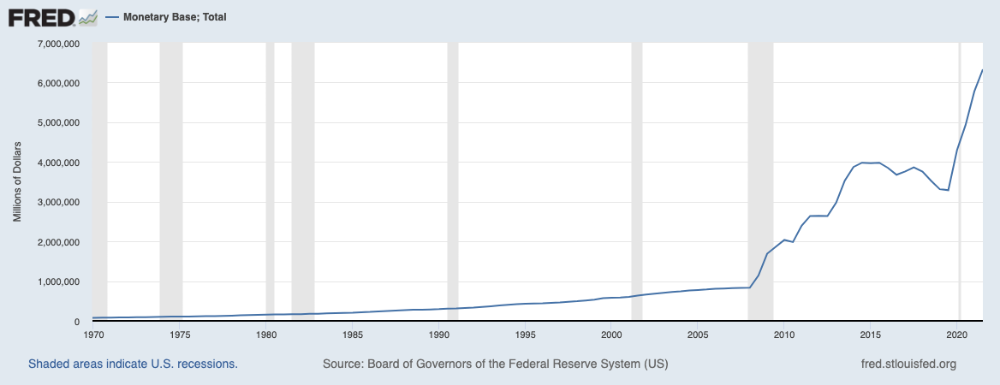
 

 
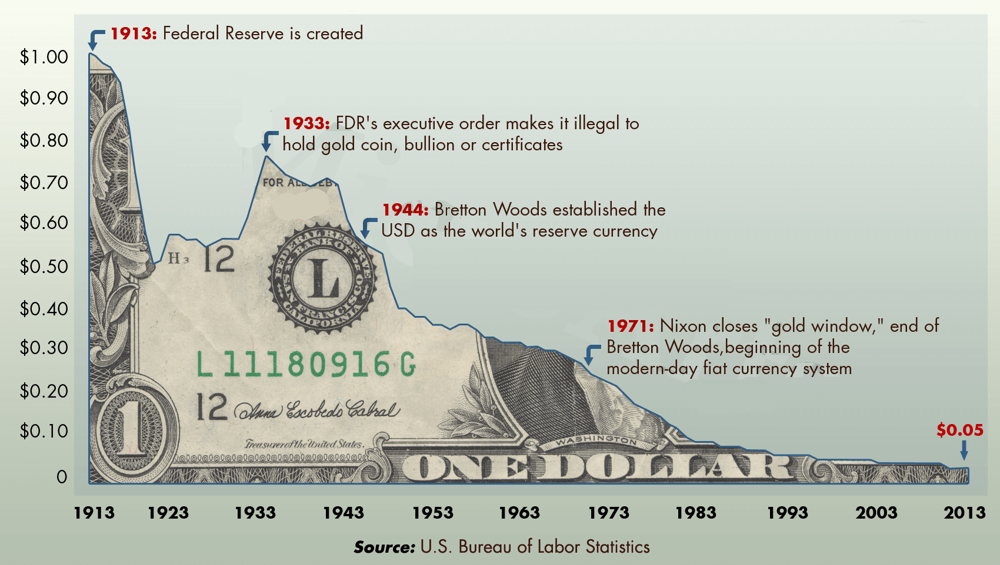
 

 
 
 
________________________________________________________________  
 
 
 
*5/29/2022*
     

**Traditional Markets**  

- Gavin Newsom [suggests](https://www.gov.ca.gov/2022/03/23/governor-newsom-proposes-11-billion-relief-package-for-californians-facing-higher-gas-prices/) $11bn in stimulus to combat gas price inflation - lol. Inflation is always a monetary phenomenon - more money in the system chasing the same goods results in higher prices. Next on the list of things not to do will come price controls. Taxes on energy and necessities are always regressive as seen in Europe and well covered by Zero Hedge and Doomberg. CA has the highest taxes on gas, hurting those that can least afford it most, as does inflation. 

- Running to take Newsom's spot as governor, Micheal Shellenberger has a much better understanding of the economy and energy markets as described in his own [Substack.](https://substack.com/profile/2255433-michael-shellenberger) I wish him luck in his candidacy. 

- China's small-medium banks are insolvent? - Customers unable to access funds for a month. Lots of turmoil due to ridiculous lock downs, occams razor pivoting towards China will not open up until Europe is in official recession. US and Europe already in recession, but the time it's acknowledged, it will be nearly over if it still likely ends with a fed pivot. [via Reuters](https://www.reuters.com/markets/asia/chinese-depositors-left-dark-three-local-banks-freeze-deposits-2022-05-18/)

- China is [loosening](https://www.bloomberg.com/news/articles/2022-05-20/china-cuts-borrowing-costs-by-record-to-boost-loan-demand) by record amounts to make up for weak (or collapsing) housing market in China who does a lot more adjustable rate loans. (Evergrande's toxic balance sheet?) China needs citizens taking new loans so they're cutting rates, debt driven systems need more debt and inflationary bailouts. Current system is tight and desperate for new money. 

- Oil likely to rally further (short term) with Strategic Reserve depleted, moreso if China re-opens, in this stagflationary environment, price inflation will continue even if YOY numbers go down slightly. Longer term, demand destruction may prevail alongside low growth to bring down oil prices. 

- Bear market rally confirmed in traditional markets, back to risk on, temporary and short term mean reversion setting up for potential or likely lower lows in line with the high time frame mean reversion after decade long bubble in risk. 

- Fed announces only two more hikes, then data dependent, Powell is great at letting the markets know what should be expected. 

- Redfin [reporting](https://www.redfin.com/news/housing-market-update-price-drops-surge-to-19pct/) 1/5 home sellers drop prices last month

- Redfin "The monthly mortgage payment on the median asking price home declined slightly from a record high to $2,425 at the current 5.1% mortgage rate. This was up 42% from $1,708 a year earlier, when mortgage rates were 2.95%...Pending home sales were down 5.4% year over year."
  
- Fed Raising rates resulting in huge mortgage rate increase, highest since 2008, bond prices set to rally as safe haven compared to real estate. 
  
- University of Michigan "home buying conditions" are the worst they've been since the 1980's - [Zero Hedge](https://www.zerohedge.com/personal-finance/umich-sentiment-tumbles-accelerates-may-home-buying-confidence-collapse)
  
 
 
**Crypto Markets**  
  
- BTC playing catch up over the weekend, riskiest of risk assets will lag. Eventual decoupling will result in BTC being risk off, but this still seems like a distant future. 

- BTC Peak Fear and greed index recently reached 8 (now 10) - Extreme fear, good long term buy indicator despite potential further downside. 

- Alt/BTC pair is likely to continue to bleed until BTC shows monthly strength, BTC maxi's always have a good point. 

 

**Charts**

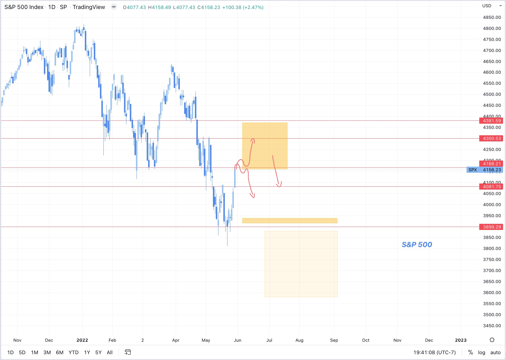
 

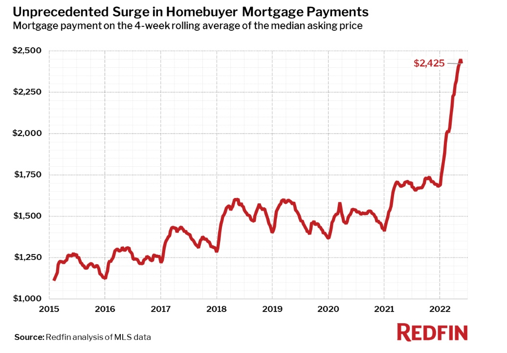
 

 

 

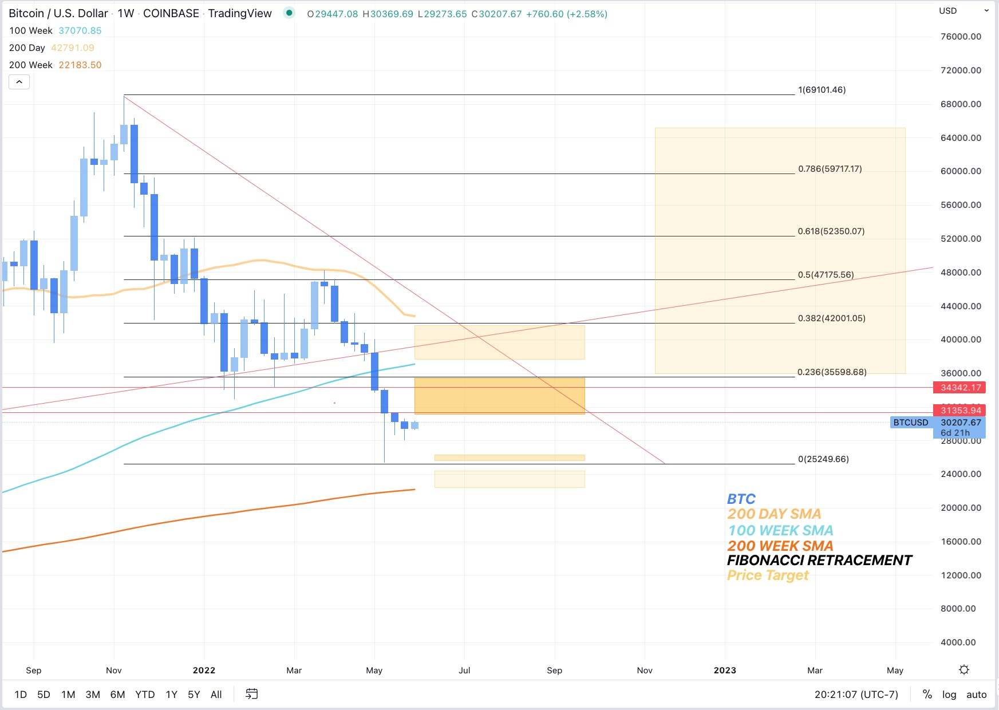
 

 
 
 
________________________________________________________________  
 
*5/27/2022*
     

- Traditional markets are having a nice rally after solid support at S&P:3900, now above 4100. Still low call volume. 

- Volatility will likely remain high for several weeks. 
  
- Consumer savings accounts shredded, American's are not able to adjust spending to keep up with newly higher prices.  - chart from Zero hedge. 

- BTC Down, everything else up, correlation with risk is breaking, but not in the fun direction. Price action closes hourly low below the range low, Longs getting trimmed until clarity in PA. BTC is the most risky of risk on assets, will potentially rally last under a bear market rally. 

- BTC dominance likely to continue to stay flat or rise whether we go up or down, Alts have been rekt with no end in sight, good prices, but no strength in BTC means alts could drop another 60%+ from here. 

- Lumber futures are down big at peak building season, houses should be being built but no one's buying wood, long term housing shortage will continue until prices fall significantly.  

- NYT changes tune on Ukraine war - Ukraine can't win. (While typing I defaulted to writing "we can't win" - American's don't want or need another proxy war.)

- Voter turnout hits record numbers in Georgia as Dems switch sides leading to massive positive swing for Republicans, could foreshadow future problems for Dems as many have already been forecasting, potentially even more reason for a FED pivot prior to November. 

 

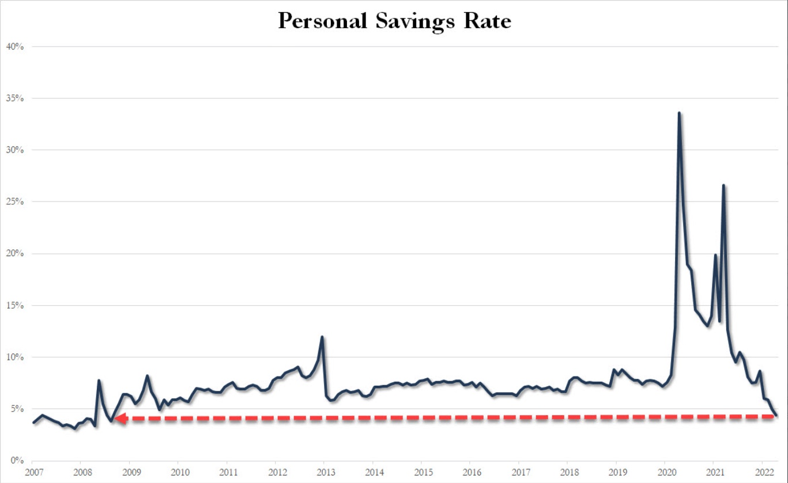
 

 
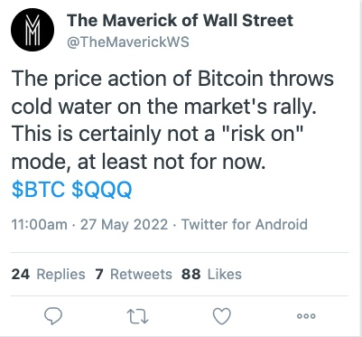
 

 
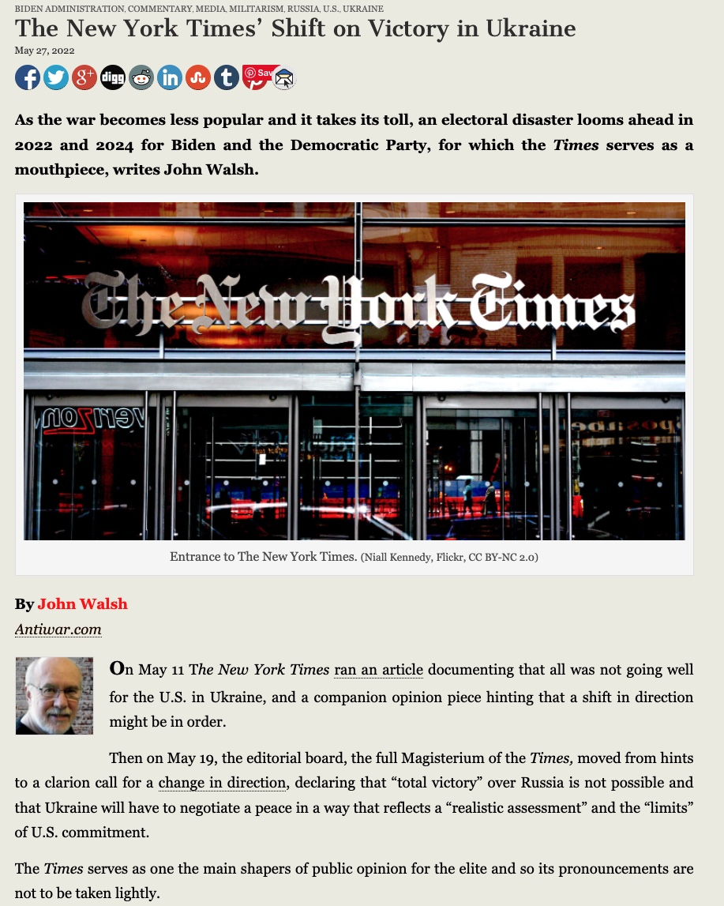
 

 

________________________________________________________________  
*5/25/2022*
   
**Short term outlook:**    
  
- DXY and US10YR threatening to roll over (a point for the bulls, finally)
  
- S&P & QQQ (&BTC) looking at a bear market rally, possibly 7-15% from bottom   
  
- BTC target 35k then possibly run the 25K lows if bottom falls out of tradfi  
  
- Ideally 10 year falls for the right reason (inflation expectations down) rather than the wrong reason (growth expectations down)   
  
- Call option volume remains low, all markets still waiting for buyers despite massively oversold conditions  
  
  
**Longer term outlook:**     
Base case is: 
  
- Possible bounce here

- Possible lower lows after - lots of entities looking for exit liquidity and a rotation out of growth to value and commodities for what is potentially a commodity driven stagflationary supercycle - this would not be great but it's potentially unavoidable (though with more QE, growth will come back as well)

- Possible rally into November midterms, 

- Fed may sell Mortgage backed securities back into the market despite rapid rise in rates, housing will take a hit regardless

- Fed hiking could stop Q4 2022 (Currently market is pricing in later 2023 or 2024 - but they won't get that far) at which point when the hiking stops, the low will already be in, markets are forward looking and will recover far before the economy does. 

- Economy looking at higher unemployment, lower wage growth, higher consumer credit to come, increased home sales and defaults, etc. real stagflation driven mainly by monetary QE, but also sanctions, and supply chains, all with no real painless solution that isn't more governmental jobs programs/Universal basic income/ socialized losses to subsidize government errors etc. 

- They will try to inflate the long term debt bubble a few more times before they let it pop and try to implement CBDC's as the savior, by this time BTC will be in the "early majority" stage of the adoption curve and by enough people learning about the faults BTC corrects in the monetary system, traditional finance will become fractured towards a dual system solution, one forever inflating, one forever deflating.  

 

 

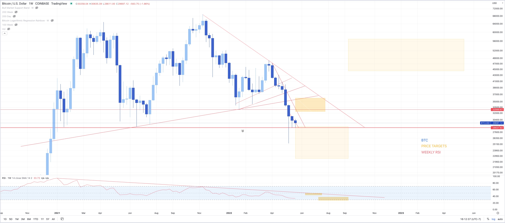
 
_________________________________________________________  
**5/24/2022**
   
- Bear market rally in QQQ less obvious  
- Was Friday rally enough to calm these extreme oversold conditions?   
- Larger uncertainty now  
- Still bullish on long term price trend and eventual FED pivot, possibly before NOV midterms, but short term pain seems imminent 

 

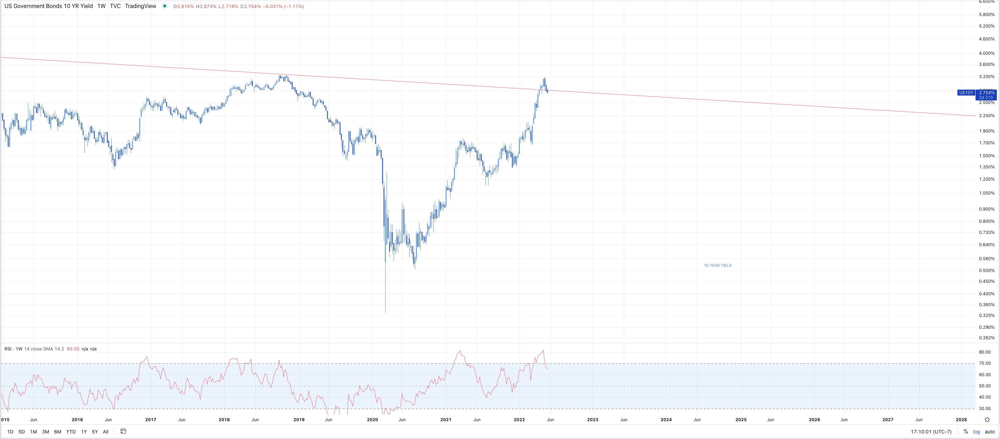
 

 

 
_________________________________________________________  
**5/23/2022**
   
- Possible bounce here, then we'll see. Markets on edge, everything oversold but still waiting for buyers. 

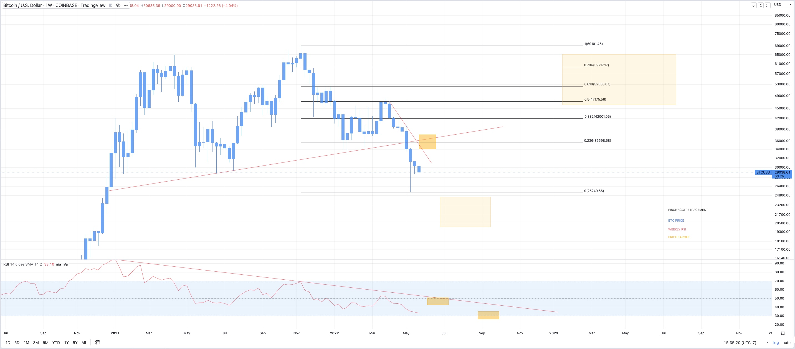

 
 

